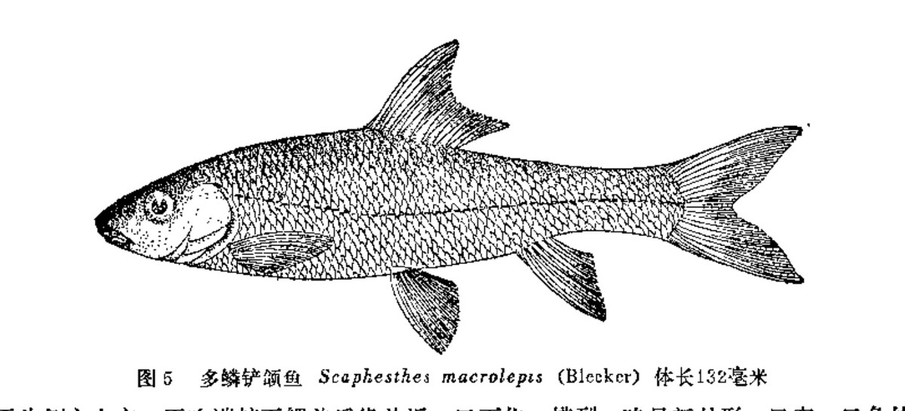

## 墨头鱼

- 学名: 无
- 别名: 无
- 分类: 鲤形目/科/亚科/属
- 链接: <http://fishbase.org/summary/TODO>

TODO

### 形态特征

TODO

### 生活习性

TODO

### 异名信息

TODO

------

## 海南墨头鱼

- 学名: 无
- 别名: 无
- 分类: 鲤形目/科/亚科/属
- 链接: <http://fishbase.org/summary/TODO>

TODO

### 形态特征

TODO

### 生活习性

TODO

### 异名信息

TODO

------

## 东方墨头鱼

- 学名: 无
- 别名: 无
- 分类: 鲤形目/科/亚科/属
- 链接: <http://fishbase.org/summary/TODO>

TODO

### 形态特征

TODO

### 生活习性

TODO

### 异名信息

TODO

------

## 条纹墨头鱼

- 学名: 无
- 别名: 无
- 分类: 鲤形目/科/亚科/属
- 链接: <http://fishbase.org/summary/TODO>

TODO

### 形态特征

TODO

### 生活习性

TODO

### 异名信息

TODO

------

## 桥街墨头鱼

- 学名: 无
- 别名: 无
- 分类: 鲤形目/科/亚科/属
- 链接: <http://fishbase.org/summary/TODO>

TODO

### 形态特征

TODO

### 生活习性

TODO

### 异名信息

TODO

------

## 奇额墨头鱼

- 学名: 无
- 别名: 无
- 分类: 鲤形目/科/亚科/属
- 链接: <http://fishbase.org/summary/TODO>

TODO

### 形态特征

TODO

### 生活习性

TODO

### 异名信息

TODO

------

## 白甲鱼

- 学名: 无
- 别名: 无
- 分类: 鲤形目/科/亚科/属
- 链接: <http://fishbase.org/summary/TODO>

TODO

### 形态特征

TODO

### 生活习性

TODO

### 异名信息

TODO

------

## 小口白甲鱼

- 学名: 无
- 别名: 无
- 分类: 鲤形目/科/亚科/属
- 链接: <http://fishbase.org/summary/TODO>

TODO

### 形态特征

TODO

### 生活习性

TODO

### 异名信息

TODO

------

## 细尾白甲鱼

- 学名: 无
- 别名: 无
- 分类: 鲤形目/科/亚科/属
- 链接: <http://fishbase.org/summary/TODO>

TODO

### 形态特征

TODO

### 生活习性

TODO

### 异名信息

TODO

------

## 四川白甲鱼

- 学名: 无
- 别名: 无
- 分类: 鲤形目/科/亚科/属
- 链接: <http://fishbase.org/summary/TODO>

TODO

### 形态特征

TODO

### 生活习性

TODO

### 异名信息

TODO

------

## 珠江卵形白甲鱼

- 学名: 无
- 别名: 无
- 分类: 鲤形目/科/亚科/属
- 链接: <http://fishbase.org/summary/TODO>

TODO

### 形态特征

TODO

### 生活习性

TODO

### 异名信息

TODO

------

## 南方白甲鱼

- 学名: 无
- 别名: 无
- 分类: 鲤形目/科/亚科/属
- 链接: <http://fishbase.org/summary/TODO>

TODO

### 形态特征

TODO

### 生活习性

TODO

### 异名信息

TODO

------

## 稀有白甲鱼

- 学名: 无
- 别名: 无
- 分类: 鲤形目/科/亚科/属
- 链接: <http://fishbase.org/summary/TODO>

TODO

### 形态特征

TODO

### 生活习性

TODO

### 异名信息

TODO

------

## 大渡白甲鱼

- 学名: 无
- 别名: 无
- 分类: 鲤形目/科/亚科/属
- 链接: <http://fishbase.org/summary/TODO>

TODO

### 形态特征

TODO

### 生活习性

TODO

### 异名信息

TODO

------

## 短身白甲鱼

- 学名: 无
- 别名: 无
- 分类: 鲤形目/科/亚科/属
- 链接: <http://fishbase.org/summary/TODO>

TODO

### 形态特征

TODO

### 生活习性

TODO

### 异名信息

TODO

------

## 粗须白甲鱼

- 学名: 无
- 别名: 无
- 分类: 鲤形目/科/亚科/属
- 链接: <http://fishbase.org/summary/TODO>

TODO

### 形态特征

TODO

### 生活习性

TODO

### 异名信息

TODO

------

## 多鳞白甲鱼

- 学名: 无
- 别名: 无
- 分类: 鲤形目/科/亚科/属
- 链接: <http://fishbase.org/summary/TODO>

TODO

### 形态特征

TODO

### 生活习性

TODO

### 异名信息

TODO

------

## 山白鱼

- 学名: 无
- 别名: 无
- 分类: 鲤形目/科/亚科/属
- 链接: <http://fishbase.org/summary/TODO>

TODO

### 形态特征

TODO

### 生活习性

TODO

### 异名信息

TODO

------

## 西昌白鱼

- 学名: 无
- 别名: 无
- 分类: 鲤形目/科/亚科/属
- 链接: <http://fishbase.org/summary/TODO>

TODO

### 形态特征

TODO

### 生活习性

TODO

### 异名信息

TODO

------

## 嵩明白鱼

- 学名: 无
- 别名: 无
- 分类: 鲤形目/科/亚科/属
- 链接: <http://fishbase.org/summary/TODO>

TODO

### 形态特征

TODO

### 生活习性

TODO

### 异名信息

TODO

------

## 程海白鱼

- 学名: 无
- 别名: 无
- 分类: 鲤形目/科/亚科/属
- 链接: <http://fishbase.org/summary/TODO>

TODO

### 形态特征

TODO

### 生活习性

TODO

### 异名信息

TODO

------

## 邛海白鱼

- 学名: 无
- 别名: 无
- 分类: 鲤形目/科/亚科/属
- 链接: <http://fishbase.org/summary/TODO>

TODO

### 形态特征

TODO

### 生活习性

TODO

### 异名信息

TODO

------

## 寻甸白鱼

- 学名: 无
- 别名: 无
- 分类: 鲤形目/科/亚科/属
- 链接: <http://fishbase.org/summary/TODO>

TODO

### 形态特征

TODO

### 生活习性

TODO

### 异名信息

TODO

------

## 银白鱼

- 学名: 无
- 别名: 无
- 分类: 鲤形目/科/亚科/属
- 链接: <http://fishbase.org/summary/TODO>

TODO

### 形态特征

TODO

### 生活习性

TODO

### 异名信息

TODO

------

## 多鳞白鱼

- 学名: 无
- 别名: 无
- 分类: 鲤形目/科/亚科/属
- 链接: <http://fishbase.org/summary/TODO>

TODO

### 形态特征

TODO

### 生活习性

TODO

### 异名信息

TODO

------

## 海南鳅鮀

- 学名: 无
- 别名: 无
- 分类: 鲤形目/科/亚科/属
- 链接: <http://fishbase.org/summary/TODO>

TODO

### 形态特征

TODO

### 生活习性

TODO

### 异名信息

TODO

------

## 短吻鳅鮀

- 学名: 无
- 别名: 无
- 分类: 鲤形目/科/亚科/属
- 链接: <http://fishbase.org/summary/TODO>

TODO

### 形态特征

TODO

### 生活习性

TODO

### 异名信息

TODO

------

## 宜昌鳅鮀

- 学名: 无
- 别名: 无
- 分类: 鲤形目/科/亚科/属
- 链接: <http://fishbase.org/summary/TODO>

TODO

### 形态特征

TODO

### 生活习性

TODO

### 异名信息

TODO

------

## 桂林鳅鮀

- 学名: 无
- 别名: 无
- 分类: 鲤形目/科/亚科/属
- 链接: <http://fishbase.org/summary/TODO>

TODO

### 形态特征

TODO

### 生活习性

TODO

### 异名信息

TODO

------

## 董氏鳅鮀

- 学名: 无
- 别名: 无
- 分类: 鲤形目/科/亚科/属
- 链接: <http://fishbase.org/summary/TODO>

TODO

### 形态特征

TODO

### 生活习性

TODO

### 异名信息

TODO

------

## 短身鳅鮀

- 学名: 无
- 别名: 无
- 分类: 鲤形目/科/亚科/属
- 链接: <http://fishbase.org/summary/TODO>

TODO

### 形态特征

TODO

### 生活习性

TODO

### 异名信息

TODO

------

## 长须鳅鮀

- 学名: 无
- 别名: 无
- 分类: 鲤形目/科/亚科/属
- 链接: <http://fishbase.org/summary/TODO>

TODO

### 形态特征

TODO

### 生活习性

TODO

### 异名信息

TODO

------

## 南方长须鳅鮀

- 学名: 无
- 别名: 无
- 分类: 鲤形目/科/亚科/属
- 链接: <http://fishbase.org/summary/TODO>

TODO

### 形态特征

TODO

### 生活习性

TODO

### 异名信息

TODO

------

## 元江长须鳅鮀

- 学名: 无
- 别名: 无
- 分类: 鲤形目/科/亚科/属
- 链接: <http://fishbase.org/summary/TODO>

TODO

### 形态特征

TODO

### 生活习性

TODO

### 异名信息

TODO

------

## 平鳍鳅鮀

- 学名: 无
- 别名: 无
- 分类: 鲤形目/科/亚科/属
- 链接: <http://fishbase.org/summary/TODO>

TODO

### 形态特征

TODO

### 生活习性

TODO

### 异名信息

TODO

------

## 异鳔鳅鮀

- 学名: 无
- 别名: 无
- 分类: 鲤形目/科/亚科/属
- 链接: <http://fishbase.org/summary/TODO>

TODO

### 形态特征

TODO

### 生活习性

TODO

### 异名信息

TODO

------

## 裸体异鳔鳅鮀

- 学名: 无
- 别名: 无
- 分类: 鲤形目/科/亚科/属
- 链接: <http://fishbase.org/summary/TODO>

TODO

### 形态特征

TODO

### 生活习性

TODO

### 异名信息

TODO

------

## 银高体鲃

- 学名: 无
- 别名: 无
- 分类: 鲤形目/科/亚科/属
- 链接: <http://fishbase.org/summary/TODO>

TODO

### 形态特征

TODO

### 生活习性

TODO

### 异名信息

TODO

------

## 刺鲃

- 学名: 无
- 别名: 无
- 分类: 鲤形目/科/亚科/属
- 链接: <http://fishbase.org/summary/TODO>

TODO

### 形态特征

TODO

### 生活习性

TODO

### 异名信息

TODO

------

## 倒刺鲃

- 学名: 无
- 别名: 无
- 分类: 鲤形目/科/亚科/属
- 链接: <http://fishbase.org/summary/TODO>

TODO

### 形态特征

TODO

### 生活习性

TODO

### 异名信息

TODO

------

## 光倒刺鲃

- 学名: 无
- 别名: 无
- 分类: 鲤形目/科/亚科/属
- 链接: <http://fishbase.org/summary/TODO>

TODO

### 形态特征

TODO

### 生活习性

TODO

### 异名信息

TODO

------

## 中华倒刺鲃

- 学名: 无
- 别名: 无
- 分类: 鲤形目/科/亚科/属
- 链接: <http://fishbase.org/summary/TODO>

TODO

### 形态特征

TODO

### 生活习性

TODO

### 异名信息

TODO

------

## 黑脊倒刺鲃

- 学名: 无
- 别名: 无
- 分类: 鲤形目/科/亚科/属
- 链接: <http://fishbase.org/summary/TODO>

TODO

### 形态特征

TODO

### 生活习性

TODO

### 异名信息

TODO

------

## 南腊方口鲃

- 学名: 无
- 别名: 无
- 分类: 鲤形目/科/亚科/属
- 链接: <http://fishbase.org/summary/TODO>

TODO

### 形态特征

TODO

### 生活习性

TODO

### 异名信息

TODO

------

## 疏斑小鲃

- 学名: 无
- 别名: 无
- 分类: 鲤形目/科/亚科/属
- 链接: <http://fishbase.org/summary/TODO>

TODO

### 形态特征

TODO

### 生活习性

TODO

### 异名信息

TODO

------

## 类小鲃

- 学名: 无
- 别名: 无
- 分类: 鲤形目/科/亚科/属
- 链接: <http://fishbase.org/summary/TODO>

TODO

### 形态特征

TODO

### 生活习性

TODO

### 异名信息

TODO

------

## 条纹小鲃

- 学名: 无
- 别名: 无
- 分类: 鲤形目/科/亚科/属
- 链接: <http://fishbase.org/summary/TODO>

TODO

### 形态特征

TODO

### 生活习性

TODO

### 异名信息

TODO

------

## 裂峡鲃

- 学名: 无
- 别名: 无
- 分类: 鲤形目/科/亚科/属
- 链接: <http://fishbase.org/summary/TODO>

TODO

### 形态特征

TODO

### 生活习性

TODO

### 异名信息

TODO

------

## 驯乐金线鲃

- 学名: 无
- 别名: 无
- 分类: 鲤形目/科/亚科/属
- 链接: <http://fishbase.org/summary/TODO>

TODO

### 形态特征

TODO

### 生活习性

TODO

### 异名信息

TODO

------

## 九圩金线鲃

- 学名: 无
- 别名: 无
- 分类: 鲤形目/科/亚科/属
- 链接: <http://fishbase.org/summary/TODO>

TODO

### 形态特征

TODO

### 生活习性

TODO

### 异名信息

TODO

------

## 宜山金线鲃

- 学名: 无
- 别名: 无
- 分类: 鲤形目/科/亚科/属
- 链接: <http://fishbase.org/summary/TODO>

TODO

### 形态特征

TODO

### 生活习性

TODO

### 异名信息

TODO

------

## 多斑金线鲃

- 学名: 无
- 别名: 无
- 分类: 鲤形目/科/亚科/属
- 链接: <http://fishbase.org/summary/TODO>

TODO

### 形态特征

TODO

### 生活习性

TODO

### 异名信息

TODO

------

## 滇池金线鲃

- 学名: 无
- 别名: 无
- 分类: 鲤形目/科/亚科/属
- 链接: <http://fishbase.org/summary/TODO>

TODO

### 形态特征

TODO

### 生活习性

TODO

### 异名信息

TODO

------

## 大眼金线鲃

- 学名: 无
- 别名: 无
- 分类: 鲤形目/科/亚科/属
- 链接: <http://fishbase.org/summary/TODO>

TODO

### 形态特征

TODO

### 生活习性

TODO

### 异名信息

TODO

------

## 小眼金线鲃

- 学名: 无
- 别名: 无
- 分类: 鲤形目/科/亚科/属
- 链接: <http://fishbase.org/summary/TODO>

TODO

### 形态特征

TODO

### 生活习性

TODO

### 异名信息

TODO

------

## 高肩金线鲃

- 学名: 无
- 别名: 无
- 分类: 鲤形目/科/亚科/属
- 链接: <http://fishbase.org/summary/TODO>

TODO

### 形态特征

TODO

### 生活习性

TODO

### 异名信息

TODO

------

## 叉背金线鲃

- 学名: 无
- 别名: 无
- 分类: 鲤形目/科/亚科/属
- 链接: <http://fishbase.org/summary/TODO>

TODO

### 形态特征

TODO

### 生活习性

TODO

### 异名信息

TODO

------

## 驼背金线鲃

- 学名: 无
- 别名: 无
- 分类: 鲤形目/科/亚科/属
- 链接: <http://fishbase.org/summary/TODO>

TODO

### 形态特征

TODO

### 生活习性

TODO

### 异名信息

TODO

------

## 短身金线鲃

- 学名: 无
- 别名: 无
- 分类: 鲤形目/科/亚科/属
- 链接: <http://fishbase.org/summary/TODO>

TODO

### 形态特征

TODO

### 生活习性

TODO

### 异名信息

TODO

------

## 短须金线鲃

- 学名: 无
- 别名: 无
- 分类: 鲤形目/科/亚科/属
- 链接: <http://fishbase.org/summary/TODO>

TODO

### 形态特征

TODO

### 生活习性

TODO

### 异名信息

TODO

------

## 大鳞金线鲃

- 学名: 无
- 别名: 无
- 分类: 鲤形目/科/亚科/属
- 链接: <http://fishbase.org/summary/TODO>

TODO

### 形态特征

TODO

### 生活习性

TODO

### 异名信息

TODO

------

## 长臀鲃

- 学名: 无
- 别名: 无
- 分类: 鲤形目/科/亚科/属
- 链接: <http://fishbase.org/summary/TODO>

TODO

### 形态特征

TODO

### 生活习性

TODO

### 异名信息

TODO

------

## 细尾长臀鲃

- 学名: 无
- 别名: 无
- 分类: 鲤形目/科/亚科/属
- 链接: <http://fishbase.org/summary/TODO>

TODO

### 形态特征

TODO

### 生活习性

TODO

### 异名信息

TODO

------

## 条纹二须鲃

- 学名: 无
- 别名: 无
- 分类: 鲤形目/科/亚科/属
- 链接: <http://fishbase.org/summary/TODO>

TODO

### 形态特征

TODO

### 生活习性

TODO

### 异名信息

TODO

------

## 云南四须鲃

- 学名: 无
- 别名: 无
- 分类: 鲤形目/科/亚科/属
- 链接: <http://fishbase.org/summary/TODO>

TODO

### 形态特征

TODO

### 生活习性

TODO

### 异名信息

TODO

------

## 宽头四须鲃

- 学名: 无
- 别名: 无
- 分类: 鲤形目/科/亚科/属
- 链接: <http://fishbase.org/summary/TODO>

TODO

### 形态特征

TODO

### 生活习性

TODO

### 异名信息

TODO

------

## 保山四须鲃

- 学名: 无
- 别名: 无
- 分类: 鲤形目/科/亚科/属
- 链接: <http://fishbase.org/summary/TODO>

TODO

### 形态特征

TODO

### 生活习性

TODO

### 异名信息

TODO

------

## 软鳍四须鲃

- 学名: 无
- 别名: 无
- 分类: 鲤形目/科/亚科/属
- 链接: <http://fishbase.org/summary/TODO>

TODO

### 形态特征

TODO

### 生活习性

TODO

### 异名信息

TODO

------

## 多鳞四须鲃

- 学名: 无
- 别名: 无
- 分类: 鲤形目/科/亚科/属
- 链接: <http://fishbase.org/summary/TODO>

TODO

### 形态特征

TODO

### 生活习性

TODO

### 异名信息

TODO

------

## 大鳞四须鲃

- 学名: 无
- 别名: 无
- 分类: 鲤形目/科/亚科/属
- 链接: <http://fishbase.org/summary/TODO>

TODO

### 形态特征

TODO

### 生活习性

TODO

### 异名信息

TODO

------

