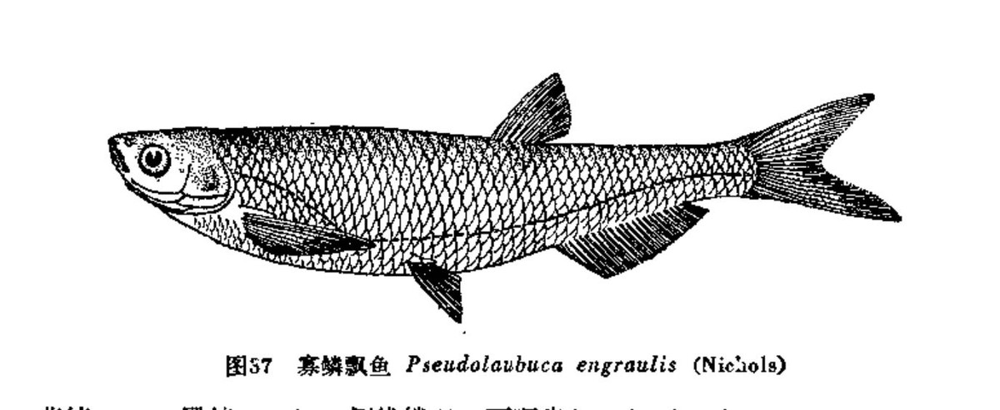

## 黑龙江中杜父鱼

- 学名: 无
- 别名: 无
- 分类: 鲤形目/科/亚科/属
- 链接: <http://fishbase.org/summary/TODO>

TODO

### 形态特征

TODO

### 生活习性

TODO

### 异名信息

TODO

------

## 黑斑狗鱼

- 学名: 无
- 别名: 无
- 分类: 鲤形目/科/亚科/属
- 链接: <http://fishbase.org/summary/TODO>

TODO

### 形态特征

TODO

### 生活习性

TODO

### 异名信息

TODO

------

## 棘头梅童鱼

- 学名: 无
- 别名: 无
- 分类: 鲤形目/科/亚科/属
- 链接: <http://fishbase.org/summary/TODO>

TODO

### 形态特征

TODO

### 生活习性

TODO

### 异名信息

TODO

------

## 叶结鱼

- 学名: 无
- 别名: 无
- 分类: 鲤形目/科/亚科/属
- 链接: <http://fishbase.org/summary/TODO>

TODO

### 形态特征

TODO

### 生活习性

TODO

### 异名信息

TODO

------

## 中国结鱼

- 学名: 无
- 别名: 无
- 分类: 鲤形目/科/亚科/属
- 链接: <http://fishbase.org/summary/TODO>

TODO

### 形态特征

TODO

### 生活习性

TODO

### 异名信息

TODO

------

## 瓣结鱼

- 学名: 无
- 别名: 无
- 分类: 鲤形目/科/亚科/属
- 链接: <http://fishbase.org/summary/TODO>

TODO

### 形态特征

TODO

### 生活习性

TODO

### 异名信息

TODO

------

## 大鳞结鱼

- 学名: 无
- 别名: 无
- 分类: 鲤形目/科/亚科/属
- 链接: <http://fishbase.org/summary/TODO>

TODO

### 形态特征

TODO

### 生活习性

TODO

### 异名信息

TODO

------

## 华缨鱼

- 学名: 无
- 别名: 无
- 分类: 鲤形目/科/亚科/属
- 链接: <http://fishbase.org/summary/TODO>

TODO

### 形态特征

TODO

### 生活习性

TODO

### 异名信息

TODO

------

## 柳城拟缨鱼

- 学名: 无
- 别名: 无
- 分类: 鲤形目/科/亚科/属
- 链接: <http://fishbase.org/summary/TODO>

TODO

### 形态特征

TODO

### 生活习性

TODO

### 异名信息

TODO

------

## 巴马拟缨鱼

- 学名: 无
- 别名: 无
- 分类: 鲤形目/科/亚科/属
- 链接: <http://fishbase.org/summary/TODO>

TODO

### 形态特征

TODO

### 生活习性

TODO

### 异名信息

TODO

------

## 哲罗鱼

- 学名: 无
- 别名: 无
- 分类: 鲤形目/科/亚科/属
- 链接: <http://fishbase.org/summary/TODO>

TODO

### 形态特征

TODO

### 生活习性

TODO

### 异名信息

TODO

------

## 四川哲罗鱼

- 学名: 无
- 别名: 无
- 分类: 鲤形目/科/亚科/属
- 链接: <http://fishbase.org/summary/TODO>

TODO

### 形态特征

TODO

### 生活习性

TODO

### 异名信息

TODO

------

## 瓦氏雅罗鱼

- 学名: 无
- 别名: 无
- 分类: 鲤形目/科/亚科/属
- 链接: <http://fishbase.org/summary/TODO>

TODO

### 形态特征

TODO

### 生活习性

TODO

### 异名信息

TODO

------

## 黄河雅罗鱼

- 学名: 无
- 别名: 无
- 分类: 鲤形目/科/亚科/属
- 链接: <http://fishbase.org/summary/TODO>

TODO

### 形态特征

TODO

### 生活习性

TODO

### 异名信息

TODO

------

## 胭脂鱼

- 学名: 无
- 别名: 无
- 分类: 鲤形目/科/亚科/属
- 链接: <http://fishbase.org/summary/TODO>

TODO

### 形态特征

TODO

### 生活习性

TODO

### 异名信息

TODO

------

## 黑龙江茴鱼

- 学名: 无
- 别名: 无
- 分类: 鲤形目/科/亚科/属
- 链接: <http://fishbase.org/summary/TODO>

TODO

### 形态特征

TODO

### 生活习性

TODO

### 异名信息

TODO

------

## 食蚊鱼

- 学名: 无
- 别名: 无
- 分类: 鲤形目/科/亚科/属
- 链接: <http://fishbase.org/summary/TODO>

TODO

### 形态特征

TODO

### 生活习性

TODO

### 异名信息

TODO

------

## 圆口铜鱼

- 学名: 无
- 别名: 无
- 分类: 鲤形目/科/亚科/属
- 链接: <http://fishbase.org/summary/TODO>

TODO

### 形态特征

TODO

### 生活习性

TODO

### 异名信息

TODO

------

## 北方铜鱼

- 学名: 无
- 别名: 无
- 分类: 鲤形目/科/亚科/属
- 链接: <http://fishbase.org/summary/TODO>

TODO

### 形态特征

TODO

### 生活习性

TODO

### 异名信息

TODO

------

## 太湖短吻银鱼

- 学名: 无
- 别名: 无
- 分类: 鲤形目/科/亚科/属
- 链接: <http://fishbase.org/summary/TODO>

TODO

### 形态特征

TODO

### 生活习性

TODO

### 异名信息

TODO

------

## 大银鱼

- 学名: 无
- 别名: 无
- 分类: 鲤形目/科/亚科/属
- 链接: <http://fishbase.org/summary/TODO>

TODO

### 形态特征

TODO

### 生活习性

TODO

### 异名信息

TODO

------

## 尖头银鱼

- 学名: 无
- 别名: 无
- 分类: 鲤形目/科/亚科/属
- 链接: <http://fishbase.org/summary/TODO>

TODO

### 形态特征

TODO

### 生活习性

TODO

### 异名信息

TODO

------

## 安氏新银鱼

- 学名: 无
- 别名: 无
- 分类: 鲤形目/科/亚科/属
- 链接: <http://fishbase.org/summary/TODO>

TODO

### 形态特征

TODO

### 生活习性

TODO

### 异名信息

TODO

------

## 陈氏新银鱼

- 学名: 无
- 别名: 无
- 分类: 鲤形目/科/亚科/属
- 链接: <http://fishbase.org/summary/TODO>

TODO

### 形态特征

TODO

### 生活习性

TODO

### 异名信息

TODO

------

## 太湖新银鱼

- 学名: 无
- 别名: 无
- 分类: 鲤形目/科/亚科/属
- 链接: <http://fishbase.org/summary/TODO>

TODO

### 形态特征

TODO

### 生活习性

TODO

### 异名信息

TODO

------

## 寡齿新银鱼

- 学名: 无
- 别名: 无
- 分类: 鲤形目/科/亚科/属
- 链接: <http://fishbase.org/summary/TODO>

TODO

### 形态特征

TODO

### 生活习性

TODO

### 异名信息

TODO

------

## 有明银鱼

- 学名: 无
- 别名: 无
- 分类: 鲤形目/科/亚科/属
- 链接: <http://fishbase.org/summary/TODO>

TODO

### 形态特征

TODO

### 生活习性

TODO

### 异名信息

TODO

------

## 白肌银鱼

- 学名: 无
- 别名: 无
- 分类: 鲤形目/科/亚科/属
- 链接: <http://fishbase.org/summary/TODO>

TODO

### 形态特征

TODO

### 生活习性

TODO

### 异名信息

TODO

------

## 短吻间银鱼

- 学名: 无
- 别名: 无
- 分类: 鲤形目/科/亚科/属
- 链接: <http://fishbase.org/summary/TODO>

TODO

### 形态特征

TODO

### 生活习性

TODO

### 异名信息

TODO

------

## 前颌间银鱼

- 学名: 无
- 别名: 无
- 分类: 鲤形目/科/亚科/属
- 链接: <http://fishbase.org/summary/TODO>

TODO

### 形态特征

TODO

### 生活习性

TODO

### 异名信息

TODO

------

## 长鳍银鱼

- 学名: 无
- 别名: 无
- 分类: 鲤形目/科/亚科/属
- 链接: <http://fishbase.org/summary/TODO>

TODO

### 形态特征

TODO

### 生活习性

TODO

### 异名信息

TODO

------

## 尼罗罗非鱼

- 学名: 无
- 别名: 无
- 分类: 鲤形目/科/亚科/属
- 链接: <http://fishbase.org/summary/TODO>

TODO

### 形态特征

TODO

### 生活习性

TODO

### 异名信息

TODO

------

## 台湾铲颌鱼

- 学名: 无
- 别名: 无
- 分类: 鲤形目/科/亚科/属
- 链接: <http://fishbase.org/summary/TODO>

TODO

### 形态特征

TODO

### 生活习性

TODO

### 异名信息

TODO

------

## 多鳞铲颌鱼

- 学名: 无
- 别名: 无
- 分类: 鲤形目/科/亚科/属
- 链接: <http://fishbase.org/summary/TODO>

TODO

### 形态特征

TODO

### 生活习性

TODO

### 异名信息

TODO

------

## 银飘鱼

- 学名: 无
- 别名: 无
- 分类: 鲤形目/科/亚科/属
- 链接: <http://fishbase.org/summary/TODO>

TODO

### 形态特征

TODO

### 生活习性

TODO

### 异名信息

TODO

------

## 寡鳞飘鱼

- 学名: 无
- 别名: 无
- 分类: 鲤形目/科/亚科/属
- 链接: <http://fishbase.org/summary/TODO>

TODO

### 形态特征

TODO

### 生活习性

TODO

### 异名信息

TODO

------

## 勒氏石首鱼

- 学名: 无
- 别名: 无
- 分类: 鲤形目/科/亚科/属
- 链接: <http://fishbase.org/summary/TODO>

TODO

### 形态特征

TODO

### 生活习性

TODO

### 异名信息

TODO

------

## 银鲳鱼

- 学名: 无
- 别名: 无
- 分类: 鲤形目/科/亚科/属
- 链接: <http://fishbase.org/summary/TODO>

TODO

### 形态特征

TODO

### 生活习性

TODO

### 异名信息

TODO

------

## 虹鳟鱼

- 学名: 无
- 别名: 无
- 分类: 鲤形目/科/亚科/属
- 链接: <http://fishbase.org/summary/TODO>

TODO

### 形态特征

TODO

### 生活习性

TODO

### 异名信息

TODO

------

## 极边扁咽齿鱼

- 学名: 无
- 别名: 无
- 分类: 鲤形目/科/亚科/属
- 链接: <http://fishbase.org/summary/TODO>

TODO

### 形态特征

TODO

### 生活习性

TODO

### 异名信息

TODO

------

## 斑腰单孔鲀

- 学名: 无
- 别名: 无
- 分类: 鲤形目/科/亚科/属
- 链接: <http://fishbase.org/summary/TODO>

TODO

### 形态特征

TODO

### 生活习性

TODO

### 异名信息

TODO

------

## 弓斑东方鲀

- 学名: 无
- 别名: 无
- 分类: 鲤形目/科/亚科/属
- 链接: <http://fishbase.org/summary/TODO>

TODO

### 形态特征

TODO

### 生活习性

TODO

### 异名信息

TODO

------

## 星点东方鲀

- 学名: 无
- 别名: 无
- 分类: 鲤形目/科/亚科/属
- 链接: <http://fishbase.org/summary/TODO>

TODO

### 形态特征

TODO

### 生活习性

TODO

### 异名信息

TODO

------

## 暗纹东方鲀

- 学名: 无
- 别名: 无
- 分类: 鲤形目/科/亚科/属
- 链接: <http://fishbase.org/summary/TODO>

TODO

### 形态特征

TODO

### 生活习性

TODO

### 异名信息

TODO

------

## 虫纹东方鲀

- 学名: 无
- 别名: 无
- 分类: 鲤形目/科/亚科/属
- 链接: <http://fishbase.org/summary/TODO>

TODO

### 形态特征

TODO

### 生活习性

TODO

### 异名信息

TODO

------

## 暗色东方鲀

- 学名: 无
- 别名: 无
- 分类: 鲤形目/科/亚科/属
- 链接: <http://fishbase.org/summary/TODO>

TODO

### 形态特征

TODO

### 生活习性

TODO

### 异名信息

TODO

------

## 红鳍东方鲀

- 学名: 无
- 别名: 无
- 分类: 鲤形目/科/亚科/属
- 链接: <http://fishbase.org/summary/TODO>

TODO

### 形态特征

TODO

### 生活习性

TODO

### 异名信息

TODO

------

## 黄鳍东方鲀

- 学名: 无
- 别名: 无
- 分类: 鲤形目/科/亚科/属
- 链接: <http://fishbase.org/summary/TODO>

TODO

### 形态特征

TODO

### 生活习性

TODO

### 异名信息

TODO

------

## 菊黄东方鲀

- 学名: 无
- 别名: 无
- 分类: 鲤形目/科/亚科/属
- 链接: <http://fishbase.org/summary/TODO>

TODO

### 形态特征

TODO

### 生活习性

TODO

### 异名信息

TODO

------

## 黄鳝

- 学名: 无
- 别名: 无
- 分类: 鲤形目/科/亚科/属
- 链接: <http://fishbase.org/summary/TODO>

TODO

### 形态特征

TODO

### 生活习性

TODO

### 异名信息

TODO

------

## 赤眼鳟

- 学名: 无
- 别名: 无
- 分类: 鲤形目/科/亚科/属
- 链接: <http://fishbase.org/summary/TODO>

TODO

### 形态特征

TODO

### 生活习性

TODO

### 异名信息

TODO

------

## 虹鳟

- 学名: 无
- 别名: 无
- 分类: 鲤形目/科/亚科/属
- 链接: <http://fishbase.org/summary/TODO>

TODO

### 形态特征

TODO

### 生活习性

TODO

### 异名信息

TODO

------

## 似鳡

- 学名: 无
- 别名: 无
- 分类: 鲤形目/科/亚科/属
- 链接: <http://fishbase.org/summary/TODO>

TODO

### 形态特征

TODO

### 生活习性

TODO

### 异名信息

TODO

------

## 单纹似鳡

- 学名: 无
- 别名: 无
- 分类: 鲤形目/科/亚科/属
- 链接: <http://fishbase.org/summary/TODO>

TODO

### 形态特征

TODO

### 生活习性

TODO

### 异名信息

TODO

------

## 细纹似鳡

- 学名: 无
- 别名: 无
- 分类: 鲤形目/科/亚科/属
- 链接: <http://fishbase.org/summary/TODO>

TODO

### 形态特征

TODO

### 生活习性

TODO

### 异名信息

TODO

------

