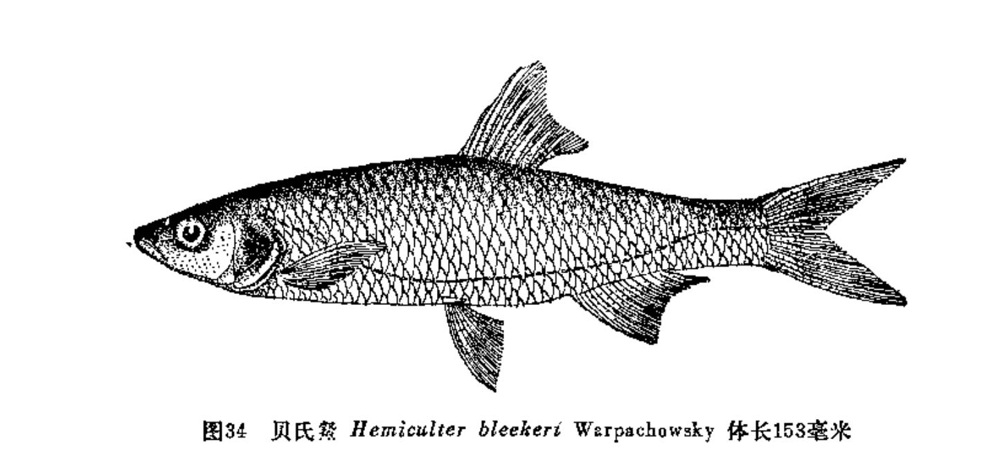
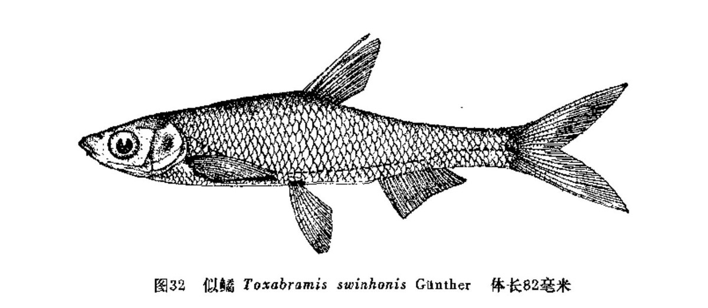

## 鰶

- 学名: 无
- 别名: 无
- 分类: 鲤形目/科/亚科/属
- 链接: <http://fishbase.org/summary/TODO>

TODO

### 形态特征

TODO

### 生活习性

TODO

### 异名信息

TODO

------

## 兴凯䱗

- 学名: 无
- 别名: 无
- 分类: 鲤形目/科/亚科/属
- 链接: <http://fishbase.org/summary/TODO>

TODO

### 形态特征

TODO

### 生活习性

TODO

### 异名信息

TODO

------

## 半䱗

- 学名: 无
- 别名: 无
- 分类: 鲤形目/科/亚科/属
- 链接: <http://fishbase.org/summary/TODO>

TODO

### 形态特征

TODO

### 生活习性

TODO

### 异名信息

TODO

------

## 伍氏半䱗

- 学名: 无
- 别名: 无
- 分类: 鲤形目/科/亚科/属
- 链接: <http://fishbase.org/summary/TODO>

TODO

### 形态特征

TODO

### 生活习性

TODO

### 异名信息

TODO

------

## 大鳞半䱗

- 学名: 无
- 别名: 无
- 分类: 鲤形目/科/亚科/属
- 链接: <http://fishbase.org/summary/TODO>

TODO

### 形态特征

TODO

### 生活习性

TODO

### 异名信息

TODO

------

## 黑尾䱗

- 学名: 无
- 别名: 无
- 分类: 鲤形目/科/亚科/属
- 链接: <http://fishbase.org/summary/TODO>

TODO

### 形态特征

TODO

### 生活习性

TODO

### 异名信息

TODO

------

## 海南拟䱗

- 学名: 无
- 别名: 无
- 分类: 鲤形目/科/亚科/属
- 链接: <http://fishbase.org/summary/TODO>

TODO

### 形态特征

TODO

### 生活习性

TODO

### 异名信息

TODO

------

## 贵州拟䱗

- 学名: 无
- 别名: 无
- 分类: 鲤形目/科/亚科/属
- 链接: <http://fishbase.org/summary/TODO>

TODO

### 形态特征

TODO

### 生活习性

TODO

### 异名信息

TODO

------

## 南方拟䱗

- 学名: 无
- 别名: 无
- 分类: 鲤形目/科/亚科/属
- 链接: <http://fishbase.org/summary/TODO>

TODO

### 形态特征

TODO

### 生活习性

TODO

### 异名信息

TODO

------

## 张氏䱗

- 学名: 无
- 别名: 无
- 分类: 鲤形目/科/亚科/属
- 链接: <http://fishbase.org/summary/TODO>

TODO

### 形态特征

TODO

### 生活习性

TODO

### 异名信息

TODO

------

## 贝氏䱗

- 学名: 无
- 别名: 无
- 分类: 鲤形目/科/亚科/属
- 链接: <http://fishbase.org/summary/TODO>

TODO

### 形态特征

TODO

### 生活习性

TODO

### 异名信息

TODO

------

## 金线丹

- 学名: 无
- 别名: 无
- 分类: 鲤形目/科/亚科/属
- 链接: <http://fishbase.org/summary/TODO>

TODO

### 形态特征

TODO

### 生活习性

TODO

### 异名信息

TODO

------

## 麦氏鱼丹

- 学名: 无
- 别名: 无
- 分类: 鲤形目/科/亚科/属
- 链接: <http://fishbase.org/summary/TODO>

TODO

### 形态特征

TODO

### 生活习性

TODO

### 异名信息

TODO

------

## 金线鱼丹

- 学名: 无
- 别名: 无
- 分类: 鲤形目/科/亚科/属
- 链接: <http://fishbase.org/summary/TODO>

TODO

### 形态特征

TODO

### 生活习性

TODO

### 异名信息

TODO

------

## 修仁鱼央

- 学名: 无
- 别名: 无
- 分类: 鲤形目/科/亚科/属
- 链接: <http://fishbase.org/summary/TODO>

TODO

### 形态特征

TODO

### 生活习性

TODO

### 异名信息

TODO

------

## 鳗尾鱼央

- 学名: 无
- 别名: 无
- 分类: 鲤形目/科/亚科/属
- 链接: <http://fishbase.org/summary/TODO>

TODO

### 形态特征

TODO

### 生活习性

TODO

### 异名信息

TODO

------

## 黑尾鱼央

- 学名: 无
- 别名: 无
- 分类: 鲤形目/科/亚科/属
- 链接: <http://fishbase.org/summary/TODO>

TODO

### 形态特征

TODO

### 生活习性

TODO

### 异名信息

TODO

------

## 司氏鱼央

- 学名: 无
- 别名: 无
- 分类: 鲤形目/科/亚科/属
- 链接: <http://fishbase.org/summary/TODO>

TODO

### 形态特征

TODO

### 生活习性

TODO

### 异名信息

TODO

------

## 金氏鱼央

- 学名: 无
- 别名: 无
- 分类: 鲤形目/科/亚科/属
- 链接: <http://fishbase.org/summary/TODO>

TODO

### 形态特征

TODO

### 生活习性

TODO

### 异名信息

TODO

------

## 拟缘鱼央

- 学名: 无
- 别名: 无
- 分类: 鲤形目/科/亚科/属
- 链接: <http://fishbase.org/summary/TODO>

TODO

### 形态特征

TODO

### 生活习性

TODO

### 异名信息

TODO

------

## 白缘鱼央

- 学名: 无
- 别名: 无
- 分类: 鲤形目/科/亚科/属
- 链接: <http://fishbase.org/summary/TODO>

TODO

### 形态特征

TODO

### 生活习性

TODO

### 异名信息

TODO

------

## 餐条

- 学名: 无
- 别名: 无
- 分类: 鲤形目/科/亚科/属
- 链接: <http://fishbase.org/summary/TODO>

TODO

### 形态特征

TODO

### 生活习性

TODO

### 异名信息

TODO

------

## 油餐条

- 学名: 无
- 别名: 无
- 分类: 鲤形目/科/亚科/属
- 链接: <http://fishbase.org/summary/TODO>

TODO

### 形态特征

TODO

### 生活习性

TODO

### 异名信息

TODO

------

## 黑线

- 学名: 无
- 别名: 无
- 分类: 鲤形目/科/亚科/属
- 链接: <http://fishbase.org/summary/TODO>

TODO

### 形态特征

TODO

### 生活习性

TODO

### 异名信息

TODO

------

## 大鳞黑线

- 学名: 无
- 别名: 无
- 分类: 鲤形目/科/亚科/属
- 链接: <http://fishbase.org/summary/TODO>

TODO

### 形态特征

TODO

### 生活习性

TODO

### 异名信息

TODO

------

## 似鱼骨

- 学名: 无
- 别名: 无
- 分类: 鲤形目/科/亚科/属
- 链接: <http://fishbase.org/summary/TODO>

TODO

### 形态特征

TODO

### 生活习性

TODO

### 异名信息

TODO

------

## 彭县似鱼骨

- 学名: 无
- 别名: 无
- 分类: 鲤形目/科/亚科/属
- 链接: <http://fishbase.org/summary/TODO>

TODO

### 形态特征

TODO

### 生活习性

TODO

### 异名信息

TODO

------

## 长吻鱼骨

- 学名: 无
- 别名: 无
- 分类: 鲤形目/科/亚科/属
- 链接: <http://fishbase.org/summary/TODO>

TODO

### 形态特征

TODO

### 生活习性

TODO

### 异名信息

TODO

------

## 唇鱼骨

- 学名: 无
- 别名: 无
- 分类: 鲤形目/科/亚科/属
- 链接: <http://fishbase.org/summary/TODO>

TODO

### 形态特征

TODO

### 生活习性

TODO

### 异名信息

TODO

------

## 花鱼骨

- 学名: 无
- 别名: 无
- 分类: 鲤形目/科/亚科/属
- 链接: <http://fishbase.org/summary/TODO>

TODO

### 形态特征

TODO

### 生活习性

TODO

### 异名信息

TODO

------

## 似鱎

- 学名: 无
- 别名: 无
- 分类: 鲤形目/科/亚科/属
- 链接: <http://fishbase.org/summary/TODO>

TODO

### 形态特征

TODO

### 生活习性

TODO

### 异名信息

TODO

------

## 海南似鱎

- 学名: 无
- 别名: 无
- 分类: 鲤形目/科/亚科/属
- 链接: <http://fishbase.org/summary/TODO>

TODO

### 形态特征

TODO

### 生活习性

TODO

### 异名信息

TODO

------

## 尖头鱥

- 学名: 无
- 别名: 无
- 分类: 鲤形目/科/亚科/属
- 链接: <http://fishbase.org/summary/TODO>

TODO

### 形态特征

TODO

### 生活习性

TODO

### 异名信息

TODO

------

## 拉氏鱥

- 学名: 无
- 别名: 无
- 分类: 鲤形目/科/亚科/属
- 链接: <http://fishbase.org/summary/TODO>

TODO

### 形态特征

TODO

### 生活习性

TODO

### 异名信息

TODO

------

## 洛氏鱥

- 学名: 无
- 别名: 无
- 分类: 鲤形目/科/亚科/属
- 链接: <http://fishbase.org/summary/TODO>

TODO

### 形态特征

TODO

### 生活习性

TODO

### 异名信息

TODO

------

## 花江鱥

- 学名: 无
- 别名: 无
- 分类: 鲤形目/科/亚科/属
- 链接: <http://fishbase.org/summary/TODO>

TODO

### 形态特征

TODO

### 生活习性

TODO

### 异名信息

TODO

------

## 湖鱥

- 学名: 无
- 别名: 无
- 分类: 鲤形目/科/亚科/属
- 链接: <http://fishbase.org/summary/TODO>

TODO

### 形态特征

TODO

### 生活习性

TODO

### 异名信息

TODO

------

## 长嘴鱲

- 学名: 无
- 别名: 无
- 分类: 鲤形目/科/亚科/属
- 链接: <http://fishbase.org/summary/TODO>

TODO

### 形态特征

TODO

### 生活习性

TODO

### 异名信息

TODO

------

## 异鱲

- 学名: 无
- 别名: 无
- 分类: 鲤形目/科/亚科/属
- 链接: <http://fishbase.org/summary/TODO>

TODO

### 形态特征

TODO

### 生活习性

TODO

### 异名信息

TODO

------

## 海南异鱲

- 学名: 无
- 别名: 无
- 分类: 鲤形目/科/亚科/属
- 链接: <http://fishbase.org/summary/TODO>

TODO

### 形态特征

TODO

### 生活习性

TODO

### 异名信息

TODO

------

## 斑尾低线鱲

- 学名: 无
- 别名: 无
- 分类: 鲤形目/科/亚科/属
- 链接: <http://fishbase.org/summary/TODO>

TODO

### 形态特征

TODO

### 生活习性

TODO

### 异名信息

TODO

------

## 丽色低线鱲

- 学名: 无
- 别名: 无
- 分类: 鲤形目/科/亚科/属
- 链接: <http://fishbase.org/summary/TODO>

TODO

### 形态特征

TODO

### 生活习性

TODO

### 异名信息

TODO

------

## 成都鱲

- 学名: 无
- 别名: 无
- 分类: 鲤形目/科/亚科/属
- 链接: <http://fishbase.org/summary/TODO>

TODO

### 形态特征

TODO

### 生活习性

TODO

### 异名信息

TODO

------

## 宽鳍鱲

- 学名: 无
- 别名: 无
- 分类: 鲤形目/科/亚科/属
- 链接: <http://fishbase.org/summary/TODO>

TODO

### 形态特征

TODO

### 生活习性

TODO

### 异名信息

TODO

------

## 间下鱵

- 学名: 无
- 别名: 无
- 分类: 鲤形目/科/亚科/属
- 链接: <http://fishbase.org/summary/TODO>

TODO

### 形态特征

TODO

### 生活习性

TODO

### 异名信息

TODO

------

## 乌鳢

- 学名: 无
- 别名: 无
- 分类: 鲤形目/科/亚科/属
- 链接: <http://fishbase.org/summary/TODO>

TODO

### 形态特征

TODO

### 生活习性

TODO

### 异名信息

TODO

------

## 乌塘鳢

- 学名: 无
- 别名: 无
- 分类: 鲤形目/科/亚科/属
- 链接: <http://fishbase.org/summary/TODO>

TODO

### 形态特征

TODO

### 生活习性

TODO

### 异名信息

TODO

------

## 尖头塘鳢

- 学名: 无
- 别名: 无
- 分类: 鲤形目/科/亚科/属
- 链接: <http://fishbase.org/summary/TODO>

TODO

### 形态特征

TODO

### 生活习性

TODO

### 异名信息

TODO

------

## 沙塘鳢

- 学名: 无
- 别名: 无
- 分类: 鲤形目/科/亚科/属
- 链接: <http://fishbase.org/summary/TODO>

TODO

### 形态特征

TODO

### 生活习性

TODO

### 异名信息

TODO

------

## 中华沙塘鳢

- 学名: 无
- 别名: 无
- 分类: 鲤形目/科/亚科/属
- 链接: <http://fishbase.org/summary/TODO>

TODO

### 形态特征

TODO

### 生活习性

TODO

### 异名信息

TODO

------

## 河川沙塘鳢

- 学名: 无
- 别名: 无
- 分类: 鲤形目/科/亚科/属
- 链接: <http://fishbase.org/summary/TODO>

TODO

### 形态特征

TODO

### 生活习性

TODO

### 异名信息

TODO

------

## 暗色沙塘鳢

- 学名: 无
- 别名: 无
- 分类: 鲤形目/科/亚科/属
- 链接: <http://fishbase.org/summary/TODO>

TODO

### 形态特征

TODO

### 生活习性

TODO

### 异名信息

TODO

------

## 褐塘鳢

- 学名: 无
- 别名: 无
- 分类: 鲤形目/科/亚科/属
- 链接: <http://fishbase.org/summary/TODO>

TODO

### 形态特征

TODO

### 生活习性

TODO

### 异名信息

TODO

------

## 锯塘鳢

- 学名: 无
- 别名: 无
- 分类: 鲤形目/科/亚科/属
- 链接: <http://fishbase.org/summary/TODO>

TODO

### 形态特征

TODO

### 生活习性

TODO

### 异名信息

TODO

------

## 葛氏鲈塘鳢

- 学名: 无
- 别名: 无
- 分类: 鲤形目/科/亚科/属
- 链接: <http://fishbase.org/summary/TODO>

TODO

### 形态特征

TODO

### 生活习性

TODO

### 异名信息

TODO

------

## 海南细齿塘鳢

- 学名: 无
- 别名: 无
- 分类: 鲤形目/科/亚科/属
- 链接: <http://fishbase.org/summary/TODO>

TODO

### 形态特征

TODO

### 生活习性

TODO

### 异名信息

TODO

------

## 大鳞细齿塘鳢

- 学名: 无
- 别名: 无
- 分类: 鲤形目/科/亚科/属
- 链接: <http://fishbase.org/summary/TODO>

TODO

### 形态特征

TODO

### 生活习性

TODO

### 异名信息

TODO

------

## 斑鳢

- 学名: 无
- 别名: 无
- 分类: 鲤形目/科/亚科/属
- 链接: <http://fishbase.org/summary/TODO>

TODO

### 形态特征

TODO

### 生活习性

TODO

### 异名信息

TODO

------

## 月鳢

- 学名: 无
- 别名: 无
- 分类: 鲤形目/科/亚科/属
- 链接: <http://fishbase.org/summary/TODO>

TODO

### 形态特征

TODO

### 生活习性

TODO

### 异名信息

TODO

------

## 线鳢

- 学名: 无
- 别名: 无
- 分类: 鲤形目/科/亚科/属
- 链接: <http://fishbase.org/summary/TODO>

TODO

### 形态特征

TODO

### 生活习性

TODO

### 异名信息

TODO

------

## 宽额鳢

- 学名: 无
- 别名: 无
- 分类: 鲤形目/科/亚科/属
- 链接: <http://fishbase.org/summary/TODO>

TODO

### 形态特征

TODO

### 生活习性

TODO

### 异名信息

TODO

------

