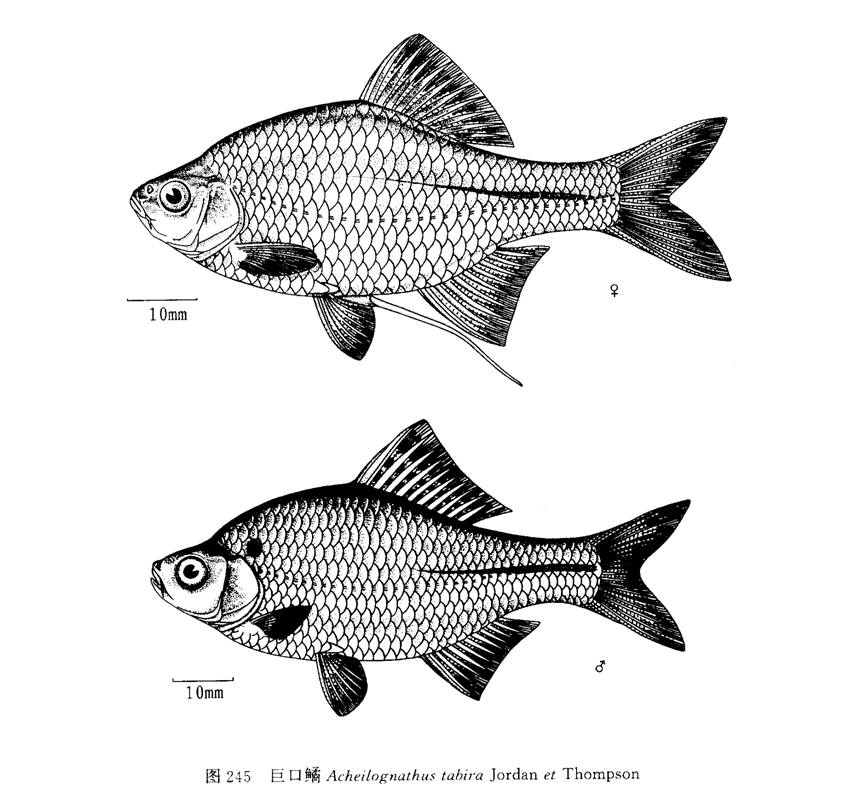

## 革条田中鳑鲏

- 学名: 无
- 别名: 无
- 分类: 鲤形目/科/亚科/属
- 链接: <http://fishbase.org/summary/TODO>

TODO

### 形态特征

TODO

### 生活习性

TODO

### 异名信息

TODO

------

## 体鳑鲏

- 学名: 无
- 别名: 无
- 分类: 鲤形目/科/亚科/属
- 链接: <http://fishbase.org/summary/TODO>

TODO

### 形态特征

TODO

### 生活习性

TODO

### 异名信息

TODO

------

## 高体鳑鲏

- 学名: 无
- 别名: 无
- 分类: 鲤形目/科/亚科/属
- 链接: <http://fishbase.org/summary/TODO>

TODO

### 形态特征

TODO

### 生活习性

TODO

### 异名信息

TODO

------

## 多鳞刺鳑鲏

- 学名: 无
- 别名: 无
- 分类: 鲤形目/科/亚科/属
- 链接: <http://fishbase.org/summary/TODO>

TODO

### 形态特征

TODO

### 生活习性

TODO

### 异名信息

TODO

------

## 中华鳑鲏

- 学名: 无
- 别名: 无
- 分类: 鲤形目/科/亚科/属
- 链接: <http://fishbase.org/summary/TODO>

TODO

### 形态特征

TODO

### 生活习性

TODO

### 异名信息

TODO

------

## 方氏鳑鲏

- 学名: 无
- 别名: 无
- 分类: 鲤形目/科/亚科/属
- 链接: <http://fishbase.org/summary/TODO>

TODO

### 形态特征

TODO

### 生活习性

TODO

### 异名信息

TODO

------

## 黑龙江鳑鲏

- 学名: 无
- 别名: 无
- 分类: 鲤形目/科/亚科/属
- 链接: <http://fishbase.org/summary/TODO>

TODO

### 形态特征

TODO

### 生活习性

TODO

### 异名信息

TODO

------

## 彩石鳑鲏

- 学名: 无
- 别名: 无
- 分类: 鲤形目/科/亚科/属
- 链接: <http://fishbase.org/summary/TODO>

TODO

### 形态特征

TODO

### 生活习性

TODO

### 异名信息

TODO

------

## 刺鳍鳑鲏

- 学名: 无
- 别名: 无
- 分类: 鲤形目/科/亚科/属
- 链接: <http://fishbase.org/summary/TODO>

TODO

### 形态特征

TODO

### 生活习性

TODO

### 异名信息

TODO

------

## 兴凯鱊

- 学名: 无
- 别名: 无
- 分类: 鲤形目/科/亚科/属
- 链接: <http://fishbase.org/summary/TODO>

TODO

### 形态特征

TODO

### 生活习性

TODO

### 异名信息

TODO

------

## 彩副鱊

- 学名: 无
- 别名: 无
- 分类: 鲤形目/科/亚科/属
- 链接: <http://fishbase.org/summary/TODO>

TODO

### 形态特征

TODO

### 生活习性

TODO

### 异名信息

TODO

------

## 革条副鱊

- 学名: 无
- 别名: 无
- 分类: 鲤形目/科/亚科/属
- 链接: <http://fishbase.org/summary/TODO>

TODO

### 形态特征

TODO

### 生活习性

TODO

### 异名信息

TODO

------

## 广西副鱊

- 学名: 无
- 别名: 无
- 分类: 鲤形目/科/亚科/属
- 链接: <http://fishbase.org/summary/TODO>

TODO

### 形态特征

TODO

### 生活习性

TODO

### 异名信息

TODO

------

## 越南鱊

- 学名: 无
- 别名: 无
- 分类: 鲤形目/科/亚科/属
- 链接: <http://fishbase.org/summary/TODO>

TODO

### 形态特征

TODO

### 生活习性

TODO

### 异名信息

TODO

------

## 大口鱊

- 学名: 无
- 别名: 无
- 分类: 鲤形目/科/亚科/属
- 链接: <http://fishbase.org/summary/TODO>

TODO

### 形态特征

TODO

### 生活习性

TODO

### 异名信息

TODO

------

## 巨口鱊

- 学名: 无
- 别名: 无
- 分类: 鲤形目/科/亚科/属
- 链接: <http://fishbase.org/summary/TODO>

TODO

### 形态特征

TODO

### 生活习性

TODO

### 异名信息

TODO

------

## 彩鱊

- 学名: 无
- 别名: 无
- 分类: 鲤形目/科/亚科/属
- 链接: <http://fishbase.org/summary/TODO>

TODO

### 形态特征

TODO

### 生活习性

TODO

### 异名信息

TODO

------

## 斑条鱊

- 学名: 无
- 别名: 无
- 分类: 鲤形目/科/亚科/属
- 链接: <http://fishbase.org/summary/TODO>

TODO

### 形态特征

TODO

### 生活习性

TODO

### 异名信息

TODO

------

## 白河鱊

- 学名: 无
- 别名: 无
- 分类: 鲤形目/科/亚科/属
- 链接: <http://fishbase.org/summary/TODO>

TODO

### 形态特征

TODO

### 生活习性

TODO

### 异名信息

TODO

------

## 峨眉鱊

- 学名: 无
- 别名: 无
- 分类: 鲤形目/科/亚科/属
- 链接: <http://fishbase.org/summary/TODO>

TODO

### 形态特征

TODO

### 生活习性

TODO

### 异名信息

TODO

------

## 长身鱊

- 学名: 无
- 别名: 无
- 分类: 鲤形目/科/亚科/属
- 链接: <http://fishbase.org/summary/TODO>

TODO

### 形态特征

TODO

### 生活习性

TODO

### 异名信息

TODO

------

## 须鱊

- 学名: 无
- 别名: 无
- 分类: 鲤形目/科/亚科/属
- 链接: <http://fishbase.org/summary/TODO>

TODO

### 形态特征

TODO

### 生活习性

TODO

### 异名信息

TODO

------

## 无须鱊

- 学名: 无
- 别名: 无
- 分类: 鲤形目/科/亚科/属
- 链接: <http://fishbase.org/summary/TODO>

TODO

### 形态特征

TODO

### 生活习性

TODO

### 异名信息

TODO

------

## 短须鱊

- 学名: 无
- 别名: 无
- 分类: 鲤形目/科/亚科/属
- 链接: <http://fishbase.org/summary/TODO>

TODO

### 形态特征

TODO

### 生活习性

TODO

### 异名信息

TODO

------

## 大鳍鱊

- 学名: 无
- 别名: 无
- 分类: 鲤形目/科/亚科/属
- 链接: <http://fishbase.org/summary/TODO>

TODO

### 形态特征

TODO

### 生活习性

TODO

### 异名信息

TODO

------

## 多鳞鱊

- 学名: 无
- 别名: 无
- 分类: 鲤形目/科/亚科/属
- 链接: <http://fishbase.org/summary/TODO>

TODO

### 形态特征

TODO

### 生活习性

TODO

### 异名信息

TODO

------

## 寡鳞鱊

- 学名: 无
- 别名: 无
- 分类: 鲤形目/科/亚科/属
- 链接: <http://fishbase.org/summary/TODO>

TODO

### 形态特征

TODO

### 生活习性

TODO

### 异名信息

TODO

------

