中国原生鱼：北京的鱼类
------

<!-- TOC -->

- [前言](#前言)
- [细鳞鲑](#细鳞鲑)
- [鳗鲡](#鳗鲡)
- [多鳞白甲鱼](#多鳞白甲鱼)
- [鲤鱼](#鲤鱼)
- [鲫鱼](#鲫鱼)
- [银鲫](#银鲫)
- [唇䱻](#唇䱻)
- [花䱻](#花䱻)
- [麦穗鱼](#麦穗鱼)
- [华鳈](#华鳈)
- [黑鳍鳈](#黑鳍鳈)
- [东北颌须鮈](#东北颌须鮈)
- [点纹银鮈](#点纹银鮈)
- [棒花鮈](#棒花鮈)
- [细体鮈](#细体鮈)
- [棒花鱼](#棒花鱼)
- [蛇鮈](#蛇鮈)
- [潘氏鳅鮀](#潘氏鳅鮀)
- [青鱼](#青鱼)
- [鯮鱼](#鯮鱼)
- [草鱼](#草鱼)
- [中华细鲫](#中华细鲫)
- [尖头鱥](#尖头鱥)
- [瓦氏雅罗鱼](#瓦氏雅罗鱼)
- [鳡鱼](#鳡鱼)
- [马口鱼](#马口鱼)
- [鳤鱼](#鳤鱼)
- [宽鳍鱲](#宽鳍鱲)
- [赤眼鳟](#赤眼鳟)
- [似鱎](#似鱎)
- [䱗](#䱗)
- [贝氏䱗](#贝氏䱗)
- [鳊鱼](#鳊鱼)
- [红鳍鲌](#红鳍鲌)
- [寡鳞飘鱼](#寡鳞飘鱼)
- [团头鲂](#团头鲂)
- [青梢红鲌](#青梢红鲌)
- [翘嘴鲌](#翘嘴鲌)
- [细鳞斜颌鲴](#细鳞斜颌鲴)
- [银鲴](#银鲴)
- [黄尾鲴](#黄尾鲴)
- [似鳊](#似鳊)
- [中华鳑鲏](#中华鳑鲏)
- [彩石鳑鲏](#彩石鳑鲏)
- [须鱊](#须鱊)
- [短须鱊](#短须鱊)
- [大鳍鱊](#大鳍鱊)
- [越南鱊](#越南鱊)
- [斑条鱊](#斑条鱊)
- [兴凯鱊](#兴凯鱊)
- [白河鱊](#白河鱊)
- [鲢鱼](#鲢鱼)
- [鳙鱼](#鳙鱼)
- [花鳅](#花鳅)
- [花斑副沙鳅](#花斑副沙鳅)
- [东方薄鳅](#东方薄鳅)
- [黄线薄鳅](#黄线薄鳅)
- [泥鳅](#泥鳅)
- [北鳅](#北鳅)
- [北方条鳅](#北方条鳅)
- [黄颡鱼](#黄颡鱼)
- [乌苏里拟鲿](#乌苏里拟鲿)
- [鲶鱼](#鲶鱼)
- [青鳉](#青鳉)
- [中华多刺鱼](#中华多刺鱼)
- [黄鳝](#黄鳝)
- [鳜鱼](#鳜鱼)
- [黄黝鱼](#黄黝鱼)
- [子陵吻虾虎鱼](#子陵吻虾虎鱼)
- [圆尾斗鱼](#圆尾斗鱼)
- [乌鳢](#乌鳢)
- [中华刺鳅](#中华刺鳅)

<!-- /TOC -->

## 前言

本文链接：[https://github.com/mcxiaoke/biology](https://github.com/mcxiaoke/biology)

本文按《北京鱼类志》的顺序整理，资料来自：

- [中国动物志数据库](http://www.zoology.csdb.cn/page/showTreeMap.vpage?uri=cnfauna.tableTaxa)
- [国家水产种质资源平台](http://www.fishinfo.cn/searcher_indexpage.jsp?urltype=tree.TreeTempUrl&wbtreeid=1029)
- [FishBase鱼类数据库](http://fishbase.org/search.php)

## 细鳞鲑

Brachymystax lenok (Pallas,1773)

http://www.fishbase.org/summary/2079

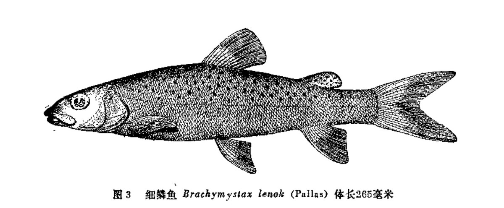

又名细鳞鱼。俗称桦鱼，花鱼。体长10到26厘米，体背部深紫褐色，体侧略淡，腹部橘黄色。体侧有许多分散的圆形或椭圆形小黑斑。为冷水性鱼类，多栖息于水温较低的山麓附近的水域，幼鱼喜钻入石缝或乱石堆中，入冬后进入深水区。是肉食性鱼类，较贪食，通常以小鱼、鱼卵、水生昆虫等为食，有时也能食小型哺乳动物及植物的枝叶等。每天食欲最旺的时间是早晨颌傍晚，其它时间多潜伏在溪流沿岸的水底。多分布于黑龙江、图们江水系，在秦岭有零星分布。鱼肉肥，含脂量大，个体大，是一种珍贵的经济鱼类。

## 鳗鲡

Anguilla japonica Temminck et Schlegel,1846

http://www.fishbase.org/summary/295

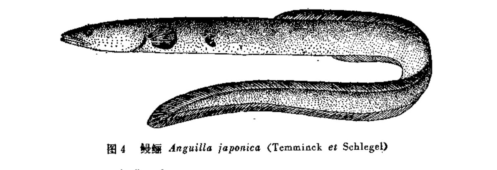

俗称青鳝，白鳝，体长440厘米，体细长，前部圆柱形，后部侧扁，头部钝尖。体呈灰黑色，腹部黄白色。为降河入海产卵的洄游性鱼类。成鱼栖息于江河湖泊及水库底层，白天潜伏于洞穴或石缝中，夜间出来活动，以小鱼、小虾、水生昆虫、甲壳动物为食，也食动物尸体。肉质细嫩，含脂量高。分布于长江、闽江、珠江流域，以及海南岛等地。

## 多鳞白甲鱼

Onychostoma macrolepis  (Bleeker, 1871)

http://www.fishbase.org/summary/60668

俗称鱼古洞，体长10厘米左右，体侧扁，稍狭长，背部稍隆起，腹部圆。尾部稍侧扁。头短。吻钝。体呈黑褐色，腹部灰白，体侧每个鳞片基部均有新月形的黑斑。分布于长江、淮河、海河水系。

## 鲤鱼

Cyprinus carpio Linnaeus

http://www.fishbase.org/summary/1450

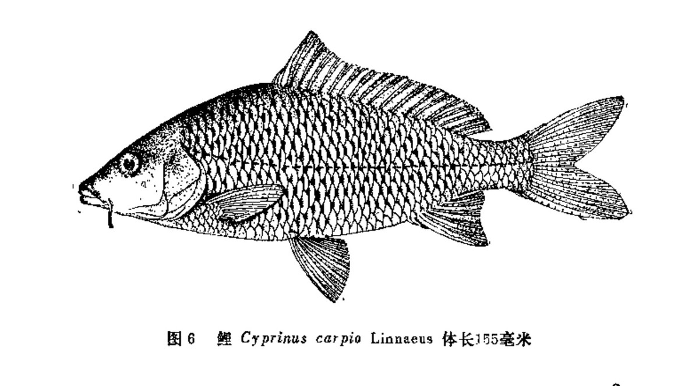

俗称鲤拐子。身体侧扁而腹部圆，口呈马蹄形，须2对。背鳍基部较长，背鳍和臀鳍均有一根粗壮带锯齿的硬棘。体侧金黄色，尾鳍下叶橙红色。鲤鱼平时多栖息于江河、湖泊、水库、池沼的水草丛生的水体底层，以食底栖动物为主。其适应性强，耐寒、耐碱、耐缺氧。在流水或静水中均能产卵，产卵场所多在水草丛中，卵粘附于水草上发育。

## 鲫鱼

Carassius auratus  (Linnaeus, 1758)

http://fishbase.org/summary/271

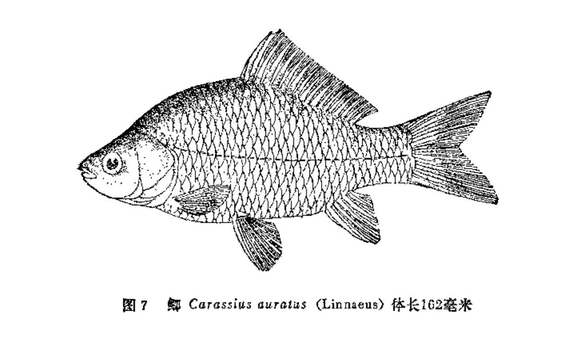

俗称鲫瓜，体侧扁而高。头较小，吻钝。无须。下咽齿侧扁。背鳍基部较短。背鳍、臀鳍具粗壮的、带锯齿的硬刺。为广布、广适性鱼类，分布自亚寒带至亚热带，能适应各种恶劣环境。杂食性，食浮游生物、底栖动物及水草等。繁殖力强，成熟早。3—7月，在浅水湖汊或河湾的水草丛生地带繁殖，分批产卵，卵粘附于水草或其他物体上。为中小型鱼类，常见为半市斤左右。广布于全国各水系。
中国原生鱼：北京的鱼类

## 银鲫

Carassius gibelio  (Bloch, 1782)

http://www.fishbase.org/summary/6376

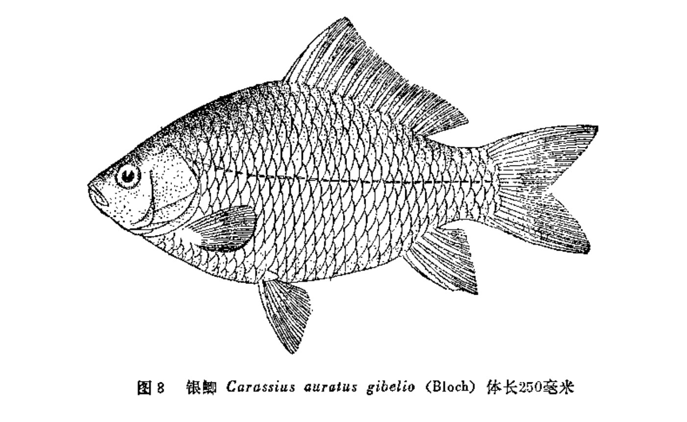

体侧扁，宽而高。腹部圆。头小，吻钝。口端位，呈弧形；口裂宽大于口裂长。无须。背鳍基长，其起点距吻端较距尾鳍基近，最末根硬刺粗壮。尾鳍分叉较浅。生活于湖泊、河湾等水流缓慢的水域。成鱼为杂食性，适应性强，常因栖息环境不同，体色有明显变化；同时形成了在形态和生态上都稍有差异的地方性种群。为我国北方主要经济鱼类之一，也用于养殖。

## 唇䱻

Hemibarbus labeo  (Pallas, 1776)

http://www.fishbase.org/summary/17301

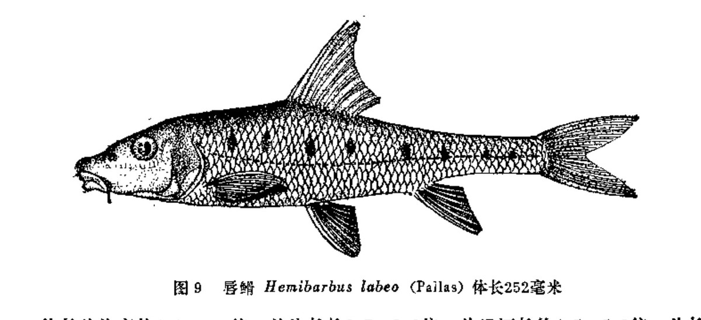

体长10到25厘米，略侧扁，胸腹部稍圆。头大，其长大于体高。吻长，稍尖而突出，长度显著
大于眼后头长。体背青灰色，腹部白色。成鱼体侧无斑点，小个体具不明显的黑斑。背、尾鳍灰黑，
其他各鳍灰白色。喜栖息于水流湍急的水中，幼鱼生活在水流平稳的地方。主要以水生昆虫及软体动物为食。生长较慢，数量少。分布于全国各主要水系。

## 花䱻

Hemibarbus maculatus  Bleeker, 1871

http://www.fishbase.org/summary/4752

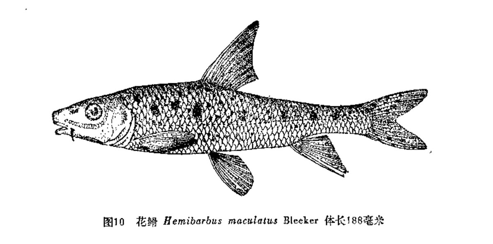

俗称麻鲤，体长5到18厘米，较高，腹部圆。头中等大。背鳍长，末根不分枝鳍条为光滑的硬刺，长且粗壮。体背及体侧上部青灰色，腹部白色。体侧具多数大小不等的黑褐色斑点。背鳍和尾鳍具多数小黑点，其他各鳍灰白。为江湖中常见的中、下层鱼类。以水生昆虫的幼虫为主要食物，也食软体动物和小鱼。生殖季节在4—5月，分批产卵。卵粘性，附着于水草上发育。广泛分布于全国各大水系。

## 麦穗鱼

Pseudorasbora parva  (Temminck & Schlegel, 1846)

http://www.fishbase.org/summary/4691

俗称罗汉鱼，野草鱼。体长，侧扁，尾柄较宽，腹部圆。。尾鲭宽阔，分叉浅，上下叶等长，末端圆。体背及体侧灰黑色，腹部银白色。体侧鳞片的后缘有新月形的黑斑。各鳍灰白色。为江河、湖泊、池塘等水体中常见的小型鱼类。喜栖息于水草丛生的浅水水域。杂食，主食浮游动物。产卵期4—6月。卵椭圆形，具粘性，成串地粘附于石片、蚌壳等物体上，孵化期雄鱼有守护的习性。

## 华鳈

Sarcocheilichthys sinensis  Bleeker, 1871

http://www.fishbase.org/summary/47349

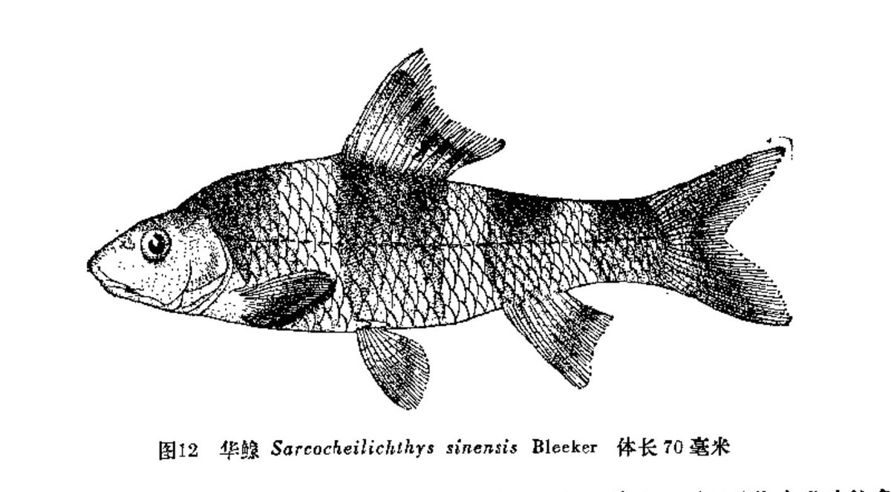

体略高，稍侧扁，头后背部显著隆起，以背鳍起点处为最高，腹部圆，尾柄宽短，侧扁。体灰色，背部灰黑，腹部灰白。体侧具宽阔的垂直黑斑4块，各斑块的宽度与其间隔相等或稍大。各鳍灰黑色，边缘浅黄或呈白色。栖息于水的中下层，以底栖无脊椎动物、藻类及植物碎屑为食。利用它尖锐的下颌刮食固着在石头上的食物。在各大水系均有分布。

## 黑鳍鳈

Sarcocheilichthys nigripinnis  (Günther, 1873)

http://www.fishbase.org/summary/12225

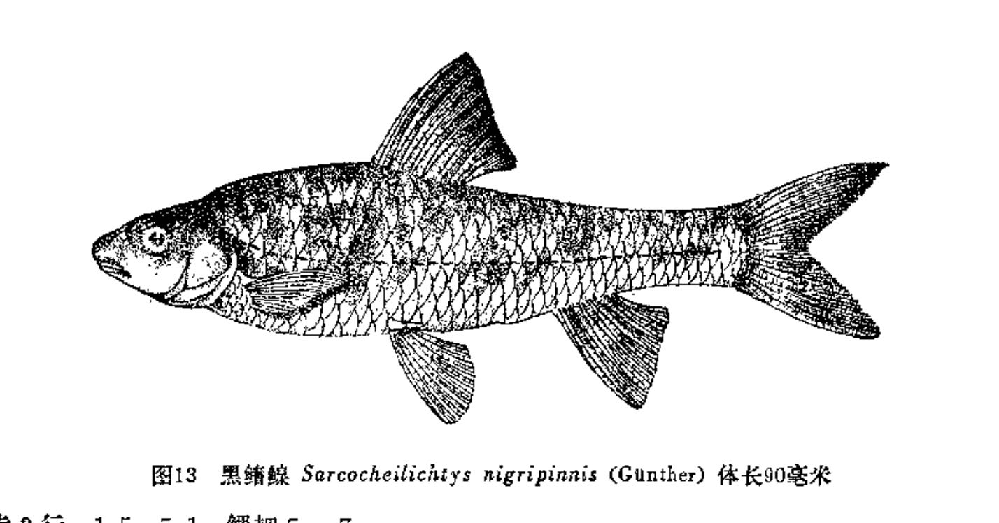

俗称花花媳妇，体长10厘米左右，略侧扁．尾柄稍短，腹部圆。头较小，头长略小于体高。体背及体侧灰暗，问杂有黑色和棕黄色的斑纹，腹部白色。鳃盖后缘、峡部、胸部均呈桔黄色，鳃孔后缘的体前部具有一条深黑色的垂直条纹，背鳍、尾鳍灰黑色较深，其他各鳍呈黑色。常游于水草繁茂处，有跃水的习性。以水生昆虫和水草碎片为食。在长江、黄河、珠江水系及海南岛、台湾均有分布。

## 东北颌须鮈

Gnathopogon strigatus  (Regan, 1908)

http://www.fishbase.org/summary/46937

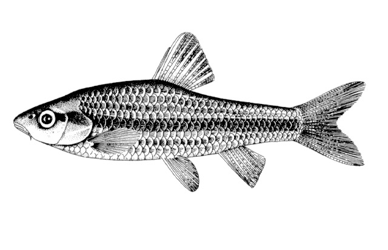

体长不到10厘米，侧扁，腹部圆。背侧灰黑色，腹部灰白色，体侧中央有一条较宽的黑色纵纹，侧线上下方有竖条较细的纵纹，背鳍有黑色纵纹，其它各鳍灰白色。小型鱼类，喜栖息于河流及其支流的底层。以底栖无脊椎动物为食。分布于黑龙江流域。

## 点纹银鮈

Squalidus wolterstorffi  (Regan, 1908)

http://www.fishbase.org/summary/54972

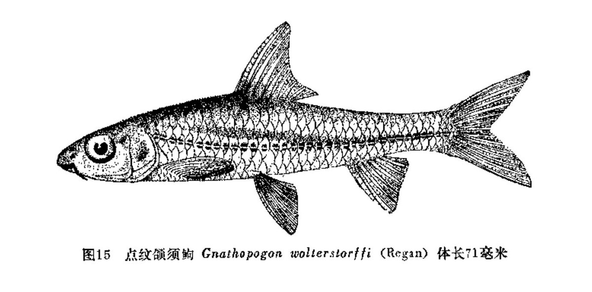

体长不到10厘米，稍侧扁，腹部圆。头中等大。吻前端钝圆。胸腹部披鳞。背鳍较短，无硬刺。体呈淡棕色，腹部白色。体侧中轴稍上方有一黑条纹，体侧上半部有不规则黑色斑点。侧线鳞片各具一黑斑。背鳍、尾鳍深棕色，其它各鳍灰白色。栖息于浅水水域，以矽藻、绿藻及枝角类为食。小型鱼类，数量稀少。分布于滦河、海河、长江、闽江、漓江等水系。

## 棒花鮈

Gobio rivuloides  Nichols, 1925

http://www.fishbase.org/summary/60100

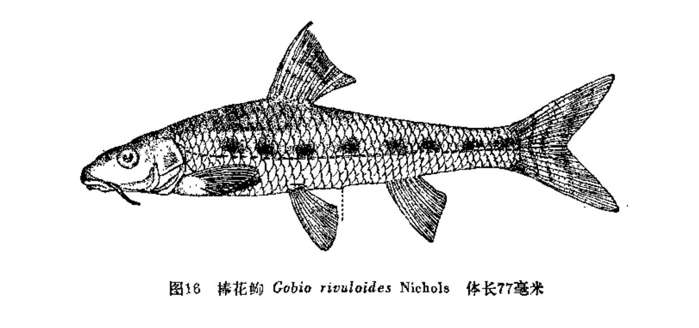

体长，略呈圆筒形，背部不甚隆起，腹部平坦，尾柄侧扁，较短且高。头近锥形。背鳍较短，无硬刺，外缘微凹。体背深灰色，腹面白色。体侧具不明显的纵纹，沿体中轴自头后至尾基。其上有9一11个黑斑点，背中线上也有8-11个黑斑点。背、尾鳍有多数小黑点组成的条纹，其他各鳍灰白。底层小型鱼类，栖息于泥沙底质的缓流浅水处，以摇蚊幼虫和藻类为食，6月繁殖。分布于海河、黄河、滦河、大凌河等水系。

## 细体鮈

Romanogobio tenuicorpus  (Mori, 1934)

http://www.fishbase.org/summary/47347

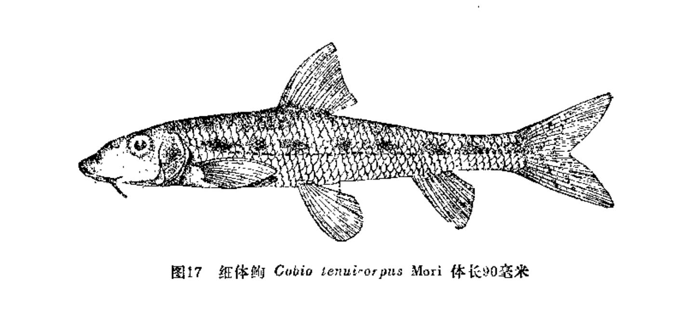

吻稍尖，口下位，呈弧形。唇厚，口角具粗长的须1对。背鳍无硬刺，胸鳍较大，腹鳍较长，尾鳍叉型，末端尖。体背部及体侧上部灰黑色，背上有许多小黑点，沿体侧中轴有8—11个黑色长形斑块，背部正中有6—7上黑斑块。喜激流，生活于江河中不进入湖泊。个体小，数量少，无经济价值。分布于黑龙江、滦河水系。

## 棒花鱼

Abbottina rivularis  (Basilewsky, 1855)

http://www.fishbase.org/summary/22903

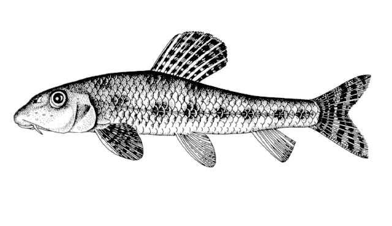

体长，稍侧扁。头较短，吻短，前端圆钝。眼小，侧上位，眼间宽平。背鳍无硬刺，胸鳍圆钝，均较短。尾鳍叉型。头背部稍黑，体侧具一不明显的纵纹，其上有9-11个黑点斑块，背部也具8-11个黑色斑块。背鳍和尾鳍具有由黑色小点组成的斑纹。小型鱼类，生活在静水或流水的底层，主食无脊椎动物。分布于全国各主要水系及湖泊、沟塘中。

## 蛇鮈

Saurogobio dabryi  Bleeker, 1871

http://www.fishbase.org/summary/47352

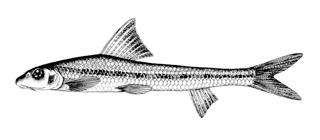

体长形，前部圆筒形，候补稍侧扁，腹部略平坦。头较长，吻部在鼻孔前下凹。吻长大于眼后头长。唇发达，具显著小乳突，下唇后缘游离。须1对。侧线鳞47—49。胸部裸露。体上灰下白，沿侧线有一条宽的黑色纵带。小型鱼类，生活于江河、湖泊的底层。主食底栖无脊椎动物。繁殖期4—6月，漂流性卵。体较肥壮，数量较多。在各大水系广泛分布。

## 潘氏鳅鮀

Gobiobotia pappenheimi  Kreyenberg, 1911

http://www.fishbase.org/summary/47278

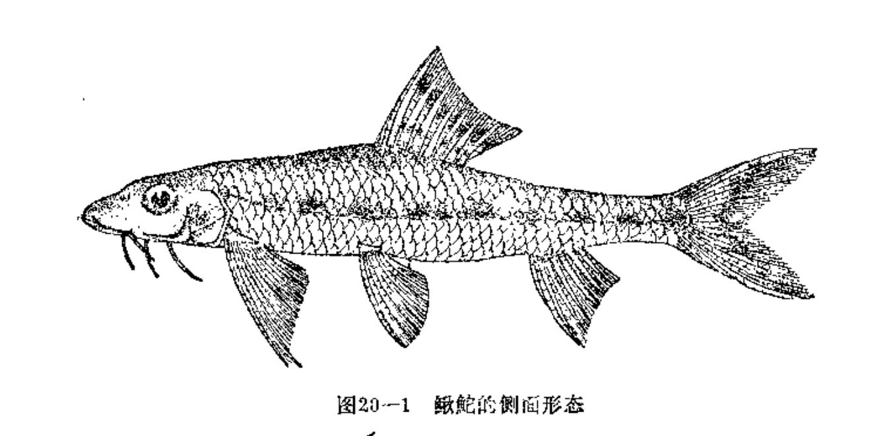

体长形，前部圆形，后部侧扁，腹部平坦。头平宽，宽大于高。吻圆钝。鳞圆形，侧线平直，胸鳍较宽大，尾鳍深叉形，末端稍尖。体背部棕灰色，下部色淡，体侧正中线上有9个黑色斑点。背鳍河尾鳍上有不明显斑点组成的条纹，其它各鳍灰白色。小型鱼类，喜生活在急流中，贴近水底。胸部和胸鳍有吸盘的作用。以底栖无脊椎动物、昆虫幼鱼为食。分布于海河和黄河水系。

## 青鱼

Mylopharyngodon piceus  (Richardson, 1846)

http://www.fishbase.org/summary/4602

又名黑鲩、螺蛳青。体粗壮，近圆筒形，腹部圆，无腹棱。鳃孔宽，向前伸至前鳃盖骨后缘的下方；鳃盖膜与峡部相连；峡部较宽。鳞中大；侧线约位于体侧中轴，浅弧形，向后伸达尾柄正中。体呈青灰色，背部较深，腹部灰白色，鳍均呈黑色。栖息于大江河和湖泊的下层，一般不游至水面。以软体动物为主要食料，有时也食小虾和水生昆虫。生长快，个体大。分布于长江以南平原地区，黑龙江、黄河等水系也有分布。

## 鯮鱼

Luciobrama macrocephalus  (Lacepède, 1803)

http://www.fishbase.org/summary/54895

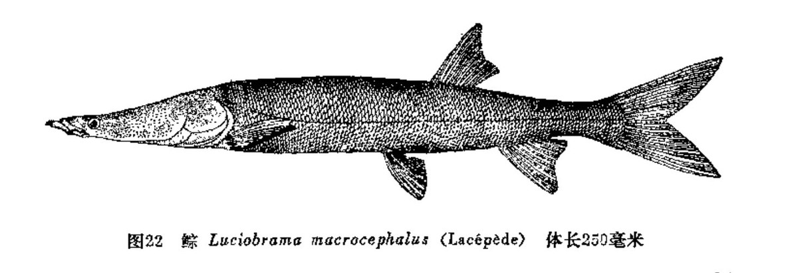

又称尖头鳡、剑鳡、俗名马头鲸。体细长，近圆筒状，尾柄粗壮。头尖长，前部呈管状，稍平扁，眼后头部侧扁。口上位，下颌显著长于上颌。无须。眼小，位头之前上方，眼后头长远大于吻长。体背深灰，体侧及腹面银白，背鳍灰黄，其他鳍及尾鳍下叶红色。性情凶猛，游动性强，以追捕小鱼为食，危害其它鱼类，是凶猛的肉食鱼类之一。主要分布于长江流域和珠江流域。

## 草鱼

Ctenopharyngodon idella  (Valenciennes, 1844)

http://www.fishbase.org/summary/79

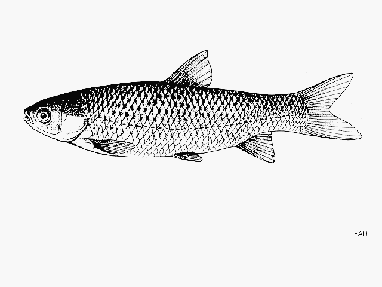

体长形，前部近圆筒形，尾部侧扁，腹部圆，无腹棱。头宽，中等大，前部略平扁。吻短钝，吻长稍大于眼径。体呈荼黄色，腹部灰白色，体侧鳞片边缘灰黑色，胸鳍、腹鳍灰黄色，其它鳍浅色。生活于水的中下层和近岸多水草区域。性情活波，典型的草食性鱼类，以水草、萍类及高等植物为食，幼鱼期兼食昆虫、蚯蚓及藻类。个体大，生长快。在各地广泛分布。

## 中华细鲫

Aphyocypris chinensis  Günther, 1868

http://www.fishbase.org/summary/23617

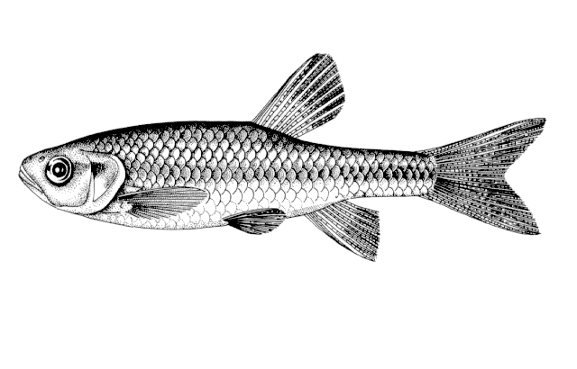

体细长，稍侧扁，体高略小于头长。前腹圆，从腹鳍基底到肛门具有腹棱。吻钝。咽骨弧形，较窄。咽齿圆锥形，末端略成钩状。鳃耙短小，稀疏。沿体侧中部有1道不太显著的深色条斑。各鳍无明显斑纹。口端位，口裂向后方倾斜，唇薄，无须。腹鳍基部肛门之间有腹棱。鳃耙短小，稀疏。鳞片大，侧线不完全。集群性小型鱼类。生活于水田、沟渠、池塘、湖泊中。喜集群，游泳迅速。分布在四川、浙江、山东、福建、湖北、河北、东北等地。

## 尖头鱥

Phoxinus jouyi  (Jordan & Snyder, 1901)

http://www.fishbase.org/summary/22927

体长，稍侧扁，腹部圆，尾柄稍高。口裂宽浅，呈弧形。鳞细小，排列不规则。侧线完全。尾鳍浅灰色，其余鳍呈浅色。体呈黑褐色，至腹侧渐浅而呈白色。体有许多不规则的黑色小斑点，体两侧中轴有一显著的黑色纵带纹。小型鱼类，生活在水流缓慢清澈的冷水溪流中。通常成群，游动迅速。以食硅藻、植物碎片等植物为主，也食一些水生昆虫等。分布在黑龙江和山西等地。

## 瓦氏雅罗鱼

Leuciscus waleckii  (Dybowski, 1869)

http://www.fishbase.org/summary/46549

体长形，侧扁，背缘略呈弧形，腹部圆。头短，侧扁，头长小于体高。腹鳍起点在背鳍之前，末端钝，不伸达肛门。尾鳍叉形，上下叶等长，末端尖形。体背侧青灰色，腹侧浅色，体侧鳞片后缘灰黑色；背鳍、尾鳍浅灰色，尾鳍边缘灰黑色，胸鳍、腹鳍、臀鳍浅色。中上层鱼类，喜栖居在河口及水流较缓、水质清澈处，冬季在江河的深水处越冬。杂食性，以底栖动物、水生昆虫为食，也食藻类和小鱼等。是脂肪不多的瘦鱼，被捕后极易死亡。分布于黑龙江流域和黄河中游地区。

## 鳡鱼

Elopichthys bambusa  (Richardson, 1845)

http://www.fishbase.org/summary/12068

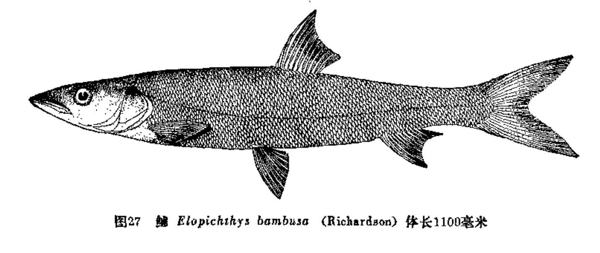

体修长，头锥形，吻部尖。下颌前端有一坚硬的骨质凸起，与上颌的凹陷相嵌合。鳞细小。背鳍起点位于腹鳍之后上方。鲜活时体背侧灰黑色，腹侧银白色；背鳍、尾鳍深灰色，其余鳍及峡部呈黄色，尾鳍边缘黑色。大型凶猛性鱼类，性情活波，游动迅速，善于猎食，常在敞水区域追捕鲢、鳙、鮊类等鱼为食。上等的食用鱼类，但危害其它鱼类。出西北、西南外，在各水系广泛分布。

## 马口鱼

Opsariichthys bidens  Günther, 1873

http://www.fishbase.org/summary/27264

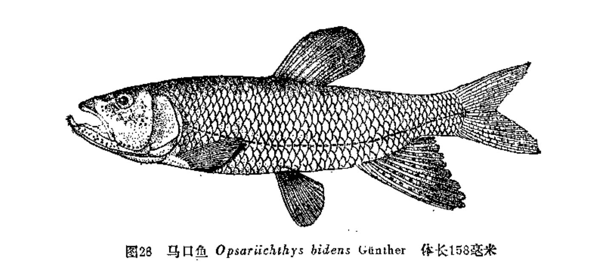

体厂而侧扁，背、腹部较圆，口大。背部灰蓝色，腹部银白色，体侧有许多蓝绿色的垂直斑条。背鳍和臀鳍具蓝黑色小斑点。胸鳍、腹鳍桔黄色。眼上方有一红色斑点。喜栖息于山涧溪流中，尤喜水流较急多砂砾的支流中，与鱲常集群游泳，性情活波，清晨和傍晚常跃出水面。小型凶猛鱼类，以小鱼、水生无脊椎动物为主要食物。分布于各大水系。

## 鳤鱼

Ochetobius elongatus  (Kner, 1867)

http://www.fishbase.org/summary/25599

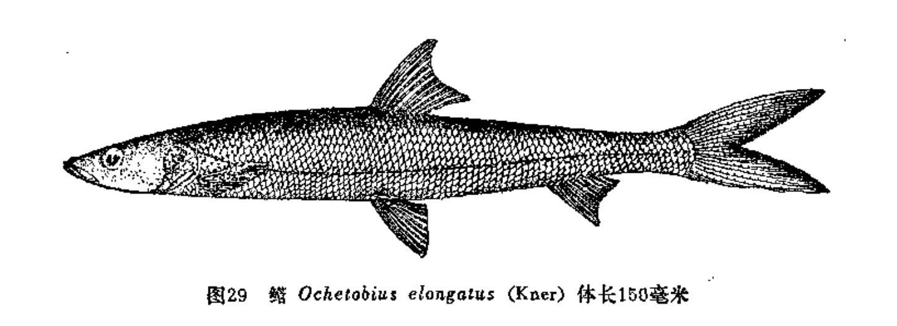

体低而延长，呈圆筒状，尾柄低。头短，稍侧扁。吻短，稍失，吻长大于眼径。鲜活时体背侧灰黑色，腹部银白色。鳞片中等大小，尾鳍末端尖，分叉深。背鳍、臀鳍、尾鳍带淡黄色，尾鳍边缘黑色。中型鱼类，有江湖洄游习性，性情温和，生活在水的中上层，以浮游动物为食，有时也吃小鱼。广泛分布于各大水系。

## 宽鳍鱲

Zacco platypus  (Temminck & Schlegel, 1846)

http://fishbase.org/summary/7762

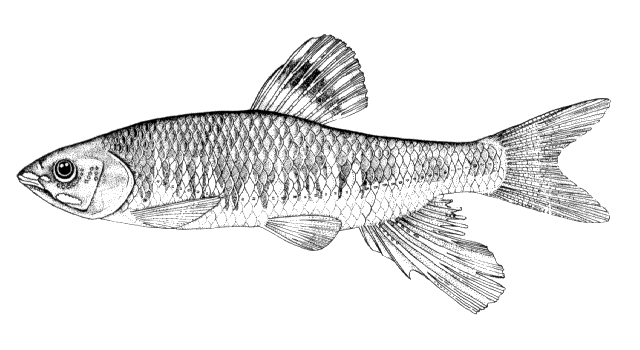

体长而侧扁，体高略大于头长，腹部圆。生活时体色鲜艳，背部灰黑，腹部银白，体侧有多条蓝色的垂直条纹，在条纹之间杂有粉红色斑点。腹鳍淡红色，各鳍鳍膜微黑，无明显斑纹。小型鱼类，喜栖息于山涧底质为砾石的小溪急流中。通常集群活动，性情活波，喜跃水。摄食小型鱼类和水生昆虫。常与马口鱼在同一水域中共存。广泛分布于各大水系。

## 赤眼鳟

Squaliobarbus curriculus  (Richardson, 1846)

http://www.fishbase.org/summary/10387

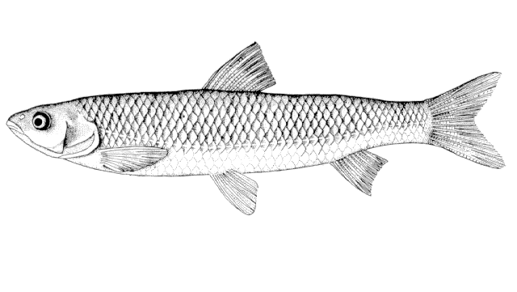

又名鳟条、红眼，体前部近圆筒形，尾部侧扁，背缘平直，腹部无腹棱。头近圆锥形，背面较宽。侧线以上每一鳞片基部有黑点，列成纵行。背鳍、尾鳍深灰色，其他鳍浅灰色。体色与草鱼蕾丝，灰黄中带青绿色，背部深灰色，腹部银白色。眼的上缘有一块红斑。生活在江河流速较缓的水域或湖泊的中下层。不喜集群。杂食性鱼类，主食水草，也食小鱼、软体动物等。广泛分布于各大水系。

## 似鱎

Toxabramis swinhonis  Günther, 1873

http://www.fishbase.org/summary/55396

俗称锯鲦，又称为薄䱗，体甚侧扁，背部较平直，腹部弧形，自峡部至肛门具腹棱。头短，侧扁，头背平直，头长显著小于体高。背鳍位于腹鳍基后上方，外缘平直，最后不分枝鳍条为硬刺，后缘具锯齿，刺长短于头长；背鳍起点至尾鳍基的距离较至吻端为近。体呈银白色，背侧色较暗。体侧有一条亮银色纵带纹，液浸后变为黑色。小型鱼类，一般栖息于水体的中上层。常成群游于水面。食物喂枝角类、浮游藻类及少量的昆虫幼虫等。分布于长江、黄河等水系。

## 䱗

Hemiculter leucisculus  (Basilewsky, 1855)

http://www.fishbase.org/summary/4755

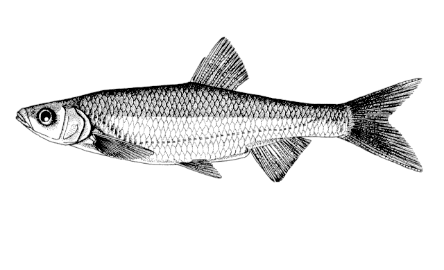

又名白条、小白条、白鱎。体侧扁，背缘平直，腹缘略呈弧形，自胸鳍基下方至肛门具腹棱。头略尖，侧扁，头部背面平直，头长短于体高。吻短，吻长大于眼径。体背部青灰色，腹侧银色，尾鳍边缘灰黑。极常见的小型鱼类，生活在水的中上层，冬季潜藏于深水层，喜群集于沿岸水面游泳觅食，行动迅速。杂食性，以水生昆虫、高等植物碎片、枝角类和藻类等为食，偶尔也吞食小鱼。广泛分布于除西部高原外的各大水系。

## 贝氏䱗

Hemiculter bleekeri  Warpachowski, 1888

http://www.fishbase.org/summary/22529

又名油餐条、小白条。体型于餐略同，体侧扁，背腹缘略呈弧形，腹部自胸鳍基部下方至肛门具腹棱。头侧扁，头背平直，头长小于体高。体背部青灰色，体侧和腹面银白色，各鳍均为灰白色。在河流、湖泊、池塘等各类水体中都能生存，喜集群，常在浅水处摄食。杂食性鱼类。除西部高原外在各大水域均有分布。

## 鳊鱼

Parabramis pekinensis  (Basilewsky, 1855)

http://www.fishbase.org/summary/282

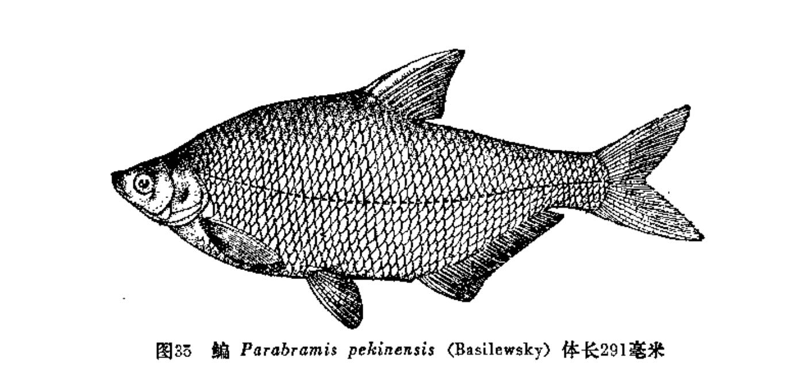

又名扁鱼，体高，甚侧扁，呈长菱形，背部窄，腹部自胸鳍基下方至肛门具腹棱，尾柄宽短。头
小，侧扁，略尖，头长远较体高为小。体背部青灰色，略带浅绿色光泽，体侧和腹面银灰色，各鳍均为灰白色。栖息于水的中下层，喜栖息在河床上有岩石的流水中，冬季群集于深水处。草食性鱼类。幼鱼喜食浮游动物、藻类、水生昆虫以及少量水生植物碎片。广泛分布于国内各大水域。

## 红鳍鲌

Chanodichthys erythropterus  (Basilewsky, 1855)

http://www.fishbase.org/summary/4635

又名连子，体长形，侧扁，头后背部隆起。下颌往上翘。下咽齿尖端呈钩状。胸鳍长，其末端接近腹鳍。尾鳍深叉形。体背部灰色，侧面及腹面银白色。体侧鳞片后缘具黑色斑点。背鳍灰白色，腹鳍、臀鳍和尾鳍下叶均呈桔黄色。小型鱼类，喜栖息在水草繁茂的湖泊中，在河流中通常在缓流鳢。主要捕食小型鱼类，也是少量水生昆虫、虾和枝角类。从黑龙江至海南岛都有分布。

## 寡鳞飘鱼

Pseudolaubuca engraulis  (Nichols, 1925)

http://www.fishbase.org/summary/54782

体甚侧扁，腹部外廓圆凸，背部接近一直线。腹棱完全。无须。侧线在胸鳍上方突然向下弯折。体呈银色，背部略带黄色。个体小，产量少，小型鱼类，杂食，在长江流域、黄河流域均有分布。

## 团头鲂

Megalobrama amblycephala  Yih, 1955

http://www.fishbase.org/summary/285

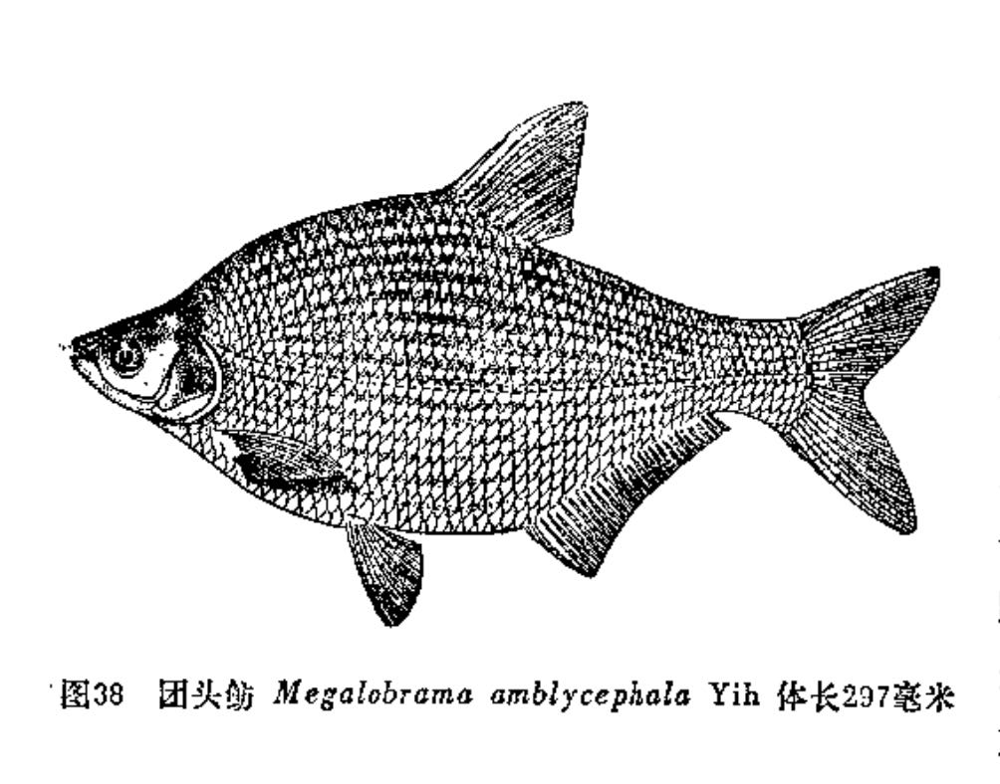

又名武昌鱼，体高，偏扁。腹棱自腹鳍至肛门。上下颌角质较薄。背鳍刺较短，其长度不及头长。尾柄高大于长。鳔3室，中室最大。生殖季节雌雄体上均具珠星，雄鱼第1根胸鳍条肥厚，略呈波浪形弯曲。体呈青灰色，体侧鳞片基部浅色，两侧灰黑色，在体侧形成数行深浅相交的纵纹。鳍呈灰黑色。生活在水的中下层，是适于静水水体繁殖生长的鱼类。幼鱼主要食甲壳动物，也食少量水生植物嫩叶，成鱼主要以水生植物为食。主要分布于湖北的中型湖泊，鄱阳湖也有分布。

## 青梢红鲌

Chanodichthys dabryi  (Bleeker, 1871)

http://www.fishbase.org/summary/46610

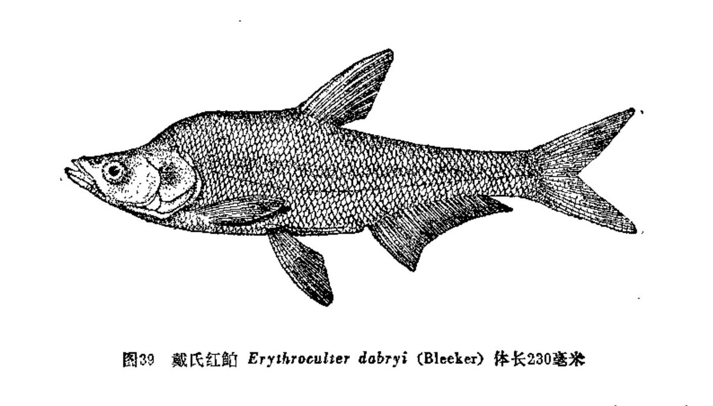

又名达氏鲌、戴氏红鲌、大眼红鲌、青桔子、撅嘴鲢。体长形，侧扁，背部较厚，在头后隆起，腹部在腹鳍处稍凹入，腹棱存在丁腹鳍基至肛门，尾柄较短。侧线前部微弯，后部平直，伸达尾鳍基。体背部灰黑色，腹部银灰色，鳍均呈灰黑色。喜栖息于静水湖泊，在水的中上层游动摄食。以小虾尾食料，偶尔兼食小鱼。凶猛鱼类，在黑龙江、长江、珠江等流域均有分布。

翘嘴红鲌：头与背之间相对比较平，鱼口呈地包天之势，下唇肥厚结实，上唇相对薄弱，尾巴很宽，尾巴呈黑色，尾巴尖长度一样，体型瘦长。青梢红鮊：头显得小，鱼眼黑、发亮，鱼背较驼、厚实、向上隆起，体较翘嘴短、宽，鱼鳍呈青黑色，尾巴尖上面比下面尖子短。二者最大的区别：青梢红鮊有些驼背，翘嘴红鲌更象弯刀。

## 翘嘴鲌

Culter alburnus  Basilewsky, 1855

http://www.fishbase.org/summary/46708

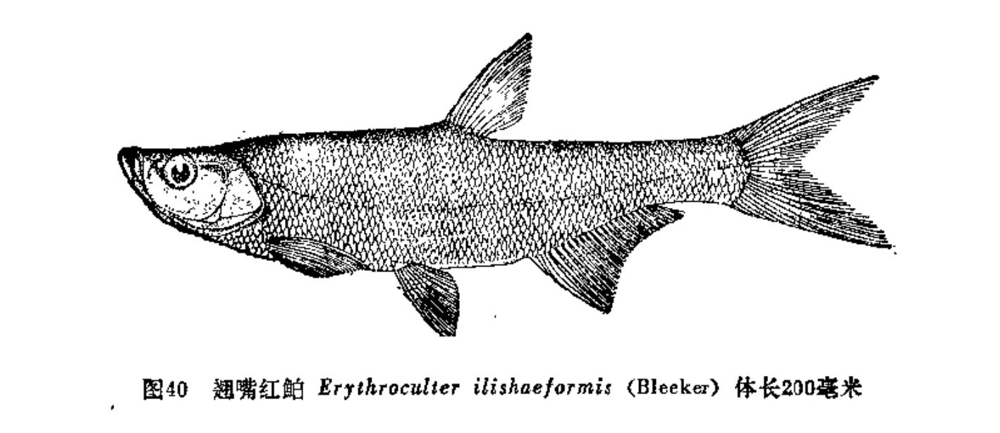

又名翘嘴连子、翘嘴红鲌、大白鱼。体长，侧扁，头背面平直。口上位，下颌坚厚，上翘，竖于口前。眼大。鳞小，侧线鳞80—93。背鳍具强大而光滑的硬刺。体背及体侧上部浅棕色，下部银灰色，腹部银白色，背鳍和尾鳍灰黑色，胸鳍、腹鳍及臀鳍灰白色。大型鱼类，生活在流水及大型水体中，中上层鱼，游动迅速，善于跳跃。主要以小鱼为食，也食昆虫、枝角类等。各地江河湖泊均有分布。

## 细鳞斜颌鲴

Plagiognathops microlepis  (Bleeker, 1871)

http://www.fishbase.org/summary/46742

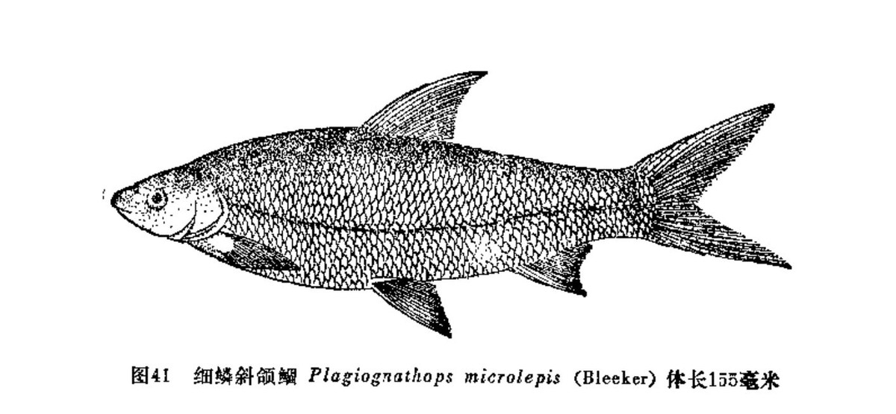

俗名黄皮、黄片、板黄鱼、沙姑子。体长而侧扁。头小。吻钝短；吻皮紧贴于上领。口下位，略呈弧形；下颌前缘有薄的角质缘。无须。体背灰黑色，体侧和腹部银白色。胸、腹、臀鳍浅黄色或灰白色，背鳍灰黑色、尾鳍桔黄色，后缘灰黑色。中下层鱼类，栖息于较急的流水中，行动缓慢，易于捕捞。主要以高等植物的枝叶颌丝状藻类为食，也食水生昆虫、枝角类和其他腐殖物质。在黑龙江、长江、珠江都有分布。

鲴亚科几种主要种类形态特征较为相似，但都有各自明显的区别。黄尾鲴的腹棱不发达，长度为肛门到腹鳍的1/4，鳃盖后缘有一条桔黄色斑纹；鳍条呈显著黄色。园吻鲴无腹棱；在鳃盖后缘也无色斑；各鳍条均呈灰黑色。银鲴也无腹棱，或只有不发达的腹棱，长度为肛门到腹鳍的1/5；鳃盖后缘有较深桔黄色斑一条；鳍条颜色不同，腹鳍、臀鳍呈杏黄色，其他各鳍呈灰黑色。

## 银鲴

Xenocypris macrolepis  Bleeker, 1871

http://www.fishbase.se/summary/11099

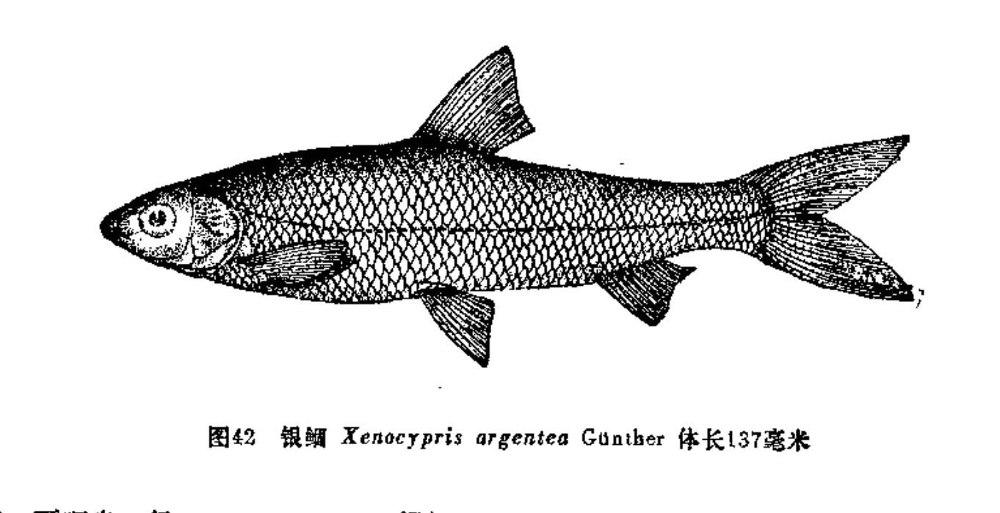

又名密鲴、红鳃。体侧扁，长形。头小。吻钝。口下位。下颌前缘有薄的角质。无须。眼较大，侧上
位。尾鳍分叉较深。鳃盖膜后缘有桔黄色斑块。体银白色，背侧略带暗绿色。胸、腹、臀鳍基部呈浅黄色，背鳍灰色，尾鳍常带黄色。性情活波，喜集群游泳，栖息在水的中下层。常以下颌的角质边缘在其它物体上刮取食物，以食藻类和高等植物碎片为主，也食浮游动物。在长江、黑龙江、黄河、珠江流域及云南均有分布。

## 黄尾鲴

Xenocypris davidi  Bleeker, 1871

http://www.fishbase.org/summary/54925

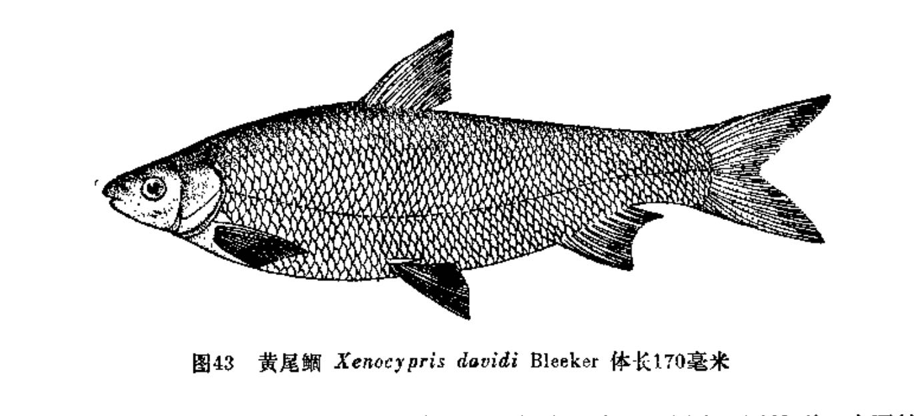

体长而侧扁，较银鲴为厚。头小。吻钝。口下位，略呈弧形。下颌前缘有薄的角质层。背部灰黑色，腹部肌体侧下半部银白色，鳃盖骨后缘有一浅浅黄色斑块，尾鳍黄色。本种和银鲴较相似，容易混淆。主要区别为本种体相对地高、厚；鳞片数较多；新鲜时尾鳍黄色；分布范围也较银鲴狭。栖息于水的中下层，以高等植物碎片、藻类为食，也食少量浮游动物、虾、水生昆虫等。分布广泛，长江流域最为常见。

## 似鳊

Pseudobrama simoni  (Bleeker, 1864)

http://www.fishbase.org/summary/56111

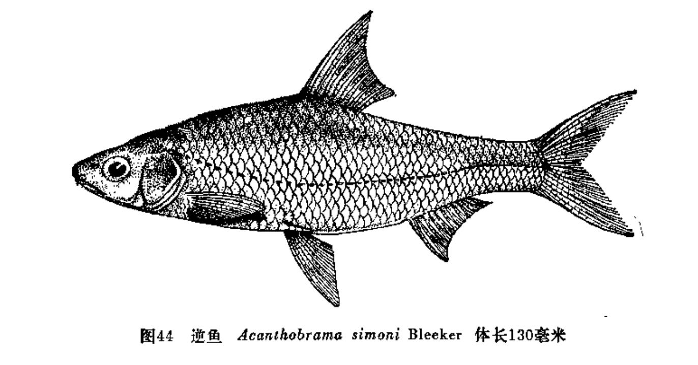

又名逆鱼。体长而侧扁。头短。吻钝。口下位，横裂。唇较薄。尾鳍深叉形。体背部和体上侧为青灰色，体下侧和腹部为银白色。背鳍、尾鳍浅灰色，腹鳍、胸鳍基部浅黄色，臀鳍灰白色。小型鱼类，栖息于水的中下层，主要食物是硅藻、丝藻类及高等植物碎片，喜用下颌刮取食物。喜群集逆水而游。在长江流域分布广泛。

## 中华鳑鲏

Rhodeus sinensis  Günther, 1868

http://www.fishbase.org/summary/54926

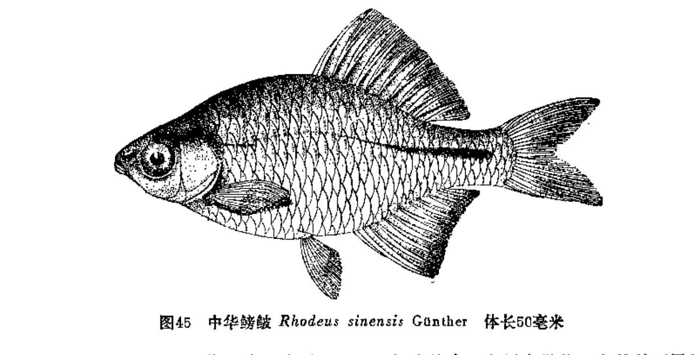

体侧扁，呈卵圆形，背部隆起，腹部凸，呈弧形。头小而尖。口角无须。眼侧位，眼间距稍大于眼径，眼上半部红色。侧线不完全，仅前面的3—7片鳞上具侧线孔。雌面具长的产卵管。体侧上部每个鳞片后缘都有一小黑斑。沿尾柄中线又一条黑色纵纹。鳃盖后方的体侧有两个一前一后的暗色斑。生殖季节雄鱼色彩异常鲜艳，吻部及眼眶周缘具珠星。卵在河蚌壳内发育。喜栖息在氧气条件好、水流缓慢、底质具有淤泥的浅水处。以高等植物的碎屑和藻类为食。长江流域及河北、山西有分布。

## 彩石鳑鲏

Rhodeus lighti  (Wu, 1931)

http://www.fishbase.org/summary/47833

又名彩石鲋。体高，扁薄，卵圆形。口角无须。背鳍无硬刺。侧线不完全，仅在前面3—6枚鳞片上具侧线孔。生殖期雄鱼的吻部具珠星，色泽鲜艳。背侧蓝绿色，腹部银白色，体上部鳞片后缘都具一小黑斑。鳃孔后方的第一个侧线鳞上有一绿色大斑点。尾柄中部有一条蓝绿色纵纹。多生活在小溪、水沟、稻田等处。主食藻类、水生植物碎片和水蚤等。繁殖季节雄鱼体色鲜艳。北起黑龙江，南至广东、福建等均有分布。

## 须鱊

Acheilognathus barbatus  Nichols, 1926

http://www.fishbase.org/summary/55891

体侧扁，呈长卵圆形。头小。吻尖。侧线完全，略平直。背鳍和臀鳍均具硬刺。体上部各鳞片边缘黑色，鳃孔后方第一个侧线鳞上有一大斑。长江中下游及福建有分布。

## 短须鱊

Acheilognathus barbatulus  Günther, 1873

http://www.fishbase.org/summary/54928

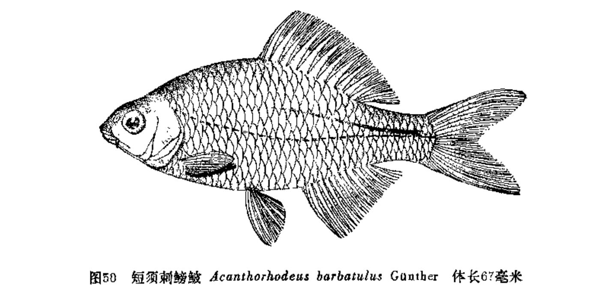

体侧扁，轮廓呈长卵形。口亚下位，呈马蹄形。侧线完全。背鳍及臀鳍均具硬刺，背鳍起点距吻端距离比距尾鳍基距离大。肛门接近腹鳍，胸鳍末端不达腹鳍，尾鳍深分叉。体上部各鳞片边缘黑色，鳃孔后方第一个侧线鳞上有一大黑斑。尾柄中线有一条明显的黑色纵纹。背鳍具三列小黑点。臀鳍及其它各鳍灰白色。小型鱼类，生活习性和其它鳑鲏亚科类似。在长江中下游及附近均有分布。

## 大鳍鱊

Acheilognathus macropterus  (Bleeker, 1871)

http://www.fishbase.org/summary/54380

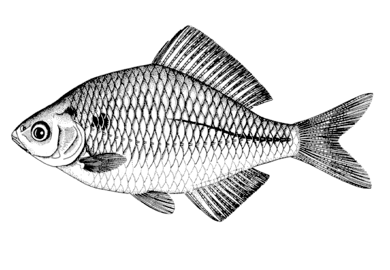

又名大鳍刺鳑鲏，体扁薄，卵圆形。具短须一对。齿面具锯纹。侧线完全，背、臀鳍均具硬刺。体背部暗绿色，体侧银白色，第四个侧线鳞上有一个大黑点，尾柄中线有一黑色纵纹。背鳍具三列小黑点组成的纵纹。鳍的外缘色浓。臀鳍有三条不等宽的黑色纵纹，其外缘纵纹最宽，其它各鳍灰色。是鳑鲏亚科中个体较大的一种。喜栖息于氧气条件良好、水草丛生的地方。生活习性和其它鳑鲏亚科类似。北自黑龙江，南至广东、广西均有分布。

## 越南鱊

Acheilognathus tonkinensis  (Vaillant, 1892)

http://www.fishbase.org/summary/54709

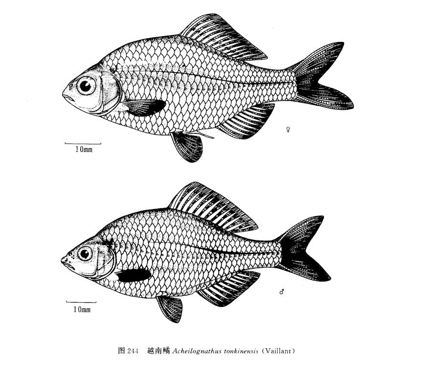

又名越南刺鳑鲏。体较高而扁薄，外形呈长卵圆形，头后背部显著隆起，腹缘浅弧形。臀鳍具有2根硬刺。侧线完全。尾鳍分叉深。腹腔膜灰褐色，体背部深灰色，腹侧面灰白色。体侧上半部每个鳞片的后援黑色。鳃孔后上方第一个侧线鳞上有一大黑点。沿尾柄中线有一条明显的纵纹。背鳍有三列小黑点。臀鳍灰黑色，边缘白色。其它各鳍灰白色。生活习性和其它鳑鲏亚科类似。主要分布于长江流域、珠江流域和福建等地。

## 斑条鱊

Acheilognathus taenianalis  (Günther, 1873)

http://www.fishbase.org/summary/61857

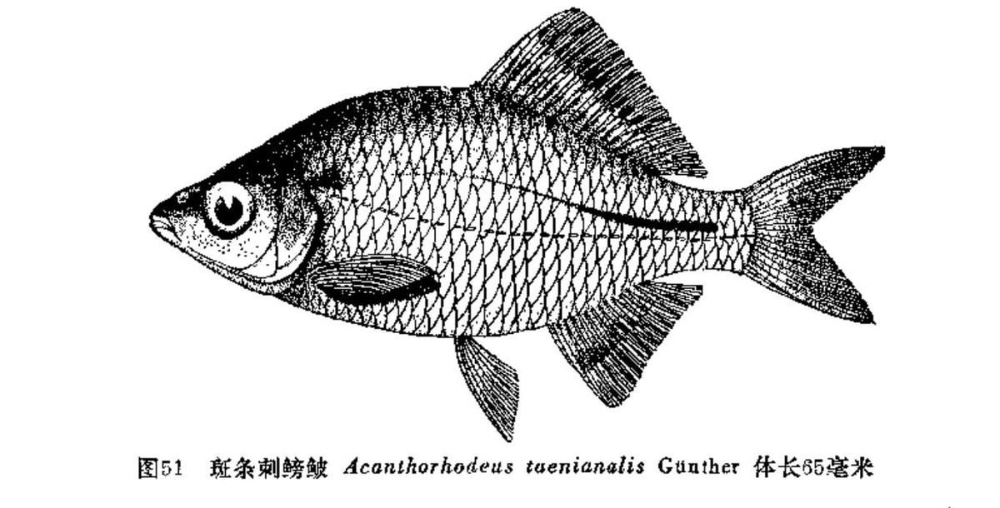

又名斑条刺鳑鲏。体高而侧扁，背前部隆起较高，腹部呈弧形。头较小，吻尖。眼较大。侧线完全，较平直。背鳍和臀鳍均具硬刺。体背部灰褐色，腹侧银白色。鳃后方侧线鳞上方有一黑色大斑。尾柄中线具一条细长的黑色纵纹。背鳍、尾鳍有两列不连续的黑点，鳍的边缘黑色。其它各鳍浅灰色。生活习性和其它鳑鲏亚科类似。无经济价值。主要分布于吉林、河北、安徽集长江流域一带。

## 兴凯鱊

Acanthorhodeus chankaensis  (Dybowski, 1872)

http://www.fishbase.org/summary/46831

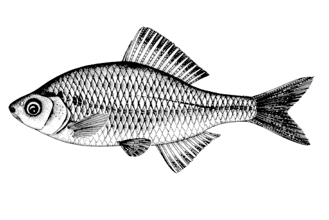

又名兴凯刺鳑鲏。体侧扁而高，呈椭圆形。口角无须。眼较大，侧位。侧线完全，较平直。背鳍和臀鳍均具细而尖的硬刺。体背部灰褐色，腹侧银白色。沿尾柄正中线有一条细的黑色纵纹。背鳍有两列黑白相间的条纹。雄鱼臀鳍边缘深黑色。生活习性和其它鳑鲏亚科类似。在我国分布广泛。

## 白河鱊

Acheilognathus peihoensis  (Fowler, 1910)

http://www.fishbase.org/summary/61918

又名白河刺鳑鲏。体侧扁而高，呈椭圆形。口角无须。眼较大，侧位。侧线完全，较平直。背鳍和臀鳍均具硬刺。体背部灰褐色，腹侧银白色。鳃孔后方第一个侧线鳞上有一个大黑点，沿尾柄中线有一条黑色纵纹。背鳍有两列小黑点组成的纵纹，边缘黑色。尾鳍淡棕色，其边缘色浓。其它各鳍灰白色。主要分布于河北、湖北、江苏等地。

## 鲢鱼

Hypophthalmichthys molitrix  (Valenciennes, 1844)

http://www.fishbase.org/summary/274

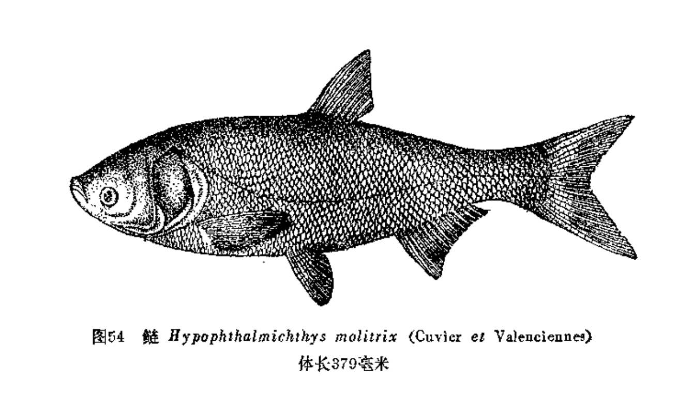

又名白鲢。头大，吻钝圆，口宽，眼位于头侧下半部，眼间距宽。鳃耙特化，彼此联合成多孔的膜质片，有螺旋形的鳃上器。鳞细小。胸鳍末端不达腹鳍基部。腹部狭窄，自喉部至肛门有发达的腹棱。背鳍短、无硬刺。体呈银白色，胸、腹鳍尾灰白色。栖息于水的中上层，性情活波，受惊动时能跳出水面。以浮游植物为食。分布于黑龙江、长江、珠江、西江等流域。

## 鳙鱼

Hypophthalmichthys nobilis  (Richardson, 1845)

http://www.fishbase.org/summary/275

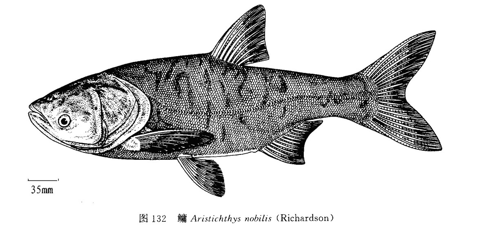

又名花鲢、胖头鱼。体侧扁，较高，腹部在腹鳍基部之前较圆，其后部至肛门前有狭窄的腹棱。头极大，前部宽阔，头长大于体高。背部及体侧上半部微黑，有许多不规则的黑色斑点；腹部灰白色。各鳍呈灰色，上有许多黑色小斑点。背鳍短、无硬刺。体背及体侧灰黑色，间有浅黄色光泽，腹部银白色。生活于水的中上层，性情温顺，行动迟缓，不善跳跃，易捕获。以浮游动物为食，偶食浮游植物。在国内分布极广，但在黄河以北各水体的数量较少。

## 花鳅

Cobitis taenia  Linnaeus, 1758

http://www.fishbase.org/summary/6378

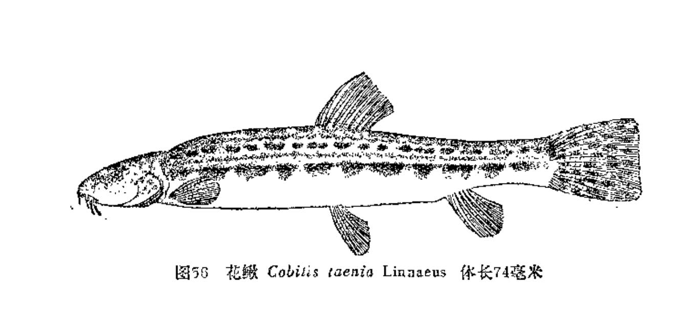

又名豆角。体细长，侧扁。头部小，侧扁。口小，唇厚。须四对。前后鼻孔靠近。眼的下缘有一枚硬刺。眼间距狭小。鳃孔仅开口于胸鳍基部区域。胸鳍短小，呈圆扇形。尾鳍近圆形。鳞片甚细小。侧线不完全。腹膜灰色，鳔很小。体褐色，头部密布不规则黑色斑纹，背部有10多个黑色斑块。体侧中线上方至北部之间散有不规则的黑色花纹。腹部白色。胸鳍、腹鳍、臀鳍均为白色。背鳍和尾鳍有几条黑纹。小型底层鱼类，喜栖息于水质较肥的河岸或湖边的浅水处。以藻类和底栖无脊椎动物为食。分布广泛。

## 花斑副沙鳅

Parabotia fasciata  Dabry de Thiersant, 1872

http://www.fishbase.org/summary/54998

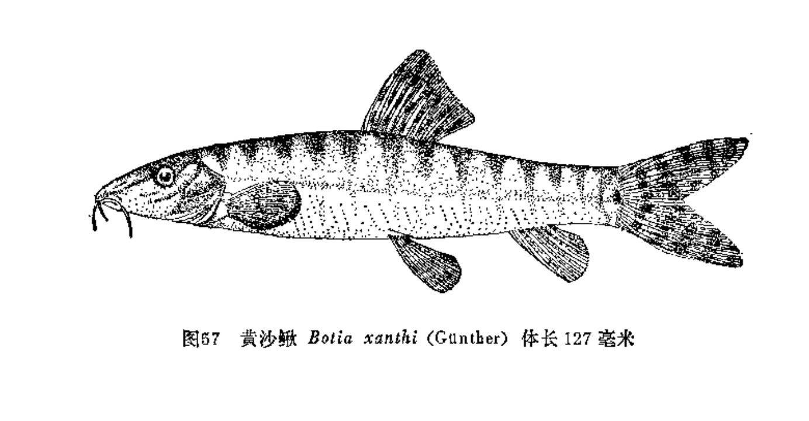

体长形，略圆，尾部侧扁，头长而尖。前后鼻孔靠近，中间有一分离的皮褶。眼的下缘有一分叉的硬刺。鳃孔很小，鳞片很微小。侧线完全。背鳍无硬刺。胸鳍圆扇形。臀鳍短小、无硬刺。尾鳍分叉深。体呈黄褐色，腹部灰白色，鳃盖后缘有多条深褐色的横斑纹。尾鳍基部有一深褐色斑点。背鳍、尾鳍有多行褐色斑点组成的纵纹。小型底层鱼类，主要以水生昆虫为食。黄河流域、长江流域、河北均有分布。

## 东方薄鳅

Leptobotia orientalis  Xu, Fang & Wang, 1981

http://www.fishbase.org/summary/55406

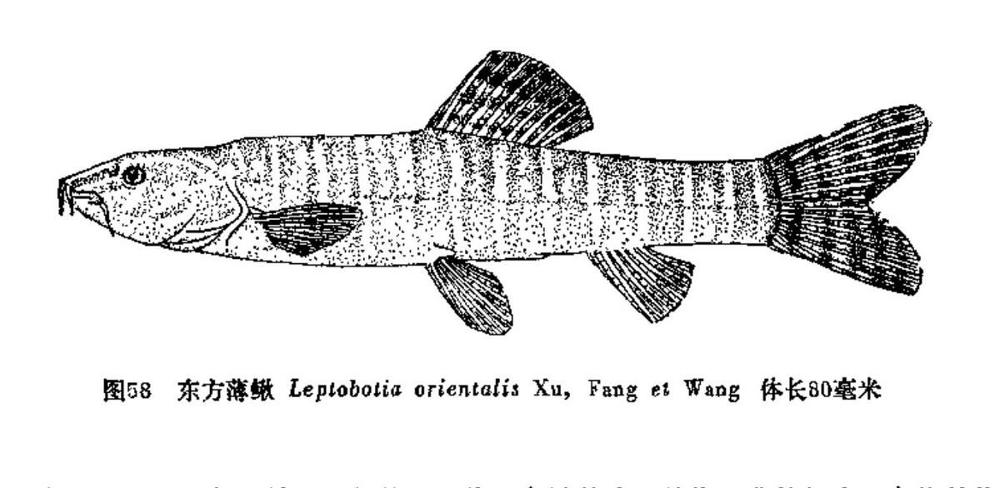

体长，侧扁，头长大于提高，眼小，口小。尾鳍短而宽。侧线完全，平直。体被细鳞。北部棕灰色，腹部浅黄色，体具10多条棕灰色垂直宽带纹，延伸至腹部。背鳍具3-4列斑点组成的斜形条纹。尾鳍有5咧回形条纹。分布于黄河、汉水等地。

北京特有，已灭绝。

## 黄线薄鳅

Leptobotia flavolineata  Wang, 1981

http://www.fishbase.org/summary/60397

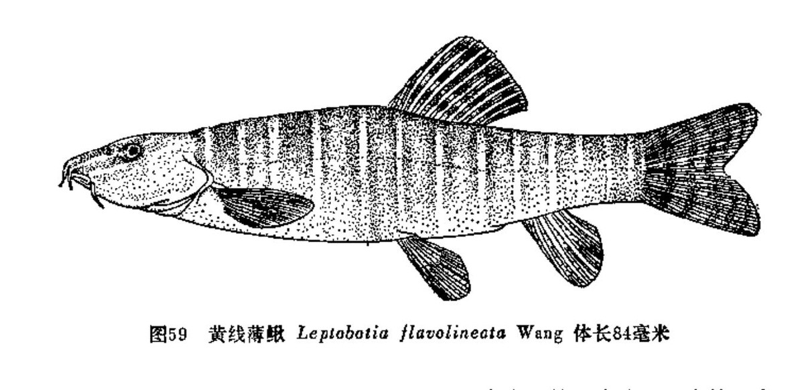

体长而侧扁，躯干部略粗而圆，尾柄短而高。眼中等大，侧上位。胸鳍短小，圆形。尾鳍短而宽，深凹，两叶圆钝。胸鳍、腹鳍基部均具腋鳞。体被细鳞，颊部也具鳞。体棕黄色，有14条很宽且规则的深棕色垂直带，间隔为黄色细线，左右侧的带于线均相连接成环。背鳍有4条由斑点组成的黑色横纹。尾鳍有不规则条纹。腋鳞黄色。仅分布于北京房山拒马河上游。

北京特有，已灭绝。

## 泥鳅

Misgurnus anguillicaudatus  (Cantor, 1842)

http://www.fishbase.org/summary/3016

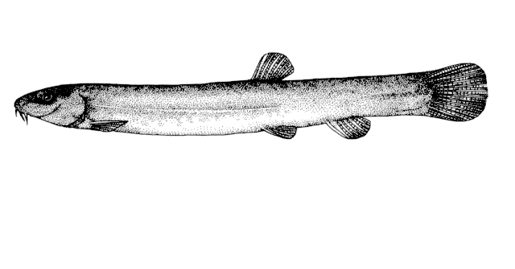

大鳞泥鳅(Misgurnus mizolepis)是本种的同物异名。

体长形，呈圆柱状，尾柄侧扁而薄。头小。吻尖。须5对。眼小。鳞片甚细小。背鳍短小。胸鳍距腹鳍很远。胸鳍不达臀鳍。尾鳍圆形。体上部黑色，下部白色，体侧有不规则的黑色斑点。背鳍及尾鳍上有更小的斑点。尾鳍基部上方有一显著的黑色大斑。其它各鳍灰白色。适应性极强。多栖息于泥底较深的静水或水流缓慢的池塘、沟渠、稻田等水域，适于中性和弱酸性土壤。多活动于水的底层，有时潜入泥中。除用鳃呼吸外，肠管和皮肤均有呼吸作用，如果氧气不足，可跃出水面吞吸空气。杂食性，幼鱼主要吃浮游动物、摇蚊幼虫等，成鱼以植物性食物为主。主要在夜间摄食。在国内各水域广泛分布。

## 北鳅

Lefua costata  (Kessler, 1876)

http://www.fishbase.org/summary/28022

体长形，前部稍扁平，后部侧扁。腹部圆。头宽而平扁。尾鳍圆形。鳞片甚小。无发达的侧线。口下位，有8小须，4个在唇上。背鳍不具鳍刺。体上部暗褐色，下部白色，北部及体侧有黑色小点。体侧有棕色狭条纹。尾基有以黑点。背鳍及尾鳍有小点。主要生活在静水和水流缓慢区域。数量不多，主要分布在北部地区，如黑龙江、内蒙古、山西、辽宁等地。

## 北方条鳅

Barbatula toni  (Dybowski, 1869)

http://www.fishbase.org/summary/61649

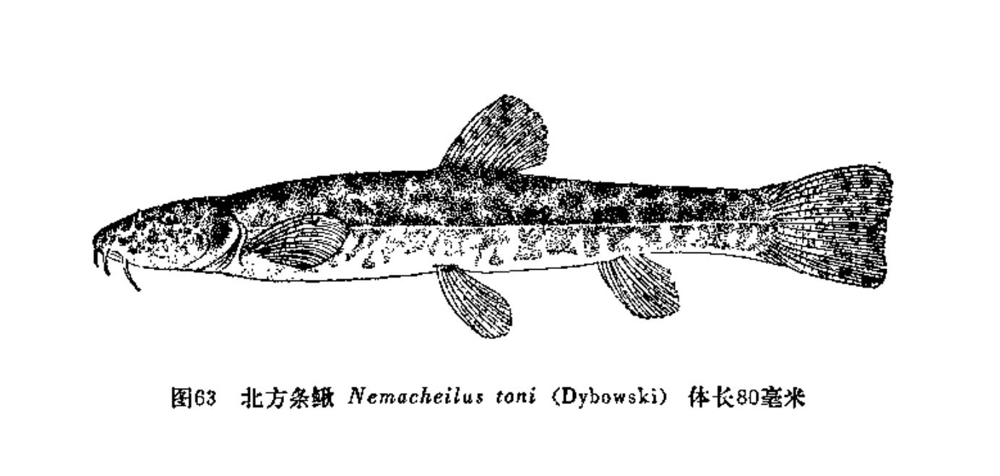

体长形，前部近四方形，后部侧扁。头平扁且宽阔，宽度大于高度。口旁有3对小须。前鼻孔有短管，后鼻孔为圆孔状。鳃膜连于胸鳍。头与体均无显著的鳞片。背鳍无硬刺。胸鳍短小。尾鳍截形。体呈淡黄色，体侧有许多不规则的深褐色斑块。胸鳍、背鳍、尾鳍均有褐色斑纹。生活于水的底层，受惊吓即钻入石头等物底下隐藏。以藻类、植物碎片为食。适应环境能力强。一般生活于山区溪流中。主要分布于东北、内蒙古、山西、河北等地。

## 黄颡鱼

Tachysurus fulvidraco  (Richardson, 1846)

http://www.fishbase.org/summary/28052

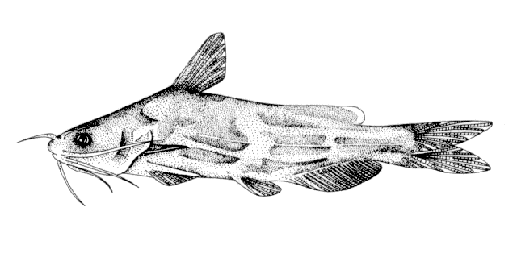

又名黄辣丁、嘎鱼、黄鸭叫、昂刺鱼。体延长，稍粗壮，吻端向背鳍上斜，后部侧扁。头略大而纵扁，头背大部裸露；上枕骨棘宽短，接近项背骨。吻部背视钝圆。口大，下位，弧形。背鳍较小，具骨质硬刺，前缘光滑，后缘具细锯齿，起点距吻端大于距脂鳍起点。脂鳍短，基部位于背鳍基后端至尾鳍基中央偏前。背部黑褐色，至腹部渐浅黄色。沿侧线上下各有一狭窄的黄色纵带，约在腹鳍与臀鳍上方各有一黄色横带，交错形成断续的暗色纵斑块。尾鳍两叶中部各有一暗色纵条纹。适应性很强，广泛分布于各种水体中，栖息于水流缓慢、水生植物丛生的水底层。白天极少活动，夜间外出寻食。以水生昆虫及其幼虫、小虾、软体动物及小鱼为食。如麦穗鱼、小鲫鱼、虾虎鱼。在各地分布广泛。

## 乌苏里拟鲿

Pelteobagrus ussuriensis  (Dybowski, 1872)

http://www.fishbase.org/summary/28050

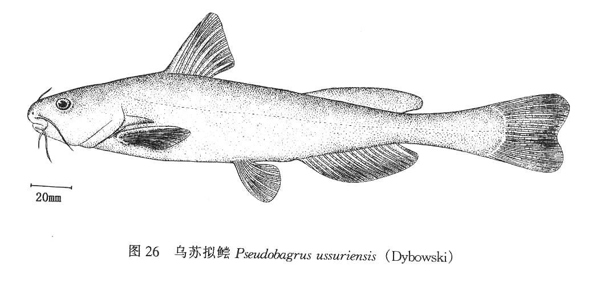

体延长，前部粗圆，后部侧扁。头纵扁，头顶有皮膜覆盖；上枕骨棘几裸露，与项背骨接近。吻稍尖圆。口下位，横裂。唇厚。上颌突出于下颌。上、下颌具绒毛状细齿，形成齿带；腭骨齿带呈新月形。眼小，侧上位，位于头的前部，眼缘不游离，被皮膜覆盖。背鳍骨质硬刺前缘光滑，后缘具弱锯齿，刺长稍长于胸鳍硬刺。尾鳍内凹，上叶稍长，末端圆钝。体呈灰黄色，腹部白色。比黄颡鱼少很多，主要分布于黑龙江、长江等流域。

## 鲶鱼

Silurus asotus  Linnaeus, 1758

http://www.fishbase.org/summary/6566

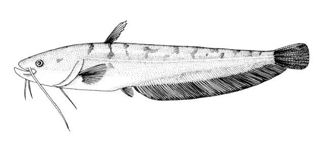

又名鲇、土鲶。体延长，前部略呈短圆筒形，后部渐侧扁。头纵扁，宽大于头高，钝圆。吻宽且纵扁。口大，次上位，口裂呈弧形且浅，伸达眼前缘垂直下方。唇厚，口角唇褶发达，上唇沟和下唇沟明显。臀鳍基部甚长，后端与尾鳍相连。胸鳍圆形，侧下位，骨质硬刺前缘具弱锯齿，被以皮膜，后缘锯齿强，鳍条后伸不及腹鳍。体色随栖息环境不同而有所变化，一般生活时体呈褐灰色，体侧色浅，具不规则的灰黑色斑块，腹面白色，各鳍色浅。大型鱼类，常生活于水草丛生、水流较缓的泥底层。为肉食性鱼类，以虾、小鱼为食。在各地分布广泛。

## 青鳉

Oryzias latipes  (Temminck & Schlegel, 1846)

http://www.fishbase.org/summary/4669

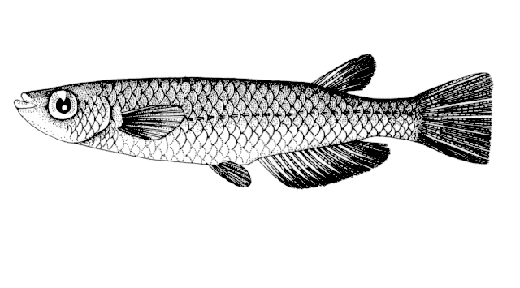

又名大眼贼。体很小，侧扁，背部较平直，腹面下凸。头中等大，较平扁。无须。眼大。头部及体侧均被圆鳞，体鳞较大。背鳍靠后，接近尾鳍。胸鳍位置较高。尾鳍宽大，后缘稍内凹。体呈青灰色，腹部及各鳍灰白色，臀鳍及尾鳍均散布有黑色小点。小型鱼类，生活在池塘、湖泊、稻田及沟渠。常成群活动于水的上层。分布于海南岛、福建、四川、辽宁、山东等地。

## 中华多刺鱼

Pungitius sinensis  (Guichenot, 1869)

http://www.fishbase.org/summary/24828

体长形，侧高，尾柄细长，且有发达的侧棱。头较小，眼较大。身体的前部有薄骨片，后部光滑。背鳍由两部分组成，第一背鳍由分离的小刺组成，小刺左右倾斜，第二背鳍由鳍条组成。臀鳍与第二背鳍相对，前方具一游离硬刺。胸鳍略呈圆形。腹鳍有一硬刺。尾鳍微凹近截形。体呈草绿色，腹部白色。生活在水草丛生的浅水水域。分布于吉林、辽宁、黑龙江、河北、天津等地。

## 黄鳝

Monopterus albus  (Zuiew, 1793)

http://www.fishbase.org/summary/4663

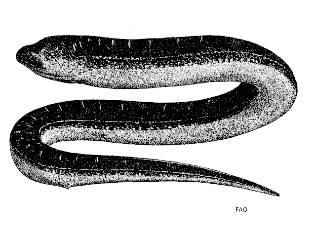

又名鳝鱼。体细长，呈蛇形，尾部尖而短，头部上下隆起，口大，上颌稍突出。上颌、下颌和颚骨都有细齿。体光滑无鳞。鳔退化。无胸鳍和腹鳍，背鳍和臀鳍退化为皮褶状。体黄褐色，具有许多不规则的黑色斑点，腹部灰白色。生活在水边，喜穴居石隙中，夜间出穴觅食。能直接呼吸空气。肉食性鱼类，主要食小鱼、昆虫幼虫及蝌蚪、幼蛙等。适应性强，分布广泛。

## 鳜鱼

Siniperca chuatsi  (Basilewsky, 1855)

http://www.fishbase.org/summary/28054

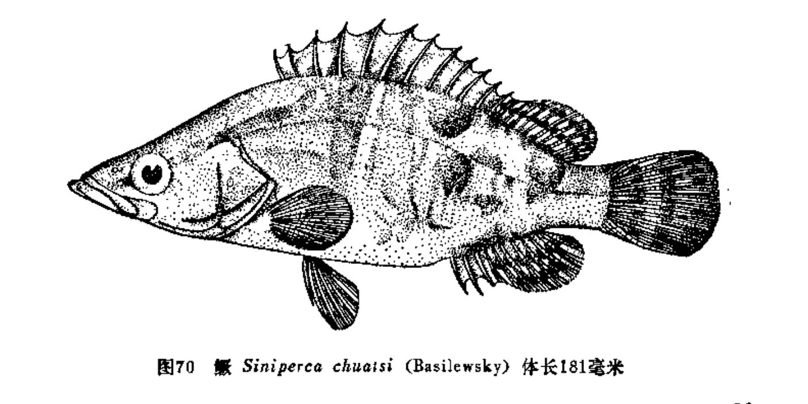

又名胖鳜、季花鱼、鳌花、桂鱼、桂花鱼、螯鱼、花鲫鱼。体高而侧扁，背部隆起，背缘呈弧形，腹部圆凸。口裂略向上倾斜。上颌、下颌、犁骨和口盖骨均有大小不等的小齿。眼较大，位于头的前部，侧上位。鳞片为细小的圆鳞。后鳃盖骨的边缘有平扁的大刺。背鳍长，前部为硬刺，后部为鳍条。胸鳍圆形。腹鳍有硬刺。臀鳍由硬刺和软鳍条组成。尾鳍圆形。体呈黄绿色，腹部灰白色，体侧具有多个不规则的暗棕色斑块。背、尾、臀鳍均有暗棕色条斑纹。一般生活在静水或缓流的水体中，白天卧穴，夜间活动。冬季在深水处越冬。肉食性凶猛鱼类，以其它鱼类为主要食物。全国各江河湖泊均有分布。

## 黄黝鱼

Micropercops swinhonis  (Günther, 1873)

http://www.fishbase.org/summary/68232

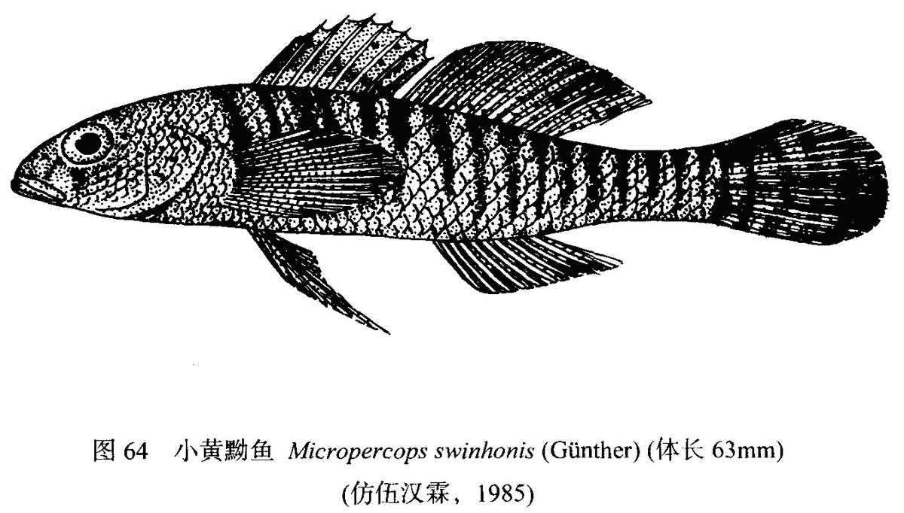

体延长，颇侧扁；背缘浅弧形，腹缘稍平直；尾柄颇长，小于体高。头中大，较尖，颇侧扁，背部稍隆起。头部具感觉管及5个感觉管孔。吻尖突，颇长，吻长小于或大于眼径。眼大，背侧位，眼上缘突出于头部背缘。体被中大栉鳞，头部、前鳃盖骨前部被圆鳞，鳃盖骨被小栉鳞，吻部和眼间隔处无鳞。胸部和胸鳍基部被小圆鳞。无侧线。体淡褐色，背部色较深，体侧有十多条灰褐色横纹。眼下缘至口角有一条棕色条纹。背鳍、尾鳍棕色，并具有多列黑色小点。个体很小，数量较多，常成小群生活在浅水水域的水草丛中，喜伏水底。以浮游动物、水生昆虫及其幼虫、小虾等为食。分布广泛。

## 子陵吻虾虎鱼

Rhinogobius giurinus  (Rutter, 1897)

http://www.fishbase.org/summary/15825

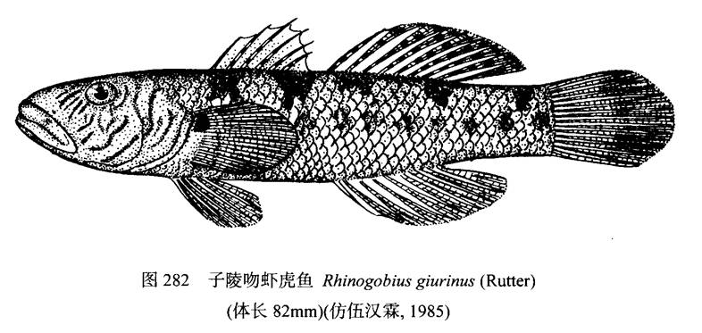

又名小爬虎鱼。体延长，前部近圆筒形，后部稍侧扁；背缘浅弧形隆起，腹缘稍平直；尾柄颇长，其长大于体高。头中大，圆钝，前部宽而平扁，背部稍隆起，头宽大于头高。眼较大，侧上位。体被中大栉鳞，头的吻部、颊部、鳃盖部无鳞。项部在背鳍中央前方具11～13枚背鳍前鳞。背鳍2个，分离。胸部、腹部及胸鳍基部均无鳞，腹部具小圆鳞。无侧线。胸鳍宽大，圆形。腹鳍胸位，左右愈合呈吸盘状，椭圆形。体呈灰褐色，腹部黄白色。体侧有一纵行暗色斑点。颊部有3-4条较长的褐色斜斑纹，还有一些短的斑纹。背鳍与尾鳍上均有暗色小点组成的线纹。臀鳍暗色。胸鳍基底上方有一个黑色小斑。喜生活于浅水区水底具有卵石、岩缝、沙滩的环境中，喜底栖生活。以小虾和水蚤等为食。数量多，分布广泛。

## 圆尾斗鱼

Macropodus ocellatus  Cantor, 1842

http://www.fishbase.org/summary/4795

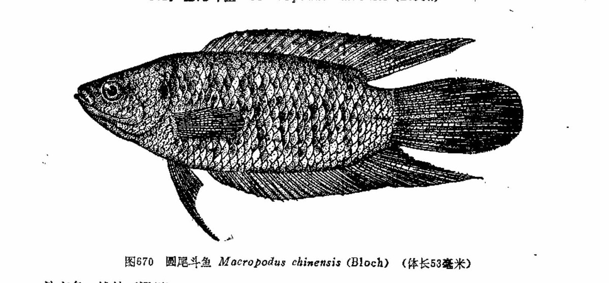

又名老布鱼、斗鱼。身体侧扁切薄，略成长方形。头较大，吻短而钝。上颌与下颌均有小齿。前鳃盖骨又细锯齿。全身被鳞，鳞片较大，头部为圆鳞，体侧为栉鳞。背鳍前部为鳍刺，后部为分节的鳍条。腹鳍胸位，第一个鳍条为鳍刺，第二三根鳍条向后延伸。尾鳍圆形。体呈暗绿褐色，体侧有侧人字形黑蓝色横纹十余条，鳃盖后上角有以深蓝色圆斑。背鳍、尾鳍和臀鳍微红色，腹鳍灰褐色。雄鱼体色鲜艳。喜栖息于杂草丛生的池塘、湖边、沟渠的浅水区。以浮游动物为食，也吞食蚊子幼虫。主要分布在长江以北的河流中。

## 乌鳢

Channa argus  (Cantor, 1842)

http://www.fishbase.org/summary/4799

又名黑鱼。体形呈长棒状。头部扁平，头大，口裂大。吻部圆形。口内齿牙丛生。偶鳍皆小，背鳍和臀鳍特长，尾鳍圆形。头部与躯干部皆被有大小相似的鳞片。侧线完整，在胸鳍的后方有个弯曲。 头顶部有许多感觉小孔，大鱼其数目较多。体色背部灰绿色，腹部灰白，体侧有作八字形排列的显明黑色条纹。头部有三对向后伸出的条纹。背鳍、臀鳍和尾鳍具有黑白相间的花纹。胸鳍、腹鳍浅黄色，胸鳍基部有一黑点。底栖鱼类，性情凶猛，成鱼以小鱼、小虾、水生昆虫为食。喜欢潜伏在水草丛中追捕猎物。适应性强，可以在水面呼吸。冬季在淤泥中过冬。除西部高原地区外均有分布。

## 中华刺鳅

Sinobdella sinensis  (Bleeker, 1870)

http://www.fishbase.org/summary/52400

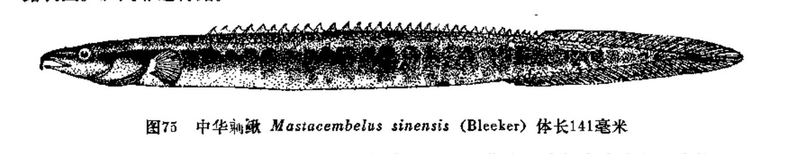

体延长呈鳗状，侧扁。头略小而尖。眼小，被透明皮膜，无游离眼睑；眼间隔窄而隆起。口小，近横裂状，下颌较短。犁骨与腭骨无牙。前鳃盖骨无棘或锯齿。鳃盖膜不与峡部相连。无鳃耙。鳞片极细小，头、体及各奇鳍均被有。背鳍和臀鳍均与尾鳍相连续。背鳍各鳍棘以低鳍膜相连，呈分离状。臀鳍第三鳍棘距第一、第二鳍棘颇远。胸鳍小而圆。尾鳍尖形。体褐或灰褐色。体侧有暗色垂直带纹，腹侧有淡色斑点，背侧或有虫状纹。背鳍有暗褐色网状纹，臀鳍略黑而有白色边缘。体背部黑褐色，侧面灰黑色，背、腹部有许多网状花纹，体侧有十多条垂直褐斑。分布于亚热带地区。