中国原生鱼：淡水虾虎鱼
---

<!-- TOC -->

- [粘皮鲻虾虎鱼](#粘皮鲻虾虎鱼)
- [奥氏拟虾虎鱼](#奥氏拟虾虎鱼)
- [大鳞鳍虾虎鱼](#大鳞鳍虾虎鱼)
- [塔氏裸身虾虎鱼](#塔氏裸身虾虎鱼)
- [无孔拟吻虾虎鱼](#无孔拟吻虾虎鱼)
- [明潭吻虾虎鱼](#明潭吻虾虎鱼)
- [昌江吻虾虎鱼](#昌江吻虾虎鱼)
- [波氏吻虾虎鱼](#波氏吻虾虎鱼)
- [戴氏吻虾虎鱼](#戴氏吻虾虎鱼)
- [细斑吻虾虎鱼](#细斑吻虾虎鱼)
- [溪吻虾虎鱼](#溪吻虾虎鱼)
- [丝鳍吻虾虎鱼](#丝鳍吻虾虎鱼)
- [台湾吻虾虎鱼](#台湾吻虾虎鱼)
- [福岛吻虾虎鱼](#福岛吻虾虎鱼)
- [颊纹吻虾虎鱼](#颊纹吻虾虎鱼)
- [大吻虾虎鱼](#大吻虾虎鱼)
- [子陵吻虾虎鱼](#子陵吻虾虎鱼)
- [恒春吻虾虎鱼](#恒春吻虾虎鱼)
- [红河吻虾虎鱼](#红河吻虾虎鱼)
- [兰屿吻虾虎鱼](#兰屿吻虾虎鱼)
- [李氏吻虾虎鱼](#李氏吻虾虎鱼)
- [雀斑吻虾虎鱼](#雀斑吻虾虎鱼)
- [林氏吻虾虎鱼](#林氏吻虾虎鱼)
- [陵水吻虾虎鱼](#陵水吻虾虎鱼)
- [刘氏吻虾虎鱼](#刘氏吻虾虎鱼)
- [斑带吻虾虎鱼](#斑带吻虾虎鱼)
- [密点吻虾虎鱼](#密点吻虾虎鱼)
- [名古屋吻虾虎鱼](#名古屋吻虾虎鱼)
- [南渡江吻虾虎鱼](#南渡江吻虾虎鱼)
- [南台吻虾虎鱼](#南台吻虾虎鱼)
- [小吻虾虎鱼](#小吻虾虎鱼)
- [短吻红斑吻虾虎鱼](#短吻红斑吻虾虎鱼)
- [神农吻虾虎鱼](#神农吻虾虎鱼)
- [四川吻虾虎鱼](#四川吻虾虎鱼)
- [万泉河吻虾虎鱼](#万泉河吻虾虎鱼)
- [仙水吻虾虎鱼](#仙水吻虾虎鱼)
- [瑶山吻虾虎鱼](#瑶山吻虾虎鱼)
- [宽带裂身虾虎鱼](#宽带裂身虾虎鱼)
- [罗氏裂身虾虎鱼](#罗氏裂身虾虎鱼)
- [条纹狭虾虎鱼](#条纹狭虾虎鱼)
- [眼带狭虾虎鱼](#眼带狭虾虎鱼)
- [日本瓢鳍虾虎鱼](#日本瓢鳍虾虎鱼)
- [宽颊瓢鳍虾虎鱼](#宽颊瓢鳍虾虎鱼)
- [环带瓢眼虾虎鱼](#环带瓢眼虾虎鱼)
- [紫身枝牙虾虎鱼](#紫身枝牙虾虎鱼)
- [多鳞枝牙虾虎鱼](#多鳞枝牙虾虎鱼)
- [黑鳍枝牙虾虎鱼](#黑鳍枝牙虾虎鱼)
- [小黄黝鱼](#小黄黝鱼)
- [萨氏华黝鱼](#萨氏华黝鱼)

<!-- /TOC -->

## 粘皮鲻虾虎鱼

Mugilogobius myxodermus  (Herre, 1935)

http://www.fishbase.org/summary/55202

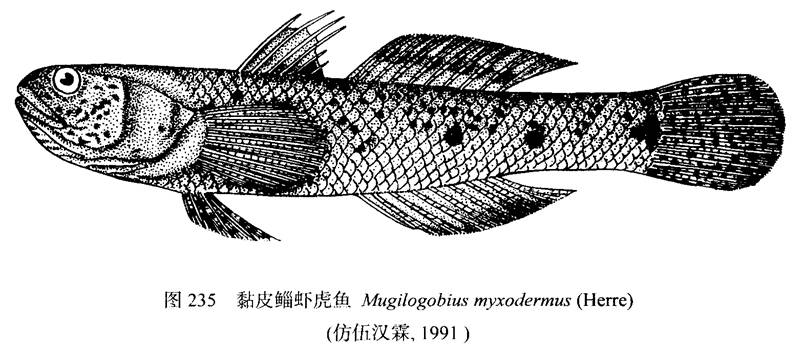

又名黏皮虾虎、黏皮栉虾虎、黏皮鲻虾虎鱼。体延长，前部亚圆筒形，后部侧扁；尾柄较长。头颇大，稍宽，略大于眼径。头颇大，稍宽，头部和鳃盖部无任何感觉管孔。唇发达。舌游离，前端近截形，不分叉。鳃孔中大，向前下方伸达前鳃盖骨后缘下方。前鳃盖骨和鳃盖骨边缘光滑。峡部宽。鳃盖膜与峡部相连。鳃盖条5根。有假鳃。鳃耙短小。体被弱栉鳞，后部鳞较大，前部被圆鳞。第一背鳍起点向前至眼后，鳃盖上部、胸鳍基部、胸部和腹部均被圆鳞。吻部和颊部无鳞。无侧线。体背侧具许多不规则灰黑色斑点。头的颊部有暗红色虫状纹及斑点，腹面自颏部向后有多条暗色弧形线纹和横线纹。臀鳍灰褐色。胸鳍和腹鳍浅灰色。尾鳍灰色，有数行暗色点纹。
淡水底层小型鱼类，栖息于河沟和池塘中，数量少。分布于中国长江、区瓦江、九龙江和珠江等水系。为中国特有种。p499

## 奥氏拟虾虎鱼

Eugnathogobius siamensis  (Fowler, 1934)

http://www.fishbase.org/summary/26857

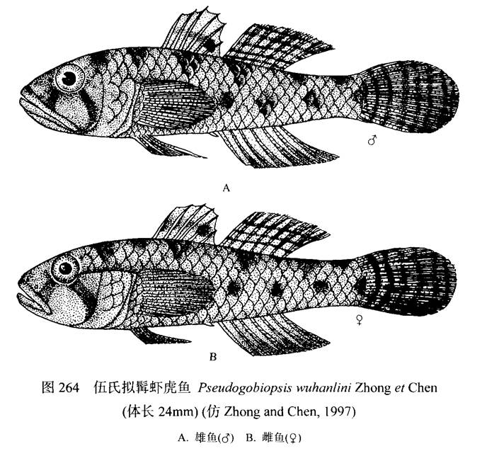

又名伍氏拟髯虾虎鱼。体延长，前部粗壮，圆筒形，后部侧扁；背缘、腹缘浅弧形；尾柄较宽。头中大，略平扁，头宽几乎等于头高，头部具5个感觉管孔。颊部稍凸。眼中大，眼背缘几乎突出于头背缘。眼间隔狭窄，略凹，约为眼径的1/2。唇厚。舌游离，前端平截或稍内凹。鳃孔中大，约与胸鳍基等高，鳃盖上方及前鳃盖骨后缘均无硬棘。峡部宽大，左、右鳃盖膜不连，被峡部隔开，仅分别连于峡部。具假鳃。鳃耙短小，钝突。项部、胸鳍基、胸部及腹部被圆鳞；自胸鳍基至尾鳍基被栉鳞；鳃盖部具3～4枚大圆鳞。第一背鳍起点至眼后方被圆鳞，前部鳞较大，眼后上方中间第一鳞最大。颊部无鳞。无侧线。胸鳍浅色。雄鱼臀鳍、腹鳍灰色；雌鱼臀鳍、腹鳍浅色。尾鳍灰色，具6～7条褐色横纹，尾鳍基部中央具1暗色长圆形斑点。栖息于淡水及咸、淡水河口底层。数量极少，属于稀有种类。分布于闽江、珠江水系。

## 大鳞鳍虾虎鱼

Gobiopterus macrolepis  Cheng, 1965

http://www.fishbase.org/summary/55206

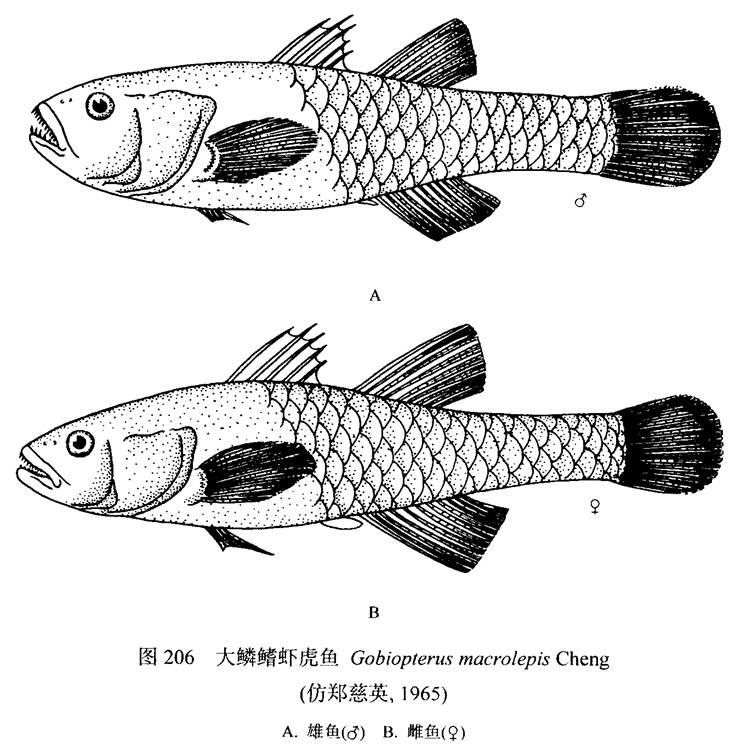

体延长，后部侧扁；背缘稍隆起，腹缘较平直；尾柄细长。头中大，稍侧扁，头宽大于体宽。吻较长，圆钝，吻长约等于或稍大于眼径。眼大，背侧位，在头的前半部。眼间隔宽，大于眼径，圆凸。唇厚，上唇较为发达。舌甚宽，游离，前端分叉。鳃孔大，侧位，向前伸达头部腹面。体被中大栉鳞，头部、项部及体的前部裸露无鳞。无侧线。胸鳍宽圆，其长大于眼后头长，肌肉柄发达。腹鳍短小，后端尖形，不伸达胸鳍后端垂直线上，起点位于胸鳍基的下方，左、右腹鳍愈合成一吸盘，与腹部游离，不愈合。尾鳍后端圆形，略短于头长。头、体半透明，无色。为暖水性小型底层鱼类。栖息于淡水河、溪及鱼塘内。成熟个体很小。较罕见。无食用价值。体长20～30mm。数量极少，属稀有种类。分布于广东珠江三角洲，为中国特有种。p439

## 塔氏裸身虾虎鱼

Gymnogobius taranetzi  (Pinchuk, 1978)

http://www.fishbase.org/summary/48342

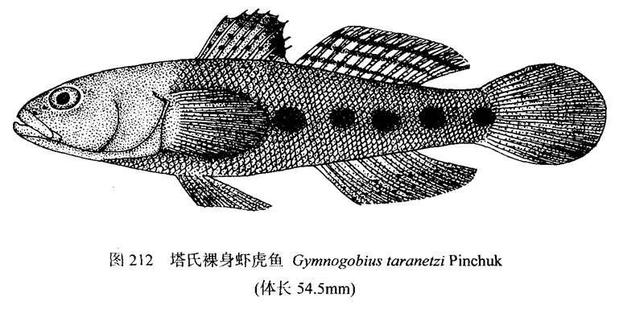

体延长，前部亚圆筒形，后部略侧扁；背缘、腹缘浅弧形隆起；尾柄较高。头中大，前部略平扁，头部具2个感觉管孔。口中大，前位，斜裂。上、下颌等长或下颌稍突出。唇厚。舌游离，前端分叉。颏部常具一皮质隆起，后缘有一横沟，沟内有一对感觉乳突。体前部被小圆鳞，后部被中大栉鳞，头部、胸部及胸鳍基部裸露无鳞。无侧线。胸鳍尖圆，下侧位，上部无游离丝状鳍条。腹鳍椭圆形，左、右腹鳍愈合成一吸盘。尾鳍圆形。体呈浅绿褐色，腹部浅灰色，峡部浅褐色。体侧具6个不规则的褐色斑点。第一背鳍具2～3纵行褐色斑点，第七棘后端具1卵圆形的黑斑；第二背鳍具6～8行黑褐色小斑点。臀鳍密具黑褐色小点，外缘黑褐色，基部浅色。胸鳍灰白色。腹鳍灰黑色，具一浅色细小边缘。尾鳍灰白色。
为冷温性底层小型鱼类。栖息于淡水、下游河川中。摄食淡水底栖无脊椎动物。个体小，无食用价值。体长50～70mm。分布于黑龙江水系、图们江珲春河水系、辽河、滦河水系。p451

## 无孔拟吻虾虎鱼

Pseudorhinogobius aporus  Zhong & Wu, 1998

http://www.fishbase.org/summary/60512

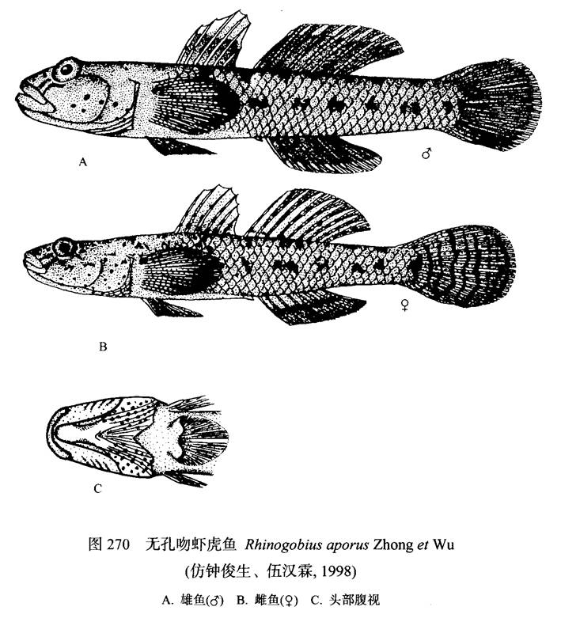

体延长，前部亚圆筒形，后部侧扁；背缘浅弧形隆起，腹缘稍平直；尾柄颇长，其长大于体高。头中大，圆钝，前部宽而平扁，背部稍隆起，头宽大于头高。头部无任何感觉管孔。吻圆钝，颇长，吻长等于或稍大于眼径。眼中大，背侧位，位于头的前半部，眼上缘突出于头部背缘。眼间隔狭窄，稍小于眼径，内凹。唇厚，发达。舌游离，前端圆形。鳃孔宽大，侧位，其宽稍大于胸鳍基部宽，向头部腹面延伸，止于鳃盖骨中部下方。前鳃盖骨后缘及鳃盖上方均无感觉管孔。峡部宽大，鳃盖膜与峡部相连。鳃盖条5根。具假鳃。鳃耙短小。体被中大弱栉鳞，前部的鳞小，后部的鳞较大；体背部鳞片始于第一背鳍起点稍后方，体侧鳞片始于胸鳍基部上方。头的吻部、颊部、鳃盖部无鳞。背鳍中央前方无背鳍前鳞，胸部、腹部及胸鳍基部均无鳞。无侧线。膜盖左、右侧的鳍棘和鳍条相连处的鳍膜内凹，形成叶状突出；左、右腹鳍愈合成一圆形吸盘。尾鳍圆形，短于头长。体呈灰褐色，背部色深，腹部色浅，峡部灰色。背部有7～8条横带，向下仅伸达体侧上部的1/4处；体侧具7～8个不规则黑色斑块。雄鱼背鳍灰黑色，上半部色浅，两背鳍均具数小黑点。臀鳍灰黑色，下半部色较深。胸鳍灰色，基部上部具1小黑斑。腹鳍及尾鳍均为灰黑色。尾鳍具6～7条灰黑色横纹。
暖水性底栖小型淡水虾虎鱼类，喜栖息于水绵较多、石头底质和水流较缓的水域中。在水底匍匐游动，伺机掠食，摄食小鱼、虾、水生昆虫、水生环节动物、浮游动物和藻类等。分布于浙江省瓯江上游的仙都小溪中。为中国特有种。p572

## 明潭吻虾虎鱼

Rhinogobius candidianus  (Regan, 1908)

http://www.fishbase.org/summary/27215

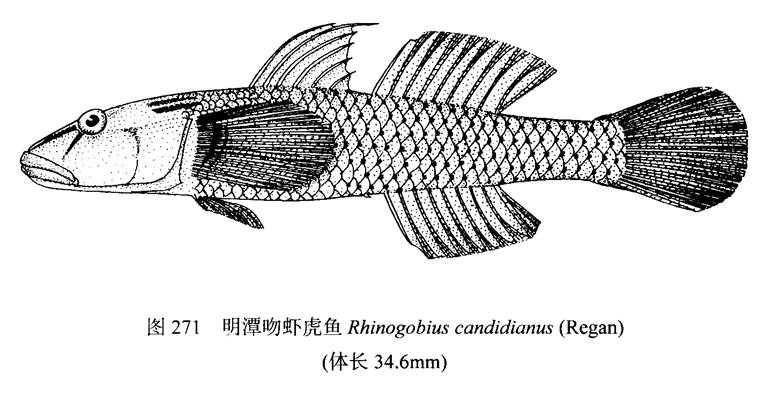

又名明潭吻鰕虎魚。体延长，前部圆筒形，后部侧扁；背缘浅弧形，腹缘稍平直；尾柄颇长，其长大于体高。头中大，圆钝，前部宽而平扁，背部稍隆起，头宽大于头高。颊部凸出，中央具3纵行感觉乳突。吻短而圆钝，吻长大于眼径，雄鱼的吻部明显长于雌鱼的。眼较小，背侧位，位于头的前半部，眼上缘突出于头部背缘。眼间隔颇窄小，小于眼径，稍内凹。唇略厚，发达。舌游离，前端圆形。鳃孔中大，侧位，其宽稍大于胸鳍基部宽，向头部腹面延伸，止于鳃盖骨中线下方。峡部宽，鳃盖膜与峡部相连。鳃盖条5根。具假鳃。鳃耙短小。体被中大弱栉鳞，前部鳞小，后部鳞较大，头的吻部、颊部、鳃盖部无鳞。胸部及腹部有极细小的圆鳞，胸鳍基部无鳞。无侧线。腹鳍略短于胸鳍，圆盘状，膜盖发达，边缘弧形凹入，左、右腹鳍愈合成一吸盘。尾鳍长圆形，短于头长。体呈黄褐色或深褐色，部分个体体侧具不太明显的斑块，鳞片基部有暗淡橘色斑点。雄鱼颊部及鳃盖无斑点；雌鱼通常不具斑点，但有少数个体在前鳃盖骨后缘具不明显斑点。吻部有红色线纹，项部具数条横向褐纹。背鳍棘皆呈红褐色，鳍膜呈灰棕色，无斑点。尾鳍灰棕色，外缘黄色；胸鳍灰褐色。为台湾河川溪流中、上游地区的优势小型鱼类，大多成群栖息在潭区或懒区的岩石上。繁殖时期，成鱼会有明显的领域性。属于肉食性鱼类，以小鱼、水生昆虫及小虾、蟹为食。分布于台湾东北部、北部及中部的溪流上游水域。为台湾省特有种。p574

## 昌江吻虾虎鱼

Rhinogobius changjiangensis  Chen, Miller, Wu & Fang, 2002

http://www.fishbase.org/summary/61849

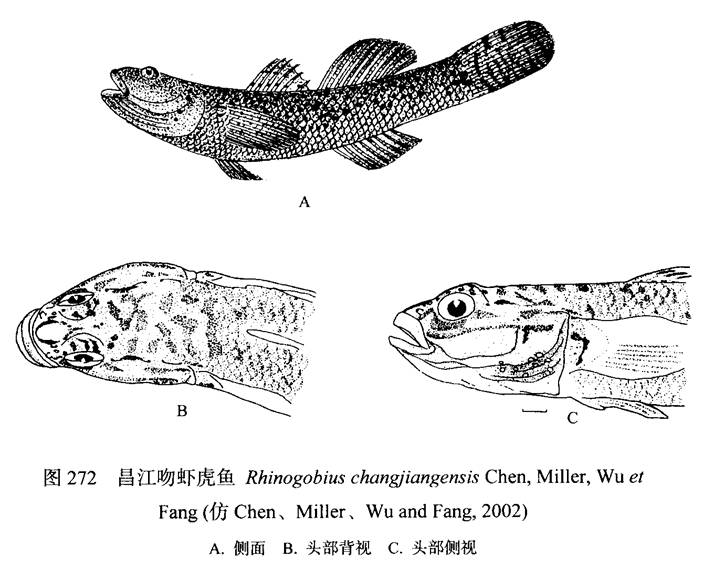

体延长，前部圆筒形，后部侧扁；背缘浅弧形，腹缘稍平直；尾柄颇长，其长大于体高。头中大，圆钝，前部宽而平扁，背部稍隆起，头宽大于头高。头部具5个感觉管孔。吻圆钝，较短，吻长等于眼径。眼中大，背侧位，位于头的前半部，眼上缘突出于头部背缘。眼间隔狭窄，最窄处仅为眼径的2/5，稍内凹。唇略厚，发达。舌游离，前端圆形。鳃孔大，侧位，向头部腹面延伸，止于鳃盖骨后缘下方稍后处。体被中大栉鳞，头的吻部、颊部、鳃盖部无鳞。项部裸露，仅在背鳍中央前方具数个小圆鳞，两侧的鳞片分布到鳃盖骨的上缘。胸部、腹部前区及胸鳍基部均无鳞。无侧线。腹鳍略短于胸鳍，圆盘状，左、右腹鳍愈合成一吸盘。尾鳍长圆形，短于头长。肛门与第二背鳍起点相对。雄鱼生殖乳突细长而尖，雌鱼生殖乳突短钝。第一背鳍浅色，在第二鳍棘中部鳍膜上具一黑斑；第二背鳍浅白色，具3纵行深褐色小斑。臀鳍灰黑色，无任何斑纹。胸鳍基部具一直角形条纹。腹鳍吸盘为灰色。尾鳍白色，具5～6行垂直的黑色斑纹，尾鳍基具2个垂直黑斑。为淡水性小型底层鱼类，喜生活于底质为沙地、砾石和贝壳等的湖岸、河溪中之浅滩区。分布于海南西部昌化江水系。为海南特有种。p576

## 波氏吻虾虎鱼

Rhinogobius cliffordpopei  (Nichols, 1925)

http://www.fishbase.org/summary/60226

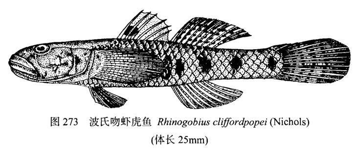

体延长，前部圆筒形，后部侧扁；背缘浅弧形，腹缘稍平直；尾柄颇长，其长大于体高。头中大，圆钝，前部宽而平扁，背部稍隆起，头宽大于头高。吻圆钝，颇长，吻长大于眼径。眼中大，背侧位，位于头的前半部，眼上缘突出于头部背缘。眼间隔狭窄，其宽小于眼径，稍内凹。鼻孔每侧2个，分离，相互接近：前鼻孔具1短管，位于吻部前方1/3处，接近于上唇；后鼻孔小，圆形，边缘隆起，紧位于眼前方。口小，前位，斜裂。两颌约等长。上颌骨后端伸达或不伸达眼前缘下方。上、下颌齿细小，尖锐，无犬齿，多行，排列稀疏，呈带状，外行齿稍扩大；下颌内行齿亦扩大。犁骨、腭骨及舌上均无齿。唇略厚，发达。舌游离，前端圆形。鳃孔大，侧位，向头部腹面延伸，止于鳃盖骨后缘下方稍后处。前鳃盖骨后缘有3个感觉管孔，鳃盖上方具3个感觉管孔。峡部宽，鳃盖膜与峡部相连。体被中大弱栉鳞，头的吻部、颊部、鳃盖部无鳞。项部在背鳍中央前方无小鳞。胸部、腹部及胸鳍基部均无鳞。无侧线。臀鳍与第二背鳍相对，同形，起点位于第二背鳍第一和第二鳍条的下方，后部鳍条较长，平放时，不伸达尾鳍基。胸鳍宽圆形，下侧位，鳍长大于吻后头长，后缘距肛门上方有较大距离。腹鳍略短于胸鳍，圆盘状，膜盖发达，边缘深凹，左、右腹鳍愈合成一吸盘。尾鳍长圆形，短于头长。体呈灰褐色，背部暗色，腹部浅色。体侧具6～7条深褐色横带或斑块。雌、雄鱼第一背鳍第一与第二鳍棘间的鳍膜上具1蓝黑色大斑点，有时雌鱼的不明显。各鳍灰褐色。有的个体两背鳍和胸鳍的上缘均呈淡灰色。头的腹面黑褐色。
为淡水性小型底层鱼类，体长一般为20-30mm，喜生活于底质为沙地、砾石和贝壳等的湖岸、河溪中的浅滩区，伏卧水底，做间隙性缓游。也经常在水的中、上层逆水徊游。食性颇杂，摄食摇蚊幼虫、白虾、挠足类、丝状藻、枝角类、鱼卵等。一般体长30mm已达性成熟。在湖北，每当春雨来临，山洪暴发，鱼即成群而上，故称为“春鱼”。其数量之巨而形成鱼汛。湖北梁子湖、阳新县网湖每年在五月中、下旬至七月上旬为捕捞旺季，其后鱼体渐长大，幼鱼体长在25mm以上时，鱼群开始分散潜居，以特化为圆盘状的腹鳍吸附于石砾或贝壳之上，伺机觅食，此时鱼汛结束。在云南省，波氏吻虾虎鱼随家鱼苗由外省带入，现已广泛分布于云南各湖泊。分布于辽河、黄河、长江、钱塘江、珠江等水系。为中国特有种。p578

## 戴氏吻虾虎鱼

Rhinogobius davidi  (Sauvage & Dabry de Thiersant, 1874)

http://www.fishbase.org/summary/54774

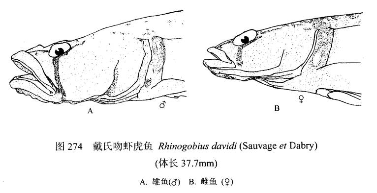

体延长，前部亚圆筒形，后部侧扁；背缘浅弧形隆起，腹缘稍平直；尾柄颇长，其长大于体高。头中大，圆钝，前部宽而平扁，背部稍隆起，头宽大于头高。雄鱼颊部颇凸出。吻圆钝，颇长，吻长大于眼径；雄鱼吻部较雌鱼更为突出。眼中大，背侧位，位于头的前半部，眼上缘突出于头部背缘。眼间隔宽阔，宽大于眼径，稍内凹。唇略厚，颇发达。舌游离，前端圆形。鳃孔中大，侧位，向头部腹面延伸，止于鳃盖骨后缘下方稍后处，其宽稍大于胸鳍基部的宽。峡部宽，鳃盖膜与峡部相连。鳃盖条5根。具假鳃。鳃耙短小。体被中大弱栉鳞，头的吻部、颊部、鳃盖部无鳞。雄鱼无背鳍前鳞，雌鱼背鳍中央前方具3～4枚小鳞，眼后项部具1裸露区。胸部、腹部及胸鳍基部均无鳞。无侧线。臀鳍与第二背鳍相对，同形，起点位于第二背鳍第二鳍条的下方，后部鳍条较长，平放时，不伸达尾鳍基。胸鳍宽大，长圆形，下侧位，鳍长大于吻后头长，后缘几乎伸达肛门上方。腹鳍略短于胸鳍，圆盘状，膜盖发达，边缘弧形凹入，左、右腹鳍愈合成一吸盘。尾鳍长圆形，短于头长。肛门与第二背鳍起点相对。体呈浅棕色，腹部白色。体侧隐具6～7个不规则黑斑。头部眼睛附近具2条深黑色条纹：一条自眼前缘向前伸达吻端，与对侧的形成U形纹；另一条黑色条纹很长，由眼下缘向下为1垂直伸向口角处的黑纹。颊部及鳃盖部无斑纹。雄鱼的鳃盖膜边缘为褐色。雄鱼的第一背鳍第一至第三鳍棘的基部有1个黑斑，第二背鳍、臀鳍及尾鳍鳍膜无斑点，尾鳍基具一垂直条斑，胸鳍基部灰褐色，下方具1半月形浅色区。雌鱼的第一、第二背鳍具3～5列小黑点，第一背鳍第三鳍棘的前方下半部具1个黑斑，尾鳍具6～8行垂直褐斑，基部具2个褐斑，胸鳍基部黑褐色，具1半月形浅色区。
为淡水小型底层鱼类，栖息于江、河、池、沼的底层。摄食底栖无脊椎动物。不常见，无食用价值。分布于浙江、福建各水系。为中国特有种。p580

## 细斑吻虾虎鱼

Rhinogobius delicatus  Chen & Shao, 1996

http://www.fishbase.org/summary/27217

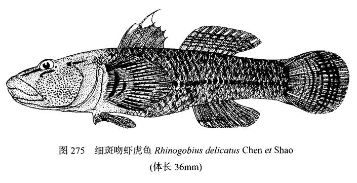

延长，前部圆筒形，后部侧扁；背缘浅弧形，腹缘稍平直；尾柄颇长，其长大于体高。头宽大，圆钝，前部稍平扁，背部隆起，头宽大于头高。颊部凸出，中央具3纵行感觉乳突线。吻短而圆钝，吻长大于眼径，雄鱼吻部较雌鱼为长。眼较小，背侧位，位于头的前半部，眼上缘突出于头部背缘。眼间隔的宽小于眼径，稍内凹。鳃孔中大，侧位，其宽稍大于胸鳍基部宽，向头部腹面延伸，止于鳃盖骨中部下方。峡部宽，鳃盖膜与峡部相连。鳃盖条5根。具假鳃。鳃耙短小。体被中大弱栉鳞，尤其以后半部鳞片较大。头的吻部、颊部、鳃盖部无鳞。项部在背鳍中央前方具5～15枚背鳍前鳞，向前伸达或超过鳃盖后缘上方，不达眼后方；胸部、腹部鳞片细小，胸鳍基部无鳞。无侧线。腹鳍略短于胸鳍，圆盘状，膜盖发达，边缘弧形凹入，左、右腹鳍愈合成一吸盘。尾鳍长圆形，短于头长。肛门与第二背鳍起点相对。雄鱼生殖乳突细长而尖，雌鱼生殖乳突短钝，扁圆形。体呈褐色或黑褐色，体侧上半部鳞片基部为黑褐色，各鳞外缘颜色较深。雌鱼通常在体侧中央鳞列处具一列深褐色点纹，延伸至尾鳍基部，成熟雌鱼腹部为黄色。
为生活于河川溪流的中、上游的小型鱼类，大多成群出现在岩砾或石缝中。成鱼有护卵行为。肉食性，以水生昆虫、小虾为食。数量极少，属于稀有种类，为濒危物种。分布于台湾花莲、台东的溪流中。为台湾省特有种。p582

## 溪吻虾虎鱼

Rhinogobius duospilus  (Herre, 1935)

http://www.fishbase.org/summary/55204

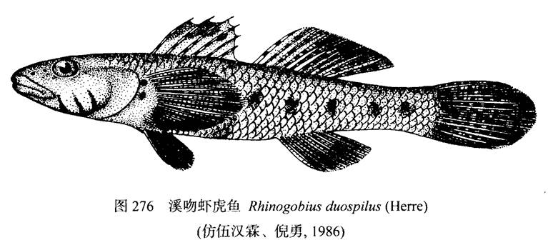

体延长，前部近圆筒形，后部侧扁；背缘浅弧形隆起，腹缘稍平直；尾柄较长，其长大于体高。头中大，稍平扁，头宽等于或稍大于头高。头部具5个感觉管孔。颊部稍凸出，具3纵行感觉乳突线(b,c,d )。吻短而圆钝，唇略厚，发达。舌游离，前端浅弧形。鳃孔大，侧位，向头部腹面延伸，止于鳃盖骨后缘下方稍后处，其宽大于胸鳍基部宽。体被中大弱栉鳞，头的吻部、颊部、鳃盖部无鳞。背鳍中央前方具10余枚小鳞，向前仅伸达项部后半部的1/2或1/3处，胸部无鳞，腹部被小圆鳞。无侧线。背鳍2个，分离；第一背鳍高，基部短，起点位于胸鳍基部后上方，鳍棘柔软，第二、第三鳍棘最长，其余各鳍棘向后渐短，平放时，伸达第二背鳍起点；第二背鳍略高于第一背鳍，基部较长，后部鳍条稍短，中部鳍条较长。腹鳍略短于胸鳍，长圆形，膜盖发达，边缘弧形凹入，左、右腹鳍愈合成一吸盘。尾鳍长圆形，短于头长。体呈灰褐色，腹部浅色，体侧有6个暗色斑块，列成1纵行，最后面的斑块在尾鳍基底中部；头部在吻端经眼至鳃盖后上方有1暗色纵纹；颊部有3条斜向后下方的暗色条纹，伸达前鳃盖骨下方；头部腹面鳃盖膜密布浅色的小圆点，第一背鳍灰色，前部的第一至第三鳍棘的鳍膜上有1个大黑斑；第一背鳍、尾鳍、胸鳍、腹鳍呈灰黑色；胸鳍基部上、下方有2个小黑斑；臀鳍黑色，边缘浅色。
为暖水性小型底层鱼类，栖息于南方各淡水河川中。无食用价值。分布于珠江、闽江水系及海南各河溪。为中国特有种。p584

## 丝鳍吻虾虎鱼

Rhinogobius filamentosus  (Wu, 1939)

http://www.fishbase.org/summary/60229

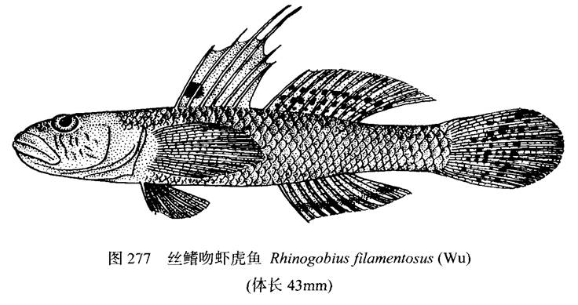

体延长，前部圆筒形，后部侧扁；背缘浅弧形，腹缘稍平直；尾柄颇长，其长大于体高。头中大，圆钝，前部宽而平扁，背部稍隆起。头部具5个感觉管孔。颊部稍凸出，具3纵行感觉乳突线。吻短而圆钝，吻长稍大于眼径。唇略厚，发达。舌游离，前端圆形。鳃孔中大，侧位，其宽稍大于胸鳍基部的宽，向头部腹面延伸，止于鳃盖骨后缘下方稍后处。前鳃盖骨后缘有3个感觉管孔，鳃盖上方具3个感觉管孔。峡部宽，鳃盖膜与峡部相连。鳃盖条5根。具假鳃。鳃耙短小。体被中大弱栉鳞，头的吻部、颊部、鳃盖部无鳞，项部在背鳍中央前方具8～11枚背鳍前鳞，向前仅伸达项部的1/3处，不达眼后方；胸部、腹部及胸鳍基部无鳞。无侧线。胸鳍宽大，圆形，下侧位，鳍长大于吻后头长，后缘伸达或伸越第二背鳍起点。腹鳍略短于胸鳍，圆盘状，膜盖发达，后缘弧形凹入，左、右腹鳍愈合成一吸盘，末端至臀鳍起点的距离等于腹鳍长。尾鳍长圆形，短于头长。肛门与第二背鳍起点相对。体呈棕褐色，体侧有6～7条暗色横带，头部背面有网状细纹，颊部常有伸向腹面的细条纹。雄鱼第一背鳍第一至第三鳍棘间的鳍膜下方有1长圆形黑斑，边缘浅色，雌鱼无黑斑。第二背鳍有数行点状条纹，有时不明显。臀鳍灰黑色，边缘浅色。胸鳍、腹鳍灰色。尾鳍具数行点状条纹或呈灰黑色。
为淡水小型底层鱼类，栖息于江河支流及小溪中。不常见。无食用价值。分布于西江及北江的支流。为中国特有种。p586

## 台湾吻虾虎鱼

Rhinogobius formosanus  Oshima, 1919

http://www.fishbase.org/summary/27332

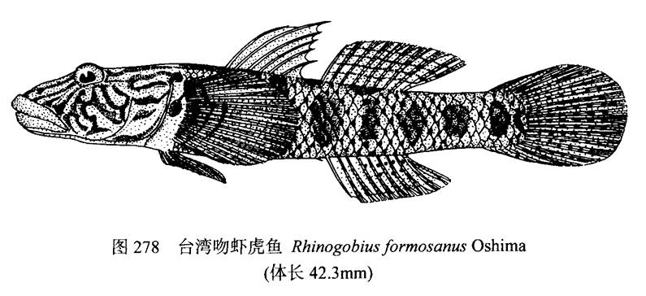

体延长，前部亚圆筒形，后部侧扁；背缘浅弧形，腹缘稍平直；尾柄颇长，其长大于体高。头中大，圆钝，前部宽而平扁，背部稍隆起，头宽大于头高。颊部凸出，中央具3纵行感觉乳突。吻短而尖，吻长大于眼径，约与下颌等长。眼较小，背侧位，位于头的前半部，眼上缘突出于头部背缘。唇肥厚，发达。舌游离，前端圆形。鳃孔中大，侧位，其宽稍大于胸鳍基部宽，向头部腹面延伸，止于鳃盖骨中线下方。峡部宽，鳃盖膜与峡部相连。鳃盖条5根。具假鳃。鳃耙短小。
体被中大弱栉鳞，后半部鳞片较大，头的吻部、颊部、鳃盖部无鳞。项部在背鳍中央前方具9～14枚背鳍前鳞，向前仅伸达或超过鳃盖后缘上方，前项部无鳞。胸部及腹部具小圆鳞，胸鳍基部无鳞。无侧线。胸鳍宽大，椭圆形，下侧位，鳍长等于吻后头长，后缘不伸达第二背鳍起点。腹鳍略短于胸鳍，圆盘状，膜盖发达，边缘弧形凹入，左、右腹鳍愈合成一吸盘，末端至臀鳍起点的距离等于腹鳍长。尾鳍长圆形，短于头长。肛门与第二背鳍起点相对。体呈黄褐色，被有6～7个垂直深褐色横斑，其宽度大于其间隔区。雄鱼体侧鳞片中央有蓝色光泽；雌鱼在生殖季节时，腹部呈现明亮蓝色。吻部及颊部被有红色或橘红色放射状蠕虫形线纹，眼前方有3条斜向吻端及上颌的红色线纹，而雄鱼颊部则具有亮蓝色光泽。胸鳍基部上方具1红棕色斑点，靠基部前面区域有3～4条棕色横线；腹鳍白色或透明。
为溪流中的小型鱼类。分布于台湾北部的溪流中。为台湾省特有种。p587

## 福岛吻虾虎鱼

Ctenogobius fukushimai  (Mori, 1934)

http://fishbase.org/summary/59378

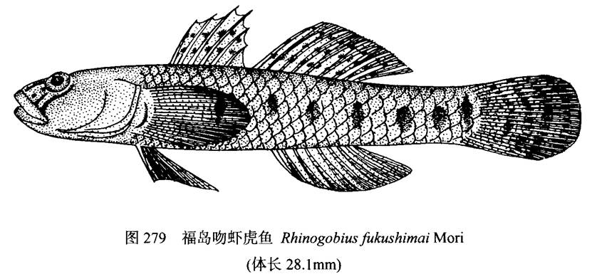

体延长，前部亚圆筒形，后部侧扁；背缘浅弧形隆起，腹缘稍平直；尾柄颇长，其长大于体高。头中大，圆钝，前部宽而平扁，背部稍隆起，头宽大于头高。头部具5个感觉管孔。颊部稍凸出，具3纵行感觉乳突线。吻短而圆钝，吻长大于眼径。眼中大，背侧位，位于头的前半部，眼上缘突出于头部背缘，眼下缘无放射状感觉乳突线。唇略厚，颇发达。舌游离，前端浅弧形。鳃孔中大，侧位，向头部腹面延伸，止于鳃盖骨后缘下方稍后处，其宽稍大于胸鳍基部的宽。前鳃盖骨后缘有3个感觉管孔，鳃盖上方具3个感觉管孔。峡部宽，鳃盖膜与峡部相连。鳃盖条5根。体被中大弱栉鳞，头的吻部、颊部、鳃盖部无鳞。背鳍中央前方一般无背鳍前鳞，或者具4枚小鳞，项部被鳞，胸部、腹部及胸鳍基部均无鳞。无侧线。胸鳍宽大，长圆形，下侧位，鳍长大于吻后头长，后缘不伸达肛门上方。腹鳍略短于胸鳍，圆形，膜盖发达，边缘弧形凹入，左、右腹鳍愈合成一吸盘。尾鳍长圆形，短于头长。体呈浅棕色，背部色深，腹部呈白色，项背部有云纹状黑色条纹。臀鳍浅灰色，边缘色较深。腹鳍灰色；尾鳍有3～4条灰黑色弧形条纹。眼前下方有3条灰黑色斜线。为淡水小型底层鱼类，栖息于江、河、小溪的底层。不常见，无食用价值。分布于辽宁（大凌河水系）、河北（滦河水系）、上海（长江水系）。为中国特有种。p589

## 颊纹吻虾虎鱼

Rhinogobius genanematus  Zhong & Tzeng, 1998

http://www.fishbase.org/summary/59342

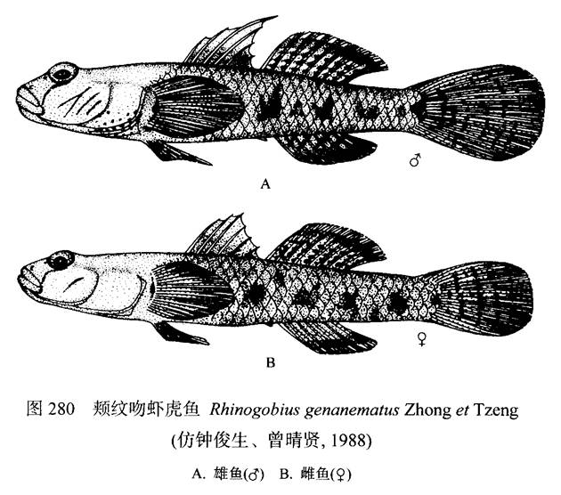

体延长，前部亚圆筒形，后部侧扁；背缘浅弧形隆起，腹缘稍平直；尾柄颇长，其长大于体高。头中大，圆钝，前部宽而平扁。头部具5个感觉管孔。颊部稍凸出。唇略厚，发达。舌游离，前端圆形。鳃孔大，侧位，向头部腹面延伸，止于鳃盖骨中部下方。峡部宽，鳃盖膜与峡部相连。鳃盖条5根。体被中大弱栉鳞，前部鳞小，后部鳞较大。头的吻部、颊部、鳃盖部裸露无鳞。背鳍中央前方无背鳍前鳞。胸部、腹部及胸鳍基部均无鳞。无侧线。胸鳍宽大，椭圆形，下侧位，鳍长大于吻后头长，后缘可伸达第二背鳍起点下方。腹鳍短于胸鳍，仅为胸鳍长的1/2，圆盘状，膜盖发达，边缘弧形凹入，左、右腹鳍愈合成一吸盘。尾鳍圆截形，短于头长。头、体呈棕色，背部色深，腹部色浅。峡部浅色。体侧具5～6个不规则黑棕色斑块，最后面的斑块位于尾鳍基部，呈“＜”状。体侧下半部每一枚鳞片中央具1椭圆形或不规则的橘红色斑点，后缘灰黑色，形成一明显边缘。胸鳍浅色，基部中央具1个小黑斑，近黑斑后方具1橘红色半月形斑条。腹鳍浅色。尾鳍深灰色，具5～6行由黑褐色小点组成的横纹，并具浅色边缘。为淡水小型底层鱼类，栖息于江、河、小溪的底层。无食用价值。分布于浙江。为中国特有种。p591

## 大吻虾虎鱼

Rhinogobius gigas  Aonuma & Chen, 1996

http://www.fishbase.org/summary/27074

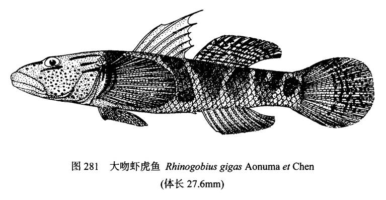

体延长，前部圆筒形，后部侧扁；背缘浅弧形，腹缘稍平直；尾柄颇长，其长大于体高。头中大，圆钝，前部宽而平扁，背部稍隆起，头宽大于头高。颊部凸出，中央具3纵行感觉乳突线。吻短而尖突，吻长大于眼径，雄鱼吻部较雌鱼为长。眼较小，背侧位，位于头的前半部，眼上缘突出于头部背缘。唇略厚，发达。舌游离，前端圆形。鳃孔中大，侧位，其宽稍大于胸鳍基部的宽，向头部腹面延伸，止于鳃盖骨中线下方稍后处。体被中大弱栉鳞，前部鳞小，后部鳞较大，头的吻部、颊部、鳃盖部、胸鳍基部及前项部无鳞，但有的个体鳞洼延伸到鳃盖后缘垂线上方附近。胸部、腹部鳞片细小。胸鳍宽大，椭圆形，下侧位，鳍长等于吻后头长，后缘不伸达第二背鳍起点。腹鳍略短于胸鳍，圆盘状，膜盖发达，边缘弧形凹入，左、右腹鳍愈合成一吸盘。体呈黄棕色，具6～7条黑褐色垂直横带；体侧鳞片基部淡黄色，腹部和胸部较白；雌鱼在生殖季时腹部为青色，鳃盖及颊部有许多红色或红褐色斑点，项部有数个红褐色纵纹，眼下方具有2对红纹。臀鳍黄绿色，胸鳍黄绿色，略带透明，基部有3条褐色弧形线，其上方有1黑褐色斑点；腹鳍白色略带透明。为溪流中的中小型溯河徊游鱼类，仔鱼孵化后，漂流至河口或沿岸海域，成长至20mm后再由河口上溯至溪流中栖息。肉食性鱼类，喜摄食小鱼、水生昆虫及底栖无脊椎动物。是台湾产吻虾虎鱼中体型最大者。分布于台湾宜兰南部、花莲、台东各地区的溪流中。为台湾省特有种。p592

## 子陵吻虾虎鱼

Rhinogobius giurinus  (Rutter, 1897)

http://www.fishbase.org/summary/15825

体延长，前部近圆筒形，后部稍侧扁；背缘浅弧形隆起，腹缘稍平直；尾柄颇长，其长大于体高。头中大，圆钝，前部宽而平扁，背部稍隆起，头宽大于头高。头部具5个感觉管孔。吻圆钝，颇长，吻长大于眼径。眼中大，背侧位，位于头的前半部，眼上缘突出于头部背缘。唇略厚，发达。舌游离，前端圆形。鳃孔中大，侧位，向头部腹面延伸，止于鳃盖骨后缘下方稍后处，鳃孔宽稍大于胸鳍基部的宽。体被中大栉鳞，头的吻部、颊部、鳃盖部无鳞。项部在背鳍中央前方具11～13枚背鳍前鳞，向前伸达眼间隔的后方，胸部、腹部及胸鳍基部均无鳞，腹部具小圆鳞。无侧线。腹鳍略短于胸鳍，长圆形，膜盖发达，边缘深凹，左、右腹鳍愈合成一吸盘。体呈黄褐色，体侧有6～7个宽而不规则的黑色横斑，有时不明显。头部在眼前方有数条（5条）黑褐色蠕虫状条纹，颊部及鳃盖有5条斜向前下方的暗色细条纹。臀鳍、腹鳍和胸鳍黄色，胸鳍基底上端具1黑斑点。背鳍和尾鳍黄色或橘红色，具多条暗色点纹。为肉食性鱼类，在池塘中会大量吞食鱼苗，成为有害的小杂鱼。分布于除西北地区以外的各大江河水系，海南及台湾均有分布。
原属于河、海洄游鱼类，但亦可生活于水库以上的溪流及湖泊、野塘之中，适应成陆封性族群。幼鱼具浮游期。为淡水小型鱼类，栖息于江、河中下游、湖泊、水库及池沼的沿岸浅滩，或者在小沟的石砾间，有时也栖息于河口。喜在池、溪水清澈之湖、潭中生活，常散居于石缝或在石下挖穴。领域性强，会主动攻击入侵的鱼族。常在水底匍匐游动，伺机掠食，摄食小鱼、虾、水生昆虫、水生环节动物、浮游动物和藻类等，有同类残食现象。在钱塘江，每年春汛之际，水温22～28℃, 10～25mm幼鱼成群溯水而上，推测是一种索饵活动。初期个体嫩小，淡黄色，大小均匀；后期个体大，体色较暗黑，大小不等。p594

## 恒春吻虾虎鱼

Rhinogobius henchuenensis  Chen & Shao, 1996

http://www.fishbase.org/summary/27218

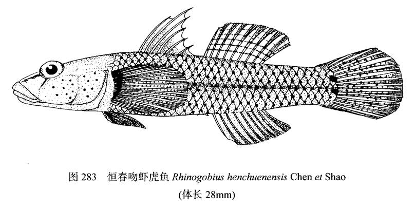

体延长，前部圆筒形，后部侧扁；背缘浅弧形，腹缘稍平直；尾柄颇长，其长大于体高。头中大，圆钝，前部宽而平扁，背部稍隆起，头宽大于头高。颊部凸出，中央具3纵行感觉乳突线。吻短而尖突，吻长大于眼径，雄鱼吻部略长于雌鱼。眼较小，背侧位，位于头的前半部，眼上缘突出于头部背缘。唇略厚，发达。舌游离，前端圆形。鳃孔中大，侧位，其宽稍大于胸鳍基部的宽，向头部腹面延伸，止于鳃盖骨中线下方稍后处。峡部宽，鳃盖膜与峡部相连。体被中大弱栉鳞，后半部鳞片较大，头的吻部、颊部、鳃盖部无鳞。项部在背鳍中央前方具12～16枚背鳍前鳞，前项部无鳞，中央鳞列超过鳃盖后缘垂线，约达鳃盖中线上方附近，不达眼后方；胸部、腹部鳞片较细小，胸鳍基部无鳞。无侧线。胸鳍宽大，椭圆形，下侧位，鳍长等于吻后头长，后缘不伸达第二背鳍起点下方。腹鳍略短于胸鳍，圆盘状，膜盖发达，边缘弧形凹入，左、右腹鳍愈合成一吸盘。尾鳍长圆形，短于头长。体呈黄棕色或褐色，体侧各鳞的基部有1个深色斑，雄鱼多呈红褐色，雌鱼暗褐色。体侧中央有1列深色点纹延伸到尾鳍基部，腹侧斑点色泽较淡。腹部黄色，颊部及鳃盖散布着约30个红色斑点，雄鱼色泽较为鲜明。尾鳍淡棕色，具4～5列垂直排列斑点，雄鱼为红色，雌鱼则为灰黑色；尾鳍外缘橘红色，雌鱼尾鳍基部有两个褐色斑点。胸鳍基部上方有1个黑褐色斑，下面有1列新月形红褐色线纹；腹鳍灰白略透明。为溪流的底栖小型鱼类。成鱼有护卵习性。肉食性，以小鱼、水生昆虫等为食。数量极少，属于稀有种类。分布于台湾南部的枫港溪以及四重溪。为台湾省特有种。p599

## 红河吻虾虎鱼

Rhinogobius honghensis  Chen, Yang & Chen, 1999

http://www.fishbase.org/summary/59345

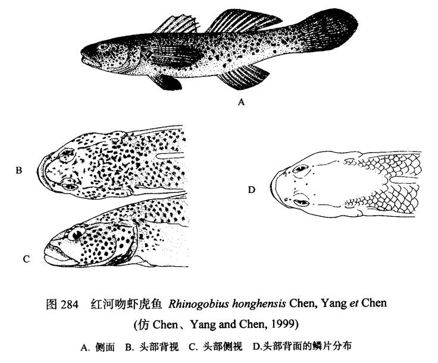

体延长，前部亚圆筒形，后部侧扁；背缘浅弧形隆起，腹缘稍平直；尾柄颇长，其长大于体高。头中大，圆钝，前部宽而平扁，背部稍隆起，头宽大于头高。唇略厚，发达。舌游离，前端圆弧形。鳃孔中大，侧位，其宽稍大于胸鳍宽，向头部腹面延伸，止于前鳃盖骨后缘下方稍后处。鳃孔大，侧位，向头部腹面延伸，止于鳃盖骨后缘下方稍后处。体被中大栉鳞，头的吻部、颊部、鳃盖部无鳞。第一背鳍起点中央正前方无背鳍前鳞，或者具1～4小圆鳞；两侧具小鳞，向前伸达鳃盖骨上缘。胸部、腹部及胸鳍基部均无鳞。无侧线。腹鳍略短于胸鳍，圆形，膜盖发达，边缘弧形凹入，左、右腹鳍愈合成一吸盘。尾鳍长圆形，短于头长。头、体呈黄色或深棕色，体侧无深褐色宽横纹或大斑块，具8～9行水平状、大于瞳孔的褐色圆斑。颊部及鳃盖部黄色，雄鱼鳃盖膜密具65～70个褐色圆斑。雌鱼无圆斑。腹部黄色或浅色。项部具许多不规则的细小斑点。臀鳍浅色或灰色，雄鱼具暗色边缘。胸鳍浅色，基部具数个不规则黑色斑点。雄鱼腹鳍灰色，雌鱼浅白色。尾鳍浅色或灰色，具6～7列垂直暗斑或暗色横带。为暖水性小型底层鱼类，喜栖息于淡水河川的上游。无食用价值。分布于中国云南和越南北部。p601

## 兰屿吻虾虎鱼

Rhinogobius lanyuensis  Chen, Miller & Fang, 1998

http://www.fishbase.org/summary/54599

体延长，前部亚圆筒形，稍平扁，后部侧扁；背缘浅弧形隆起，腹缘稍平直；尾柄长，其长小于体高。头大，圆钝，亚圆筒形，前部宽而稍平扁，背部稍隆起，头宽大于头高。唇略厚，发达。舌游离，前端圆形。鳃孔大，侧位，向头部腹面延伸，止于鳃盖骨下缘近中部处。体被小栉鳞。头的吻部、颊部、鳃盖部无鳞。背鳍前鳞区具13～17枚鳞片，其前缘鳞片排列呈三叉形；眼后的背鳍前区裸露无鳞。腹部具小圆鳞，胸部在腹鳍起点前方处亦具小圆鳞。无侧线。胸鳍宽大，圆形，下侧位，鳍长大于吻后头长，第三鳍条端部游离。腹鳍略短于胸鳍，圆形，左、右腹鳍愈合成一吸盘。尾鳍长圆形，短于头长。头、体呈亮褐色。体侧具8条灰褐色垂直宽条纹，体背具8个黑褐色斑块。颊部和鳃盖骨部无蠕虫形红褐纹。腹部浅色或微蓝。颊部和鳃盖具许多橘色小点（雄鱼）或褐色小点（雌鱼）；颊部和鳃盖的上部还具2～3条褐色平行的纵纹。臀鳍浅黄色，雌鱼的臀鳍中部具一条黑褐色纵带。胸鳍浅白色，基部具2条深色垂直条纹。腹鳍浅色，无斑块及条纹。尾鳍基具1三角形黑褐色大斑。为河、溪小型底层鱼类。无食用价值。种群数量小，分布区狭窄。分布于台湾兰屿岛。为台湾省特有种。p603

## 李氏吻虾虎鱼

Rhinogobius leavelli  (Herre, 1935)

http://www.fishbase.org/summary/60211

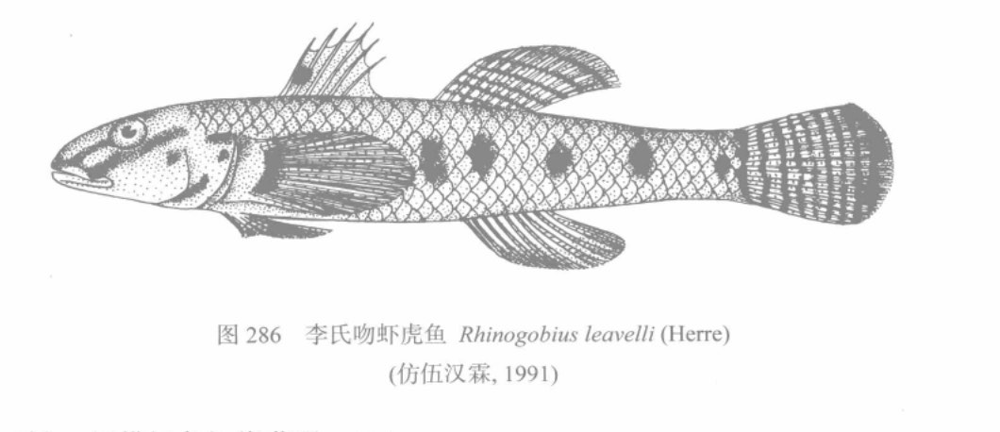

体延长，前部亚圆筒形，后部侧扁；背缘浅弧形隆起，腹缘稍平直；尾柄颇长，其长大于体高。头中大，圆钝，前部宽而平扁，背部稍隆起，头宽大于头高。眼间隔狭窄。口中大，前位，斜裂。两颌约等长，口闭时，上颌稍突出于下颌之前。舌游离，前端圆弧形。鳃孔中大，侧位，其宽稍大于胸鳍宽，向头部腹面延伸，止于鳃盖骨后缘下方稍后处。体被中大弱栉鳞，头的吻部、颊部、鳃盖部无鳞。背鳍中央前方具7～12枚背鳍前鳞，向前仅伸达项部的1/3处，胸部、腹部及胸鳍基部均无鳞。无侧线。前部鳍条稍短，后部鳍条较长。胸鳍宽大，长圆形，下侧位，鳍长约等于吻后头长，后缘几乎伸达肛门上方。腹鳍略短于胸鳍，圆形，膜盖发达，边缘弧形凹入，左、右腹鳍愈合成一吸盘。尾鳍长圆形，短于头长。头、体呈浅灰色，体侧隐具3～5个暗灰色斑块，每一枚鳞片的后缘呈橘黄色（雌鱼）或褐黄色（雄鱼）；头部具橘黄色点纹，眼前至吻背前端具1～2橘色斜纹（雌鱼）或具暗褐黄色细纵带（雄鱼），鳃盖膜上具平行橘色细纹。背鳍灰黄色，第二背鳍具5条暗色纵纹。臀鳍浅色，中部有1浅黄色纵带，纵带外缘稍黑，鳍的边缘白色。胸鳍暗灰色，基部有2行橘色横纹。腹鳍浅黄色。尾鳍基有1橘色宽横纹，尾鳍上有7条暗色横带。为暖水性小型底层鱼类，喜栖息于淡水河川中。无食用价值。分布于钱塘江以南各水系及海南各河溪。为中国特有种。p604

## 雀斑吻虾虎鱼

Rhinogobius lentiginis  (Wu & Zheng, 1985)

http://www.fishbase.org/summary/54776

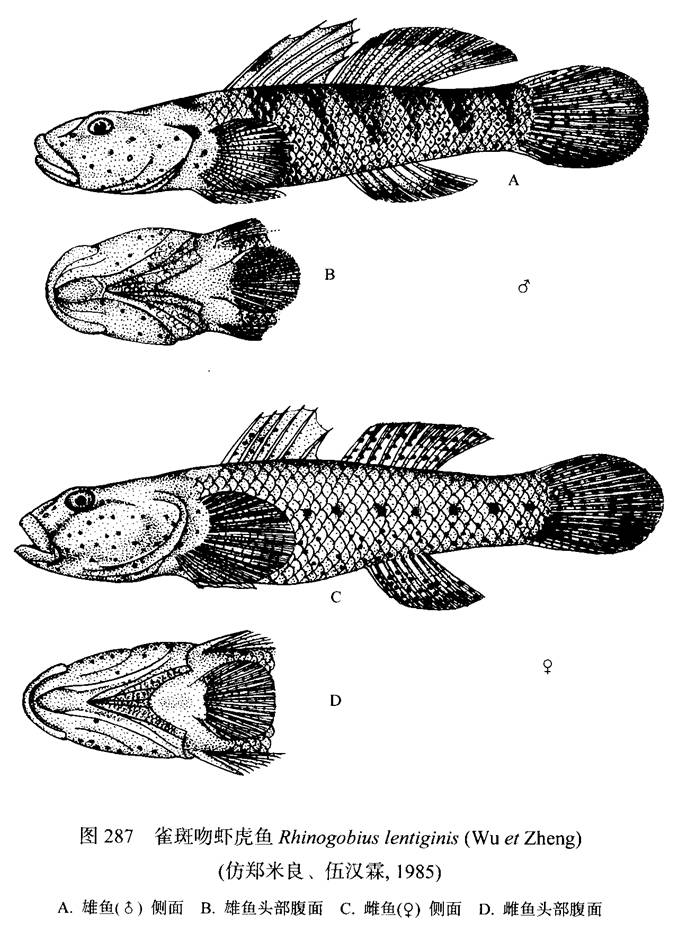

体延长，前部稍平扁，后部侧扁；背缘浅弧形隆起，腹缘稍平直；尾柄颇长，其长大于体高。头中大，圆钝，前部宽而平扁（雄鱼）或稍侧扁（雌鱼），背部稍隆起，头宽大于头高。头部无感觉管及感觉管孔。口小，前位，斜裂。上、下颌约等长。上颌骨后端伸达或几乎不伸达眼前缘下方。唇略厚，发达。舌游离，前端圆形。鳃孔大，侧位，向头部腹面延伸，止于前鳃盖骨后缘下方稍前处。前鳃盖骨后缘及鳃盖上方均无感觉管孔。体被中大薄圆鳞，头的吻部、颊部、鳃盖部无鳞。背鳍中央前方无背鳍前鳞，胸部、腹部及胸鳍基部均无鳞。无侧线。腹鳍略短于胸鳍，圆形，膜盖发达，边缘弧形凹入，左、右腹鳍愈合成一吸盘。尾鳍长圆形，短于头长。雄鱼头、体呈深灰色，雌鱼呈浅棕色。体侧具稍不规则的黑色斑块数个，腹侧有时散具数个小黑点，或者体侧隐具数个黑色斑块。体侧每一鳞片边缘浅色，不形成网格状纹。颊部和鳃盖具10余个小黑点。头部腹面鳃盖膜处密具白色小圆点。雄鱼腹鳍灰黑色，其余各鳍深灰色，其第一背鳍第一与第二鳍棘间的鳍膜上具1个黑斑，第二背鳍无斑点或条纹；雌鱼腹鳍浅色，其余各鳍浅棕色，第一背鳍第一与第二鳍棘间的鳍膜上亦隐具1个黑斑，第二背鳍具数行黑色斑纹。为河、溪小型底层鱼类。无食用价值。数量极少，属于稀有种类。分布于浙江灵江、飞云江及鳌江各水系。为中国特有种。p606

## 林氏吻虾虎鱼

Rhinogobius lindbergi  Berg, 1933

http://fishbase.org/summary/60231

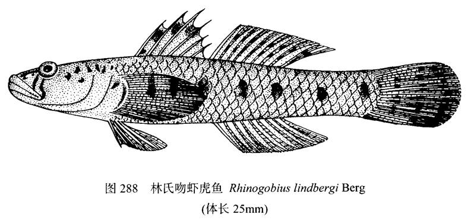

又名真吻虾虎鱼。体延长，前部圆筒形，后部侧扁；背缘浅弧形，腹缘稍平直；尾柄颇长，其长大于体高。头中大，稍尖突，前部平扁，背部稍隆起，头宽稍大于头高。唇略厚，发达。舌游离，前端圆形。鳃孔大，侧位，向头部腹面延伸，止于鳃盖骨后缘下方稍后处，其宽稍大于胸鳍基部宽。峡部宽，鳃盖膜与峡部相连。体被中大弱栉鳞，头的吻部、颊部、鳃盖部无鳞。背鳍中央前方无背鳍前鳞，项部无鳞，胸部、腹部及胸鳍基部均无鳞。无侧线。胸鳍宽大圆形，下侧位，鳍长约等于吻后头长，后缘不伸达肛门上方。腹鳍略短于胸鳍，圆形，膜盖发达，边缘凹入，左、右腹鳍愈合成一吸盘。尾鳍长圆形，短于头长。头、体呈浅棕色，背部色深，腹部乳白色，体侧具8～9个深色不规则斑块。项背部具多条云状纹。第一背鳍各鳍棘间的鳍膜灰色，尤以第一至第二鳍棘间的鳍膜呈深灰黑色，第一鳍棘的基部起点处有时有1个黑色小点；第二背鳍隐具2行由点列组成的浅色纵纹；尾鳍具3条弧形条纹；臀鳍和腹鳍浅灰色；胸鳍基部上方有1个灰黑色圆斑，沿胸鳍基有1条灰色横纹，呈弧形。眼前下方隐具3条褐色斜纹。为河、溪底层小型鱼类，栖息于江河岸边和通流的泡沼中，喜有微流的水域，在含氧量较高的止水泡沼中可以繁殖、生长，其生活水域在石砾底层。以挠足类和枝角类为食。6月产卵，卵产在石砾和砂上，卵椭圆形，卵粒小。雄鱼有护卵发育孵化的习性。分布于松花江、绥芬河、中俄界河黑龙江等水系的支流和湖泊中。p609

## 陵水吻虾虎鱼

Rhinogobius linshuiensis  Chen, Miller, Wu & Fang, 2002

http://www.fishbase.org/summary/61850

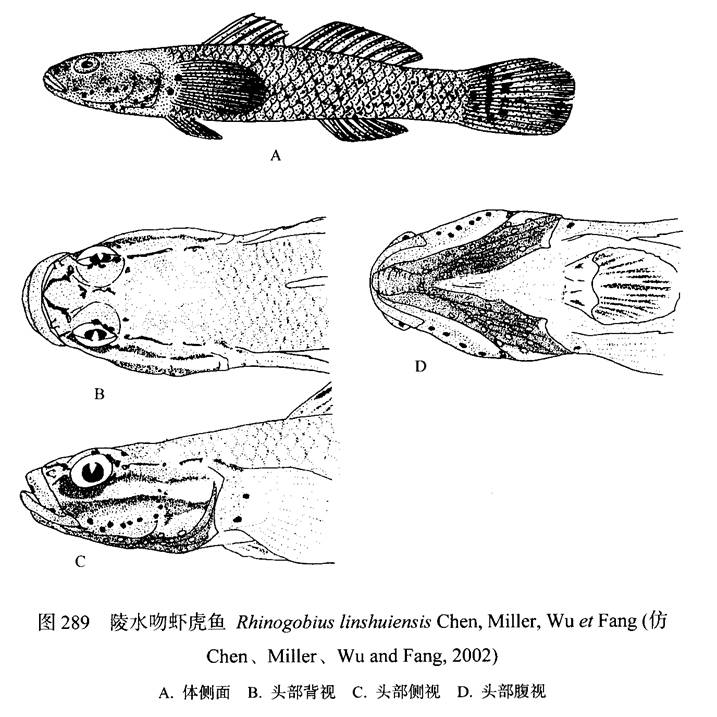

体较延长，前部圆筒形，后部侧扁；背缘浅弧形隆起，’腹缘稍平直；尾柄颇长，其长稍大于体高。头中大，圆钝，前部宽而平扁，背部稍隆起，头宽大于头高。眼中大，背侧位，位于头的前半部，眼上缘突出于头部背缘。唇略厚，发达，下唇突出。舌游离，前端圆形。鳃孔大，侧位，向头部腹面延伸，止于前鳃盖骨后缘下方稍后处。体被大栉鳞，头的吻部、颊部、鳃盖部无鳞。背鳍中央前方的背鳍前鳞为圆鳞，腹部在肛门前方具小鳞。胸部及胸鳍基部均无鳞。无侧线。腹鳍略短于胸鳍，圆盘状，膜盖发达，边缘弧形凹入，左、右腹鳍愈合成一吸盘。尾鳍长圆形，短于头长。头、体呈乳白色，体侧无明显黑色横斑，但具2纵行红色小斑。颊部和鳃盖骨乳白色，但具2纵行红点；雄鱼鳃盖膜具16～22个橘色小斑。项部具不明显暗灰色斑块。吻背自眼前方至吻端具“U”形黑纹。眼下具1个方形暗灰色大斑。第一背鳍浅色，边缘橘色，第二鳍棘前方的鳍膜上具一黑斑，黑斑向后有一条暗色条纹；第二背鳍浅色，具3行褐斑。臀鳍品红色，边缘具暗灰色（雄鱼）条纹或灰白色带纹（雌鱼）。胸鳍暗灰色或浅色，基部具2个小黑斑。腹部白色，腹鳍浅色。尾鳍浅灰色，具2～3行垂直褐色点纹。为生活于海南河溪中的小型底层鱼类。不常见。分布于海南。为海南特有种。p610

## 刘氏吻虾虎鱼

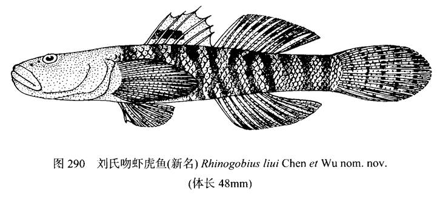

又名四川吻虾虎鱼。体延长，前部亚圆筒形，后部侧扁；背缘浅弧形隆起，腹缘稍平直；尾柄颇长，其长大于体高。头中大，圆钝，前部宽而平扁，背部稍隆起。体被中大弱栉鳞，头的吻部、颊部、鳃盖部及项部无鳞。无背鳍前鳞。胸部、腹部及胸鳍基部裸露无鳞。无侧线。腹鳍略短于胸鳍，圆盘状，膜盖发达，边缘弧形凹入，左、右腹鳍愈合成一吸盘。尾鳍长圆形，短于头长。头、体呈浅褐色，体背侧色深，腹侧浅色。体侧有8～11条黑褐色横带（或大横斑），背侧的第一背鳍基部下方及项部有许多深灰色虫状纹或云纹，中间杂有许多较大浅色圆斑。第一背鳍第一至第四鳍棘间的鳍膜上有1大黑斑。背鳍、尾鳍和臀鳍为灰黑色或浅灰黑色，边缘灰白色或白色。尾鳍有时有5～6深色垂直横纹。胸鳍、腹鳍灰白色。为淡水小型底层鱼类，喜栖息于江、河的中游。不常见。分布于四川、湖北等长江干支流。为中国特有种。p612

## 斑带吻虾虎鱼

Rhinogobius maculafasciatus  Chen & Shao, 1996

http://www.fishbase.org/summary/27219

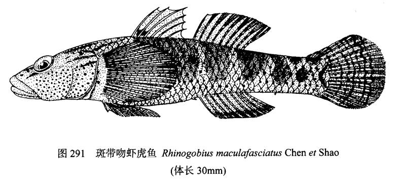

体延长，前部圆筒形，后部侧扁；背缘浅弧形，腹缘稍平直；尾柄颇长，其长大于体高。头中大，圆钝，前部宽而平扁，背部稍隆起，头宽大于头高。颊部凸出，中央具纵行感觉乳突。吻短而圆钝，吻长大于眼径。唇略厚，发达。舌游离，前端圆形。鳃孔中大，侧位，其宽稍大于胸鳍基部宽，向头部腹面延伸，止于鳃盖骨中线下方。峡部宽，鳃盖膜与峡部相连。体被中大弱栉鳞，后半部鳞片较大，头的吻部、颊部、鳃盖部均无鳞。项部在背鳍中央前方具8～12枚背鳍前鳞，向前可达到或超过鳃盖后缘上方，不达眼后方；胸鳍基部无鳞。无侧线。胸鳍宽大，椭圆形，下侧位，鳍长等于吻后头长，后缘不伸达第二背鳍起点。腹鳍略短于胸鳍，圆盘状，膜盖发达，边缘弧形凹入，左、右腹鳍愈合成一吸盘，末端至臀鳍起点的距离等于腹鳍长。体呈淡棕色或米黄色，体侧则有6～7条褐色横带，成熟雌鱼腹部为黄色。体侧鳞片基部具黄色或鲜明的橘红色斑点，前鳃盖后缘及下缘排列较细密；项部有数条褐色纵纹，背侧有不规则深褐色网纹，眼前及前下方各有1条红褐色斜纹伸到吻端及上颌中部上方。背鳍透明，略带浅黄色，第一背鳍棘淡棕色，上缘鳍膜黄色，第一至第三鳍棘的鳍膜间通常有蓝黑色亮斑；第二背鳍淡棕色，具5～7列褐色水平方向的点纹；尾鳍淡黄色，有8～12列褐色或黑褐色垂直点纹，基部有深褐色“＜”形纹，雄鱼尾基上方有1橘黄色圆斑。臀鳍为黄色或黄绿色，外缘有褐色边，最外缘则透明无色；胸鳍淡黄色，基部有2列橘红色不规则斑点；腹鳍透明或灰白色。
为溪流中的小型鱼类，典型的河、海洄游鱼类，底栖性。仔鱼具浮游期。本种游泳力强，常栖息于各河川干流及支流低海拔的溪段，生活于急流、潭头等水域。肉食性，以水生昆虫、小型鱼类及虾类为食。目前已成难得一见的稀有鱼种，有灭种危机，属于稀有种类。分布于台湾的曾文溪及高屏溪水系。为台湾省特有种。p614

## 密点吻虾虎鱼

Rhinogobius multimaculatus  (Wu & Zheng, 1985)

http://www.fishbase.org/summary/60219

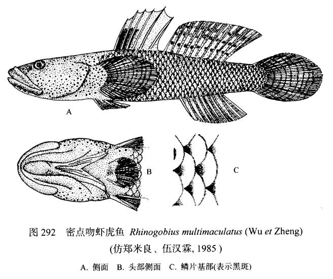

体延长，前部稍平扁，后部侧扁；背缘浅弧形隆起，腹缘稍平直；尾柄颇长，其长大于体高。头中大（雄鱼头稍尖；雌鱼头略高，前部圆钝），宽而平扁，背部稍隆起，头宽大于头高。眼间隔狭窄，宽大于眼径，稍内凹。唇略厚，发达。舌游离，前端圆形。鳃孔大，侧位，向头部腹面延伸，止于前鳃盖骨后缘下方稍前处。体被中大弱栉鳞，头的吻部、颊部、鳃盖部无鳞。背鳍中央前方无背鳍前鳞，胸部、腹部及胸鳍基部均无鳞。无侧线。腹鳍略短于胸鳍，圆盘形，膜盖发达，边缘弧形凹入，左、右腹鳍愈合成一吸盘。尾鳍长圆形，短于头长。头、体呈棕褐色，头部略深。头及体侧具许多小黑斑点，头部、体前部及胸鳍基底的黑斑细小、密集；体后部黑斑较大，位于每枚鳞片的基部，成规则排列腹面浅色，无小黑斑。背鳍和尾鳍灰色，第一背鳍第一与第四鳍棘间的鳍膜上具黑色斑块，第二背鳍及尾鳍有时具数行黑色斑纹。臀鳍灰黑色，边缘灰白色。胸鳍浅灰色。雄鱼腹鳍灰黑色，雌鱼腹鳍灰白色。为中国东南部河、溪底层的小型鱼类。个体小，体长40～60mm。数量极少，属于稀有种类。分布于浙江。为中国特有种。p616

## 名古屋吻虾虎鱼

Rhinogobius nagoyae  Jordan & Seale, 1906

http://www.fishbase.org/summary/27331

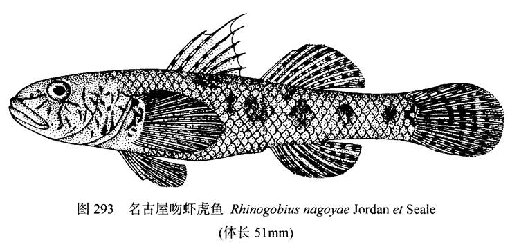

体延长，前部圆筒形，后部侧扁；背缘浅弧形，腹缘稍平直；尾柄颇长，其长大于体高。头中大，圆钝，前部宽而平扁，背部稍隆起，头宽大于头高。眼间隔狭窄，宽小于眼径，稍内凹。体被中大弱栉鳞，头的吻部、颊部、鳃盖部无鳞。背鳍中央前方具9～12枚背鳍前鳞，鳞片向前仅伸达项部的1/3处，胸部、腹部及胸鳍基部均无鳞。无侧线。腹鳍略短于胸鳍，圆形，膜盖发达，边缘显著凹入，左、右腹鳍愈合成一吸盘。尾鳍长圆形，短于头长。液浸标本的头、体呈浅棕色，背部色深，腹部浅色，体侧具6～7个不规则灰黑色横斑，最后面的横斑位于尾鳍基，呈“＜”状浅弧形。颊部及鳃盖上具许多辐射状蠕虫形红褐色条纹。眼前下方的吻部具4条伸向上颌的斜纹。第一背鳍和臀鳍呈灰褐色；第二背鳍有4条灰黑色纵纹；尾鳍具6～8条灰黑色弧形横纹；胸鳍基部上方有1个黑斑，其后沿胸鳍基有3条弧形横纹；腹鳍灰色。为江、河底层小型鱼类，喜栖息于中、小河川水清流缓、底质为石砾处。杂食性，摄食小型水生昆虫及附着性藻类。分布于中国东北部地区的图们江、辽河、鸭绿江、黑龙江等水系。p617

## 南渡江吻虾虎鱼

Rhinogobius nandujiangensis  Chen, Miller, Wu & Fang, 2002

http://www.fishbase.org/summary/61851

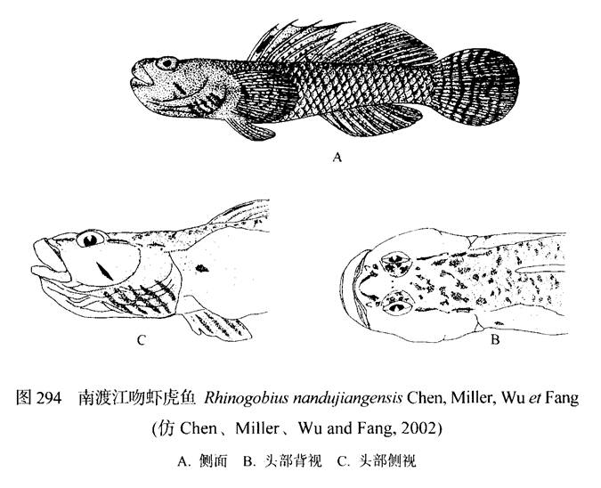

体延长，前部稍平扁，后部侧扁；背缘浅弧形隆起，腹缘稍平直；尾柄长，其长等于体高。头中大，圆钝，前部宽而平扁（雄鱼）或稍侧扁（雌鱼），背部稍隆起，头宽大于头高。唇略厚，发达。舌游离，前端圆形。鳃孔大，侧位，向头部腹面延伸，止于鳃盖骨下缘近中部处。体被大栉鳞，头的吻部、颊部、鳃盖部无鳞。背鳍前鳞区的后部具圆鳞，背鳍前鳞区的前缘呈三叉形。腹部在肛门前方至腹鳍后缘具圆鳞，腹鳍前区及胸鳍基部均无鳞。无侧线。腹鳍略短于胸鳍，圆形，左、右腹鳍愈合成一吸盘。尾鳍长圆形，短于头长。头、体呈乳黄色，体侧无深色横带和斑块，雄鱼体侧每一枚鳞袋边缘呈橘褐色，腹部呈浅黄色或白色。颊部及鳃盖部乳黄色。颊部具1条斜纹，鳃盖膜具5～7条暗红色条纹。项部具若干个褐色斑块。吻背自眼前方至吻端具“U”形黑纹。雄鱼腹鳍暗黑色，雌鱼腹鳍浅灰色。第二背鳍灰白色，具6～8纵行红褐色小点。尾鳍浅灰色，具6～8条垂直褐色条纹，尾鳍基部具黑斑。臀鳍浅色，雄鱼具3纵行红褐色小点，雌鱼无纵行小点。胸鳍浅色或暗灰色，基部具一暗褐色圆斑。腹鳍暗灰色。为河、溪小型底层鱼类。分布于海南南渡江水系。为海南特有种。p619

## 南台吻虾虎鱼

Rhinogobius nantaiensis  Aonuma & Chen, 1996

http://www.fishbase.se/summary/27072

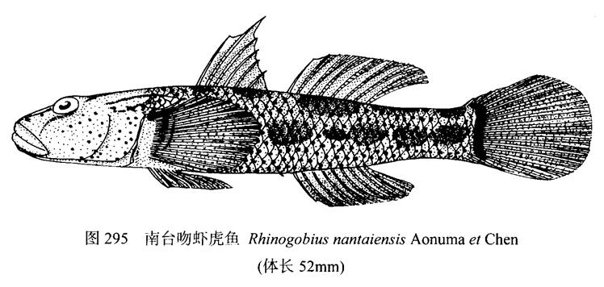

体延长，前部圆筒形，后部侧扁；背缘浅弧形，腹缘稍平直；尾柄颇长，其长大于体高。头大，圆钝，前部宽而平扁，背部稍隆起，头宽大于头高。眼间隔窄小，其宽小于眼径，稍内凹。唇略厚，发达，上唇突出于下唇之前。舌游离，前端圆形。鳃孔中大，侧位，其宽稍大于胸鳍基部的宽，向头部腹面延伸，伸达鳃盖骨后缘下方。体被中大弱栉鳞，后半部鳞片较大，头的吻部、颊部、鳃盖部无鳞。项部在背鳍中央前方具13～17枚背鳍前鳞，向前仅伸达鳃盖骨后缘垂线上方，前项部无鳞。胸部及腹部具小圆鳞，胸鳍基部无鳞。无侧线。胸鳍宽大，椭圆形，下侧位，鳍长几乎等于吻后头长，后缘不伸达第二背鳍起点。腹鳍略短于胸鳍，圆盘状，膜盖发达，边缘弧形凹入，左、右腹鳍愈合成一吸盘，末端至臀鳍起点的距离等于腹鳍长。尾鳍长圆形，短于头长。体呈灰褐色或淡褐色，体侧各鳞基部有较深色斑点，背侧具棕斑，体侧中央有1纵列宽大而不规则的褐斑，尾鳍基部具1褐色垂直条纹。成熟雌鱼腹部呈蓝色；颊部及鳃盖具有许多橘红色或橙色斑点，雄鱼色斑较为鲜明。项部具数列深褐色纵纹，眼下方各有1条红色斜纹，延伸到吻端及上颌中部上方。背鳍呈灰白色或灰棕色，尾鳍灰白略透明，中央部分略有淡蓝色光泽，最外缘呈黄色。臀鳍灰棕色，外缘黄色或透明；胸鳍淡棕色，基部上方具1个黑褐色斑点，前方有2～3列红棕色垂直弧形纹；腹鳍灰白略透明。各鳍膜均无斑点。
为溪流的底栖小型鱼类，可能属于陆封型或非必要降海型的鱼类。仔鱼浮游期较短。喜栖息于潭区浅于2m的水域或懒区中。肉食性，以小型鱼、虾类、水生昆虫、有机碎屑为食。分布于中国台湾的曾文溪、高屏溪等水系。为台湾省特有种。p621

## 小吻虾虎鱼

Rhinogobius parvus  (Luo, 1989)

http://www.fishbase.org/summary/60232

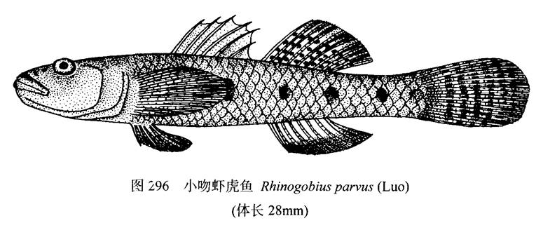

体延长，前部圆筒形，后部侧扁；背缘浅弧形隆起，腹缘稍平直；尾柄颇长，其长大于体高。头中大，圆钝，前部宽而平扁，背部稍隆起，头宽大于头高。眼间隔狭窄，其宽小于眼径，稍内凹。唇略厚，发达。舌游离，前端圆形。鳃孔大，侧位，向头部腹面延伸，止于前鳃盖骨后缘下方稍后处。体被中大弱栉鳞，头的吻部、颊部、鳃盖部无鳞。背鳍中央前方具1～4枚背鳍前鳞。胸部、腹部及胸鳍基部均无鳞。无侧线。胸鳍宽大，圆形，下侧位，鳍长稍大于吻后头长，后缘不伸达肛门上方。腹鳍略短于胸鳍，圆盘状，膜盖发达，边缘弧形凹入，左、右腹鳍愈合成一吸盘。尾鳍长圆形，短于头长。头、体呈浅棕色，体侧常有不明显的暗斑。雄鱼背鳍、臀鳍、尾鳍灰黑色；第一背鳍无暗斑，边缘浅色。雌鱼的背鳍、尾鳍具数行暗色点纹。腹鳍浅灰色。为生活于中国南部河、溪中的小型底层鱼类。不常见。无食用价值。体长30～50mm。数量极少，属于稀有种类。分布于广西。为中国特有种。p623

## 短吻红斑吻虾虎鱼

Rhinogobius rubromaculatus  Lee & Chang, 1996

http://www.fishbase.org/summary/27214

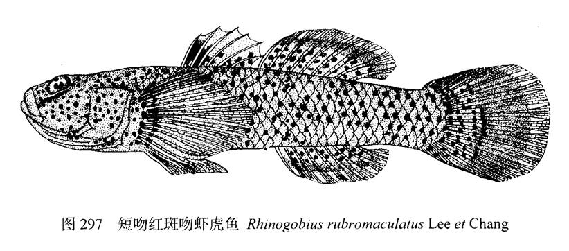

又名短吻褐斑吻虾虎。体延长，前部圆筒形，后部侧扁；背缘浅弧形，腹缘稍平直；尾柄颇长，其长大于体高。头大，圆钝，前部宽而平扁，背部稍隆起，头宽大于头高。眼间隔较小，稍小于眼径，稍内凹。唇略厚，发达。舌游离，前端圆形。鳃孔中大，侧位，其宽稍大于胸鳍基部宽，向头部腹面延伸，止于鳃盖骨中线下方。体被中大弱栉鳞，头的吻部、颊部、鳃盖部无鳞。项部在背鳍中央前方具8～11枚背鳍前鳞，鳞区向前仅伸达项部的1/3处，不达眼后方；胸部、腹部及胸鳍基部无鳞；无侧线。胸鳍宽大，椭圆形，下侧位，鳍长几乎等于吻后头长，后缘伸达或伸越第二背鳍起点。腹鳍略短于胸鳍，圆盘状，膜盖发达，边缘弧形凹入，左、右腹鳍愈合成一吸盘，末端至臀鳍起点的距离等于腹鳍长。体呈黄棕色或褐色，身上密布许多红色或红褐色细小斑点，吻部、颊部及鳃盖上皆有许多红色或橘红色斑点；两眼前方无“U”形条纹，眼前及眼下各有1条细窄红纹，延伸到吻端及上颌中央上方。第一背鳍第一到第三鳍棘之间下半部的鳍膜处有1个黑蓝色亮斑，各鳍膜有散列的红色斑点；第二背鳍有3～5列红色或橘红色斑点，雄鱼第二背鳍外缘呈白色；尾鳍有4～7列散开的红色或红褐色斑点；臀鳍橘黄色，较外缘为黑色，最外缘则呈白色或透明无色；胸鳍基部有2～3列垂直排列的红色或橘红色斑点。为溪流中、上游的小型底栖鱼类，为吻虾虎鱼中典型的陆封种，可归于初级淡水鱼。仔鱼完全无浮游期，与日本产的河川吻虾虎鱼 R. flumineus的生活史形态相类似，常栖息于小支流里的缓流区、边缘水等环境中，不喜好活动。肉食性，以水生昆虫为食。分布于台湾北部、中部、南部的溪流中、上游区域，亦即中央山脉以西的浊水溪以及以北的溪流水系中。为台湾省特有种。p624

## 神农吻虾虎鱼

Ctenogobius shennongensis  Yang & Xie, 1983

http://www.fishbase.org/summary/59359

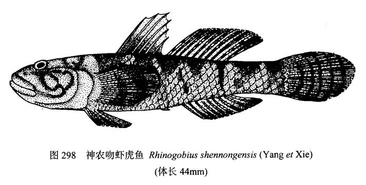

体延长，粗壮，前部亚圆筒形，后部侧扁；背缘浅弧形隆起，腹缘稍平直；尾柄颇长，其长大于体高。头中大，圆钝，前部宽而低，平扁，背部稍隆起，头宽大于头高。头部具5个感觉管孔。眼间隔狭窄，宽等于眼径，稍内凹。唇略厚，发达。舌游离，前端圆形。鳃孔大，侧位，其宽稍大于胸鳍基部的宽度，向头部腹面延伸，止于鳃盖骨后缘下方稍后处。体被中大弱栉鳞，头的吻部、颊部、鳃盖部无鳞。项部基本无鳞，仅在背鳍中央前方具4～5枚背鳍前鳞，胸部、腹部及胸鳍基部无鳞。无侧线。胸鳍宽大，圆形，下侧位，鳍长大于眼后头长，后缘不伸达肛门上方。腹鳍略短于胸鳍，圆盘状，膜盖发达，边缘弧形凹入，左、右腹鳍愈合成一吸盘。头、体呈翠绿色，体侧有6～7条较宽的黑色斑条，横跨背部。雄鱼第一背鳍前部有1个大而明显的荧光蓝色斑点；雌鱼无此斑点。各鳍均具黑色斑点组成的条纹；胸鳍基部有1条黑色横纹，雄鱼胸鳍和腹鳍呈灰黑色，雌鱼的为灰白色。尾鳍基有1个深褐色半月形斑。为温水性小型底层鱼类，喜生活于急流浅滩处，以特化为圆盘状的腹鳍吸附于砾石上，使其不至于被急流冲走，平时常潜伏于砾石缝隙间，游动距离不超过1m，活动敏捷，不易捕捉。无食用价值。分布于中国中部及东南部河、溪中。为中国特有种。p626

## 四川吻虾虎鱼

Ctenogobius szechuanensis  (Liu, 1940)

http://www.fishbase.org/summary/60225

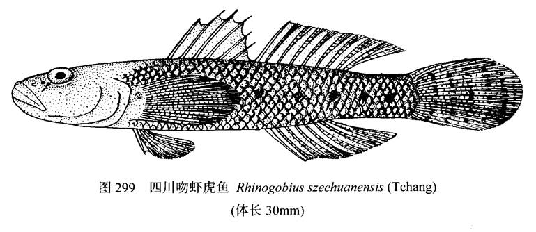

体延长，前部亚圆筒形，后部侧扁；背缘浅弧形隆起，腹缘稍平直；尾柄颇长，其长大于体高。头中大，圆钝，前部宽而平扁，背部稍隆起，头宽大于头高。头部无感觉管及感觉管孔。唇肥厚，发达。舌游离，前端圆形。鳃孔稍小，其宽稍大于胸鳍基部的宽，侧位，向头部腹面延伸，止于鳃盖骨后缘下方稍后处。前鳃盖骨后缘及鳃盖上方均无感觉管孔。体被中大弱栉鳞，头的吻部、颊部、鳃盖部无鳞。背鳍中央前方无背鳍前鳞，胸部、腹部及胸鳍基部均无鳞。无侧线。胸鳍宽大，圆形，下侧位，鳍长大于吻后头长，后缘几乎伸达肛门上方。腹鳍略短于胸鳍，圆盘状，膜盖发达，边缘平直或微凹，左、右腹鳍愈合成一吸盘。尾鳍长圆形，短于头长。体呈灰褐色或浅褐色，腹部黄白色，体侧每一枚鳞片边缘棕褐色，形成网格状纹，中央无纵带，有时体侧具数个小黑斑。头部黑褐色，颊部和鳃盖无小黑点。背鳍、臀鳍、胸鳍和腹鳍均呈灰褐色；第一背鳍无纵纹，第一至第二鳍棘之间的鳍膜上无黑斑，但有时有1条深色的长条纹；第二背鳍有数列深褐色小斑点；胸鳍基部上方有时隐具一个黑斑。尾鳍具6～7条深色横纹，上、下叶近边缘区深棕色，中部灰白色。为暖温性小型底层鱼类，常栖息于流水的溪、河中，多在乱石、卵石间活动。肉食性鱼类，以小鱼、水生昆虫及小虾、蟹为食。分布于四川眠江水系。为中国特有种。p628

## 万泉河吻虾虎鱼

Rhinogobius wangchuangensis  Chen, Miller, Wu & Fang, 2002

http://www.fishbase.se/summary/61852

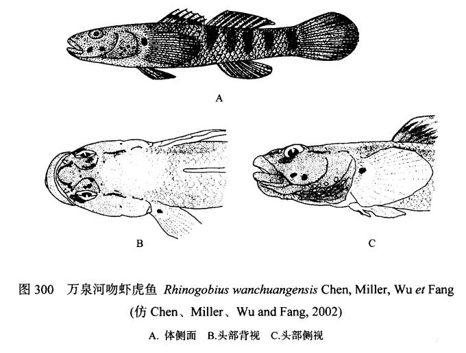

体延长，前部稍平扁，后部侧扁；背缘浅弧形隆起，腹缘稍平直；尾柄长，其长等于体高。头中大，圆钝，前部宽而平扁（雄鱼）或稍侧扁（雌鱼），背部稍隆起，头宽大于头高。眼间隔颇狭窄，为眼径的1/3，稍内凹。唇略厚，发达。舌游离，前端圆形。鳃孔大，侧位，向头部腹面延伸，止于鳃盖骨下缘近中部处。体被大栉鳞，头的吻部、颊部、鳃盖部无鳞。背鳍前鳞区的后部具小圆鳞，背鳍前鳞区的前缘呈三叉形。腹部中央鳞区具小圆鳞，但不延伸至腹鳍后缘。腹鳍前区及胸鳍基部均无鳞。无侧线。胸鳍宽大，圆形，下侧位，鳍长大于吻后头长，其后缘不伸达肛门上方。腹鳍略短于胸鳍，圆形，左、右腹鳍愈合成一吸盘。尾鳍长圆形，短于头长。头、体呈浅色，体侧具7～8条长方形黑灰色的宽横带，背侧由项部至尾柄部具5个灰色斑块。体侧每一鳞袋无暗色边缘，腹部浅色或亮黄色。颊部及鳃盖中部无灰色条纹。颊部下缘具2个卵圆形、黑色圆斑。鳃盖膜暗灰色，具8～13个橘红色小圆斑。项部无明显斑纹。臀鳍橙色，雄鱼具1纵行红褐色小点，雌鱼浅色，边缘呈灰色。胸鳍浅色或暗灰色，基部具一黑褐色圆斑。雄鱼腹鳍暗黑色，雌鱼腹鳍浅灰色。尾鳍灰黑色，雄鱼的尾鳍无暗褐色小斑，雌鱼的尾鳍具4列垂直灰黑色圆点。为河、溪小型底层鱼类。无食用价值。分布于海南万泉河水系。为海南特有种。p630

## 仙水吻虾虎鱼

Rhinogobius xianshuiensis  Chen, Wu & Shao, 1999

http://www.fishbase.org/summary/54315

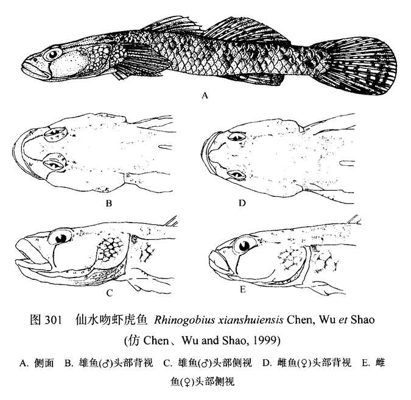

体颇延长，前部亚圆筒形，稍平扁，后部侧扁；背缘浅弧形隆起，腹缘稍平直；尾柄长，其长等于体高。头大，圆钝，亚圆筒形，前部宽而稍平扁，背部稍隆起，头宽大于头高。眼中大，背侧位，位于头的前半部，眼上缘突出于头部背缘，眼下缘无放射状感觉乳突线。唇略厚，发达。舌游离，前端圆形。鳃孔大，侧位，向头部腹面延伸，止于鳃盖骨下缘近中部处。体被大栉鳞。头的吻部、颊部、鳃盖部无鳞。胸鳍和腹鳍前部区域裸露。背鳍前鳞区和腹部具小圆鳞，背鳍前鳞区的前缘呈三叉形。无侧线。腹鳍略短于胸鳍，圆形，左、右腹鳍愈合成一吸盘。尾鳍长圆形，短于头长。头、体呈亮褐色，活时为金黄色。体侧具6～7个方形暗灰色的宽斑块，背侧亦具6～7个大圆亮斑；体侧无灰褐色垂直宽条纹。体侧每一鳞袋后缘暗褐色。颊部和鳃盖骨部无蠕虫形红褐纹。头部眼睛附近具2条深黑色条纹。雄鱼臀鳍橘色，具亮黄色小圆点，近边缘处具黑色条纹；雌鱼的为亮黄色或白色。胸鳍基部黄色，密具珠色小圆斑。尾鳍基具水平状短黑纹，尾鳍透明，具4～6行由褐色圆点组成的垂直条纹。为河、溪小型底层鱼类。无食用价值。分布于福建木兰溪水系。为中国特有种。p631

## 瑶山吻虾虎鱼

Rhinogobius yaoshanensis  (Luo, 1989)

http://www.fishbase.org/summary/60224

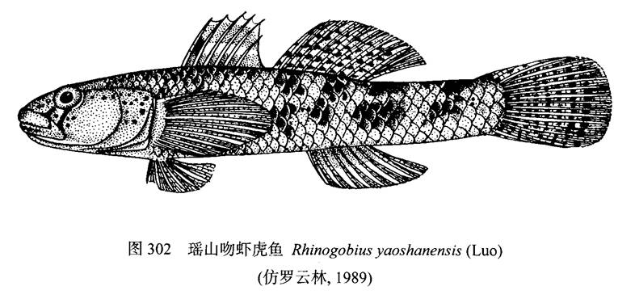

体延长，前部近圆筒形，后部侧扁；背部浅弧形隆起，腹缘稍平直；尾柄颇长，其长等于或稍大于体高。头中大，圆钝，前部宽而平扁，背部稍隆起，头宽大于头高。头部具5个感觉管孔。颊部稍凸出，具3纵行感觉乳突线。雄鱼吻短而圆钝，雌鱼稍尖，吻长稍大于眼径。眼间隔稍宽，小于眼径，微内凹。口中大，前位，斜裂。两颌约等长。上颌骨后端伸达眼前缘下方或稍后。唇略厚，发达。舌游离，前端近圆形。鳃孔大，侧位，向头部腹面延伸，止于前鳃盖骨后缘下方稍后处。被中大弱栉鳞，头的吻部、颊部、鳃盖部无鳞。背鳍中央前方具10～12枚背鳍前鳞，向前仅伸达项部的4/5处，两眼间隔后方有一小片裸露区。胸部及腹部被小圆鳞；胸鳍基部无鳞。无侧线。胸鳍宽大，圆形，下侧位，鳍长约等于吻后头长，后缘几乎伸达肛门上方。腹鳍短于胸鳍，圆盘状，膜盖发达，边缘弧形凹入，左、右腹鳍愈合成一吸盘。头、体呈棕褐色。体侧有5～6个暗斑，跨越背部。头部在眼前下缘有2条斜带：一条自眼前缘至上唇；另一条自眼前缘至口角，颊部常具褐色小点。各鳍呈灰黑色，雄鱼的背鳍、臀鳍、尾鳍边缘为浅灰色，第一背鳍第一至第二鳍棘之间的鳍膜上有1个小黑点。雄鱼第二背鳍、尾鳍具点状条纹数行，臀鳍浅灰色，腹鳍灰黑色。生活于南部山区河、溪中游的小型底层鱼类。不常见，无食用价值。分布于广西大瑶山、金秀等河、溪中。为中国特有种。p633

## 宽带裂身虾虎鱼

Schismatogobius ampluvinculus  Chen, Shao & Fang, 1995

http://www.fishbase.se/summary/27076

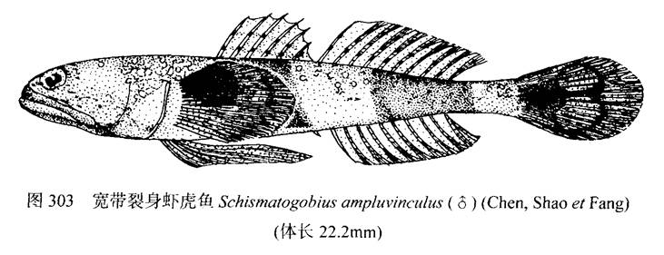

体颇延长，前部亚圆筒形，后部侧扁；背缘和腹缘稍平直；尾柄较长，大于体高的1/2。头中大，前部略平宽。头宽大于头高，背部稍隆起。头部具3个感觉管孔。颊部圆凸，稍隆起，散具若干个感觉乳突。眼中大，上侧位，眼上缘突出于头部背缘。全身皆裸露，无鳞。无侧线。胸鳍宽大，长圆形，中侧位，雄鱼的胸鳍末端几乎可达肛门上方。腹鳍小，略短于胸鳍，长圆形，基底长小于腹鳍全长的一半，左、右腹鳍愈合成一大型吸盘。尾鳍长，等于头长。体呈乳黄色，腹面乳白色，体侧具有2条宽大黑色横带：第一条位于第一背鳍基下方；第二条位于第二背鳍基下方。尾鳍基部具一黑斑。体侧横带间隔区上半部，具许多褐色网纹。口内部橙红色。头部侧面有大型黑斑，头项背部至背鳍起点前具褐色网纹。各鳍灰白而透明，第一背鳍近基部具1条黑色线纹；第二背鳍具2～3列黑色细点。尾鳍具有2个椭圆形白色斑块。臀鳍灰白。胸鳍上半部具1个大型黑纵斑，斑点宽度达鳍的1/2。为暖水性小型鱼类，喜栖息于河水清澈小溪流的砾石栖地中。不好游动，常与周围的石砾形成极佳的保护性。肉食性鱼类，以小型水生昆虫为食。体长30～40mm。数量极少。分布于台湾。p636

## 罗氏裂身虾虎鱼

Schismatogobius roxasi  Herre, 1936

http://www.fishbase.org/summary/23652

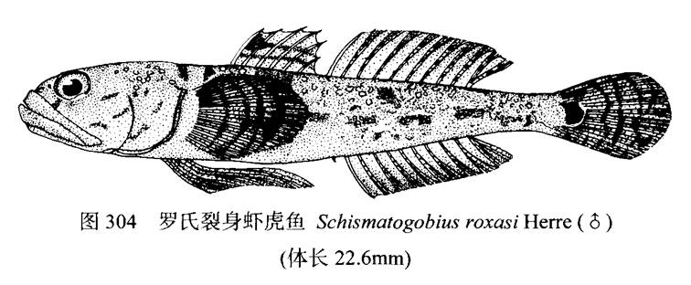

体颇延长，前部呈圆筒形，后部侧扁；背缘和腹缘稍平直；尾柄颇长，大于体高的1/2。头中大，前部稍平扁，头宽大于头高，背部稍隆起。眼间隔狭窄，稍内凹，小于眼径。唇略厚，发达。舌游离，前端分叉为2叶。鳃孔大，侧位，向头部腹面延伸，止于前鳃盖骨后缘下方。全身皆裸露，无鳞。无侧线。腹鳍略短于胸鳍，长圆形，基底长小于腹鳍全长的一半，左、右腹鳍愈合成一吸盘。尾鳍长圆形，等于头长。体呈乳黄色，腹面乳白色，体侧无宽阔黑横带，但其上半部隐具4个黑色细斑块：第一个斑块位于第一背鳍基下方；第二、三个斑块位于第二背鳍基部下方；第四个斑块位于尾鳍基部上方。斑块的间隔区具褐色网纹。体侧下半部具有许多不规则黑色纵斑。各鳍浅黄而透明，第一背鳍前部具1个黑斑；第二背鳍具2～3列黑色细点。尾鳍隐具2个椭圆形白色斑块。臀鳍灰白。胸鳍无大型黑斑，具3～5列垂直排列的黑色线纹。为暖水性小型鱼类，喜栖息于清澈小溪流之砾石栖地中。不好游动，但对溶氧量的需求较高，多生活于浅懒区。属于肉食性鱼类，以小型水生昆虫为食。体长30～40mm，大者可达60mm。分布于台湾。p637

## 条纹狭虾虎鱼

Stenogobius genivittatus  (Valenciennes, 1837)

http://www.fishbase.org/summary/9997

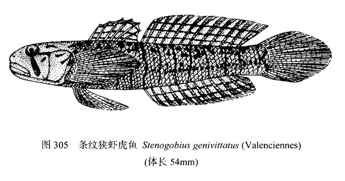

体延长，侧扁；背缘浅弧形，腹缘稍平直；尾柄较高。头中大，短而高，侧扁，背部稍隆起，头高大于头宽。颊部凸出。颊部具2纵行感觉乳突线。吻圆钝，较短，前端宽，向前突出于上颌的稍前方，背部隆起，吻长大于眼径。眼中大，背侧位，眼上缘突出于头部背缘。口中大，亚前位，稍斜裂，上、下颌几乎相等，不突出。上颌骨后端伸达眼前缘下方。唇薄，发达。舌稍游离，前端圆截形，小部分游离，大部分附于口底。鳃孔大，侧位，向头部腹面延伸，止于胸鳍基部下方稍后处。体被中大弱栉鳞，头的吻部、颊部及鳃盖部均无鳞。眼后项部被小圆鳞，胸部及腹部被小圆鳞；项部的圆鳞向前不延伸至眼后方，在眼后方有一裸露区。无侧线。腹鳍略短于胸鳍，圆形，位于胸鳍基部稍后下方，其基底长小于腹鳍全长的一半，左、右腹鳍愈合成一吸盘，向后不伸达肛门。头、体呈浅棕色，背部色深，腹部浅色。体侧每一枚鳞片边缘呈灰黑色，体侧中央有1条波状（断续的）纵带，另有13～14条长短参差的黑色细横条纹。眼中部下方有1条黑色斜横带，向后经过颊部斜向前鳃盖骨的后下缘。尾鳍上部无点、列形成的条纹。背鳍和臀鳍各具3～4条由点、列构成的条纹。为热带、亚热带河溪生活的底层小型鱼类，栖息于河川中、下游的淡水缓流区域，或者是水质较清澈的河口咸、淡水交界水域。不常游动，游动时姿态优雅。杂食性，喜好以水生昆虫、小型甲壳类及有机碎屑为食。数量少，无食用价值。分布于台湾的淡水河、溪中。p639

## 眼带狭虾虎鱼

Stenogobius ophthalmoporus  (Bleeker, 1853)

http://www.fishbase.org/summary/25114

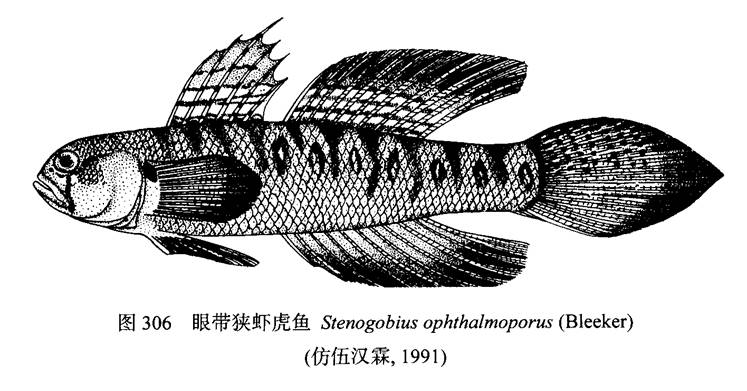

体延长，侧扁；背缘浅弧形，腹缘稍平直；尾柄较高。头中大，短而高，侧扁，背部稍隆起，头高大于头宽。颊部凸出。颊部具2纵行感觉乳突线。吻圆钝，较短，前端宽，向前突出于上颌的稍前方，背缘隆起，吻长等于或稍大于眼径。眼中大，背侧位，眼上缘突出于头部背缘。唇薄，发达。舌稍游离，前端圆截形，小部分游离，大部分附于口底。鳃孔大，侧位，向头部腹面延伸，止于胸鳍基部下方稍后处。体及鳃盖部被中大弱栉鳞，头的项部及颊部被圆鳞。背鳍前方具鳞，无裸露区。胸部及腹部被小圆鳞；项部的圆鳞向前延伸至眼后方。无侧线。腹鳍略短于胸鳍，圆形，位于胸鳍基部稍后下方，其基底长小于腹鳍全长的一半，左、右腹鳍愈合成一吸盘，向后伸达肛门。头、体呈浅棕色，背部色深，腹部浅色。体侧具7～9条灰色横带，有时横带不显著，呈云状斑块。眼中部下方具1灰黑色横带，向下伸达口角，有时横带不明显。第一、第二背鳍各具3～4条黑色纵纹，尾鳍上部具数行由点、列形成的条纹。胸鳍上方的基部具1个长形黑斑，其余各鳍灰黑色。为热带、亚热带河、溪生活的底层小型鱼类，栖息于河川中、下游水质清澈的淡水或河口咸、淡水交界处的泥沙底水域。杂食性，喜食水生昆虫、小型甲壳类及有机碎屑。数量少，无食用价值。体长100～130mm，最大可达140mm。分布于海南、台湾。p641

## 日本瓢鳍虾虎鱼

Sicyopterus japonicus  (Tanaka, 1909)

http://www.fishbase.org/summary/23724

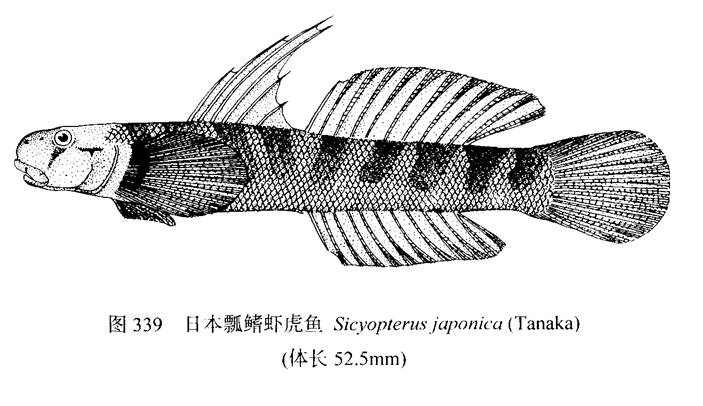

体延长，前部圆筒形，后部侧扁；背缘浅弧形，腹缘稍平直；尾柄较高，其长稍小于体高。头中大，圆钝，前部宽而略平扁，背部稍隆起，头宽小于头高。吻宽，圆团状，吻端圆钝，前突，具吻褶，几乎包住上唇，吻长大于眼径，为眼径的2.1～2.5倍。眼较小，上侧位，位于头的前半部，眼上缘突出于头部背缘。眼间隔较宽，大于眼径，为眼径的2.5～2.8倍，稍内凹。上唇肥厚，发达，且较下唇突出。舌游离，前端圆形。鳃孔较狭，侧位，向头部腹面延伸，止于胸鳍基部下缘附近。鳃盖及前鳃盖骨后缘光滑，无棘。体被细小栉鳞，头的吻部、颊部、鳃盖部无鳞。项部在背鳍中央前方具小鳞，向前伸达鳃盖骨中部卜方。胸部、胸鳍基部及腹部均无鳞。无侧线。体色呈黄褐色或褐色，体侧约有10条黑褐色横带，体前部第二背鳍起点前方的各横带向后方下斜，体后部在第二背鳍起点后方各横带则向前下斜。各鳍呈褐色，第二背鳍具许多列黑褐色斑点，雄鱼则较不明显；雌鱼臀鳍外缘有1水平向黑色线纹，雄鱼则无。眼下方有1斜向上颌后部的黑色横纹。
为典型的中小型河、海洄游鱼类，也属于溯河产卵洄游鱼类。溯河能力很强，若无水库或大型拦河坝的拦阻，可上溯至溪、河中、上游水域，至离河口超过50 km的上游区。在溪、河的中、上游产卵，孵化后的仔鱼具较长的浮游期，随溪流漂送到河口或海洋中生长，两三个月后，待其具有溯游能力时，便成群地洄溯到溪、河里，往上游区的栖所溯游。成鱼喜栖息于湍息的獭区及潭头水域中，以便利用溪底岩面上的附着性微藻类为食。体长70～80mm。分布于我国台湾尚未受到严重污染的河、川中，尤以东部溪流中较普遍，仍可见大量的溯河幼鱼群，西部河川受到污染，大部分族群都已消失。p720

## 宽颊瓢鳍虾虎鱼

Sicyopterus macrostetholepis  (Bleeker, 1853)

http://www.fishbase.org/summary/11824

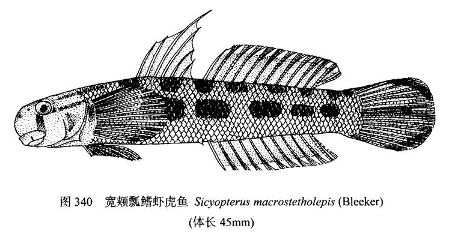

体延长，前部圆筒形，后部较侧扁；背缘浅弧形，腹缘稍平直；尾柄较高，其长稍小于体高。头中大，圆钝，前部宽而略平扁，背部稍隆起，头宽小于头高。眼间隔较宽，大于眼径，为眼径的2.4～2.7倍，稍内凹。上唇肥厚，发达，且较下唇突出。舌游离，前端圆形。鳃孔较狭，侧位，向头部腹面延伸，止于胸鳍基部下缘附近。体被细小栉鳞，头的吻部、颊部、鳃盖部无鳞。项部在背鳍中央前方具小鳞，向前伸达鳃盖骨中部上方，项部被鳞。胸部、胸鳍基部及腹部均无鳞。无侧线。体褐色或青褐色，雄性成鱼具蓝黑金属光泽，体侧上半部则有金黄色纹。体背侧有7～8个黑色斑块，体侧有6～7个云状黑斑，眼部下方有1黑褐色横纹，鳃盖的上方有2条短黑褐色纵纹。雄鱼背鳍灰黑色，雌鱼为淡黄色，其第二背鳍有2～4列黑色斑点。尾鳍上、下叶各具1暗色狭纵带，雄鱼的尾鳍金黄色，雌鱼为浅黄色。雄鱼臀鳍灰黑色，雌鱼为浅黄色，外缘具黑色线纹；胸鳍、腹鳍则皆为浅黄色。为小型河、海洄游鱼类，喜栖息在清澈而湍急的溪流中，摄食岩石表面上附生微藻类，攀爬能力很强。体长50～60mm。分布于台湾的东部、南部以及兰屿的溪流中。p722

## 环带瓢眼虾虎鱼

Sicyopus zosterophorus  (Bleeker, 1856)

http://www.fishbase.org/summary/11826

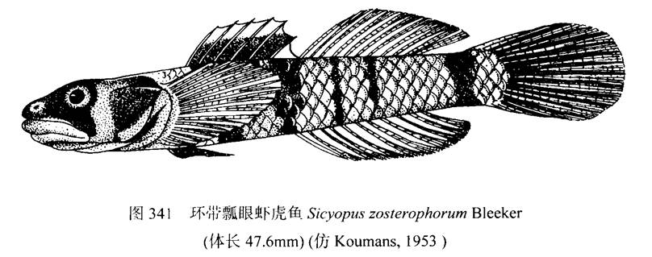

体延长，前部圆筒形，后部侧扁；背缘浅弧形，腹缘稍平直；尾柄颇高，其长大于体高。头中大，圆钝，前部宽而平扁，背部稍隆起，头宽大于头高，具5个感觉管孔。眼中大，背侧位，位于头的前半部，眼上缘突出于头部背缘。唇略厚，发达。舌宽而游离，前端圆形。鳃孔较窄小，侧位，向头部腹面延伸，仅伸达胸鳍基部下缘。体被中大弱栉鳞，后方鳞片较大，头部、胸鳍基部及胸部均裸露，无鳞。背鳍中央前方具数枚小鳞，向前不伸达鳃盖后缘上方。无侧线。腹鳍略短于胸鳍，圆形，腹鳍基底长大于腹鳍全长的1/2，左、右腹鳍愈合成一吸盘，膜盖附着于鳍棘基部后方。雌鱼体呈乳黄色，雄鱼体侧在第二背鳍第一鳍条下方的前半部为深褐色，后半部为橘红色。体背有5条黑褐色横带，由背侧环绕到腹面：前两条较宽大；体后部的3条横带较窄，前2条相互靠近，位于第二背鳍基部前半部的下方，最后一条位于尾柄基部。眼下方具有1垂直黑纹延伸至口角处。雌鱼各鳍浅黄色而透明，雄鱼呈粉红色。雄鱼第一背鳍下半叶呈褐色，延伸至第二背鳍，雄鱼臀鳍外缘黑色，尾鳍具放射状黑色线纹。为暖水性小型鱼类，生活于清澈之溪流及河、川的上游。体长50～60mm。分布于台湾岛。p724

## 紫身枝牙虾虎鱼

Stiphodon atropurpureus  (Herre, 1927)

http://www.fishbase.org/summary/51779

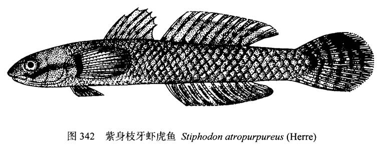

体延长，前部亚圆筒形，后部侧扁；背缘浅弧形，腹缘稍平直；尾柄颇长，其长大于其高。头略小，圆钝，前部较平扁，背部稍隆起。眼大，背侧位，眼上缘突出于头部背缘。眼下缘具6条较短的放射状感觉乳突线。口小，下位。上颌长于下颌，稍突出。体被较大栉鳞，吻部、颊部、鳃盖部、胸鳍基部及头的腹面均裸露无鳞。胸部及腹部被小圆鳞。项部由背鳍前方中央至眼间隔全部具圆鳞，其中央部分无裸露区。无侧线。腹鳍短于胸鳍，圆形，基部长仅为腹鳍长的1/2,左、右腹鳍愈合成一吸盘。尾鳍长圆形，短于头长。雄鱼体呈青黑色，体侧上部有一青色带金黄色金属光泽的纵带，自吻部前端延伸到尾鳍基部上方。体背侧的鳞片外缘呈黑色，形成网状格纹，内部金黄色。各鳍青黑色。背鳍及尾鳍具深黑色点纹。液浸标本的头、体呈紫黑色，体侧无黑色垂直横带，胸鳍前下部散具数个小黑点；雌鱼体侧背部及中部各有一条黑棕色纵带，自吻部向后伸达尾鳍基；尾鳍基部中央有1长方形黑斑。背鳍、尾鳍及臀鳍散具许多小黑点。胸鳍基部中央有1黑色条纹。
为暖水性小型底层鱼类，生活于热带、亚热带水质非常清澈的中小型山溪急流的中、下游区。性隐蔽，喜栖息在稳定水流区的潭头或潭区边缘。摄食岩石表面的藻类、小型水生昆虫及无脊椎动物。个体小，体长仅30～40mm，大者可达60mm。无食用价值，因体色鲜艳，极富观赏价值。分布于台湾东部部分溪流中。p727

## 多鳞枝牙虾虎鱼

Stiphodon multisquamus  Wu & Ni, 1986

http://fishbase.org/summary/61739

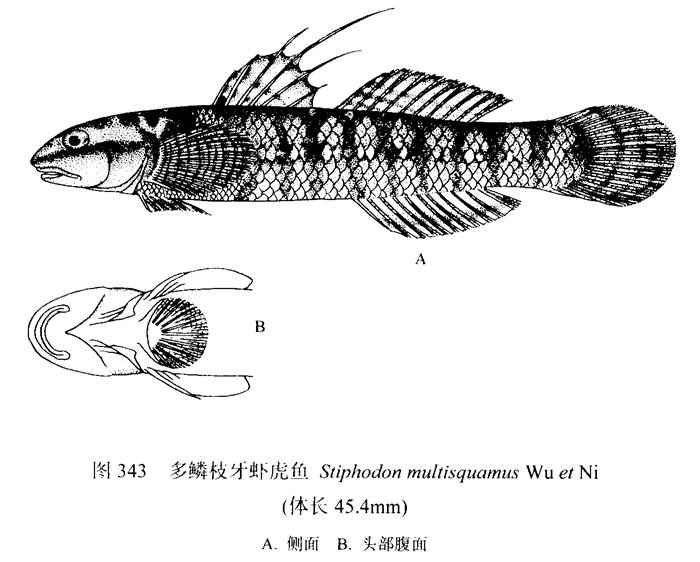

体延长，前部亚圆筒形，后部侧扁；背缘浅弧形，腹缘稍平直；尾柄中长，其长大于体高。头中大，圆钝，前部略平扁，背部稍隆起，具5个感觉管孔。颊部凸出，具2～3条分散且较短的水平状感觉乳突线。吻端圆团状，突出，吻长大于眼径，具吻褶，包住上唇。眼小，背侧位，眼上缘突出于头部背缘。唇厚，上唇很发达，下唇稍薄，平卧状。舌不游离，前端浅弧形。鳃孔狭窄，侧位，向头部腹面延伸，仅止于胸鳍基部稍下方。体被中大栉鳞，吻部、颊部、鳃盖部、胸鳍基部及头的腹面均裸露无鳞。胸部及腹部被小圆鳞。项部由背鳍前方的中央线至眼间隔之间无背鳍前鳞，裸露区大，而在中央线两侧有4～10片小鳞。无侧线。腹鳍短于胸鳍，圆形，基部长仅为腹鳍长的1/2，左、右腹鳍愈合成一吸盘。尾鳍长圆形，短于头长。体呈灰棕色，体背侧有9～10条黑色垂直横带，向下伸达体侧下方。第一背鳍起点处具1小黑点，各鳍棘灰黑色，鳍膜透明。头背自眼间隔至吻部具1深灰色区。背鳍和臀鳍灰色，无条纹。胸鳍有10余条由许多小点组成的暗色垂直横纹。腹鳍浅色。尾鳍上叶后部边缘灰白色，其余部分具10余条由点列组成的波状暗色横纹。为暖水性小型底层鱼类，生活于热带、亚热带的溪流和水库内。主要摄食附生于石上的藻类。无食用价值，可供观赏。体型较大，体长45～60mm，大者可达80mm。分布于海南。为海南特有种。p729

## 黑鳍枝牙虾虎鱼

Stiphodon percnopterygionus  Watson & Chen, 1998

http://www.fishbase.se/summary/51781

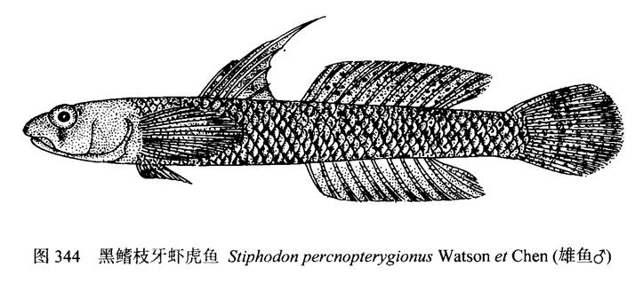

体颇延长，前部亚圆筒形，后部侧扁；背缘浅弧形，腹缘稍平直；尾柄颇长，其长大于体高。头略小，圆钝，前部较平扁，背部稍隆起。眼大，背侧位，眼上缘突出于头部背缘。眼下具6条较短的放射状感觉乳突线（图554）。眼间隔宽阔，稍平坦。唇厚，上唇颇发达，下唇稍薄，平卧状。舌不游离，前端浅弧形。体被较大栉鳞，吻部、颊部、鳃盖部、胸鳍基部及头的腹面均裸露无鳞。胸部及腹部被小圆鳞。项部由背鳍前方中央至眼间隔全部具圆鳞。尤侧线。腹鳍短于胸鳍，圆形，基部长仅为腹鳍长的1/2，左、右腹鳍愈合成一吸盘。尾鳍长圆形，等于头长。雄鱼体色变异较大，头、体呈棕色，带有金黄色或橘色的光泽；头部有蓝青色光泽，眼下具一垂直的黑纹，体侧各鳍后方具黑褐色斑。第一背鳍呈蓝黑色或暗红黑色，第二背鳍及臀鳍呈暗红色，并有深褐色点纹。胸鳍无垂直横纹。雌鱼浅黄色而透明，体侧背部及中部各有一条黑棕色纵带自吻部向后伸达尾鳍基，但背部纵带较细窄；尾鳍基部中央有时有1个垂直长方形黑斑。
为暖水性小型底层鱼类，生活于热带、亚热带水质非常清澈的山溪急流的中、下游区。喜在稍缓流的潭头或潭区边缘活动。雄鱼受惊吓时体色会产生变化。常攀附在岩石面上摄食附着性的藻类、小型水生昆虫及无脊椎动物、无食用价值，因体色鲜艳，极富观赏价值。分布于台湾南部的恒春及东部的兰屿等河川上、中游。p730

## 小黄黝鱼

Micropercops swinhonis  (Günther, 1873)

http://www.fishbase.se/summary/68232

体延长，颇侧扁；背缘浅弧形，腹缘稍平直；尾柄颇长，小于体高。头中大，较尖，颇侧扁，背部稍隆起。头部具感觉管及5个感觉管孔。吻尖突，颇长，吻长小于或大于眼径。眼大，背侧位，眼上缘突出于头部背缘。眼间隔狭窄，稍内凹，稍小于眼径。唇略厚，发达。舌游离，前端浅弧形。鳃孔大，侧位，向头部腹面延伸，伸达眼中部下方。体被中大栉鳞，头部、前鳃盖骨前部被圆鳞，鳃盖骨被小栉鳞，吻部和眼间隔处无鳞。胸部和胸鳍基部被小圆鳞。无侧线。胸鳍宽圆，下侧位，鳍长约等于吻后头长，后缘几乎伸达肛门上方。腹鳍略短于胸鳍，圆形，左、右腹鳍分离，不愈合成一吸盘。尾鳍长圆形，短于头长。头、体灰褐带浅棕色，背部色较深，体侧中央具12～16条暗色横带，横带成对排列，眼前下方至口角上方具1暗纹。鳃盖膜和背鳍灰黑色。背鳍的第二至第六鳍棘的中部鳍膜黑色，形成1较长黑纹。第二背鳍具2行由黑点排列成的纵纹。尾鳍具6行黑色横纹。臀鳍暗灰色。胸鳍和腹鳍灰白色。胸鳍基的前上方具1细长黑斜纹。
为淡水小型底栖鱼类，常成群生活于河溪、池塘、湖沼的浅水水域的中、下层及入湖溪流的水草丛中，喜潜伏于水底，以浮游动物、水生昆虫、摇蚊幼虫、小虾、硅藻、绿藻、丝状藻类等为食。个体小，最大个体为61mm。种群数量大，但无食用价值，可作为凶猛鱼类的活饵料。广泛分布于东北、华北、华东、华南、华中、西南部各地淡水河川及溪流中。为中国特有种。p142

## 萨氏华黝鱼

Sineleotris saccharae  Herre, 1940

http://www.fishbase.org/summary/62848

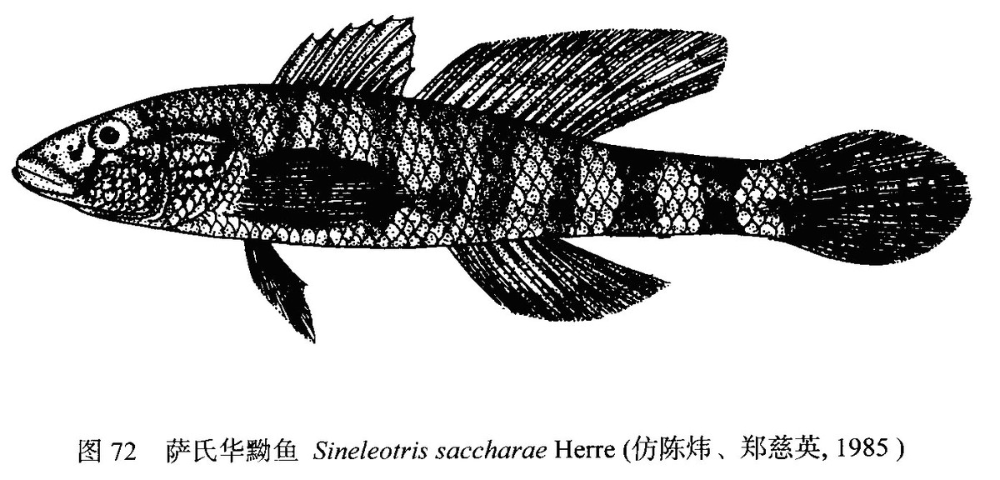

体延长，颇侧扁；背缘浅弧形隆起，腹缘稍平直；尾柄颇长，小于体高。头中大，较尖，甚为侧扁，背部稍隆起。头部具7个感觉管孔。吻尖突，颇长。眼小，背侧位，眼上缘突出于头部背缘。眼间隔狭窄，稍内凹，小于眼径。唇略厚，发达。舌窄长，游离，舌端稍呈平截形。鳃孔大，侧位，向头部腹面延伸，止于眼中部下方。体侧及尾部均被中大栉鳞，头部除吻部无鳞外，颊部、前鳃盖部、项部及胸腹部均被细小的圆鳞，鳃盖部被较大的栉鳞。无侧线。左、右腹鳍不愈合成一吸盘。尾鳍长圆形，短于头长。头、背及吻部为暗褐色，头侧浅色。体灰褐色，背部色较深，腹部灰色。体侧有数条暗色较狭横带。眼前下方至口角上方有1暗纹。鳃盖骨后上角有1个较大的黑圆斑。鳃盖膜和背鳍为灰黑色，背鳍第二至第六鳍棘的中部鳍膜为黑色，形成一长黑纹，第二背鳍有2行由黑点排列成的纵纹；臀鳍暗灰色；胸鳍和腹鳍灰白色。尾鳍有5～6行黑色横纹。
为淡水小型底栖鱼类，栖息于河川、小溪中。体长70～80mm。数量极少，属于稀有种类，为濒危物种。广东（韩江、龙津河、东江、漠阳江水系）。为中国特有种。p162

