中国原生鱼：吻虾虎鱼图鉴
---

<!-- TOC -->

- [前言](#前言)
- [明潭吻虾虎鱼](#明潭吻虾虎鱼)
- [波氏吻虾虎鱼](#波氏吻虾虎鱼)
- [戴氏吻虾虎鱼](#戴氏吻虾虎鱼)
- [细斑吻虾虎鱼](#细斑吻虾虎鱼)
- [溪吻虾虎鱼](#溪吻虾虎鱼)
- [丝鳍吻虾虎鱼](#丝鳍吻虾虎鱼)
- [台湾吻虾虎鱼](#台湾吻虾虎鱼)
- [颊纹吻虾虎鱼](#颊纹吻虾虎鱼)
- [大吻虾虎鱼](#大吻虾虎鱼)
- [子陵吻虾虎鱼](#子陵吻虾虎鱼)
- [恒春吻虾虎鱼](#恒春吻虾虎鱼)
- [红河吻虾虎鱼](#红河吻虾虎鱼)
- [兰屿吻虾虎鱼](#兰屿吻虾虎鱼)
- [李氏吻虾虎鱼](#李氏吻虾虎鱼)
- [雀斑吻虾虎鱼](#雀斑吻虾虎鱼)
- [陵水吻虾虎鱼](#陵水吻虾虎鱼)
- [刘氏吻虾虎鱼](#刘氏吻虾虎鱼)
- [斑带吻虾虎鱼](#斑带吻虾虎鱼)
- [密点吻虾虎鱼](#密点吻虾虎鱼)
- [名古屋吻虾虎鱼](#名古屋吻虾虎鱼)
- [南渡江吻虾虎鱼](#南渡江吻虾虎鱼)
- [南台吻虾虎鱼](#南台吻虾虎鱼)
- [短吻红斑吻虾虎鱼](#短吻红斑吻虾虎鱼)
- [神农吻虾虎鱼](#神农吻虾虎鱼)
- [四川吻虾虎鱼](#四川吻虾虎鱼)
- [万泉河吻虾虎鱼](#万泉河吻虾虎鱼)
- [仙水吻虾虎鱼](#仙水吻虾虎鱼)
- [瑶山吻虾虎鱼](#瑶山吻虾虎鱼)
- [褐吻虾虎鱼](#褐吻虾虎鱼)
- [周氏吻虾虎鱼](#周氏吻虾虎鱼)

<!-- /TOC -->

## 前言

本文链接：[https://github.com/mcxiaoke/biology](https://github.com/mcxiaoke/biology)

本文按《中国动物志鲈形目虾虎鱼亚目》的顺序整理，资料来自：

- [中国动物志数据库](http://www.zoology.csdb.cn/page/showTreeMap.vpage?uri=cnfauna.tableTaxa)
- [国家水产种质资源平台](http://www.fishinfo.cn/searcher_indexpage.jsp?urltype=tree.TreeTempUrl&wbtreeid=1029)
- [FishBase鱼类数据库](http://fishbase.org/search.php)
- [SeriouslyFish信息库](http://www.seriouslyfish.com/)

## 明潭吻虾虎鱼

Rhinogobius candidianus  (Regan, 1908) (台湾)

台湾河川溪流中、上游地区的优势小型鱼类，大多成群栖息在潭区或懒区的岩石上。繁殖时期，成鱼会有明显的领域性。属于肉食性鱼类，以小鱼、水生昆虫及小虾、蟹为食。分布于台湾东北部、北部及中部的溪流上游水域。为台湾省特有种。

头宽大于头高。颊部凸出。吻短而圆钝，吻长大于眼径。眼较小，眼上缘突出于头部背缘。唇略厚，发达。体被中大弱栉鳞，前部鳞小，后部鳞较大。无侧线。尾鳍长圆形，短于头长。

体呈黄褐色或深褐色，部分个体体侧具不太明显的斑块，鳞片基部有暗淡橘色斑点。雄鱼颊部及鳃盖无斑点；雌鱼通常不具斑点，但有少数个体在前鳃盖骨后缘具不明显斑点。吻部有红色线纹，项部具数条横向褐纹。背鳍棘皆呈红褐色，鳍膜呈灰棕色，无斑点；第一背鳍前2鳍棘的鳍膜上半部前缘呈黄色，第二背鳍外缘呈黄色；尾鳍灰棕色，外缘黄色；胸鳍灰褐色，靠近鳍基部有2～3条红棕色横线，在雌鱼基部上缘有1个黑斑。

## 波氏吻虾虎鱼

Rhinogobius cliffordpopei  (Nichols, 1925)

淡水性小型底层鱼类，体长一般为20-30mm，喜生活于底质为沙地、砾石和贝壳等的湖岸、河溪中的浅滩区，伏卧水底，做间隙性缓游。也经常在水的中、上层逆水徊游。分布于辽河、黄河、长江、钱塘江、珠江等水系。为中国特有种。

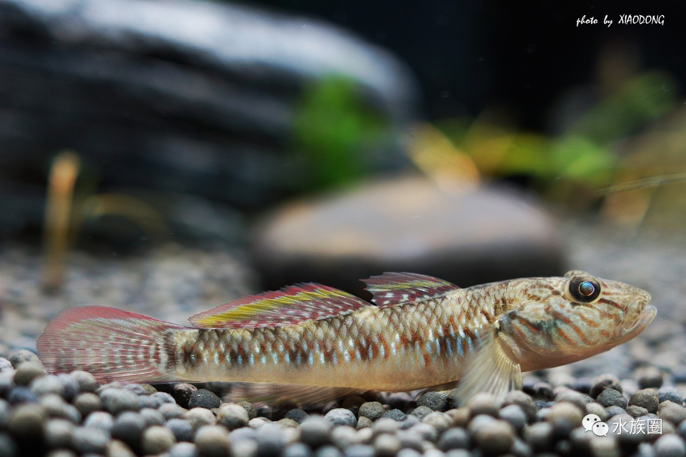
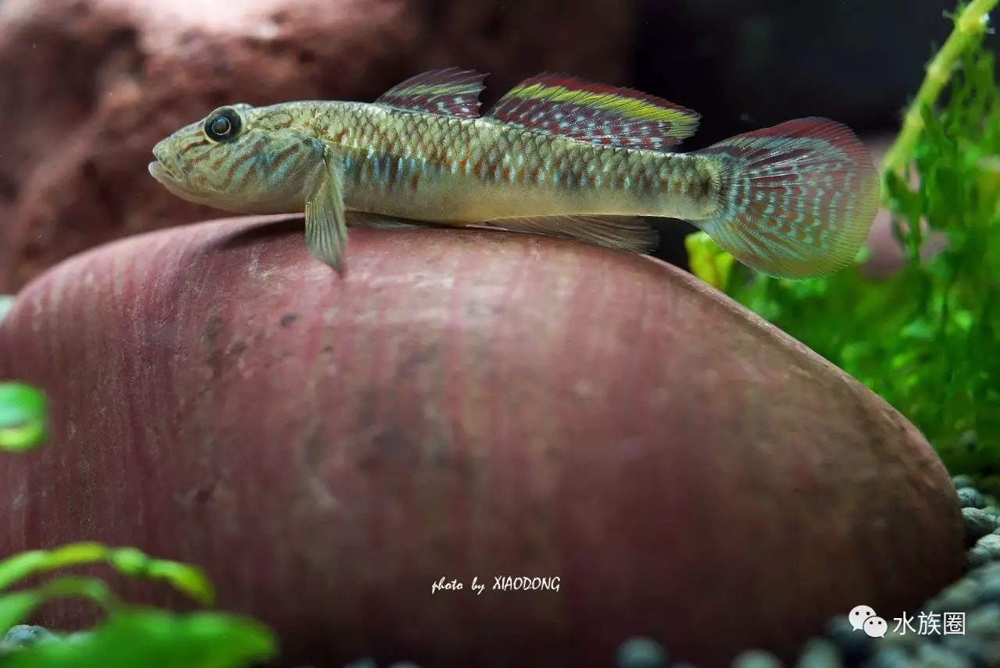
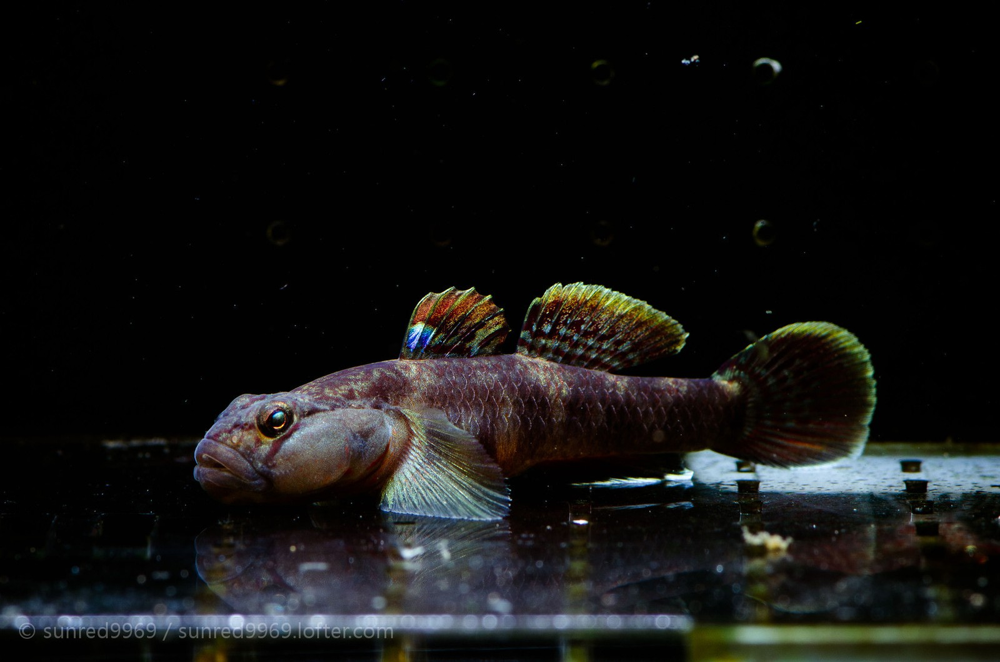

背缘浅弧形。吻圆钝，颇长，吻长大于眼径。眼中大，背侧位，眼上缘突出于头部背缘。眼间隔狭窄，其宽小于眼径，稍内凹。口小，前位，斜裂。两颌约等长。唇略厚，发达。体被中大弱栉鳞。尾鳍长圆形，短于头长。

头、体呈灰褐色，背部暗色，腹部浅色。体侧具6～7条深褐色横带或斑块。雌、雄鱼第一背鳍第一与第二鳍棘间的鳍膜上具1蓝黑色大斑点，有时雌鱼的不明显。各鳍灰褐色。有的个体两背鳍和胸鳍的上缘均呈淡灰色。头的腹面黑褐色。

## 戴氏吻虾虎鱼

Rhinogobius davidi  (Sauvage & Dabry de Thiersant, 1874)

淡水小型底层鱼类，栖息于江、河、池、沼的底层。摄食底栖无脊椎动物。不常见，无食用价值。分布于浙江、福建各水系。为中国特有种。

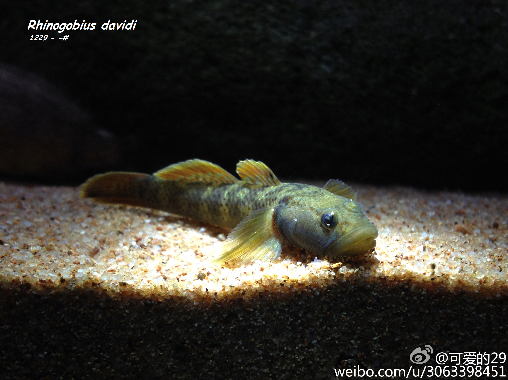
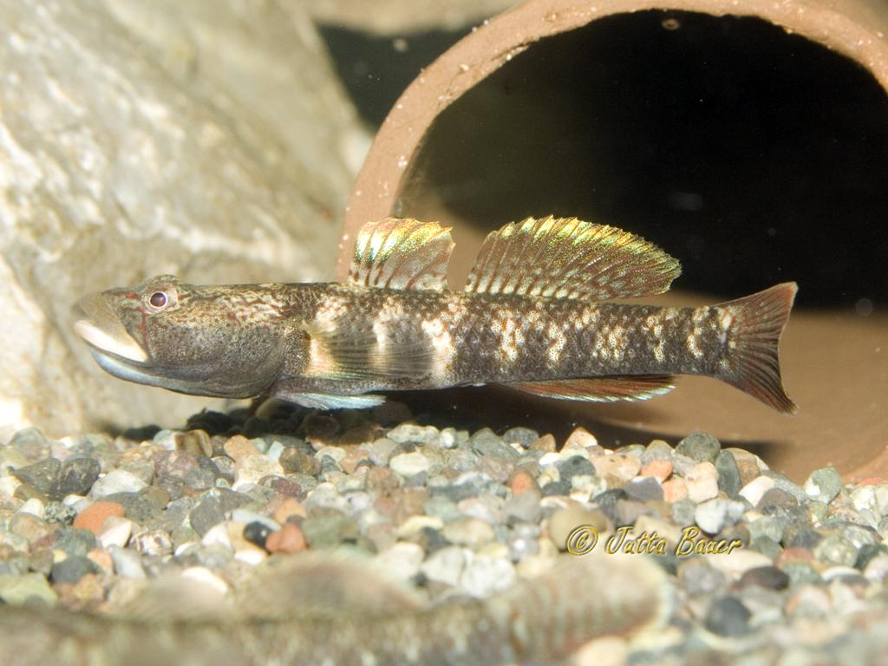

尾柄颇长，其长大于体高。雄鱼颊部颇凸出。吻圆钝，颇长，吻长大于眼径。眼中大，位于头的前半部，眼上缘突出于头部背缘。眼间隔宽阔，宽大于眼径，稍内凹。唇略厚，颇发达。尾鳍长圆形，短于头长。

头、体呈浅棕色，腹部白色。体侧隐具6～7个不规则黑斑。头部眼睛附近具2条深黑色条纹：一条自眼前缘向前伸达吻端，与对侧的形成“U”形纹；另一条黑色条纹很长，由眼下缘向下为1垂直伸向口角处的黑纹。颊部及鳃盖部无斑纹。雄鱼的鳃盖膜边缘为褐色。雄鱼的第一背鳍第一至第三鳍棘的基部有1个黑斑，第二背鳍、臀鳍及尾鳍鳍膜无斑点，尾鳍基具一垂直条斑，胸鳍基部灰褐色，下方具1半月形浅色区。雌鱼的第一、第二背鳍具3～5列小黑点，第一背鳍第三鳍棘的前方下半部具1个黑斑，尾鳍具6～8行垂直褐斑，基部具2个褐斑，胸鳍基部黑褐色，具1半月形浅色区。

## 细斑吻虾虎鱼

Rhinogobius delicatus  Chen & Shao, 1996 (台湾)

生活于河川溪流的中、上游的小型鱼类，大多成群出现在岩砾或石缝中。成鱼有护卵行为。肉食性，以水生昆虫、小虾为食。数量极少，属于稀有种类，为濒危物种。分布于台湾花莲、台东的溪流中。为台湾省特有种。

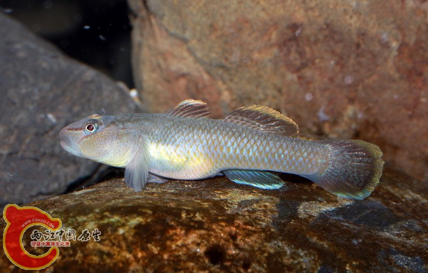

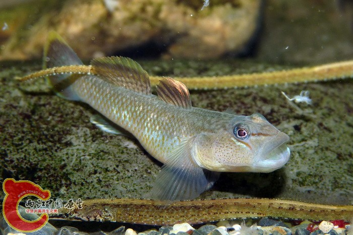

前部圆筒形。头宽大，圆钝。颊部凸出。吻短而圆钝，吻长大于眼径，雄鱼吻部较雌鱼为长。眼较小，背侧位。眼间隔的宽小于眼径，稍内凹。唇肥厚，发达。体被中大弱栉鳞。胸鳍宽大，椭圆形，下侧位。腹鳍略短于胸鳍，圆盘状。

体呈褐色或黑褐色，体侧上半部鳞片基部为黑褐色，各鳞外缘颜色较深。雌鱼通常在体侧中央鳞列处具一列深褐色点纹，延伸至尾鳍基部，成熟雌鱼腹部为黄色。胸、腹部较白；颊部密布黑褐色细点，雄鱼的斑点多于雌鱼，可超过100个以上，雌鱼则在30～50个之间；眼前方及眼下方各有1褐色斜纹。背鳍褐色或黑褐色，第二背鳍具3～5列灰黑色点纹，最外缘呈黄色；尾鳍褐色或深褐色，有6～8列垂直向的灰黑色点纹，雌鱼尾鳍基部有2个分离的黑斑；臀鳍灰褐色，外缘黄色；胸鳍灰褐色，其基部上方有1个黑斑及1条垂直黑褐色弧形纹；腹鳍黑褐色。

## 溪吻虾虎鱼

Rhinogobius duospilus  (Herre, 1935)

暖水性小型底层鱼类，栖息于南方各淡水河川中。无食用价值。分布于珠江、闽江水系及海南各河溪。为中国特有种。

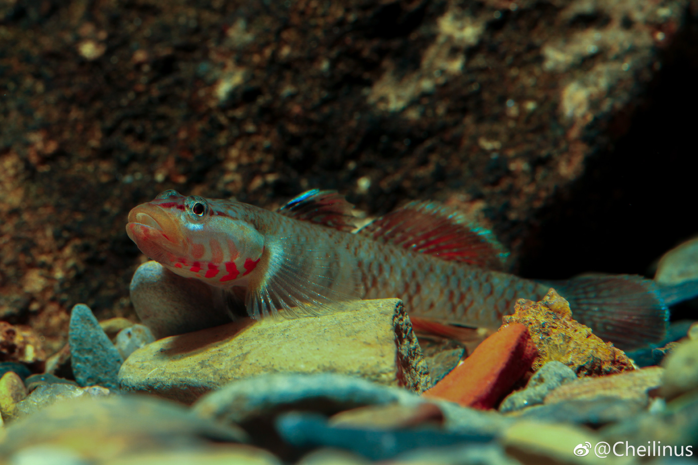

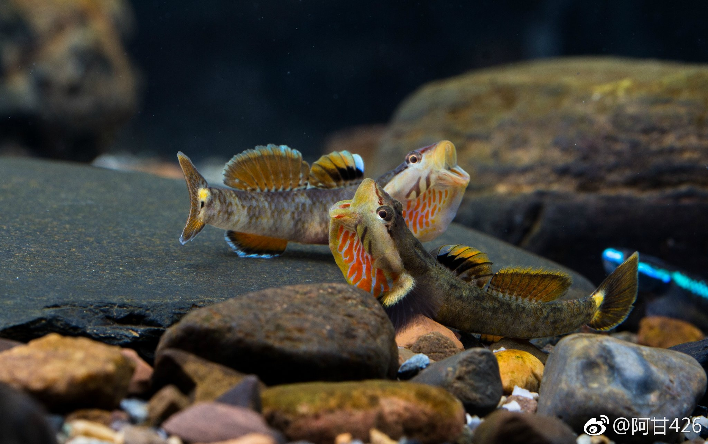
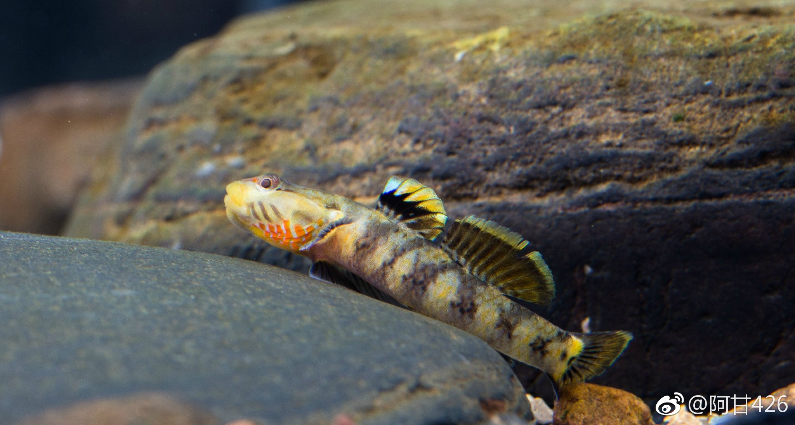

背缘浅弧形隆起。头中大，稍平扁。吻短而圆钝，唇略厚，发达。体被中大弱栉鳞。腹鳍略短于胸鳍，长圆形。尾鳍长圆形，短于头长。

头、体呈灰褐色，腹部浅色，体侧有6个暗色斑块，列成1纵行，最后面的斑块在尾鳍基底中部；头部在吻端经眼至鳃盖后上方有1暗色纵纹；颊部有3条斜向后下方的暗色条纹，伸达前鳃盖骨下方；头部腹面鳃盖膜密布浅色的小圆点，第一背鳍灰色，前部的第一至第三鳍棘的鳍膜上有1个大黑斑；第一背鳍、尾鳍、胸鳍、腹鳍呈灰黑色；胸鳍基部上、下方有2个小黑斑；臀鳍黑色，边缘浅色。

## 丝鳍吻虾虎鱼

Rhinogobius filamentosus  (Wu, 1939)

淡水小型底层鱼类，栖息于江河支流及小溪中。不常见。无食用价值。分布于西江及北江的支流。为中国特有种。

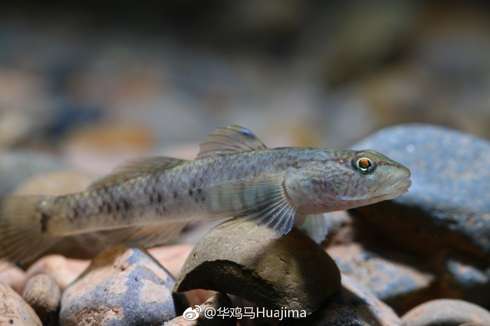

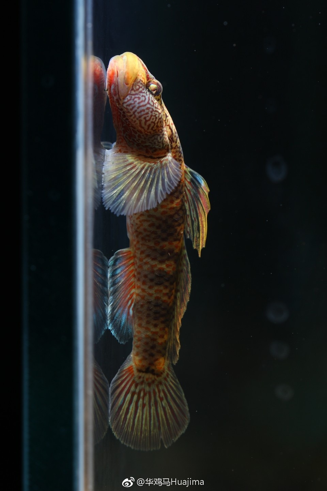

背缘浅弧形。头中大，圆钝，背部稍隆起。吻短而圆钝，吻长稍大于眼径。唇略厚，发达。体被中大弱栉鳞。胸鳍宽大，圆形，下侧位。腹鳍略短于胸鳍，圆盘状。尾鳍长圆形，短于头长。

头、体呈棕褐色，体侧有6～7条暗色横带，头部背面有网状细纹，颊部常有伸向腹面的细条纹。雄鱼第一背鳍第一至第三鳍棘间的鳍膜下方有1长圆形黑斑，边缘浅色，雌鱼无黑斑。第二背鳍有数行点状条纹，有时不明显。臀鳍灰黑色，边缘浅色。胸鳍、腹鳍灰色。尾鳍具数行点状条纹或呈灰黑色。

## 台湾吻虾虎鱼

Rhinogobius formosanus  Oshima, 1919 (台湾)

溪流中的小型鱼类。分布于台湾北部的溪流中。为台湾省特有种。

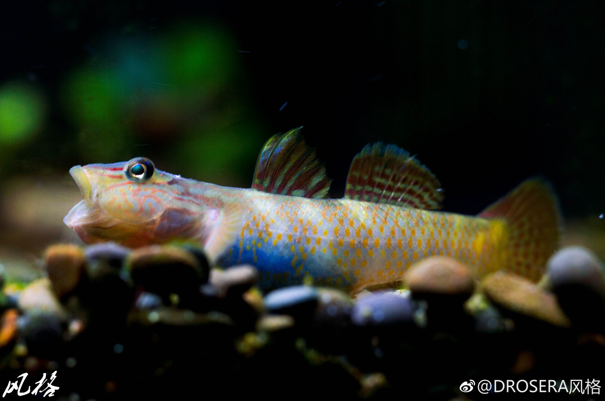
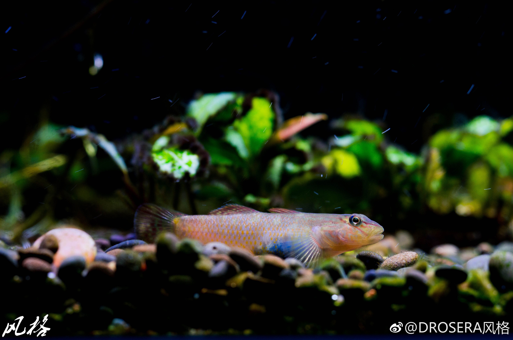
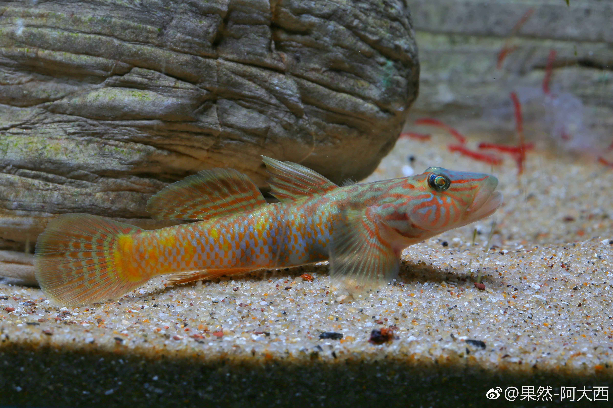

又名台湾名古屋吻虾虎鱼。

前部亚圆筒形，后部侧扁。头中大，圆钝。颊部凸出。吻短而尖，吻长大于眼径，约与下颌等长。眼较小，背侧位，位于头的前半部，眼上缘突出于头部背缘。唇肥厚，发达。体被中大弱栉鳞，后半部鳞片较大。胸鳍宽大，椭圆形，下侧位。腹鳍略短于胸鳍，圆盘状。尾鳍长圆形，短于头长。

体呈黄褐色，被有6～7个垂直深褐色横斑，其宽度大于其间隔区。雄鱼体侧鳞片中央有蓝色光泽；雌鱼在生殖季节时，腹部呈现明亮蓝色。吻部及颊部被有红色或橘红色放射状蠕虫形线纹，眼前方有3条斜向吻端及上颌的红色线纹，而雄鱼颊部则具有亮蓝色光泽。第一背鳍灰棕色，略透明，第一及第二鳍棘的鳍膜上缘为黄色；第二背鳍鳍条淡棕色，有4～5条水平方向棕色纵纹，外缘白色或透明；臀鳍灰棕色，具3条水平向淡棕色纵纹；尾鳍灰棕色，有7～9条垂直棕色横纹，基部有“＜”形褐色斑；胸鳍基部上方具1红棕色斑点，靠基部前面区域有3～4条棕色横线；腹鳍白色或透明。

## 颊纹吻虾虎鱼

Rhinogobius genanematus  Zhong & Tzeng, 1998

栖息于江、河、小溪的底层。无食用价值。分布于浙江。为中国特有种。

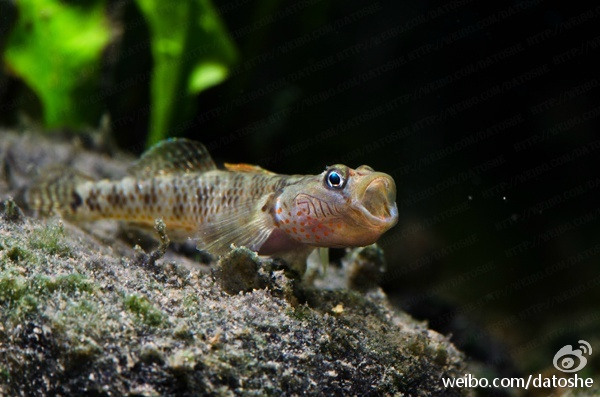

背缘浅弧形隆起。头中大，圆钝，前部宽而平扁。唇略厚，发达。体被中大弱栉鳞，前部鳞小，后部鳞较大。胸鳍宽大，椭圆形，下侧位。腹鳍短于胸鳍，仅为胸鳍长的1/2。尾鳍圆截形，短于头长。

头、体呈棕色，背部色深，腹部色浅。峡部浅色。体侧具5～6个不规则黑棕色斑块，最后面的斑块位于尾鳍基部，呈“＜”状。体侧下半部每一枚鳞片中央具1椭圆形或不规则的橘红色斑点，后缘灰黑色，形成一明显边缘。雄鱼颊部具1～4条斜向前下方的黑褐色细条纹，前方第一斜纹下部分叉为2条；雌鱼仅具1～2条黑褐色斜纹。眼下缘至上颌骨后角具1暗色条纹。雄鱼鳃盖骨部及头部腹面的鳃盖膜具7～8行由橘红色小点组成的条纹，向上延伸至鳃盖部下半部；雌鱼不明显。背鳍灰色，第一背鳍上半部鳍膜橘红色，第四鳍棘后方鳍膜上散具灰黑色小斑点；第二背鳍具浅色边缘，上半部灰色，下半部具3～4行褐色小点组成的纵行点纹。臀鳍灰色，具浅色边缘，雄鱼臀鳍上半部具3～4斜行较粗的橘红色条纹。胸鳍浅色，基部中央具1个小黑斑，近黑斑后方具1橘红色半月形斑条。腹鳍浅色。尾鳍深灰色，具5～6行由黑褐色小点组成的横纹，并具浅色边缘。

## 大吻虾虎鱼

Rhinogobius gigas  Aonuma & Chen, 1996 (台湾)

溪流中的中小型溯河徊游鱼类。肉食性鱼类，喜摄食小鱼、水生昆虫及底栖无脊椎动物。是台湾产吻虾虎鱼中体型最大者。分布于台湾宜兰南部、花莲、台东各地区的溪流中。为台湾省特有种。

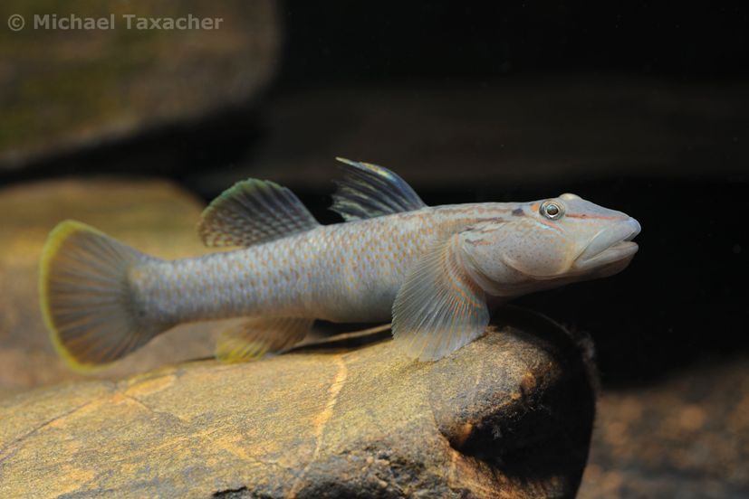
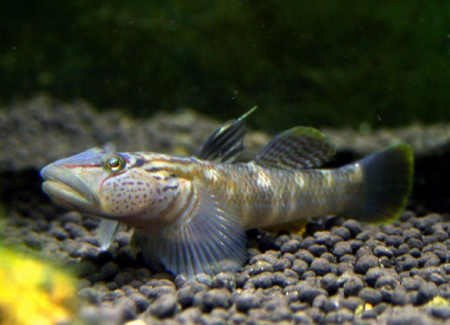

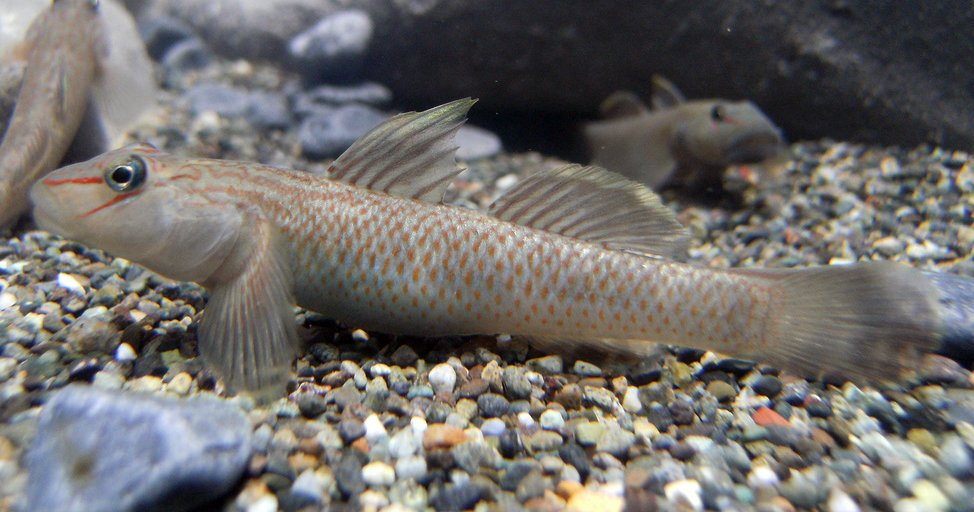

背缘浅弧形。头中大，圆钝，。颊部凸出。吻短而尖突，吻长大于眼径，雄鱼吻部较雌鱼为长。眼较小，背侧位，眼上缘突出于头部背缘。唇略厚，发达。体被中大弱栉鳞。胸鳍宽大，椭圆形，下侧位，鳍长等于吻后头长。腹鳍略短于胸鳍，圆盘状。

体呈黄棕色，具6～7条黑褐色垂直横带；体侧鳞片基部淡黄色，腹部和胸部较白；雌鱼在生殖季时腹部为青色，鳃盖及颊部有许多红色或红褐色斑点，项部有数个红褐色纵纹，眼下方具有2对红纹。第一背鳍褐色，鳍膜微灰色，雌鱼在鳍膜中段为深灰色；第二背鳍淡黄色，有5～7列水平向红褐色点纹；尾鳍黄褐色，外缘黄色，雄鱼有5～7列褐色点纹，雌鱼的鳍膜则无斑点或具不明显斑点，雌鱼尾鳍基部有黑褐色新月状横纹。臀鳍黄绿色，胸鳍黄绿色，略带透明，基部有3条褐色弧形线，其上方有1黑褐色斑点；腹鳍白色略带透明。

## 子陵吻虾虎鱼

Rhinogobius giurinus  (Rutter, 1897)

现在此名已废，属于真吻虾虎鱼。

Rhinogobius similis  Gill, 1859

栖息于江、河中下游、湖泊、水库及池沼的沿岸浅滩，或者在小沟的石砾间，有时也栖息于河口。喜在池、溪水清澈之湖、潭中生活，常散居于石缝或在石下挖穴。常在水底匍匐游动，伺机掠食，摄食小鱼、虾、水生昆虫、水生环节动物、浮游动物和藻类等，有同类残食现象。初期个体嫩小，淡黄色，大小均匀；后期个体大，体色较暗黑，大小不等。分布于除西北地区以外的各大江河水系，海南及台湾均有分布。

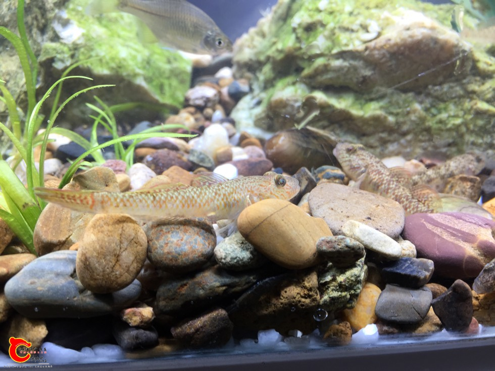
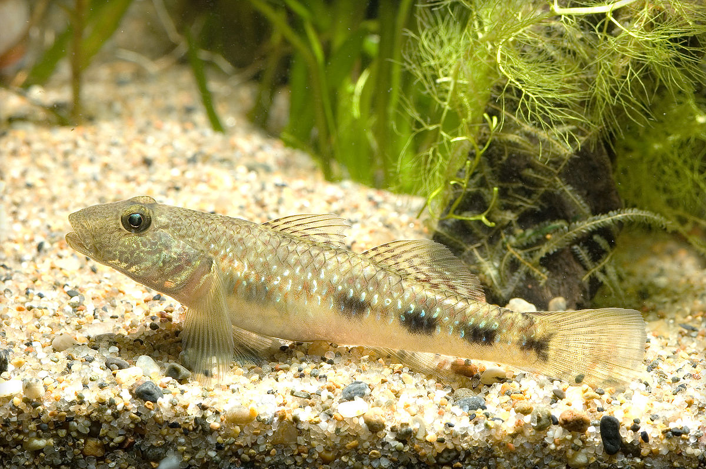

背缘浅弧形隆起。头中大，圆钝。吻圆钝，颇长，吻长大于眼径。眼中大，背侧位，眼上缘突出于头部背缘。唇略厚，发达。体被中大栉鳞。腹部具小圆鳞。腹鳍略短于胸鳍，长圆形，膜盖发达，边缘深凹。

头、体呈黄褐色，体侧有6～7个宽而不规则的黑色横斑，有时不明显。头部在眼前方有数条（5条）黑褐色蠕虫状条纹，颊部及鳃盖有5条斜向前下方的暗色细条纹。臀鳍、腹鳍和胸鳍黄色，胸鳍基底上端具1黑斑点。背鳍和尾鳍黄色或橘红色，具多条暗色点纹。

## 恒春吻虾虎鱼

Rhinogobius henchuenensis  Chen & Shao, 1996 (台湾)

溪流的底栖小型鱼类。成鱼有护卵习性。肉食性，以小鱼、水生昆虫等为食。数量极少，属于稀有种类。分布于台湾南部的枫港溪以及四重溪。为台湾省特有种。

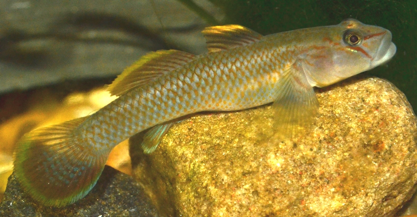
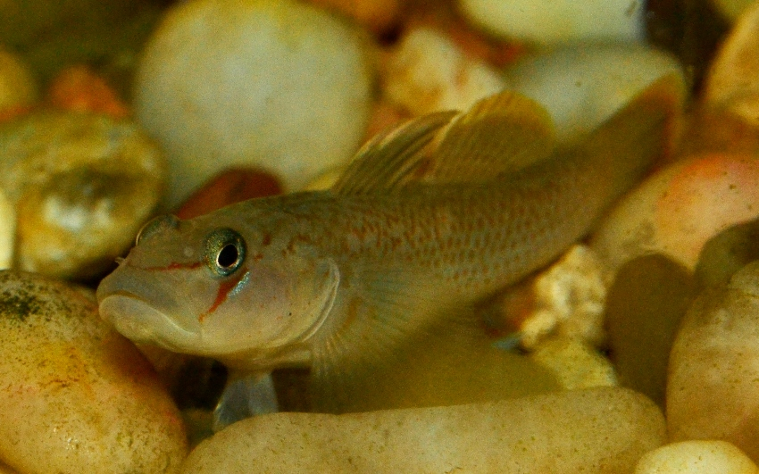
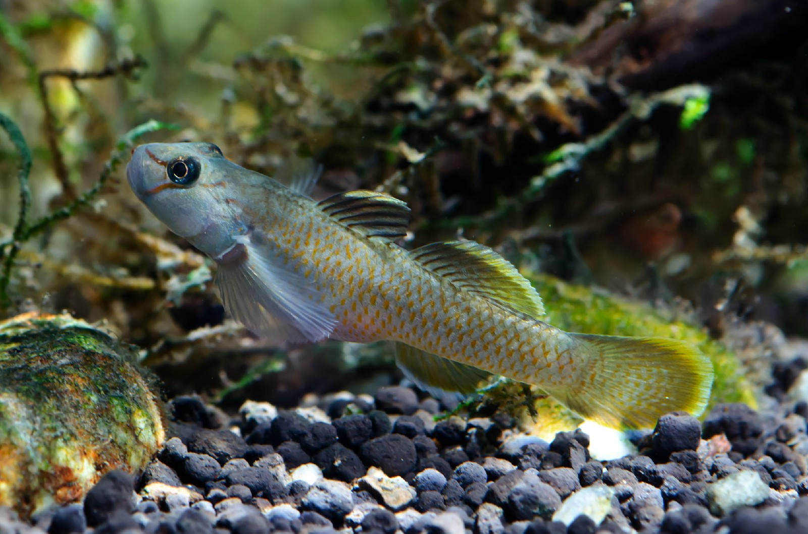
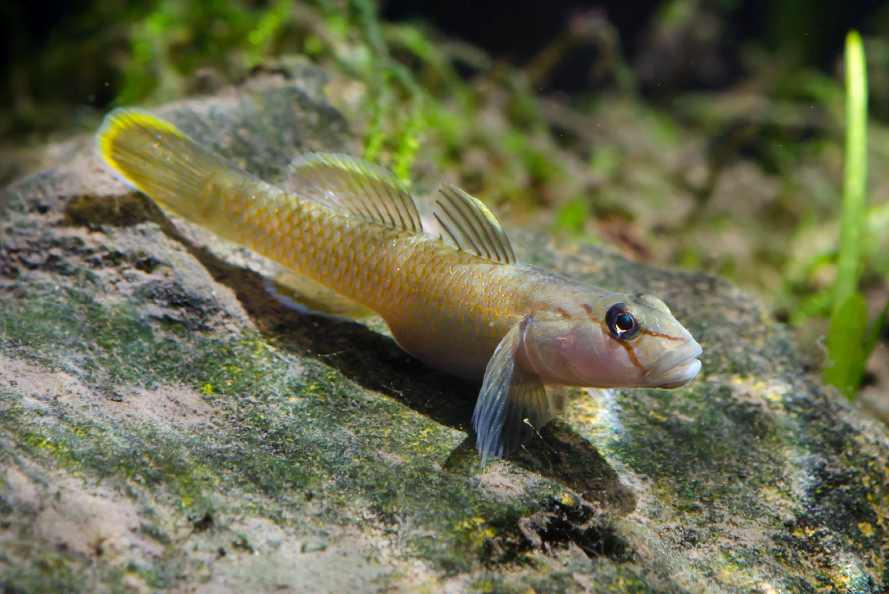

前部圆筒形。头中大，圆钝。颊部凸出。吻短而尖突，吻长大于眼径。唇略厚，发达。体被中大弱栉鳞，后半部鳞片较大。胸鳍宽大，椭圆形，下侧位。腹鳍略短于胸鳍，圆盘状。尾鳍长圆形，短于头长。

体呈黄棕色或褐色，体侧各鳞的基部有1个深色斑，雄鱼多呈红褐色，雌鱼暗褐色。体侧中央有1列深色点纹延伸到尾鳍基部，腹侧斑点色泽较淡。腹部黄色，颊部及鳃盖散布着约30个红色斑点，雄鱼色泽较为鲜明。项部仅有少数褐色纵纹，眼前及眼下各有1红色斜纹延伸到吻端及上领上方。第一背鳍淡棕色，前方上缘鳍膜呈黄色；第二背鳍为淡棕色，具3～4列水平状斑点。尾鳍淡棕色，具4～5列垂直排列斑点，雄鱼为红色，雌鱼则为灰黑色；尾鳍外缘橘红色，雌鱼尾鳍基部有两个褐色斑点。胸鳍基部上方有1个黑褐色斑，下面有1列新月形红褐色线纹；腹鳍灰白略透明。

## 红河吻虾虎鱼

Rhinogobius honghensis  Chen, Yang & Chen, 1999

暖水性小型底层鱼类，喜栖息于淡水河川的上游。无食用价值。分布于中国云南和越南北部。

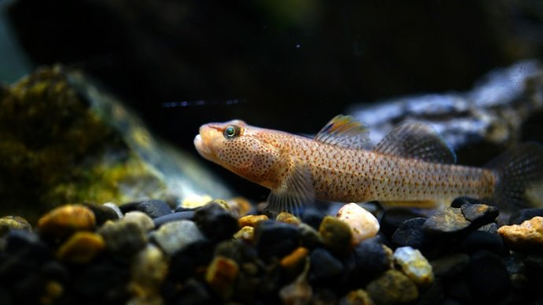

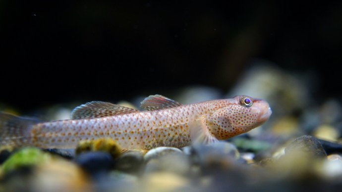

前部亚圆筒形。头中大，圆钝。唇略厚，发达。体被中大栉鳞。腹鳍略短于胸鳍，圆形，膜盖发达，边缘弧形凹入。尾鳍长圆形，短于头长。

头、体呈黄色或深棕色，体侧无深褐色宽横纹或大斑块，具8～9行水平状、大于瞳孔的褐色圆斑。颊部及鳃盖部黄色，雄鱼鳃盖膜密具65～70个褐色圆斑。雌鱼无圆斑。腹部黄色或浅色。项部具许多不规则的细小斑点。吻背无小斑，在两眼前方具1 “U”形条纹，伸向吻端。第一背鳍浅色，在第二鳍棘前方的鳍膜中央具一个黑色斑块；雄鱼第一背鳍后方具2～3纵行黑色斑点，雌鱼则具3～4行浅色斑点。第二背鳍浅色，雄鱼具3纵行暗色斑点；雌鱼具6～7纵行暗色斑点。臀鳍浅色或灰色，雄鱼具暗色边缘。胸鳍浅色，基部具数个不规则黑色斑点。雄鱼腹鳍灰色，雌鱼浅白色。尾鳍浅色或灰色，具6～7列垂直暗斑或暗色横带。

## 兰屿吻虾虎鱼

Rhinogobius lanyuensis  Chen, Miller & Fang, 1998 (台湾)

河、溪小型底层鱼类。无食用价值。种群数量小，分布区狭窄。分布于台湾兰屿岛。为台湾省特有种。

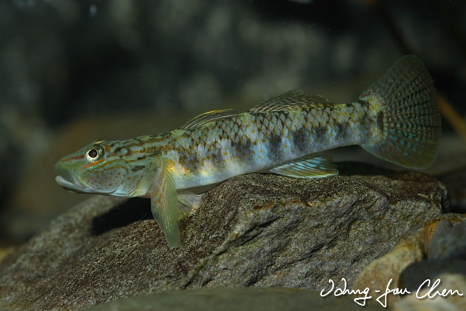
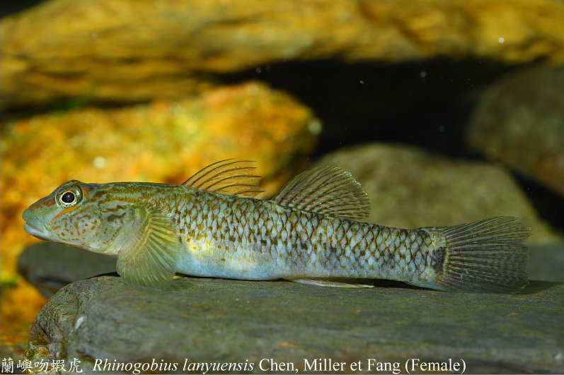
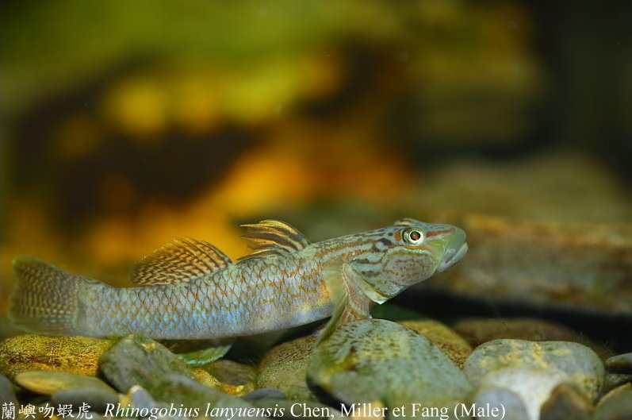

前部亚圆筒形。头大，圆钝，亚圆筒形。唇略厚，发达。体被小栉鳞。腹部具小圆鳞。胸鳍宽大，圆形，下侧位。腹鳍略短于胸鳍，圆形。尾鳍长圆形，短于头长。

头、体呈亮褐色。体侧具8条灰褐色垂直宽条纹，体背具8个黑褐色斑块。颊部和鳃盖骨部无蠕虫形红褐纹。腹部浅色或微蓝。颊部和鳃盖具许多橘色小点（雄鱼）或褐色小点（雌鱼）；颊部和鳃盖的上部还具2～3条褐色平行的纵纹。项部隐具若干条不规则条纹。头部眼睛附近具2条深黑色条纹：一条自眼前缘向前经后鼻孔伸达吻端，与对侧的形成“U”形纹；另一条较短，由眼的下缘向前向下伸向上颌后缘（雌鱼）或中部（雄鱼），但离上颌均有一定距离。第一背鳍棘褐色，鳍膜浅色，具数个小黑点（雌鱼）。第二背鳍具6～8纵列橘色或棕色小点，连成线纹。臀鳍浅黄色，雌鱼的臀鳍中部具一条黑褐色纵带。胸鳍浅白色，基部具2条深色垂直条纹。腹鳍浅色，无斑块及条纹。尾鳍透明，具11～15行（雄鱼）或7～9行（雌鱼）由褐色圆点组成的垂直条纹；尾鳍基具1三角形黑褐色大斑。

## 李氏吻虾虎鱼

Rhinogobius leavelli  (Herre, 1935)

暖水性小型底层鱼类，喜栖息于淡水河川中。无食用价值。分布于钱塘江以南各水系及海南各河溪。为中国特有种。

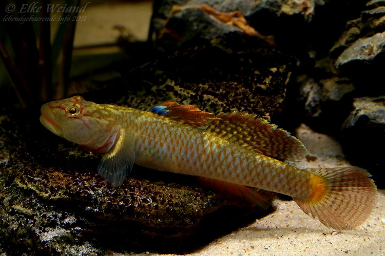
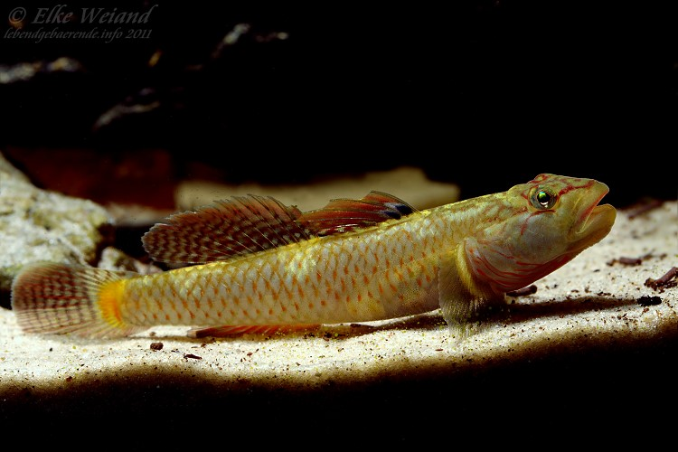
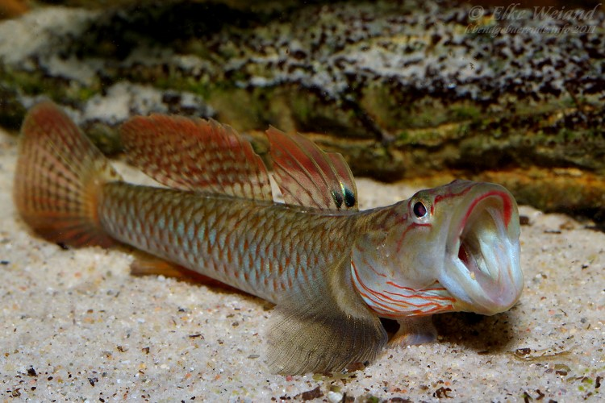
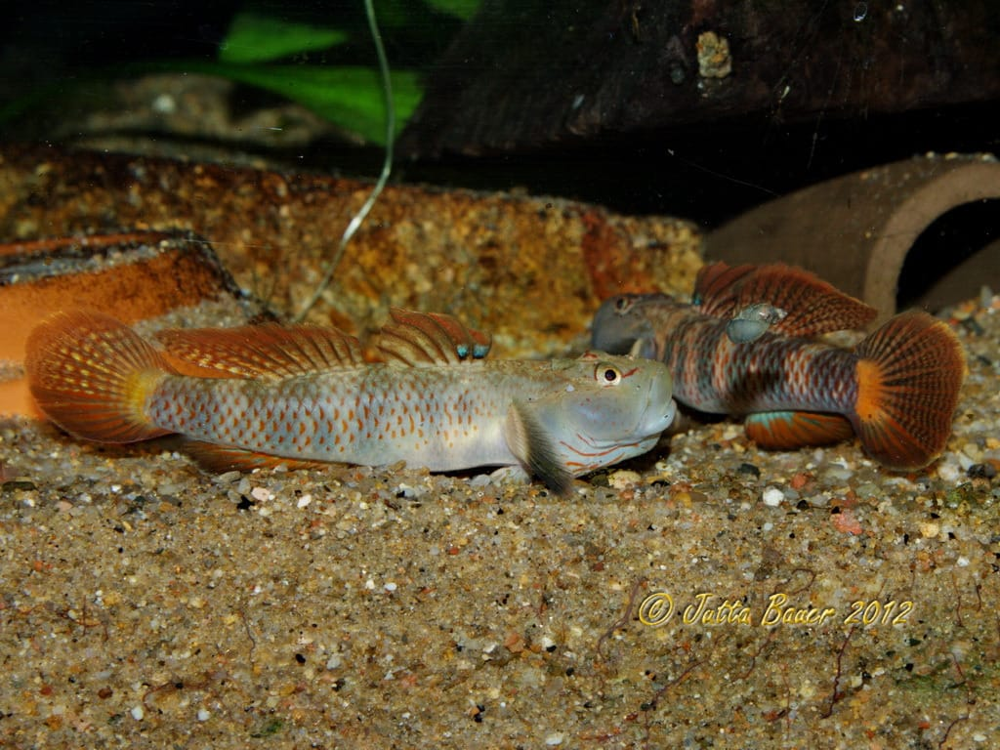

前部亚圆筒形。头中大，圆钝。眼间隔狭窄。口中大，前位，斜裂。体被中大弱栉鳞。无侧线。前部鳍条稍短，后部鳍条较长。胸鳍宽大，长圆形，下侧位。腹鳍略短于胸鳍，圆形。尾鳍长圆形，短于头长。

头、体呈浅灰色，体侧隐具3～5个暗灰色斑块，每一枚鳞片的后缘呈橘黄色（雌鱼）或褐黄色（雄鱼）；头部具橘黄色点纹，眼前至吻背前端具1～2橘色斜纹（雌鱼）或具暗褐黄色细纵带（雄鱼），鳃盖膜上具平行橘色细纹。背鳍灰黄色，第一背鳍无纵纹，其第一与第二鳍棘之间的鳍膜下部具1绿色圆斑（雄鱼明显，雌鱼不明显）；第二背鳍具5条暗色纵纹。臀鳍浅色，中部有1浅黄色纵带，纵带外缘稍黑，鳍的边缘白色。胸鳍暗灰色，基部有2行橘色横纹。腹鳍浅黄色。尾鳍基有1橘色宽横纹，尾鳍上有7条暗色横带。

## 雀斑吻虾虎鱼

Rhinogobius lentiginis  (Wu & Zheng, 1985)

河、溪小型底层鱼类。无食用价值。数量极少，属于稀有种类。分布于浙江灵江、飞云江及鳌江各水系。为中国特有种。

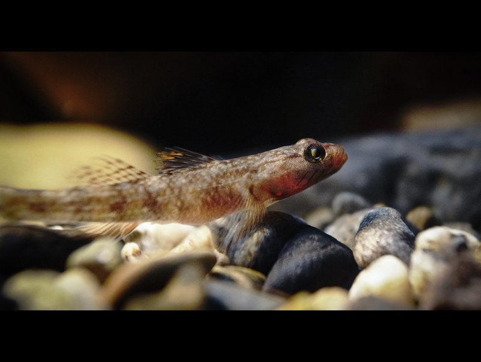

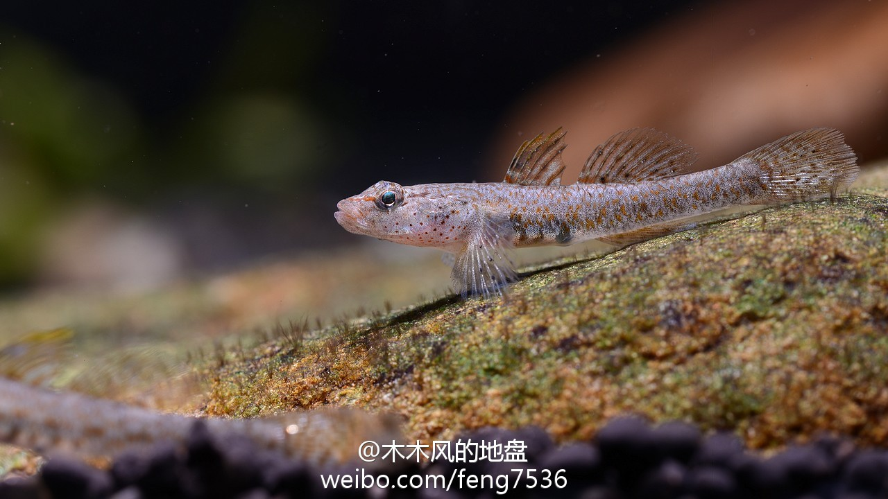

前部稍平扁。头中大，圆钝。头部无感觉管及感觉管孔。口小，前位，斜裂。唇略厚，发达。。体被中大薄圆鳞。腹鳍略短于胸鳍，圆形。尾鳍长圆形，短于头长。

雄鱼头、体呈深灰色，雌鱼呈浅棕色。体侧具稍不规则的黑色斑块数个，腹侧有时散具数个小黑点，或者体侧隐具数个黑色斑块。体侧每一鳞片边缘浅色，不形成网格状纹。颊部和鳃盖具10余个小黑点。头部腹面鳃盖膜处密具白色小圆点。雄鱼腹鳍灰黑色，其余各鳍深灰色，其第一背鳍第一与第二鳍棘间的鳍膜上具1个黑斑，第二背鳍无斑点或条纹；雌鱼腹鳍浅色，其余各鳍浅棕色，第一背鳍第一与第二鳍棘间的鳍膜上亦隐具1个黑斑，第二背鳍具数行黑色斑纹。

## 陵水吻虾虎鱼

Rhinogobius linshuiensis  Chen, Miller, Wu & Fang, 2002 (海南)

生活于海南河溪中的小型底层鱼类。不常见。分布于海南。为海南特有种。

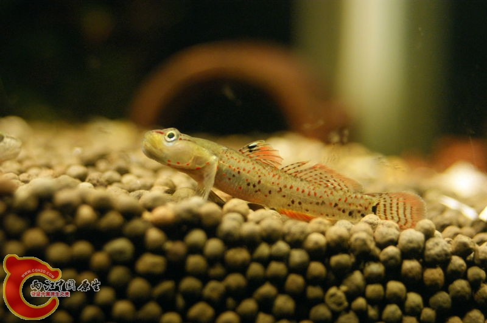

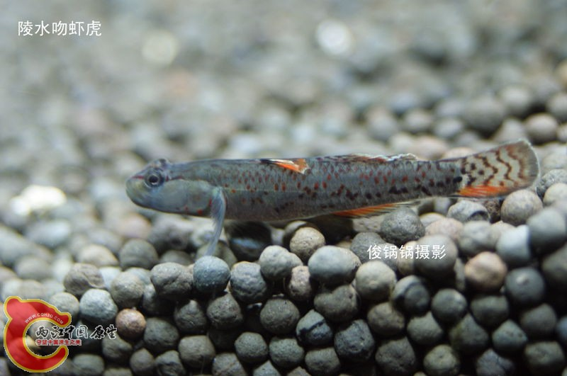

头、体呈乳白色，体侧无明显黑色横斑，但具2纵行红色小斑。颊部和鳃盖骨乳白色，但具2纵行红点；雄鱼鳃盖膜具16～22个橘色小斑。项部具不明显暗灰色斑块。吻背自眼前方至吻端具“U”形黑纹。眼下具1个方形暗灰色大斑。颊部中间和鳃盖中部具1纵行灰色条纹；雄鱼在颊部下方具1纵行7～10个深褐色圆点。第一背鳍浅色，边缘橘色，第二鳍棘前方的鳍膜上具一黑斑，黑斑向后有一条暗色条纹；第二背鳍浅色，具3行褐斑。臀鳍品红色，边缘具暗灰色（雄鱼）条纹或灰白色带纹（雌鱼）。胸鳍暗灰色或浅色，基部具2个小黑斑。腹部白色，腹鳍浅色。尾鳍浅灰色，具2～3行垂直褐色点纹。

## 刘氏吻虾虎鱼

Rhinogobius liui Chen et Wu

淡水小型底层鱼类，喜栖息于江、河的中游。不常见。分布于四川、湖北等长江干支流。为中国特有种。

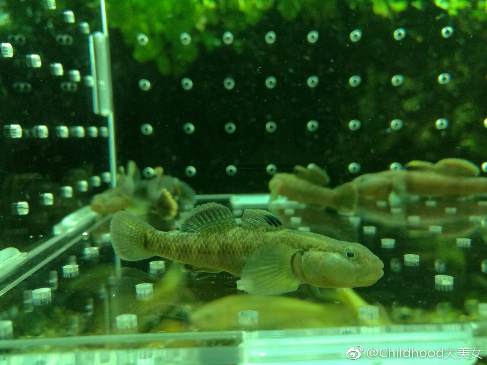

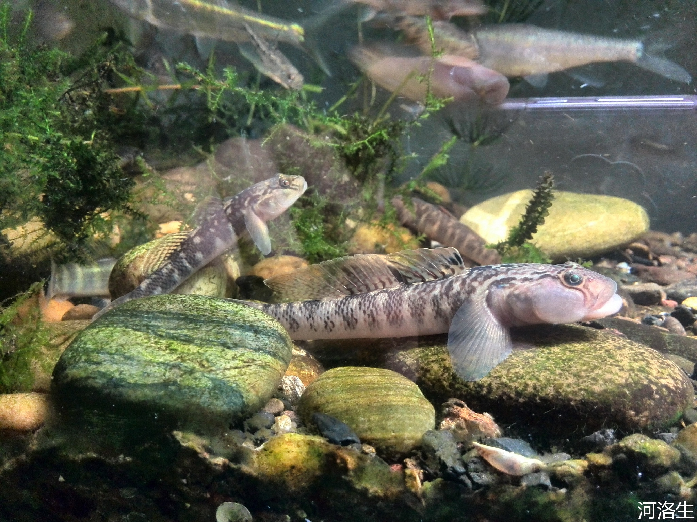
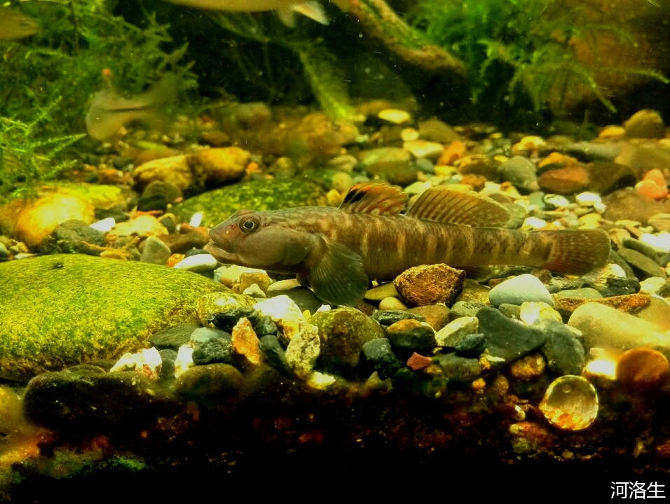

旧称四川吻虾虎鱼。前部亚圆筒形。头中大，圆钝，前部宽而平扁，背部稍隆起。颊部显著凸出，有时颇膨大。吻短而圆钝，较长，吻长稍大于眼径。眼较小，背侧位，位于头的前半部，眼上缘突出于头部背缘。眼间隔稍宽，其宽等于眼径，稍内凹。体被中大弱栉鳞。胸鳍宽大圆形，下侧位。腹鳍略短于胸鳍，圆盘状，。尾鳍长圆形，短于头长。

头、体呈浅褐色，体背侧色深，腹侧浅色。体侧有8～11条黑褐色横带（或大横斑），背侧的第一背鳍基部下方及项部有许多深灰色虫状纹或云纹，中间杂有许多较大浅色圆斑。第一背鳍第一至第四鳍棘间的鳍膜上有1大黑斑。背鳍、尾鳍和臀鳍为灰黑色或浅灰黑色，边缘灰白色或白色。尾鳍有时有5～6深色垂直横纹。胸鳍、腹鳍灰白色。

## 斑带吻虾虎鱼

Rhinogobius maculafasciatus  Chen & Shao, 1996 (台湾)

溪流中的小型鱼类，典型的河、海洄游鱼类，底栖性。仔鱼具浮游期。本种游泳力强，常栖息于各河川干流及支流低海拔的溪段，生活于急流、潭头等水域。肉食性，以水生昆虫、小型鱼类及虾类为食。分布于台湾的曾文溪及高屏溪水系。为台湾省特有种。

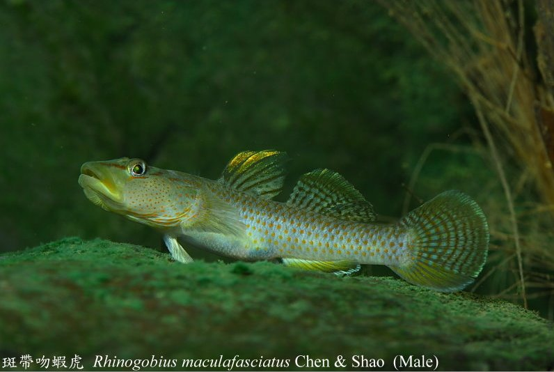

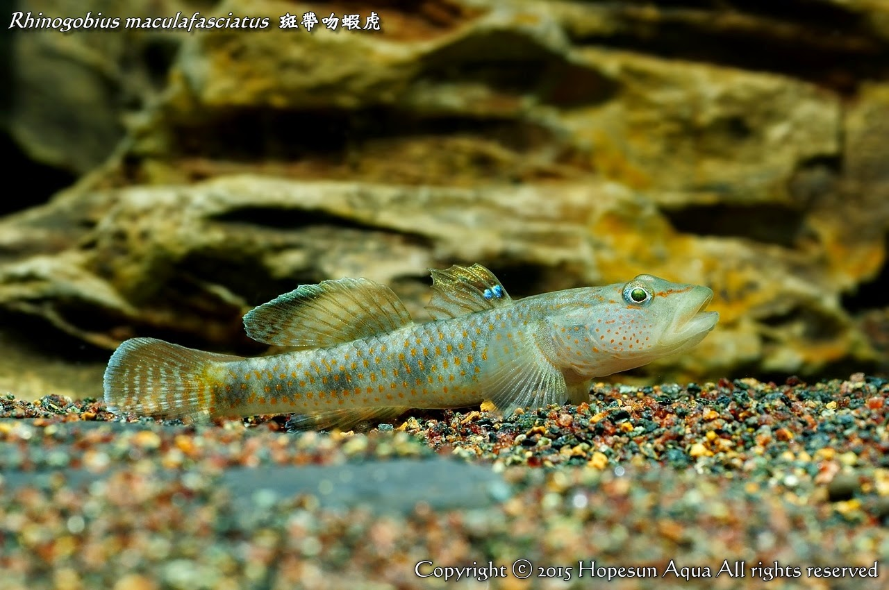

前部圆筒形。头中大，圆钝。颊部凸出，中央具纵行感觉乳突。吻短而圆钝，吻长大于眼径。唇略厚，发达。体被中大弱栉鳞。腹鳍略短于胸鳍，圆盘状，末端至臀鳍起点的距离等于腹鳍长。

体呈淡棕色或米黄色，体侧则有6～7条褐色横带，成熟雌鱼腹部为黄色。体侧鳞片基部具黄色或鲜明的橘红色斑点，前鳃盖后缘及下缘排列较细密；项部有数条褐色纵纹，背侧有不规则深褐色网纹，眼前及前下方各有1条红褐色斜纹伸到吻端及上颌中部上方。背鳍透明，略带浅黄色，第一背鳍棘淡棕色，上缘鳍膜黄色，第一至第三鳍棘的鳍膜间通常有蓝黑色亮斑；第二背鳍淡棕色，具5～7列褐色水平方向的点纹；尾鳍淡黄色，有8～12列褐色或黑褐色垂直点纹，基部有深褐色“＜”形纹，雄鱼尾基上方有1橘黄色圆斑。臀鳍为黄色或黄绿色，外缘有褐色边，最外缘则透明无色；胸鳍淡黄色，基部有2列橘红色不规则斑点；腹鳍透明或灰白色。

## 密点吻虾虎鱼

Rhinogobius multimaculatus  (Wu & Zheng, 1985)

中国东南部河、溪底层的小型鱼类。个体小，体长40～60mm。数量极少，属于稀有种类。分布于浙江。为中国特有种。

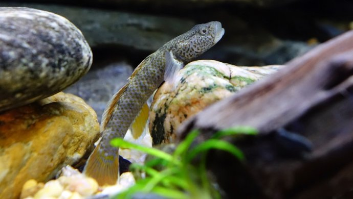
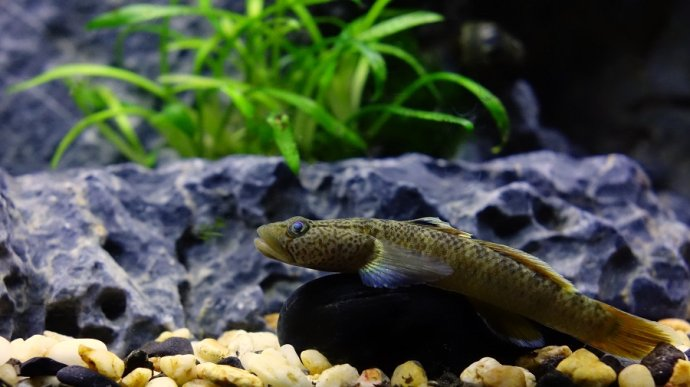

前部稍平扁，后部侧扁。头中大。眼间隔狭窄，宽大于眼径，稍内凹。唇略厚，发达。体被中大弱栉鳞。腹鳍略短于胸鳍，圆盘形。尾鳍长圆形，短于头长。

头、体呈棕褐色，头部略深。头及体侧具许多小黑斑点，头部、体前部及胸鳍基底的黑斑细小、密集；体后部黑斑较大，位于每枚鳞片的基部，成规则排列腹面浅色，无小黑斑。背鳍和尾鳍灰色，第一背鳍第一与第四鳍棘间的鳍膜上具黑色斑块，第二背鳍及尾鳍有时具数行黑色斑纹。臀鳍灰黑色，边缘灰白色。胸鳍浅灰色。雄鱼腹鳍灰黑色，雌鱼腹鳍灰白色。

## 名古屋吻虾虎鱼

Rhinogobius nagoyae  Jordan & Seale, 1906

江、河底层小型鱼类，喜栖息于中、小河川水清流缓、底质为石砾处。杂食性，摄食小型水生昆虫及附着性藻类。分布于中国东北部地区的图们江、辽河、鸭绿江、黑龙江等水系。

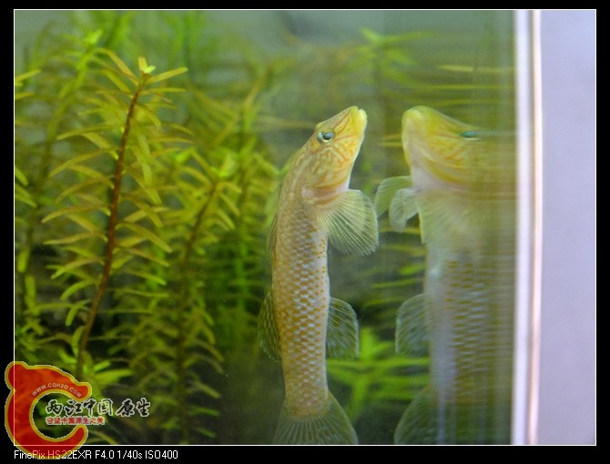
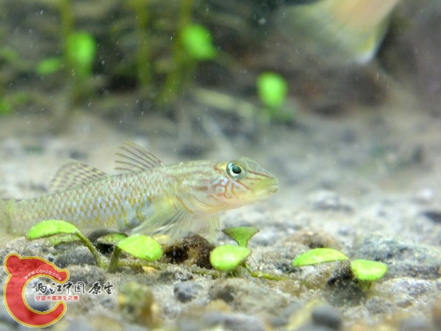

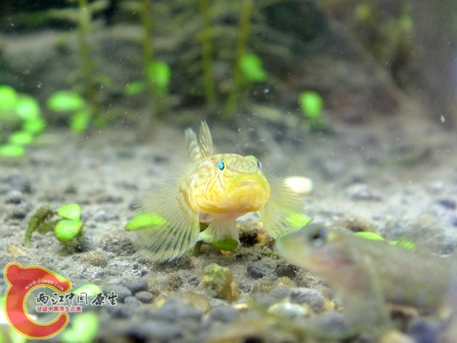

前部圆筒形。头中大，圆钝，前部宽而平扁，背部稍隆起。眼间隔狭窄，宽小于眼径，稍内凹。体被中大弱栉鳞。腹鳍略短于胸鳍，圆形，膜盖发达，边缘显著凹入。尾鳍长圆形，短于头长。

头、体呈浅棕色，背部色深，腹部浅色，体侧具6～7个不规则灰黑色横斑，最后面的横斑位于尾鳍基，呈“＜”状浅弧形。颊部及鳃盖上具许多辐射状蠕虫形红褐色条纹。眼前下方的吻部具4条伸向上颌的斜纹。第一背鳍和臀鳍呈灰褐色；第二背鳍有4条灰黑色纵纹；尾鳍具6～8条灰黑色弧形横纹；胸鳍基部上方有1个黑斑，其后沿胸鳍基有3条弧形横纹；腹鳍灰色。

## 南渡江吻虾虎鱼

Rhinogobius nandujiangensis  Chen, Miller, Wu & Fang, 2002 (海南)

河、溪小型底层鱼类。分布于海南南渡江水系。为海南特有种。

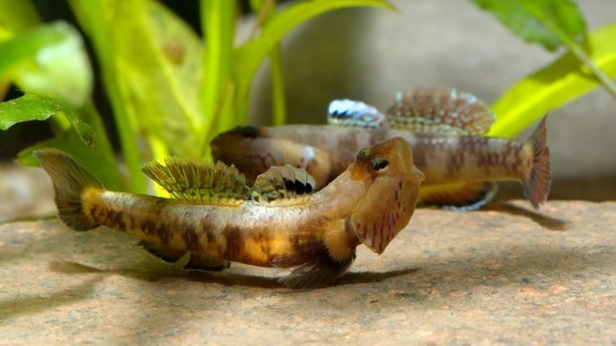

前部稍平扁，后部侧扁。头中大，圆钝，前部宽而平扁（雄鱼）或稍侧扁（雌鱼）。唇略厚，发达。体被大栉鳞。腹鳍略短于胸鳍，圆形，左、右腹鳍愈合成一吸盘。尾鳍长圆形，短于头长。

头、体呈乳黄色，体侧无深色横带和斑块，雄鱼体侧每一枚鳞袋边缘呈橘褐色，腹部呈浅黄色或白色。颊部及鳃盖部乳黄色。颊部具1条斜纹，鳃盖膜具5～7条暗红色条纹。项部具若干个褐色斑块。吻背自眼前方至吻端具“U”形黑纹。雄鱼腹鳍暗黑色，雌鱼腹鳍浅灰色。第一背鳍灰色，第一及第二鳍棘间的鳍膜上具一大黑斑；雄鱼第一背鳍具3行红褐色小点，雌鱼的仅散具若干个小点。第二背鳍灰白色，具6～8纵行红褐色小点。尾鳍浅灰色，具6～8条垂直褐色条纹，尾鳍基部具黑斑。臀鳍浅色，雄鱼具3纵行红褐色小点，雌鱼无纵行小点。胸鳍浅色或暗灰色，基部具一暗褐色圆斑。腹鳍暗灰色。

## 南台吻虾虎鱼

Rhinogobius nantaiensis  Aonuma & Chen, 1996 (台湾)

溪流的底栖小型鱼类，可能属于陆封型或非必要降海型的鱼类。仔鱼浮游期较短。喜栖息于潭区浅于2m的水域或懒区中。肉食性，以小型鱼、虾类、水生昆虫、有机碎屑为食。分布于中国台湾的曾文溪、高屏溪等水系。为台湾省特有种。

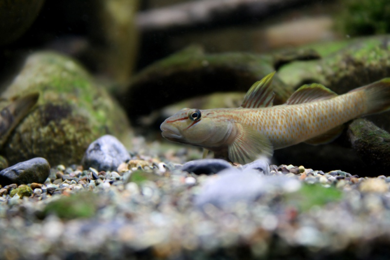

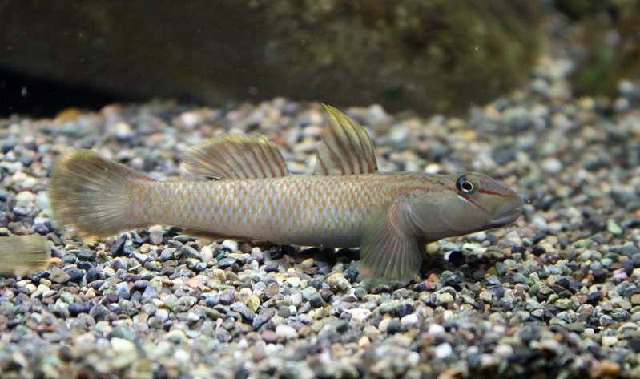

前部圆筒形。头大，圆钝，前部宽而平扁，背部稍隆起，头宽大于头高。眼间隔窄小，其宽小于眼径，稍内凹。唇略厚，发达。体被中大弱栉鳞，后半部鳞片较大。胸鳍宽大，椭圆形，下侧位，鳍长几乎等于吻后头长。腹鳍略短于胸鳍，圆盘状，膜盖发达，边缘弧形凹入。尾鳍长圆形，短于头长。

体呈灰褐色或淡褐色，体侧各鳞基部有较深色斑点，背侧具棕斑，体侧中央有1纵列宽大而不规则的褐斑，尾鳍基部具1褐色垂直条纹。成熟雌鱼腹部呈蓝色；颊部及鳃盖具有许多橘红色或橙色斑点，雄鱼色斑较为鲜明。项部具数列深褐色纵纹，眼下方各有1条红色斜纹，延伸到吻端及上颌中部上方。背鳍呈灰白色或灰棕色，尾鳍灰白略透明，中央部分略有淡蓝色光泽，最外缘呈黄色。臀鳍灰棕色，外缘黄色或透明；胸鳍淡棕色，基部上方具1个黑褐色斑点，前方有2～3列红棕色垂直弧形纹；腹鳍灰白略透明。各鳍膜均无斑点。

## 短吻红斑吻虾虎鱼

Rhinogobius rubromaculatus  Lee & Chang, 1996 (台湾)

溪流中、上游的小型底栖鱼类，为吻虾虎鱼中典型的陆封种，可归于初级淡水鱼。仔鱼完全无浮游期，常栖息于小支流里的缓流区、边缘水等环境中，不喜好活动。肉食性，以水生昆虫为食。分布于台湾北部、中部、南部的溪流中、上游区域，亦即中央山脉以西的浊水溪以及以北的溪流水系中。为台湾省特有种。

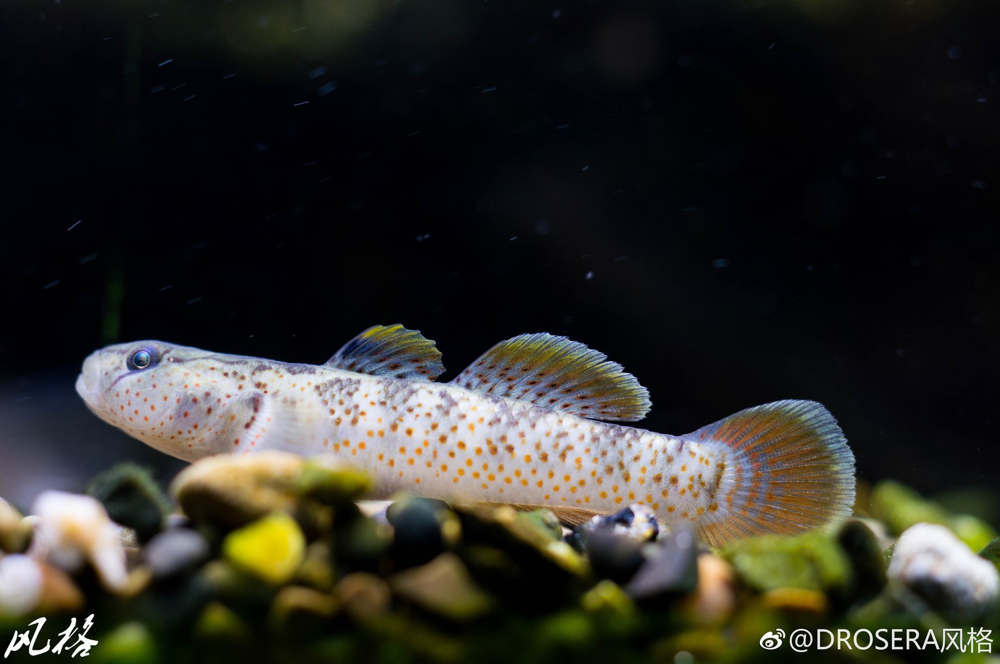
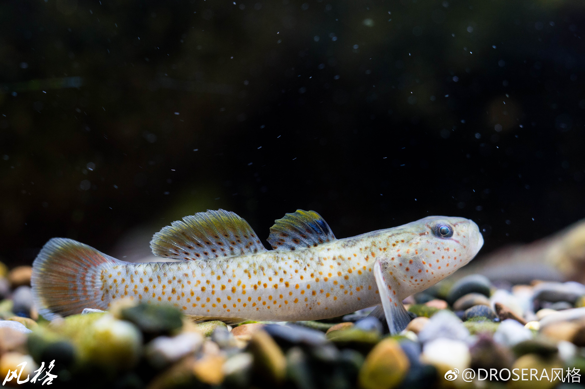

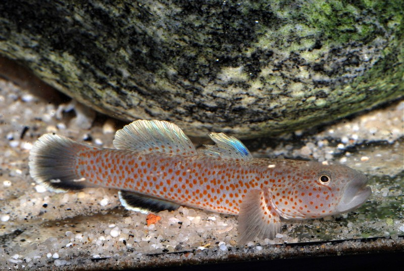

又名短吻褐斑吻虾虎。前部圆筒形。头大，圆钝，前部宽而平扁。眼间隔较小，稍小于眼径，稍内凹。唇略厚，发达。体被中大弱栉鳞。胸鳍宽大，椭圆形，下侧位，鳍长几乎等于吻后头长，后缘伸达或伸越第二背鳍起点。腹鳍略短于胸鳍，圆盘状，膜盖发达，边缘弧形凹入，末端至臀鳍起点的距离等于腹鳍长。

体呈黄棕色或褐色，身上密布许多红色或红褐色细小斑点，吻部、颊部及鳃盖上皆有许多红色或橘红色斑点；两眼前方无“U”形条纹，眼前及眼下各有1条细窄红纹，延伸到吻端及上颌中央上方。第一背鳍第一到第三鳍棘之间下半部的鳍膜处有1个黑蓝色亮斑，各鳍膜有散列的红色斑点；第二背鳍有3～5列红色或橘红色斑点，雄鱼第二背鳍外缘呈白色；尾鳍有4～7列散开的红色或红褐色斑点；臀鳍橘黄色，较外缘为黑色，最外缘则呈白色或透明无色；胸鳍基部有2～3列垂直排列的红色或橘红色斑点。

## 神农吻虾虎鱼

Ctenogobius shennongensis  Yang & Xie, 1983

温水性小型底层鱼类，喜生活于急流浅滩处，以特化为圆盘状的腹鳍吸附于砾石上，使其不至于被急流冲走，平时常潜伏于砾石缝隙间，游动距离不超过1m，活动敏捷，不易捕捉。无食用价值。分布于中国中部及东南部河、溪中。为中国特有种。

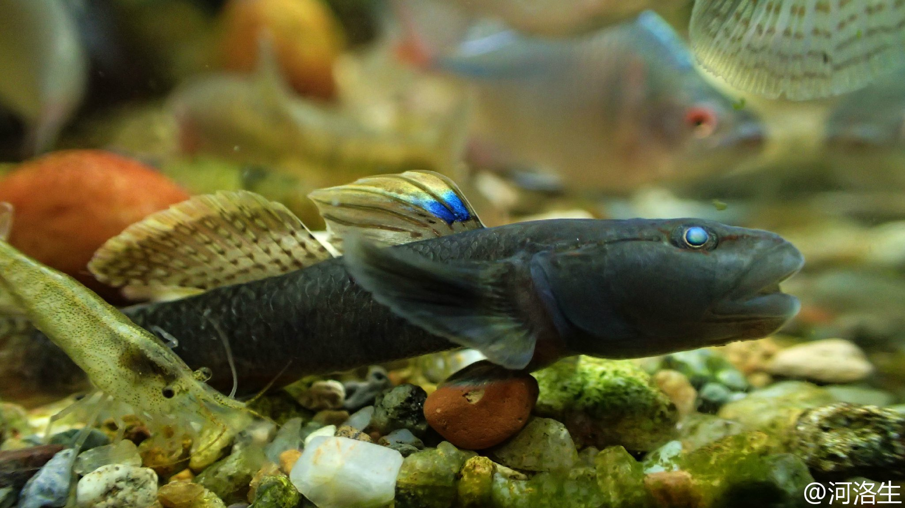
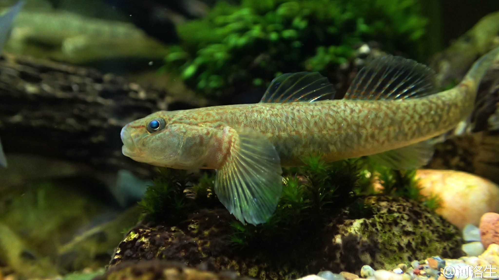
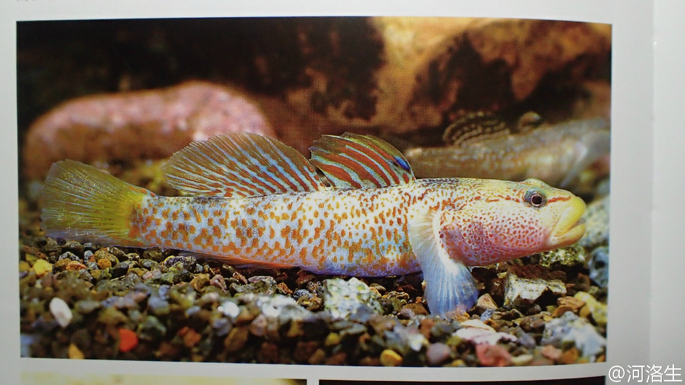
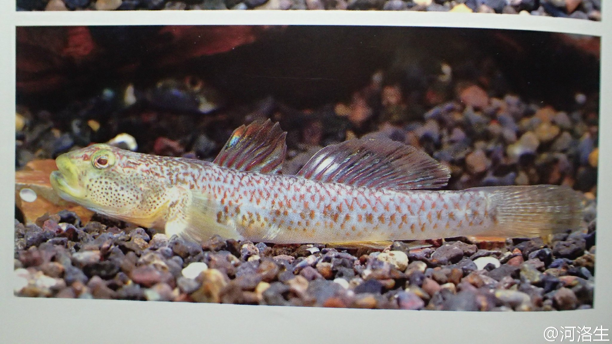

体延长，粗壮，前部亚圆筒形。头中大，圆钝，前部宽而低，平扁，背部稍隆起，头宽大于头高。眼间隔狭窄，宽等于眼径，稍内凹。唇略厚，发达。舌游离，前端圆形。体被中大弱栉鳞。胸鳍宽大，圆形，下侧位，鳍长大于眼后头长。腹鳍略短于胸鳍，圆盘状。

头、体呈翠绿色，体侧有6～7条较宽的黑色斑条，横跨背部。雄鱼第一背鳍前部有1个大而明显的荧光蓝色斑点；雌鱼无此斑点。各鳍均具黑色斑点组成的条纹；胸鳍基部有1条黑色横纹，雄鱼胸鳍和腹鳍呈灰黑色，雌鱼的为灰白色。尾鳍基有1个深褐色半月形斑。

## 四川吻虾虎鱼

Ctenogobius szechuanensis  (Liu, 1940)

暖温性小型底层鱼类，常栖息于流水的溪、河中，多在乱石、卵石间活动。肉食性鱼类，以小鱼、水生昆虫及小虾、蟹为食。分布于四川眠江水系。为中国特有种。

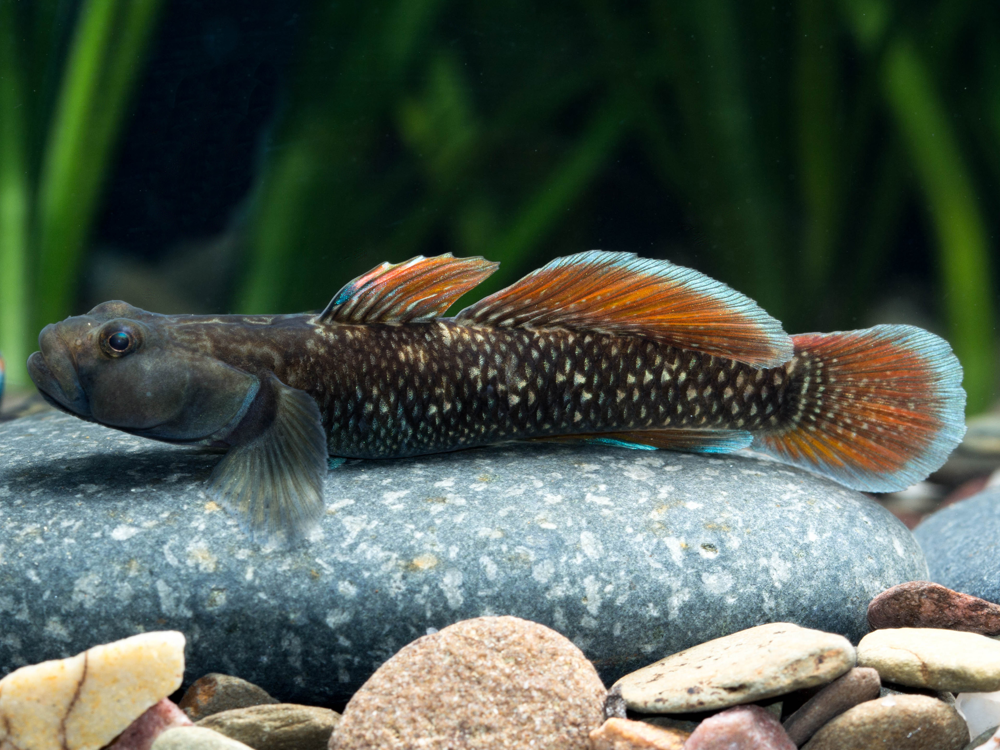
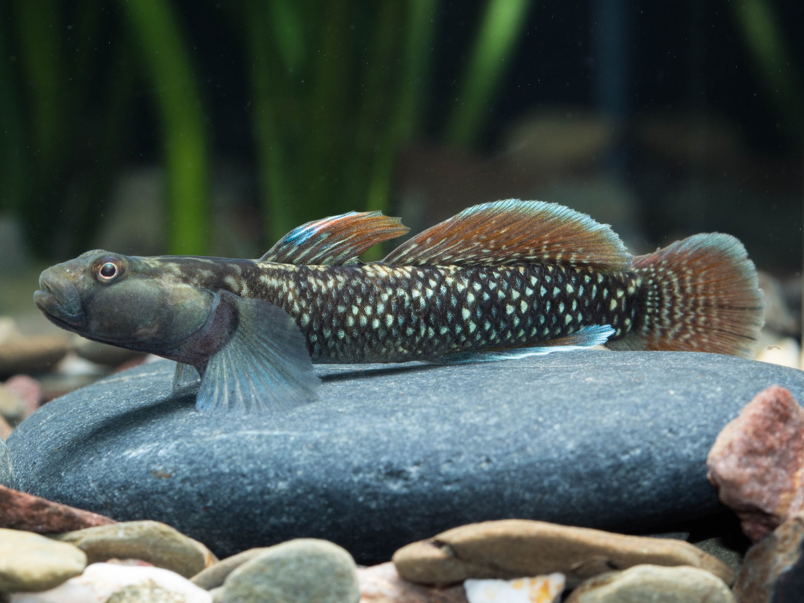
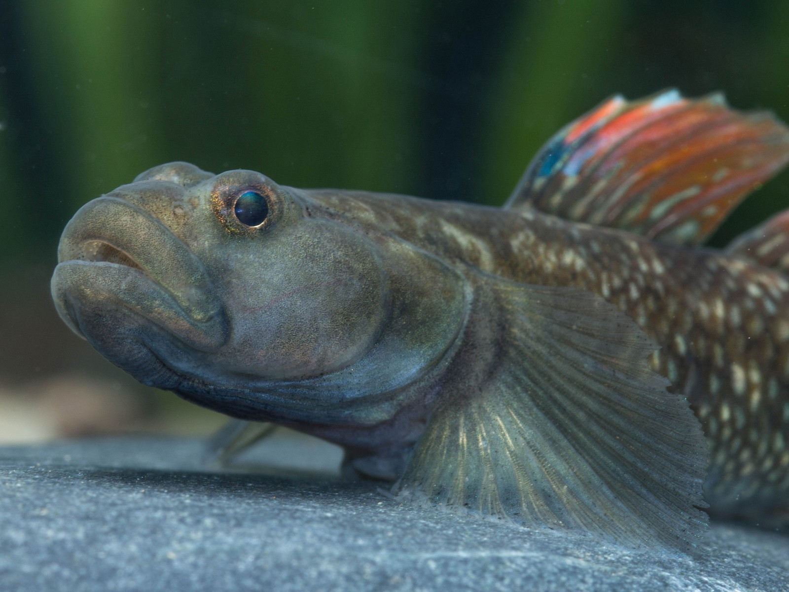

前部亚圆筒形。头中大，圆钝。唇肥厚，发达。体被中大弱栉鳞。胸鳍宽大，圆形，下侧位，鳍长大于吻后头长，后缘几乎伸达肛门上方。腹鳍略短于胸鳍，圆盘状，膜盖发达，边缘平直或微凹，左、右腹鳍愈合成一吸盘。尾鳍长圆形，短于头长。

体呈灰褐色或浅褐色，腹部黄白色，体侧每一枚鳞片边缘棕褐色，形成网格状纹，中央无纵带，有时体侧具数个小黑斑。头部黑褐色，颊部和鳃盖无小黑点。背鳍、臀鳍、胸鳍和腹鳍均呈灰褐色；第一背鳍无纵纹，第一至第二鳍棘之间的鳍膜上无黑斑，但有时有1条深色的长条纹；第二背鳍有数列深褐色小斑点；胸鳍基部上方有时隐具一个黑斑。尾鳍具6～7条深色横纹，上、下叶近边缘区深棕色，中部灰白色。

## 万泉河吻虾虎鱼

Rhinogobius wangchuangensis  Chen, Miller, Wu & Fang, 2002 (海南)

河、溪小型底层鱼类。无食用价值。分布于海南万泉河水系。为海南特有种。

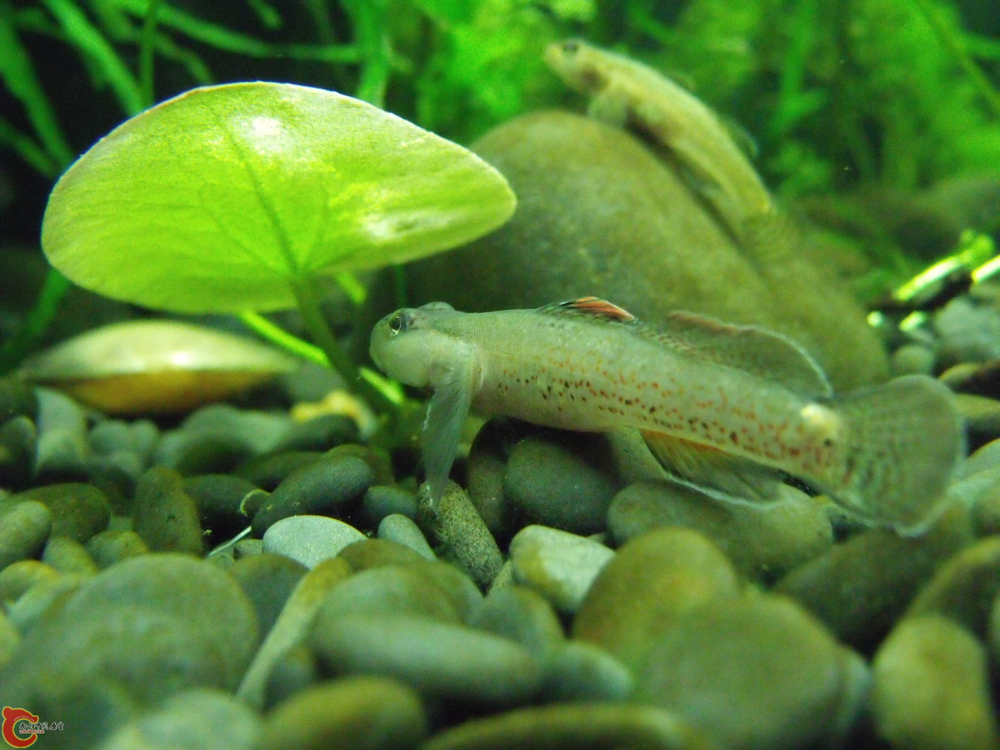
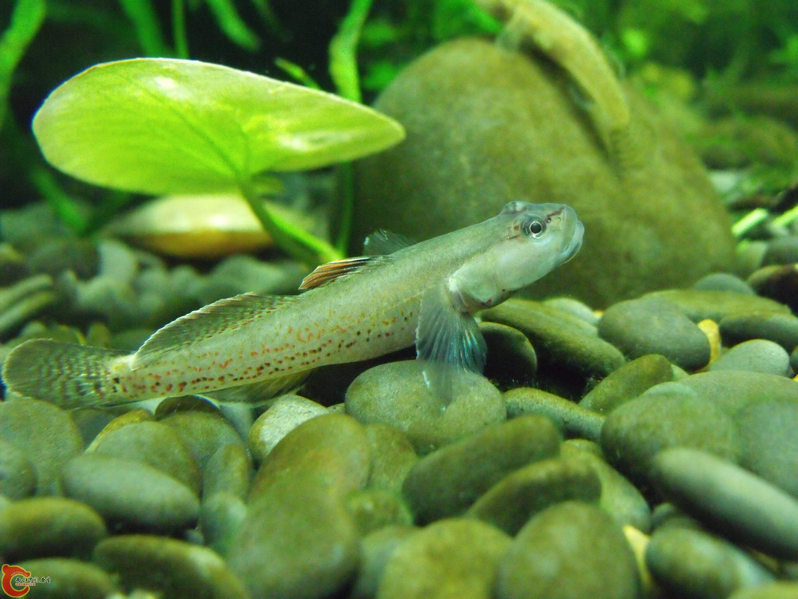
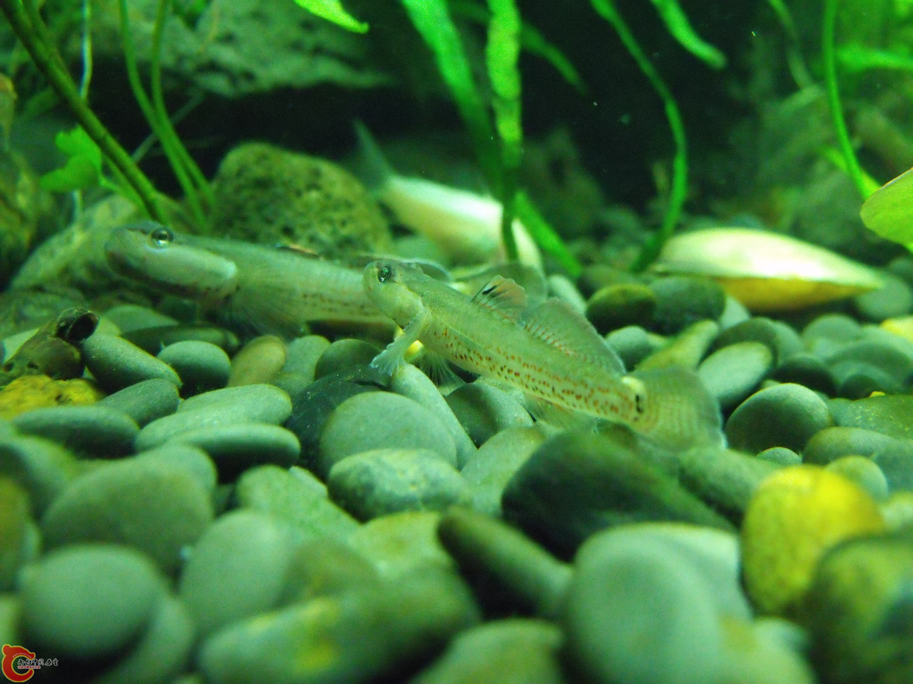
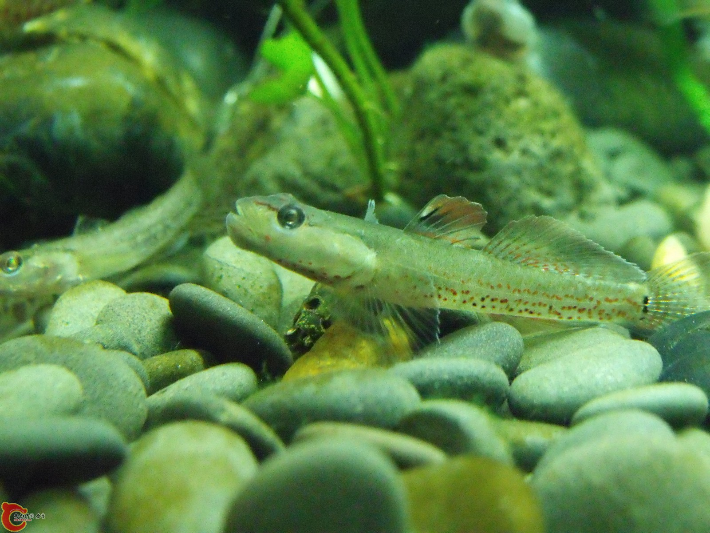

体延长。头中大，圆钝。颊部稍凸出。吻稍尖突（雄鱼）或圆钝（雌鱼），吻长等于或稍小于眼径。眼中大，背侧位。眼间隔颇狭窄，为眼径的1/3，稍内凹。体被大栉鳞。腹鳍略短于胸鳍，圆形。尾鳍长圆形，短于头长。

头、体呈浅色，体侧具7～8条长方形黑灰色的宽横带，背侧由项部至尾柄部具5个灰色斑块。体侧每一鳞袋无暗色边缘，腹部浅色或亮黄色。颊部及鳃盖中部无灰色条纹。颊部下缘具2个卵圆形、黑色圆斑。鳃盖膜暗灰色，具8～13个橘红色小圆斑。项部无明显斑纹。吻背自眼前方至吻端具“U”形黑纹。眼的下前缘具一方形暗斑。第一背鳍灰色，第三及第四鳍棘间的鳍膜上具3个黑斑；雄鱼第一背鳍具3行红褐色小点，雌鱼第一背鳍的仅散具若干个小点。第二背鳍浅色，雄鱼具2纵行暗灰色小点，雌鱼具4～5纵行暗褐色小斑。臀鳍橙色，雄鱼具1纵行红褐色小点，雌鱼浅色，边缘呈灰色。胸鳍浅色或暗灰色，基部具一黑褐色圆斑。雄鱼腹鳍暗黑色，雌鱼腹鳍浅灰色。尾鳍灰黑色，雄鱼的尾鳍无暗褐色小斑，雌鱼的尾鳍具4列垂直灰黑色圆点。

## 仙水吻虾虎鱼

Rhinogobius xianshuiensis  Chen, Wu & Shao, 1999

河、溪小型底层鱼类。无食用价值。分布于福建木兰溪水系。为中国特有种。

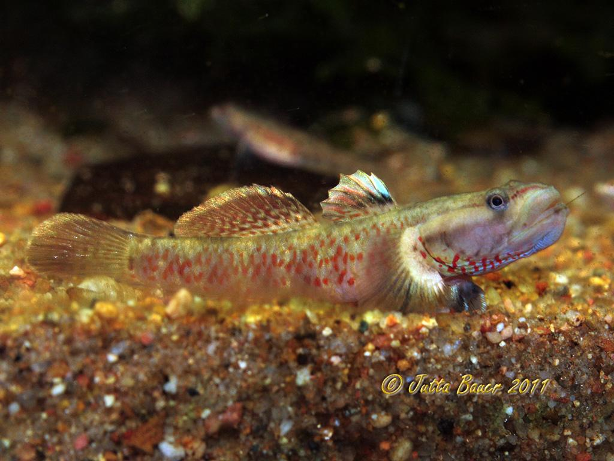
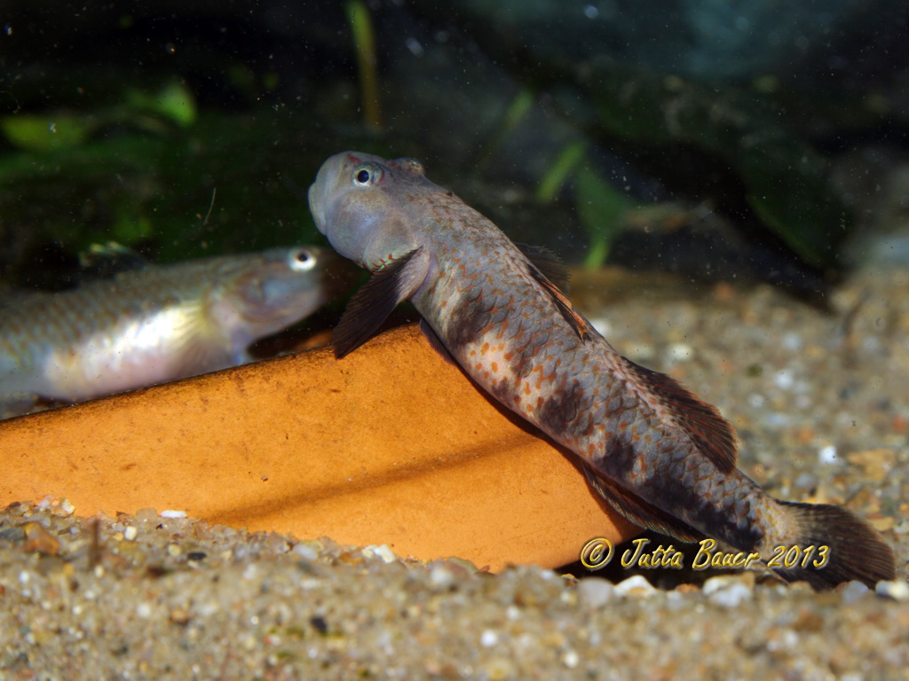

前部亚圆筒形。头大，圆钝。眼中大，背侧位。唇略厚，发达。体被大栉鳞。。腹鳍略短于胸鳍，圆形，左、右腹鳍愈合成一吸盘。尾鳍长圆形，短于头长。

头、体呈亮褐色，活时为金黄色。体侧具6～7个方形暗灰色的宽斑块，背侧亦具6～7个大圆亮斑；体侧无灰褐色垂直宽条纹。体侧每一鳞袋后缘暗褐色。颊部和鳃盖骨部无蠕虫形红褐纹。头部眼睛附近具2条深黑色条纹：一条自眼前缘向前伸达吻端，与对侧的形成“U”形纹；另一条黑色条纹很长，由眼的下缘向下垂直伸向口角或稍后处。吻背自眼前方至吻端具“U”形黑纹。颊部浅色，除眼下缘弯向口角的黑纹外，隆起部分无任何斑纹。鳃盖部具许多网格状橘红色小圆斑。雄鱼鳃盖膜具许多红色或橘红色小圆斑，雌鱼鳃盖膜圆斑较少。项部具若干条不规则的橘色或棕色条纹。第一背鳍灰橘色（雄鱼）或透明且具若干个褐色小点（雌鱼），第一及第二鳍棘间的鳍膜上具1灰色或黑色小斑；第二背鳍具4～6纵列橘色或棕色小点，有时连成线纹。雄鱼臀鳍橘色，具亮黄色小圆点，近边缘处具黑色条纹；雌鱼的为亮黄色或白色。胸鳍基部黄色，密具珠色小圆斑。尾鳍基具水平状短黑纹，尾鳍透明，具4～6行由褐色圆点组成的垂直条纹。

## 瑶山吻虾虎鱼

Rhinogobius yaoshanensis  (Luo, 1989)

生活于南部山区河、溪中游的小型底层鱼类。不常见，无食用价值。分布于广西大瑶山、金秀等河、溪中。为中国特有种。

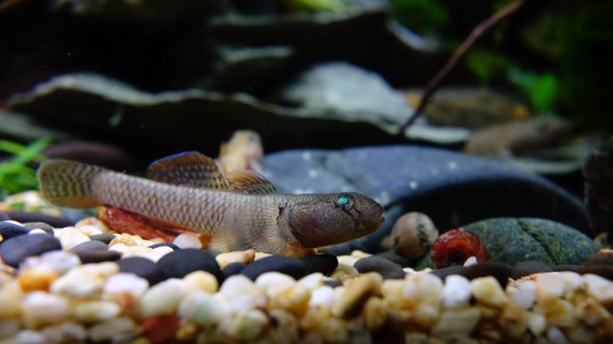
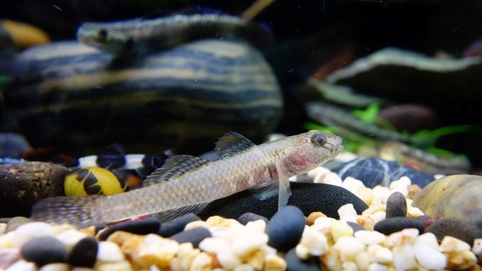

前部近圆筒形。头中大，圆钝。头部具5个感觉管孔。雄鱼吻短而圆钝，雌鱼稍尖，吻长稍大于眼径。眼间隔稍宽，小于眼径，微内凹。口中大，前位，斜裂。两颌约等长。唇略厚，发达。被中大弱栉鳞。胸鳍宽大，圆形，下侧位，鳍长约等于吻后头长，后缘几乎伸达肛门上方。腹鳍短于胸鳍，圆盘状。

头、体呈棕褐色。体侧有5～6个暗斑，跨越背部。头部在眼前下缘有2条斜带：一条自眼前缘至上唇；另一条自眼前缘至口角，颊部常具褐色小点。各鳍呈灰黑色，雄鱼的背鳍、臀鳍、尾鳍边缘为浅灰色，第一背鳍第一至第二鳍棘之间的鳍膜上有1个小黑点。雄鱼第二背鳍、尾鳍具点状条纹数行，臀鳍浅灰色，腹鳍灰黑色。

## 褐吻虾虎鱼

Rhinogobius brunneus  (Temminck & Schlegel, 1845)

栖息于底质多沙砾的溪流中。分布鱼云南南盘江和元江水系。

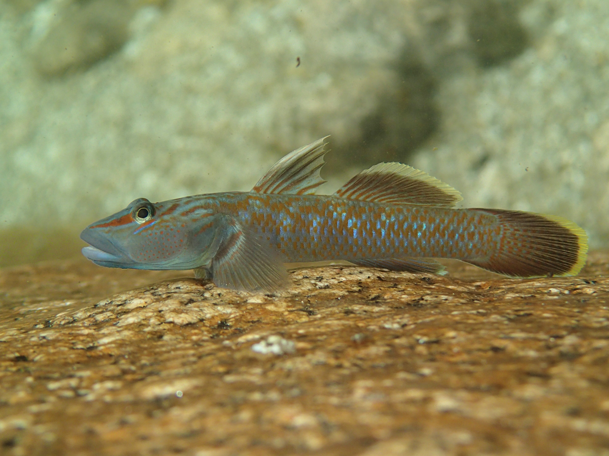
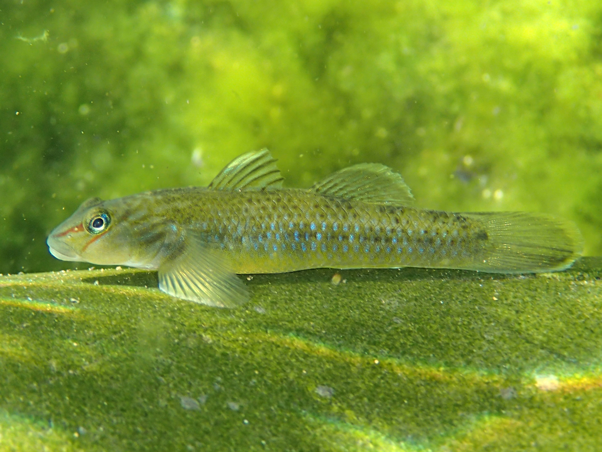

体前部近圆筒形，后部侧扁。头较大。吻较短，且圆钝，吻长稍大于眼径。眼小，背侧位，略鼓出，眼后缘约位于头的中部。眼间隔窄，略小于眼径。口端位，上下颌等长。口裂倾斜。上下唇发达，颇厚。胸鳍宽大。腹鳍圆盘状。尾鳍圆形。

体灰褐或绿褐色，腹部灰白。体侧有暗斑数个，或不明显。体侧各鳞片具1红点。头背面、颊部和鳃盖具红色虫状纹或斑点。第一背鳍有时具有黑斑。背鳍、尾鳍具数行褐色小点构成的条纹，其余各鳍浅色。栖息于底质多沙砾的溪流中。分布鱼云南南盘江和元江水系。（云南鱼类志下册P255）

## 周氏吻虾虎鱼

Rhinogobius zhoui  Li & Zhong, 2009

目前仅发现分布于中国广东省海丰县莲花山的溪流中，溪中河床以沙石为主，并伴有大块的岩石，同一溪流中还分布有溪吻虾虎鱼、李氏吻虾虎鱼。

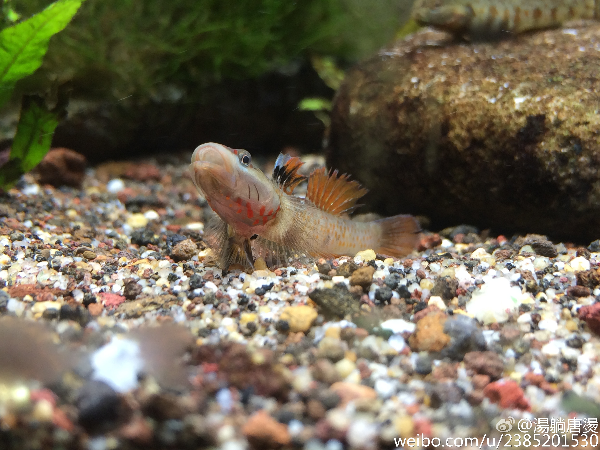

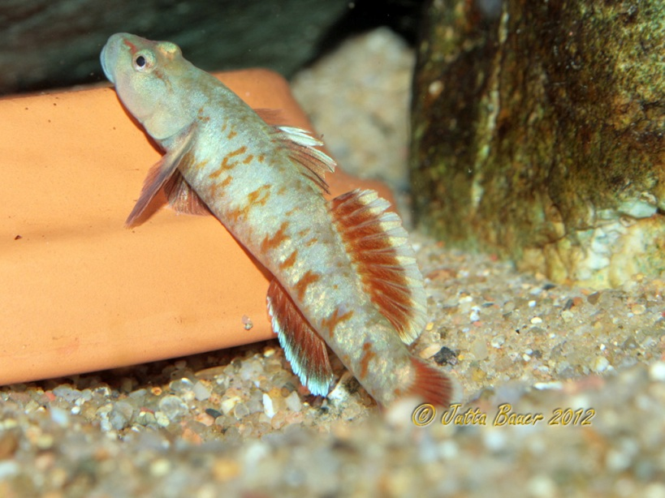

前部亚圆筒状。头大，稍平扁。眼间隔甚狭窄，小于眼径，稍内凹。口中大，斜裂。体被中大弱栉鳞，前部鳞小，后部鳞较大。

成年雄性头、体浅白色，略带浅蓝色光泽；头部仅眼周部具红棕色条纹，眼前缘具红棕色条纹延伸至近上唇部；颊部与鳃盖膜呈亮白色，不具有任何斑纹；体侧具 6—8个橙红色斑块；胸鳍基白色，中部略偏上位置具一不明显的点状斑；各奇鳍均具宽大的亮白色边缘，内侧为橙红色，其中第一背鳍大部分呈白色，不具有黑斑；偶鳍上少有色素分布。成年雌性头、体浅棕色；颊部与鳃盖膜色浅，不具有斑纹；体侧具 6—8 个橙红色斑块；胸鳍基部中上方通常具一黑斑块；各奇鳍橙色，具较窄的白色边缘，个别不明显；偶鳍上少有色素分布。