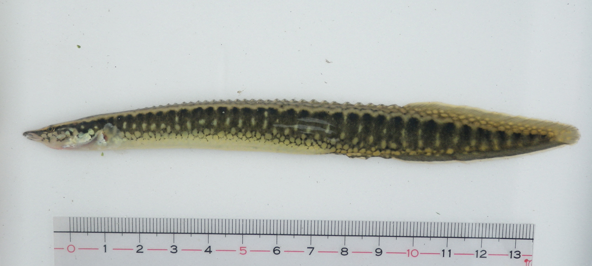
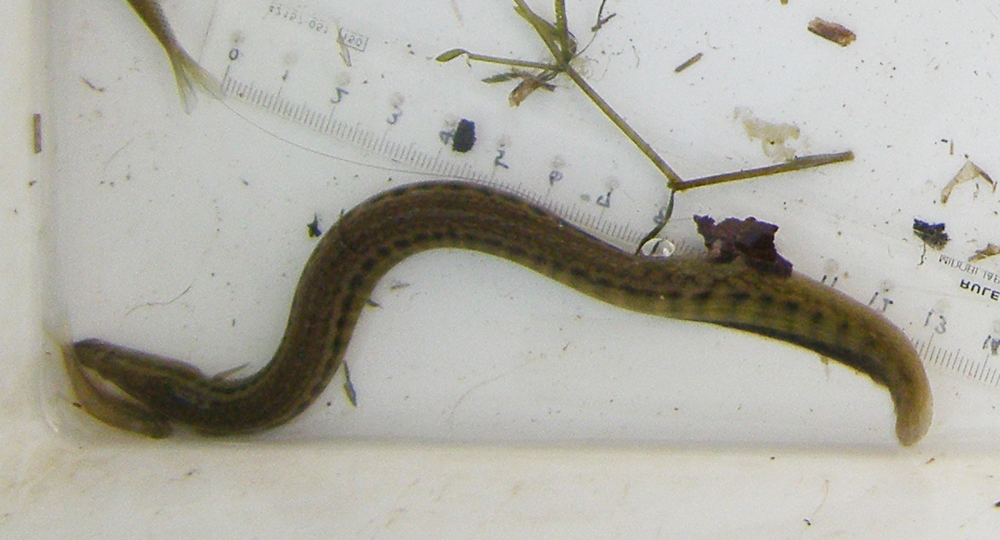

## 中华刺鳅

Sinobdella sinensis  (Bleeker, 1870)

CAFS:

<http://www.fishbase.org/summary/52400>

### 简介

体延长呈鳗状，侧扁。头略小而尖。眼小，被透明皮膜，无游离眼睑；眼间隔窄而隆起。口小，近横裂状，下颌较短。犁骨与腭骨无牙。前鳃盖骨无棘或锯齿。鳃盖膜不与峡部相连。无鳃耙。鳞片极细小，头、体及各奇鳍均被有。背鳍和臀鳍均与尾鳍相连续。背鳍各鳍棘以低鳍膜相连，呈分离状。臀鳍第三鳍棘距第一、第二鳍棘颇远。胸鳍小而圆。尾鳍尖形。体褐或灰褐色。体侧有暗色垂直带纹，腹侧有淡色斑点，背侧或有虫状纹。背鳍有暗褐色网状纹，臀鳍略黑而有白色边缘。体背部黑褐色，侧面灰黑色，背、腹部有许多网状花纹，体侧有十多条垂直褐斑。分布于亚热带地区。

### 形态特征

背鳍XXXI—XXXV-54—72；臀鳍Ⅲ-45—70；胸鳍22—23；尾鳍8—9。体长115—216毫米。 体长为体高9—14．4倍，为头长5．8—6．8倍。体延长呈鳗状，侧扁。头略小而尖，头长为吻长3—3．7倍，为眼径9．2—10．7倍。眼小，被透明皮膜，无游离眼睑；眼间隔窄而隆起。口小，近横裂状，下颌较短。牙细小绒毛状，在两颌上排列呈窄带状。犁骨与腭骨无牙。眶前骨有一强棘。前鳃盖骨无棘或锯齿。鳃盖膜不与峡部相连。无鳃耙。鳞片极细小，头、体及各奇鳍均被有。背鳍和臀鳍均与尾鳍相连续。背鳍各鳍棘以低鳍膜相连，呈分离状。臀鳍第三鳍棘距第一、第二鳍棘颇远。胸鳍小而圆。尾鳍尖形。体褐或灰褐色。体侧有暗色垂直带纹，腹侧有淡色斑点，背侧或有虫状纹。背鳍有暗褐色网状纹，臀鳍略黑而有白色边缘。
身体略侧扁，极延长似鳗鱼状。头小而往吻端略呈尖三角状。吻稍长，口中大，末端可达眼睛直前，上唇延长而略往下垂。背鳍前部之硬棘部起于胸鳍后缘直上方，各棘均短而分离。背鳍、臀鳍与尾鳍完全相连而不可分；无腹鳍，胸鳍略小。身体被有极细小之鳞片；体侧约有40个宽而略相连的宽横带，横带中央部为较深褐色之横纹，横带与横带之间为淡白色之极窄间隔。体背部和背鳍软条基部为略规则之六角龟纹，背鳍软条部上半部和尾鳍均满布白色圆形斑。

### 地理分布

分布于分布于中国和越南的亚热带地区。，台湾原发现于西北部之台北及桃园地区。近年来已极罕见。

### 生活习性

### 资源状况

### 参考资料

北京鱼类志 P98

### 线描图片

### 标准图片

### 实物图片

