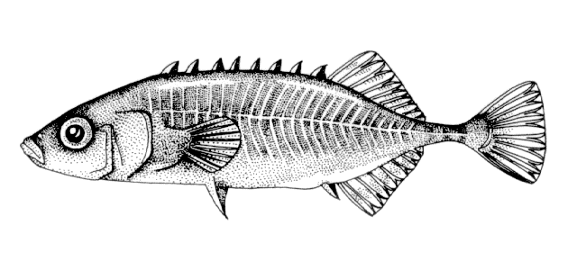
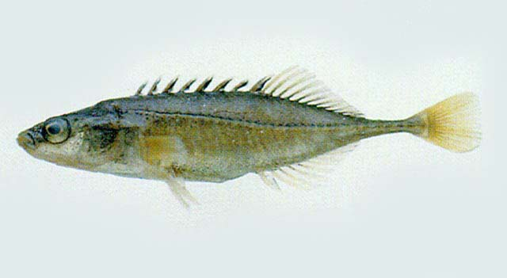
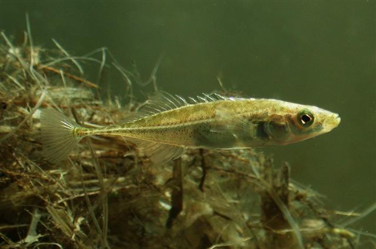

## 中华多刺鱼

Pungitius sinensis  (Guichenot, 1869)

CAFS:

<http://www.fishbase.org/summary/24828>

### 简介

体长形，侧高，尾柄细长，且有发达的侧棱。头较小，眼较大。身体的前部有薄骨片，后部光滑。背鳍由两部分组成，第一背鳍由分离的小刺组成，小刺左右倾斜，第二背鳍由鳍条组成。臀鳍与第二背鳍相对，前方具一游离硬刺。胸鳍略呈圆形。腹鳍有一硬刺。尾鳍微凹近截形。体呈草绿色，腹部白色。生活在水草丛生的浅水水域。分布于吉林、辽宁、黑龙江、河北、天津等地。

### 形态特征

背鳍Ⅷ-Ⅸ，8-12;臀鳍Ⅰ-8-11。侧线骨板32—33。体长27.0-54.3mm：体长为体高4.5—6.8倍，为头长3.4—4.2倍。头长为吻长3.7—3.9倍，为眼径3.5—3.8倍。体细长，侧扁。尾柄细。口端位，上下颌有细齿。体侧骨板连续排列至尾部，骨板中央突起，在尾部形成脊棱。背鳍前有分离的硬棘9枚，第二背鳍与臀鳍相对。腹鳍、臀鳍有1硬棘。尾鳍稍内凹。背部黑绿色，体侧灰黄。

### 地理分布

分布于堪察加沿岸以及黑龙江、松花江、图们江、辽河、内蒙古、河北及长江流域等。

### 生活习性

是适低温的淡水栖居的小型鱼类。喜欢栖息在河流相通的静水河湾以及汜滥地、湖泊的死水湾中的多水草处。生性好斗，贪食。以摇蚊幼虫、枝角类、挠足类、介形类等浮游动物为食。也食其他鱼类的卵和仔鱼。一年性成熟，春天产卵，产卵时筑巢，雄鱼护卵。怀卵70-180粒，卵径0.8mm，孵化期约12天。

### 资源状况

### 参考资料

- 北京鱼类志 P88

### 线描图片

### 标准图片

### 实物图片

