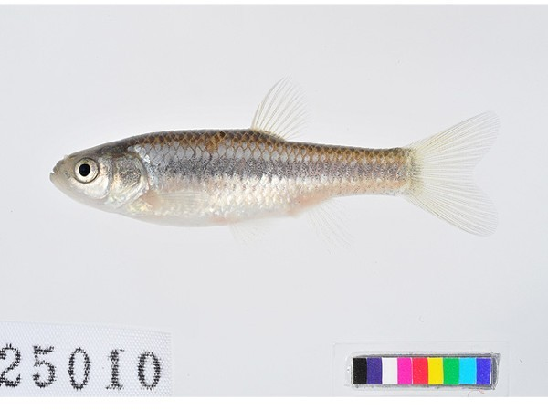

## 中华细鲫

Aphyocypris chinensis  Günther, 1868

CAFS:

<http://www.fishbase.org/summary/23617>

### 简介

体细长，稍侧扁，体高略小于头长。前腹圆，从腹鳍基底到肛门具有腹棱。吻钝。咽骨弧形，较窄。咽齿圆锥形，末端略成钩状。鳃耙短小，稀疏。沿体侧中部有1道不太显著的深色条斑。各鳍无明显斑纹。口端位，口裂向后方倾斜，唇薄，无须。腹鳍基部肛门之间有腹棱。鳃耙短小，稀疏。鳞片大，侧线不完全。集群性小型鱼类。生活于水田、沟渠、池塘、湖泊中。喜集群，游泳迅速。分布在四川、浙江、山东、福建、湖北、河北、东北等地。

### 形态特征

体细长，稍侧扁，体高略小于头长。前腹圆，从腹鳍基底到肛门具有腹棱。吻钝。口亚上位。口裂中等大小，向下倾斜。下领稍突出，上领末端向后延伸可达眼前缘下方，上下颌前缘不具相吻合的突起和凹陷。无口须。眼中等大小，侧上位。眼径约等于吻长。眼后头长大于吻长。眼间宽平，眼间距显著大于吻长。体被圆鳞，中等大小。侧线不完全（个别付缺），最长的也不超过胸鳍末端。
背鳍短，无硬刺，起点显著在腹鳍之后，距尾鳍基部的距离约等于到眼后缘的距离。胸鳍末端尖，向后接近腹鳍起点。腹鳍末端不及肛门。肛门紧挨于臀鳍起点之前。臀鳍起点稍后于背鳍基部后端，鳍条不特别延长。尾鳍叉形，末端稍尖。
下咽骨弧形，较窄。咽齿圆锥形，末端略成钩状。鳃耙短小，稀疏。肠短，其长度稍小于体长。鳔2室，后室长稍大于前室长的2倍。腹膜灰白，带有小黑点。固定标本体背棕褐色，从背鳍后缘到尾鳍基部有1道黑纹，腹面灰白。沿体侧中部有1道不太显著的深色条斑。各鳍无明显斑纹。

### 地理分布

广泛分布于我国辽河以南东部各水系。

### 生活习性

中华细鲫为一种小型鱼类，常见个体长为30～50mm，采到的最大个体长为46mm。数量较少。未见到在同一生活区内存在较大的种群，无经济价值。喜生活在水质清新的池塘、稻田、沟渠、水库及江河中；喜集群，游泳迅速，生长缓慢，一龄鱼可达性成熟，生殖季节在5- 6月，怀卵量较少。

### 资源状况

### 参考资料

- 北京鱼类志 P37

### 线描图片

### 标准图片

### 实物图片

