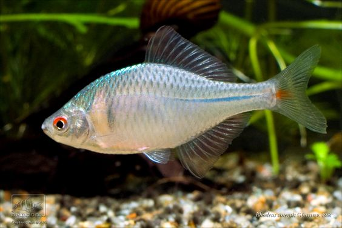

## 中华鳑鲏

Rhodeus sinensis  Günther, 1868

CAFS:

<http://www.fishbase.org/summary/54926>

### 简介

体侧扁，呈卵圆形，背部隆起，腹部凸，呈弧形。头小而尖。口角无须。眼侧位，眼间距稍大于眼径，眼上半部红色。侧线不完全，仅前面的3—7片鳞上具侧线孔。雌面具长的产卵管。体侧上部每个鳞片后缘都有一小黑斑。沿尾柄中线又一条黑色纵纹。鳃盖后方的体侧有两个一前一后的暗色斑。生殖季节雄鱼色彩异常鲜艳，吻部及眼眶周缘具珠星。卵在河蚌壳内发育。喜栖息在氧气条件好、水流缓慢、底质具有淤泥的浅水处。以高等植物的碎屑和藻类为食。长江流域及河北、山西有分布。

### 形态特征

体侧扁，头小。口角无须。下咽齿1行，齿面平滑。侧线不完全，仅前面的3～7片鳞：上具侧线孔。生殖季节雄鱼色彩异常鲜艳，吻部及眼眶周缘具珠星。雌鱼具长的产卵管。个体小，最大体长80毫米。中华鰟鮍属于1龄性成熟，其据对生殖力一般为200—300粒，繁殖期具有 领地观念，繁殖期为5月。雄鱼具鲜艳的婚姻色彩，吻部及眼眶周缘具珠星。雌鱼具长的产卵管，将卵产于蚌的鳃瓣中。

### 地理分布

中华鰟鮍即原彩石鳑鲏、彩石鲋，根据分布地的不同又有南、北两种表现类型。南中华身体较高且颜色艳丽，北中华较为细瘦，颜色也没有南方类型鲜艳。分布于除青藏高原外的我国各地；国外见于朝鲜。

### 生活习性

生活于沟渠、池塘等浅水中，常见于泥沙较多、水流缓慢的多水草处。以藻类为食。

### 资源状况

### 参考资料

- 北京鱼类志 P63

### 线描图片

### 标准图片

### 实物图片

