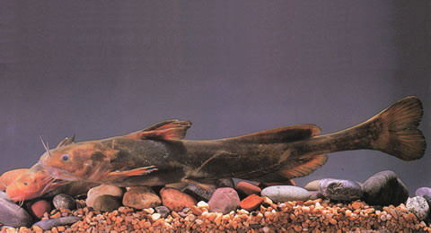
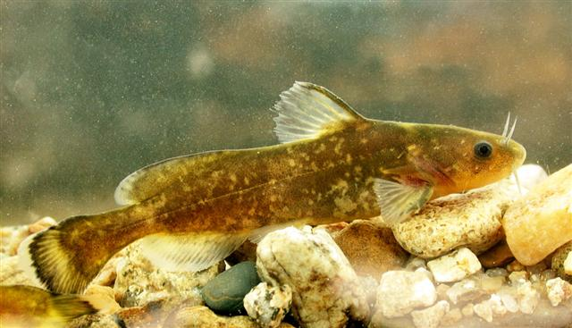

## 乌苏里拟鲿

Pelteobagrus ussuriensis  (Dybowski, 1872)

CAFS:750200050050A30008

<http://www.fishbase.org/summary/28050>

### 简介

又名牛尾巴。体延长，前部粗圆，后部侧扁。头纵扁，头顶有皮膜覆盖；上枕骨棘几裸露，与项背骨接近。吻稍尖圆。口下位，横裂。唇厚。上颌突出于下颌。上、下颌具绒毛状细齿，形成齿带；腭骨齿带呈新月形。眼小，侧上位，位于头的前部，眼缘不游离，被皮膜覆盖。背鳍骨质硬刺前缘光滑，后缘具弱锯齿，刺长稍长于胸鳍硬刺。尾鳍内凹，上叶稍长，末端圆钝。体呈灰黄色，腹部白色。比黄颡鱼少很多，主要分布于黑龙江、长江等流域。

### 形态特征

背鳍条I―7；臀鳍条18；胸鳍条I―7，腹鳍条6。鳃耙12~14。 体长为体高的4.7~6.5（5.6±0.78）倍，为头长的4.2~5.0（4.8±0.33）倍，为尾柄长的6.1~9.5（7.4±1.38）倍。头长为吻长的2.1~2.8（2.5±0.33）倍，为眼径的9.1~10.5（9.8±0.71）倍，为眼间距的2.3~2.7（2.5±0.18）倍。尾柄长为尾柄高的1.6~2.7（2.4±0.43）倍。 身体较长，前部宽厚，后部侧扁。体裸无鳞，侧线完全。头扁平，头顶有皮膜覆盖。吻端圆钝，口下位，横裂。上、下颌有绒毛状细齿。眼小位于头的前部，侧上位。鼻孔2对，前鼻孔位于吻端，呈管状。后鼻孔位于吻端至眼的中央。须4对，鼻须1对，其末端达眼的中点；上颌须1对较长，超过头长的1/2；下颌须2对，外侧须长于内侧须。鳃膜不与峡部相连。背鳍具硬刺，前缘光滑，后缘有锯齿，起点距吻端等于距臀鳍起点的距离。脂鳍较长，起点与臀鳍起点相对。胸鳍具有1硬刺，后缘有发达的锯齿。腹鳍末端达至肛门。尾柄细长。尾鳍凹型，上、下叶圆钝。 体背、体侧灰黄色，上部深于下部，腹部白色。背鳍、尾鳍末端为黑色。

### 地理分布

广泛分布于黑龙江、乌苏里江、嫩江、松花江、珠江等水域，洪泽湖、太湖也有分布。

### 生活习性

喜欢栖息在缓流中，人工养殖可以生活在静水中。从幼鱼开始，即摄食浮游动物和底栖生物。成鱼食物组成主要为蜉蝣类和毛翅类幼虫，摇蚊幼虫、蚊类等昆虫、小鱼。在人工养殖条件下，可以摄食人工配合饲料。常年摄食，生殖期及冬季摄食减弱。

### 资源状况

### 参考资料

- 北京鱼类志 P85

### 线描图片

### 标准图片

### 实物图片

