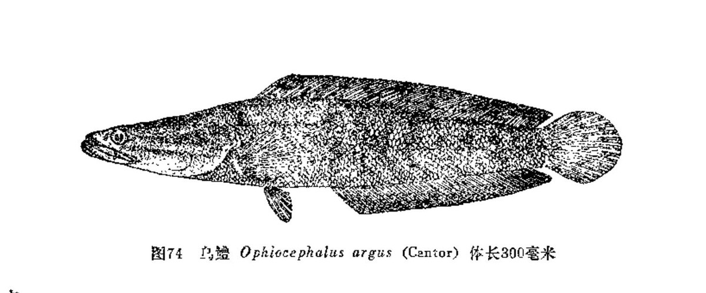
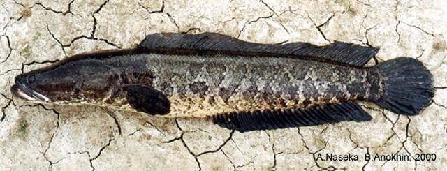
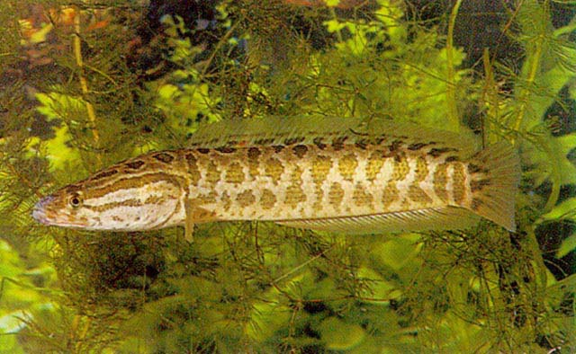

## 乌鳢

Channa argus  (Cantor, 1842)

CAFS:750200420A20010004

<http://www.fishbase.org/summary/4799>

### 简介

又名黑鱼、乌棒、财鱼、才鱼、生鱼、孝鱼、斑鱼、戾鱼、蛇头鱼、文鱼、蠢鱼、草鳢、黑鱼棒子。体形呈长棒状。头部扁平，头大，口裂大。吻部圆形。口内齿牙丛生。偶鳍皆小，背鳍和臀鳍特长，尾鳍圆形。头部与躯干部皆被有大小相似的鳞片。侧线完整，在胸鳍的后方有个弯曲。 头顶部有许多感觉小孔，大鱼其数目较多。体色背部灰绿色，腹部灰白，体侧有作八字形排列的显明黑色条纹。头部有三对向后伸出的条纹。背鳍、臀鳍和尾鳍具有黑白相间的花纹。胸鳍、腹鳍浅黄色，胸鳍基部有一黑点。底栖鱼类，性情凶猛，成鱼以小鱼、小虾、水生昆虫为食。喜欢潜伏在水草丛中追捕猎物。适应性强，可以在水面呼吸。冬季在淤泥中过冬。除西部高原地区外均有分布。

### 形态特征

形呈长棒状。头部扁平，头大，口裂大。吻部圆形。口内齿牙丛生。偶鳍皆小，背鳍和臀鳍特长，尾鳍圆形。头部与躯干部皆被有大小相似的鳞片。侧线完整，在胸鳍的后方有个弯曲。 头顶部有许多感觉小孔，大鱼其数目较多。体色背部灰绿色，腹部灰白，体侧有作八字形排列的显明黑色条纹。头部有三对向后伸出的条纹。身体前部呈圆筒形，后部侧扁。头长，前部略平扁，后部稍隆起。吻短圆钝，口大，端位，口裂稍斜，并伸向眼后下缘，下颌稍突出。牙细小，带状排列于上下颌，下颌两侧齿坚利。眼小，上侧位，居于头的前半部，距吻端颇近。鼻孔两对，前鼻孔位于吻端呈管状，后鼻孔位于眼前上方，为一小圆孔。体色呈灰黑色，体背和头顶色较暗黑，腹部淡白，体侧各有不规则黑色斑块，头侧各有2 行黑色斑纹。奇鳍黑白相间的斑点，偶鳍为灰黄色间有不规则斑点。全身披有中等大小的鳞片，圆鳞，头顶部覆盖有不规则鳞片。侧线平直，在肛门上方有一小曲折，向下移二行鳞片，行于体侧中部，后延至尾基。
乌鳢的黑龙江亚种主要特征为：背部颜色为深绿黑色，体侧有不规则黑绿色，背鳍和尾鳍与背部同色，胸鳍和臀鳍色浅。
乌鳢与斑鳢的主要差别是：乌鳢体较长，斑鳢钵较短；两者头顶部斑纹也有明显差别：乌鳢头顶部有七星状斑纹，斑鳢头顶部则呈近似“一八八”三个字之斑纹；此外，乌鳢的头比较尖长，更似蛇。

### 地理分布

### 生活习性

底栖性鱼类，通常栖息于水草丛生、底泥细软的静水或微流水中，遍布于湖泊、江河、水库、池塘等水域内。时常潜于水底层，以摆动其胸鳍来维持身体平衡。平时喜生活在沿岸泥底水草丛生的浅水区，潜伏在水草中等待时机追捕食物，夜间有时在水的上层游动。平时游动缓慢，在缺氧的水体中能借助鳃上腔的辅助呼吸器，不时将头斜露出水面进行呼吸，而且在喉部上方凹陷处贮藏着一定量的气体。当离开水体后还能存活相当长的时间。可以离水生活3天之久。冬季在深水处，把身体埋在淤泥中越冬，一般很少摄食。春、秋季为摄食旺季，产卵期亲鱼基本不摄食。性凶猛，仔鱼以浮游动物为食；幼鱼以水生昆虫、小虾和小鱼为食；成鱼则捕食其它鱼类。乌鳢长至2龄可达性成熟，怀卵量为1.4-3.4万粒。亲鱼于5-7月在长有茂盛水草的静水浅滩处繁殖。亲鱼成对地活动于产卵场所，非常活跃，有时还跃出水面。生长速度较快，最大个体长可达700毫米，重达5公斤左右。

### 资源状况

### 参考资料

- 北京鱼类志 P96

### 线描图片

### 标准图片

### 实物图片

