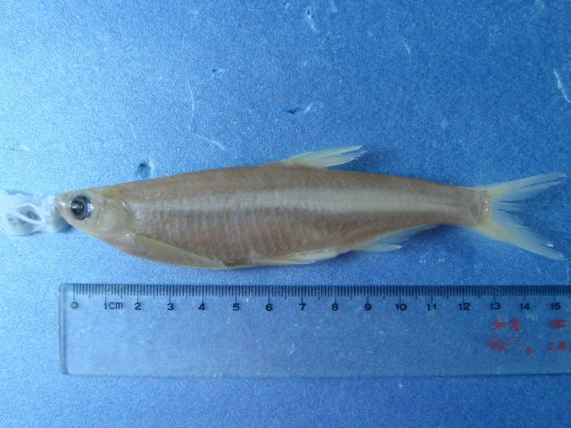
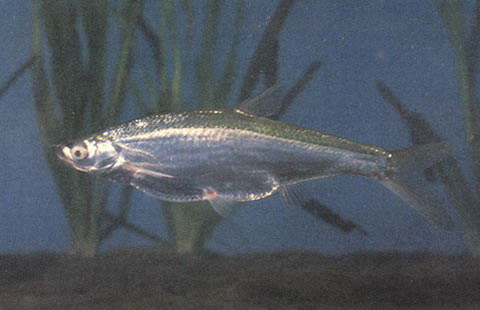

## 似鱎

Toxabramis swinhonis  Günther, 1873

CAFS:

<http://www.fishbase.org/summary/55396>

### 简介

俗称锯鲦，又称为薄䱗，体甚侧扁，背部较平直，腹部弧形，自峡部至肛门具腹棱。头短，侧扁，头背平直，头长显著小于体高。背鳍位于腹鳍基后上方，外缘平直，最后不分枝鳍条为硬刺，后缘具锯齿，刺长短于头长；背鳍起点至尾鳍基的距离较至吻端为近。体呈银白色，背侧色较暗。体侧有一条亮银色纵带纹，液浸后变为黑色。小型鱼类，一般栖息于水体的中上层。常成群游于水面。食物喂枝角类、浮游藻类及少量的昆虫幼虫等。分布于长江、黄河等水系。

### 形态特征

体甚侧扁，背部较平直，腹部弧形，自峡部至肛门具腹棱。头短，侧扁，头背平直，头长显著小于体高。吻短，稍尖，吻长小于眼径。口小，端位，上下颌约等长，上颌骨末端伸达鼻孔的下方。眼中大，位于头侧，眼后缘至吻端的距离稍大或等于眼后头长。眼间隆起，眼间距一般大于眼径。鳃孔宽，向前伸至前鳃盖骨后缘的下方；鳃盖膜与峡部相连；峡部窄。鳞薄，中大。侧线自头后向下倾斜，至胸鳍后部突然弯折成与腹部平行，行于体之下半部，至臀鳍基后端又折而向上，伸至尾柄中央。
背鳍位于腹鳍基后上方，外缘平直，最后不分枝鳍条为硬刺，后缘具锯齿，刺长短于头长；背鳍起点至尾鳍基的距离较至吻端为近。臀鳍位于背鳍基的后下方，外缘微凹，起点至腹鳍起点的距离大于臀鳍基部长。胸鳍末端尖形，后伸不达腹鳍起点；胸鳍长与头长约相等。腹鳍短，位于背鳍起点之前，后伸不达肛门。尾鳍深分叉，下叶长于上叶，末端尖形。
鳃耙细长，排列密。下咽骨略呈钩状，中间较宽，前臂长于后臂。主行下咽齿略侧扁，末端尖而钩状。鳔2室，后室长，末端具小突；后室长为前室长的2倍左右。肠呈前后弯曲，肠长短于体长。腹膜银白色，散布黑色小点。
体呈银色。固定标本体侧自头后至尾鳍基常具1暗色纵带。

### 地理分布

分布于长江、黄河等水系。

### 生活习性

小型鱼型，中、上层生活，食浮游生物。6～7月产卵，卵漂流性。

### 资源状况

### 参考资料

- 北京鱼类志 P47

### 线描图片

### 标准图片

### 实物图片

