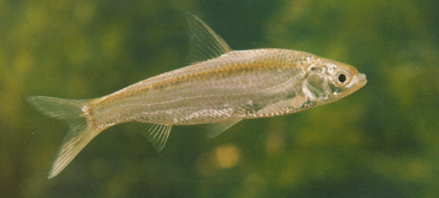
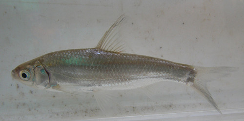

## 似鳊

Pseudobrama simoni  (Bleeker, 1864)

CAFS:

<http://www.fishbase.org/summary/56111>

### 简介

又名逆鱼、刺鳊。体长而侧扁。头短。吻钝。口下位，横裂。唇较薄。尾鳍深叉形。体背部和体上侧为青灰色，体下侧和腹部为银白色。背鳍、尾鳍浅灰色，腹鳍、胸鳍基部浅黄色，臀鳍灰白色。小型鱼类，栖息于水的中下层，主要食物是硅藻、丝藻类及高等植物碎片，喜用下颌刮取食物。喜群集逆水而游。在长江流域分布广泛。

### 形态特征

体长而侧扁。头短。吻钝。口下位，横裂。唇较薄。下颌角质边缘不甚发达。眼侧上位，眼径约与吻长相等。无须。鼻孔位于眼的前上方，至眼的距离近于至吻端的距离。鳞中大；侧线完全，前段微向下弯，向后延伸至尾柄正中。
背鳍起点距吻端比距尾鳍基为近；末根不分支鳍条为光滑的硬刺。腹鳍起点在背鳍起点之前，其基部有1狭长的腋鳞。肛门紧靠臀鳍起点。肛门至腹鳍基部有完全的腹棱。臀鳍末端不达尾鳍基部。尾鳍叉形。
下咽骨弧形，咽齿侧扁，顶端钩形。鳃耙纤细，排列非常紧密。鳔2室，后室长，末端尖，为前室的2倍以上。腹膜黑色。
体背部和体上侧为青灰色，体下侧和腹部为银白色。背鳍、尾鳍浅灰色，腹鳍、胸鳍基部浅黄色，臀鳍灰白色。

### 地理分布

分布于长江、黄河及海河等水系。

### 生活习性

喜欢群集逆水而游，食物以硅澡和蓝丝澡为主，个别个体还吃一些枝角类，桡足类及甲壳动物。

### 资源状况

### 参考资料

- 北京鱼类志 P61

### 线描图片

### 标准图片

### 实物图片

