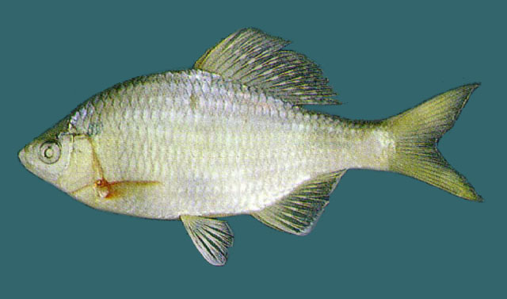
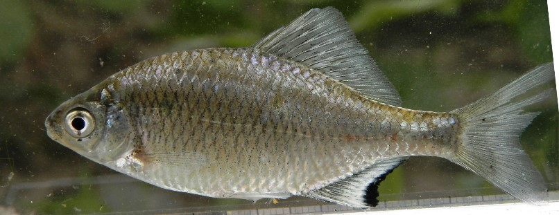

## 兴凯鱊

Acanthorhodeus chankaensis  (Dybowski, 1872)

CAFS:

<http://www.fishbase.org/summary/46831>

### 简介

又名兴凯刺鰟鲏。体侧扁而高，呈椭圆形。口角无须。眼较大，侧位。侧线完全，较平直。背鳍和臀鳍均具细而尖的硬刺。体背部灰褐色，腹侧银白色。沿尾柄正中线有一条细的黑色纵纹。背鳍有两列黑白相间的条纹。雄鱼臀鳍边缘深黑色。生活习性和其它鰟鲏亚科类似。在我国分布广泛。

### 形态特征

体侧扁．短而高．体宽不及体高的1/3头小，头长几等于头高。吻短钝。从鼻孔前缘至吻端往往较至眼前缘为近极少数个体介于二者之中。口端位，口裂极浅，口角左右间距显著大于间中点距中点至下颌顶端距离。口角与眼下缘处在同一水平线上。一般口角无须，偶有须短如突起、或成双或单个。鳃孔上角接近眼上缘水平线。鳃盖膜至鳃盖骨前缘下方连于峡部．侧线完全，沿体中线至尾柄中央。
背、臀鳍末根不分枝鳍条较粗于各自首根分枝鳍条；第二根不分枝鳍条较短，约为末根不分枝条长的1/3—1/2。背鳍位于体中央，或前后稍有移动。前移的多半是雌鱼，向后移的多半是雄鱼。臀鳍起点和背鳍第五一六分枝鳍条相对。腹鳍位于背鳍前下方，起点在胸鳍基和臀鳍起点之间或近后者。腹鳍末端达臀鳍（雄鱼）或相距1鳞片（雌鱼）。胸鳍末端触及腹鳍（雄鱼）或相距2鳞片（雌鱼）。肛门位于腹鳍基和臀鳍起点之间。尾鳍浅分叉，上下叶等长。
背鳍前鳞呈棱脊的占1/2。下咽骨似弧形．咽齿侧扁，齿侧具凹纹，个别齿光滑。鳃耙短，排列密，其长约为最长鳃丝的1/4—1/3。鳔2室，前短后长。消化管长约为体长的5.9—6.5倍。
固定标本沿尾柄黑纵条向前止于背鳍起点之下。雄鱼臀鳍外缘有宽黑边，黑边宽约占最长鳍条1/3。背、臀鳍第二不分枝鳍条末端黑色。

### 地理分布

分布于长江、珠江、韩江、黄河、黑龙江等水系。

### 生活习性

生活于江河、沟渠和池塘的缓流及静水浅水处。摄食硅藻、蓝藻和丝状藻类等。背鳍和臀鳍有两列黑色小斑点。腹鳍和臀鳍为黄白色，雄鱼臀鳍外缘镶有较宽的深黑色饰边。雌鱼臀鳍无黑边。繁殖期间雄鱼体色艳丽，吻端具白色珠星，鳍条上的斑点更为明亮；雌鱼具一灰色产卵管，产卵于蚌类的鳃瓣中。

### 资源状况

### 参考资料

- 北京鱼类志 P70

### 线描图片

### 标准图片

### 实物图片

