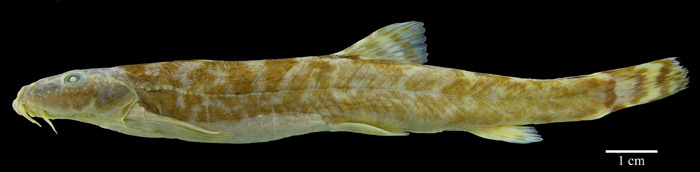
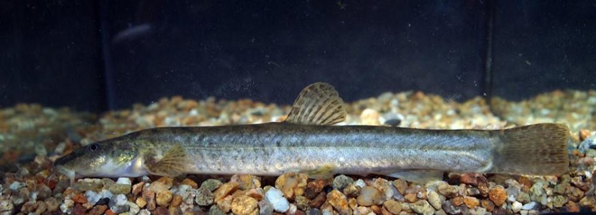

## 北方条鳅

Barbatula toni  (Dybowski, 1869)

CAFS:

<http://www.fishbase.org/summary/61649>

### 简介

体长形，前部近四方形，后部侧扁。头平扁且宽阔，宽度大于高度。口旁有3对小须。前鼻孔有短管，后鼻孔为圆孔状。鳃膜连于胸鳍。头与体均无显著的鳞片。背鳍无硬刺。胸鳍短小。尾鳍截形。体呈淡黄色，体侧有许多不规则的深褐色斑块。胸鳍、背鳍、尾鳍均有褐色斑纹。生活于水的底层，受惊吓即钻入石头等物底下隐藏。以藻类、植物碎片为食。适应环境能力强。一般生活于山区溪流中。主要分布于东北、内蒙古、山西、河北等地。

### 形态特征

背鳍Ⅱ～6～7；臀鳍Ⅱ～4～5。鳃耙11一14。椎骨36～40。
体长为体高6.2～7.6倍，为头长4.0一4.8倍。头长为吻长2.1～2.6倍，为眼径6.3一7.2倍，为眼间距5.0～6.7倍。尾柄长为尾柄高1.9一2.6倍。
体细长，几呈圆柱形，尾柄侧扁。头小，略平扁。口下位。似马蹄形。须3对，其中2对位于吻端，1对位于口角。眼小，略长。位于头侧上方.鳞极小，埋在皮下。头无鳞。侧线完全。背鳍无硬刺，起点和腹鳍起点相对，至吻端的距离大于至尾鳍基的距离。胸鳍距腹鳍较远。尾鳍截形。
背部黄褐色，背和体侧有深褐色云状斑。体例至腹部色浅。背鳍、臀鳍和尾鳍有若干纵列暗斑点。

### 地理分布

分布于黄河以北的山涧和冷水溪流中。

### 生活习性

一般生活在清冷水体中，图们江上游较多。喜栖息在有砂、卵石的河底。独个或少数几尾活动，不成大群。通常在无风时离开卵石作近距离活动及寻食，阴雨时则躲藏在石缝或石底下。杂食性，以水底甲壳动物、昆虫幼虫、附着藻类为食。

### 资源状况

### 参考资料

- 北京鱼类志 P82

### 线描图片

### 标准图片

### 实物图片

