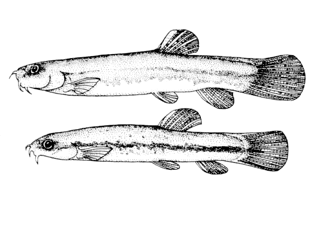
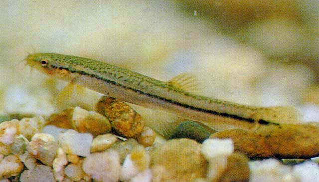
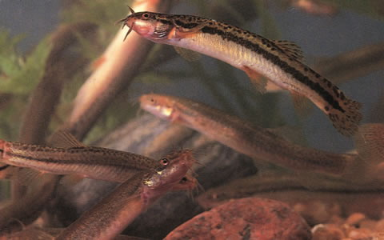

## 北鳅

Lefua costata  (Kessler, 1876)

CAFS:

<http://www.fishbase.org/summary/28022>

### 简介

又名八须泥鳅、纵带平鳅、泥鳅、须鼻鳅。体长形，前部稍扁平，后部侧扁。腹部圆。头宽而平扁。尾鳍圆形。鳞片甚小。无发达的侧线。口下位，有8小须，4个在唇上。背鳍不具鳍刺。体上部暗褐色，下部白色，北部及体侧有黑色小点。体侧有棕色狭条纹。尾基有以黑点。背鳍及尾鳍有小点。主要生活在静水和水流缓慢区域。数量不多，主要分布在北部地区，如黑龙江、内蒙古、山西、辽宁等地。

### 形态特征

体长4.8～7.4厘米时测定：背鳍Ⅱ6一7，臀鳍Ⅱ5。 头长为体长的19～23%，体高为体长的11～17%，吻长为体长的5一9%，眼径为体长的2.5一4.5%。尾柄长为体长的12～19%，尾柄高为体长的7～12%。 体断面圆，后部侧扁。头长大于体高，上颌略长于下须，口端位略向下，口唇丰厚。鼻须一对，上颌须三对（二对在吻端，一对在口角），其中口角的一对为长，后延可达眼后缘。眼小，上侧位。 背鳍无硬刺，起点偏于后部，在腹鳍基部之后。胸鳍小。肛门接近臀鳍。尾鳍截形。 背部灰绿色或棕灰色。体侧和腹部浅黄色，具有不规则的黑色斑点，或体中轴有暗色纹带，或整个斑点由纹带所代替，这是因地区而形成的变异。背鳍和尾鳍有黑色斑点，其它鳍灰白色。

### 地理分布

分布于黑龙江、吉林、辽宁、内蒙东部、山西、河北和山东等地。

### 生活习性

个体小，生活在水浅及水草丛生的河汊、沟渠和湖沼中，以水生昆虫及其幼虫、藻类和植物碎屑为食。常生活于静水和缓流河段。产卵期为4月初至7月。

### 资源状况

### 参考资料

- 北京鱼类志 P81

### 线描图片

### 标准图片

### 实物图片
