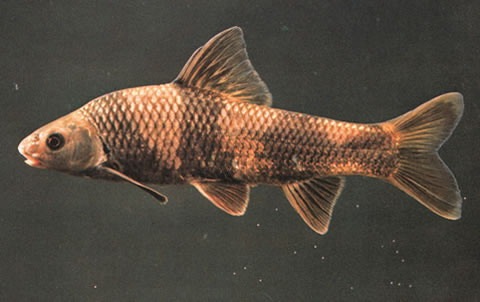
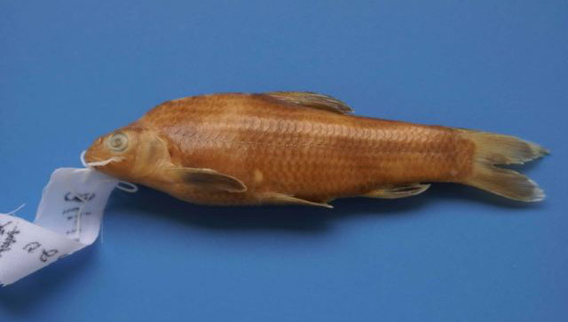

## 华鳈

Sarcocheilichthys sinensis  Bleeker, 1871

CAFS:750200040B10150006

<http://www.fishbase.org/summary/47349>

### 简介

又名花石鲫、乌鸦。体略高，稍侧扁，头后背部显著隆起，以背鳍起点处为最高，腹部圆，尾柄宽短，侧扁。体灰色，背部灰黑，腹部灰白。体侧具宽阔的垂直黑斑4块，各斑块的宽度与其间隔相等或稍大。各鳍灰黑色，边缘浅黄或呈白色。栖息于水的中下层，以底栖无脊椎动物、藻类及植物碎屑为食。利用它尖锐的下颌刮食固着在石头上的食物。在各大水系均有分布。

### 形态特征

背鳍条3，7；臀鳍条3，6；胸鳍条1,14～17;腹鳍条1,7;侧线鳞40～42；下咽齿1行，5－5。背鳍前鳞11～14;围尾柄鳞16。第一鳃弓外侧鳃耙7～8；脊椎骨4+36～37。体长为体高的3.1～3.7倍，为头长的4.3～4.8倍，为尾柄长的5.2～6.5倍，为尾柄高的6.4～7.4倍。头长为吻长的2.5～2.9倍，为眼径的3.8～4.8倍，为眼间距的2.0～2.4倍，为尾柄长的1.1～1.4倍，为尾柄高的1.4～1.7; 尾柄长为尾柄高的1.0～1.2倍。体侧扁，头后背部隆起，腹部圆,尾柄宽短,侧扁。头短小，吻圆钝，微突出。口甚小,下位，略呈马蹄形。唇稍厚，唇后沟中断，间隔较宽，下颌前缘有较发达的角质，口角一对短须。背鳍不分枝鳍条基部较硬，末端柔软分节，背鳍起点距吻端比距尾鳍基为近。臀鳍甚短，尾鳍分叉较浅。侧线直，鳔2室，腹腔膜银灰色。体背灰黑色，体侧灰色，腹部灰白色。体侧有4条宽而垂直的黑色斑带。各鳍为灰黑色，边缘白色。在生殖季节，雄性个体吻部出现"珠星"，体色及各鳍均变为浓黑色，雌性个体变化不明显，唯产卵管延长。

### 地理分布

长江流域各水体。

### 生活习性

小型鱼类，体型较小，体长一般不超过150毫米，数量较少多，肉质较松软。栖息于中下层，多栖息于山溪支流河段，主要以摄食小型底栖动物为主，1冬龄始达性成熟，5－6月份为产卵季节。

### 资源状况

### 参考资料

- 北京鱼类志 P22

### 线描图片

### 标准图片

### 实物图片

