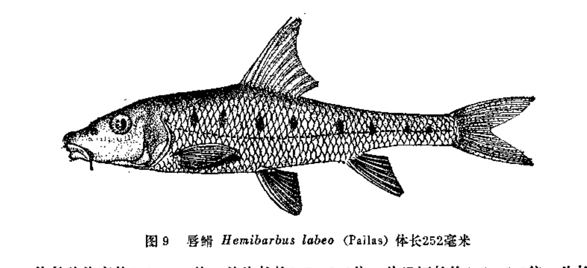
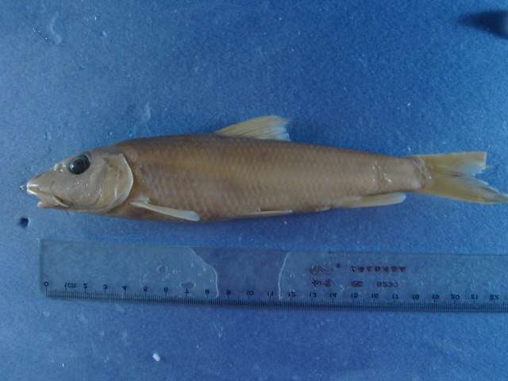
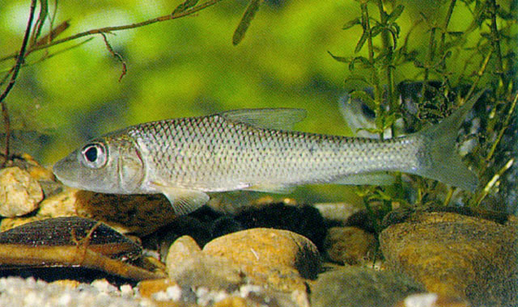

## 唇䱻

Hemibarbus labeo  (Pallas, 1776)

CAFS:750200040B10050002

<http://www.fishbase.org/summary/17301>

### 简介

又名重唇鱼、竹竿头、真口鱼。体长10到25厘米，略侧扁，胸腹部稍圆。头大，其长大于体高。吻长，稍尖而突出，长度显著
大于眼后头长。体背青灰色，腹部白色。成鱼体侧无斑点，小个体具不明显的黑斑。背、尾鳍灰黑，
其他各鳍灰白色。喜栖息于水流湍急的水中，幼鱼生活在水流平稳的地方。主要以水生昆虫及软体动物为食。生长较慢，数量少。分布于全国各主要水系。

### 形态特征

背鳍条III―7；臀鳍条III-6；胸鳍条I―17~18，腹鳍条I―8。鳃耙10~14。下咽齿3行，1.3.5―5.3.1（2行，2.4-4.2），侧线鳞 。 体长为体高的3.7~4.9（4.3）倍，为头长的3.5~3.8（3.7）倍，为尾柄长的5.4~7.4（6.4）倍。为尾柄高的9.8~11.0（10.3）倍。头长为吻长的2.1~2.4（2.2）倍，为眼径的4.3~5.2（4.9）倍，为眼间距的3.3~4.3（3.7）倍。尾柄长为尾柄高的1.4~1.9（1.6）倍。 体较长，稍侧扁，腹部圆。吻长，钝而圆。眼大，侧上位，眼间宽阔。前眶骨、下眶骨、前鳃盖骨边缘具一排粘液腔。口下位，呈马蹄形，唇厚，下唇发达，两侧叶宽厚，具皱褶，唇后沟中断，间距甚窄，中央有1三角形的小突起。颌须1对，略小于眼径，后伸达眼 前缘下方。下咽骨粗壮，主行末端呈钩状，外侧纤细。鳃耙发达。鳞小，侧线鳞完全。 背鳍具有一粗壮而光滑硬棘，背鳍起点距吻端较距尾鳍基为近；腹鳍起点位背鳍起点稍后。臀鳍起点距尾鳍基较距腹鳍起点为近。肛门紧靠臀鳍起点。 鳔较大，二室，后室末端尖细，为前室2.5倍。肠粗短。腹膜银灰色。 背部、体侧为灰褐色，腹部白色。鳞片边缘黑色，鳍为灰白色。幼鱼体侧有黑色斑点。

### 地理分布

黑龙江及支流、镜泊湖、五大连池。

### 生活习性

喜栖息流水与低温水域，多分布江河及大型湖泊。

### 资源状况

较少。

### 参考资料

- 北京鱼类志 P19

### 线描图片

### 标准图片

### 实物图片

