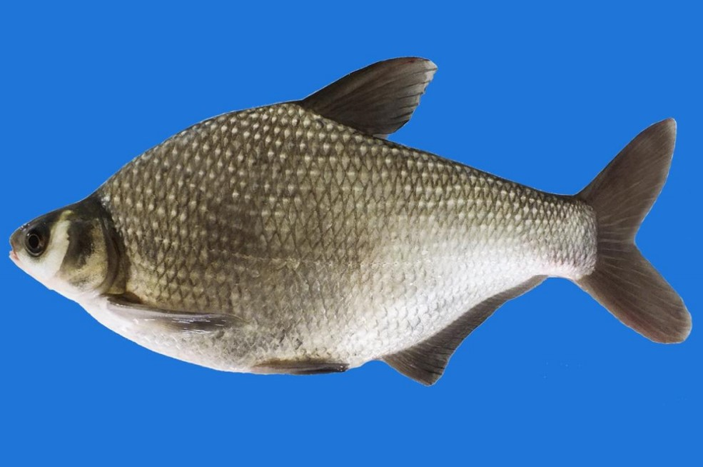
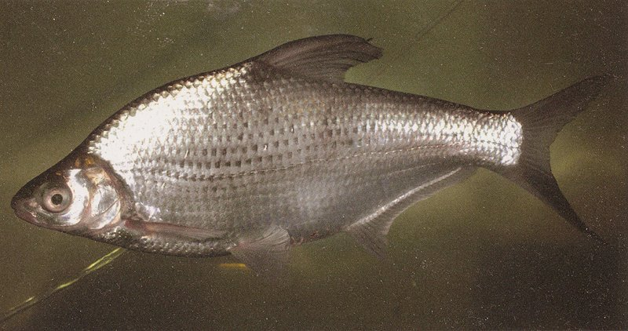

## 团头鲂

Megalobrama amblycephala  Yih, 1955

CAFS:750200040A90090004

<http://www.fishbase.org/summary/285>

### 简介

又名武昌鱼，体高，偏扁。腹棱自腹鳍至肛门。上下颌角质较薄。背鳍刺较短，其长度不及头长。尾柄高大于长。鳔3室，中室最大。生殖季节雌雄体上均具珠星，雄鱼第1根胸鳍条肥厚，略呈波浪形弯曲。体呈青灰色，体侧鳞片基部浅色，两侧灰黑色，在体侧形成数行深浅相交的纵纹。鳍呈灰黑色。生活在水的中下层，是适于静水水体繁殖生长的鱼类。幼鱼主要食甲壳动物，也食少量水生植物嫩叶，成鱼主要以水生植物为食。主要分布于湖北的中型湖泊，鄱阳湖也有分布。

### 形态特征

背鳍条3，7；臀鳍条3，25～30；侧线鳞50～56；下咽齿3行，2·4·5一4·4·2；鳃耙外侧12～16，内侧22～24；脊椎骨37～39。体长为体高的2.0～2.3倍，为头长的4.4～5.1倍；为见柄长的6.9～8.6倍，为尾柄高的7.1～8.5倍。头长为吻长的3.4～4.0倍，为眼径的3.9～4.3倍，为眼间距的1.9一2.4倍。体高、眼间距都随着鱼体的增长而相对增大，而头长、眼径则随鱼体的增长相对地减小。体高而十分侧扁，呈长梭形。背鳍位于身体最高处，起点在体轴正中，具有一个强大光滑的硬刺。臀鳍起点在背鳍基部之后，无硬刺。胸鳍末端延伸至胸、腹鳍基部距离的3／4～4／5处。尾鳍深叉形。头短而小，吻较钝圆，口端位，上下颌等长，具有角质"喙"。下咽齿细长，齿端呈小钩状。腹梭仅自腹鳍基部至肛门。鳞片中等大小。侧线直，横贯于体侧中部下方。鳔3室，前室为圆筒状，中室最大，呈圆锥形，后室细小。腹腔膜灰色或灰黑色。肠管前端比较扩大，后端细小，其长度约为体长的2.6～2.8倍。体呈灰黑色，体背部略带黄铜色泽，体侧每个鳞片后端的中部黑色素稀少，因此整个体侧呈现出数条灰白色的纵纹。各鳍呈青灰色。

### 地理分布

主要分布于长江中、下游的中型湖泊。

### 生活习性

团头鲂是适应于湖泊静水水体繁殖生长的鱼类。平时栖息于底质为淤泥，生长有沉水植物的敞水区的中下层。生殖季节，产卵群体群集于有水流的场所进行产卵。冬季则在深水处的泥坑中越冬。团头鲂的肥育期在6～1O月份，冬季基本停止援食。一幼鱼的食物主要是甲壳动物，也食少量的水生植物嫩叶。成鱼的食物是水生植物，其中以苦草、轮叶黑藻为主，其次为菹草、聚草、水绵及湖底的植物碎屑等。

### 资源状况

### 参考资料

- 北京鱼类志 P53

### 线描图片

### 标准图片

### 实物图片

