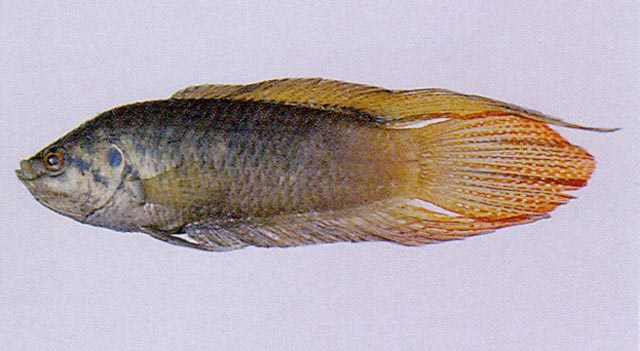
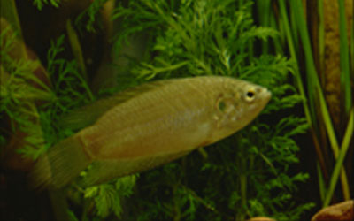

## 圆尾斗鱼

Macropodus ocellatus  Cantor, 1842

CAFS:750200420A30010002

<http://www.fishbase.org/summary/4795>

### 简介

又名老布鱼、斗鱼。身体侧扁切薄，略成长方形。头较大，吻短而钝。上颌与下颌均有小齿。前鳃盖骨又细锯齿。全身被鳞，鳞片较大，头部为圆鳞，体侧为栉鳞。背鳍前部为鳍刺，后部为分节的鳍条。腹鳍胸位，第一个鳍条为鳍刺，第二三根鳍条向后延伸。尾鳍圆形。体呈暗绿褐色，体侧有侧人字形黑蓝色横纹十余条，鳃盖后上角有以深蓝色圆斑。背鳍、尾鳍和臀鳍微红色，腹鳍灰褐色。雄鱼体色鲜艳。喜栖息于杂草丛生的池塘、湖边、沟渠的浅水区。以浮游动物为食，也吞食蚊子幼虫。主要分布在长江以北的河流中。

### 形态特征

体侧扁，呈长椭圆形，背腹凸出，略呈浅弧形。头侧扁。吻短突。眼大而圆，侧上位。眶前骨下缘前部游离，具弱锯齿，后部盖于皮下。眼间隔宽，微凸出。前鼻孔近上唇边缘，后鼻孔在眼近前缘。口小，上位，口裂斜，下颌略突出。上下颌牙细弱，犁骨与腭骨无牙，。前鳃盖骨和下鳃盖骨下缘具有弱锯齿。鳃孔重大。鳃上腔宽阔，内有迷路状鳃上器官，有辅助呼吸作用。噻耙退化，仅为短突起状。鳃盖膜左右相连，与峡部分离。
具圆鳞，眼间、头顶及体侧皆被鳞，背鳍及臀鳍基部有鳞鞘，尾基部亦被鳞。侧线退化，不明显。
背鳍一个，起于胸鳍基后上方，基底甚长，棘部与鳍条部连续，后部鳍条较延长。臀鳍与背鳍同形，略长于背鳍，起点在背鳍第三鳍棘之下。胸鳍圆形，较短小。腹鳍胸位，起点略前于胸鳍起点，外侧第一鳍条延长成丝状。尾鳍圆形。
体侧暗褐色，有的暗灰色，有不明显黑色横带数条。鳃盖骨后缘具一蓝色眼状斑块，小于眼径。在眼后下方与鳃盖间有二条暗色斜带。体侧各鳞片后部有黑色边缘。背鳍、臀鳍及腹鳍暗灰色，胸鳍浅灰色。雄鱼常比雌鱼体色鲜艳，背鳍和臀鳍后部鳍条更为延长。

### 地理分布

分布于长江流域及中国北部。

### 生活习性

小型鱼类，体长不超过13cm，栖息于湖泊、池塘、沟渠、稻田等静水环境中，以挠足类、轮虫、水生昆虫为食。产卵期为5～7月，卵浮性。产卵前，雄鱼先选择一处水面平静避风的地方，由口吐成一个表面隆起或略平扁的泡巢。雌鱼接近雄鱼，横卧身体，雄鱼随即紧贴雌鱼，并把雌鱼的身体倒转过来，使其腹部朝上，雄鱼贴在雌鱼的上面。此时雌雄鱼各排出卵子和精子。由于卵子比水重，卵子在水中往下沉，此时的雄鱼会用口接住，把卵粘着在浮巢下面。

### 资源状况

### 参考资料

- 北京鱼类志 P95

### 线描图片

### 标准图片

### 实物图片

