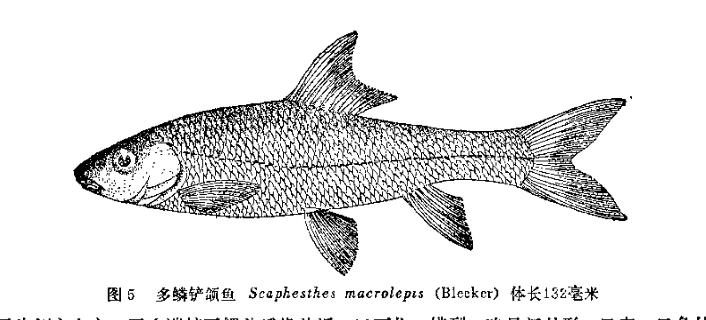

## 多鳞铲颌鱼

Onychostoma macrolepis  (Bleeker, 1871)

CAFS: 750200040A80210013

<http://www.fishbase.org/summary/60668>

### 简介

又名钱鱼、梢白甲、赤鳞鱼、石口鱼。体长10厘米左右，体侧扁，稍狭长，背部稍隆起，腹部圆。尾部稍侧扁。头短。吻钝。体呈黑褐色，腹部灰白，体侧每个鳞片基部均有新月形的黑斑。分布于长江、淮河、海河水系。

### 形态特征

背鳍 ⅳ-8；臀鳍 ⅲ-5；胸鳍 ⅰ-15～17；腹鳍ⅱ-8～9；侧线鳞50～53；背鳍前鳞20～25,围尾柄鳞20～23。下咽齿3行，2·3·5－5·3·2；第一鳃鳃弓外侧鳃耙22～26。体长为体高的3.7～4.4倍，为头长的4.2～4.9倍，为尾柄长的5.4～6.4倍，为尾柄高的9.1～10.6倍。头长为吻长的2.8～3.3倍，为口宽的2.8～3.6倍，为眼径的4.2～4.9倍，为眼间距的2.3～2.7倍。尾柄长为尾柄高的1.5～1.9倍。体较细长,侧扁,腹部圆，尾柄细长。吻短而钝圆。口宽，下位，横裂。下颌具角质。上唇薄而光滑，与吻皮有一深沟相隔。唇后沟仅在口角处。须2对，吻须短，颌须较长。鳃膜与峡部相连。背鳍软刺，其起点至吻端较至尾鳍基的距离为近。腹鳍基部外侧具一狭长的腋鳞。肛门紧接臀鳍起点。鳔2室。腹膜黑色。体背部青黑色，腹部白色。

### 地理分布

长江中、上游支流、干流（宜昌）有时也可见到,淮河、渭河及海河上游的滹沱河。

### 生活习性

多生活在急流环境下,喜底层活动。

### 资源状况

多鳞铲颌鱼肉嫩味鲜，有滋补明目下乳之功效，为山溪鱼产中之上品。在产区种群数量较大，特别是在陕西南部山区为优势种群。4月中旬当鱼群出泉时，数量很大，一些较大的鱼泉最多可达万斤以上，一般多为几千斤，小鱼苗也在百斤以上，是当地群众喜食的山区特产。今后如能对其天然资源加以保护，同时解决人工繁殖等技术问题，它将是山区渔业中一种很有前途的养殖鱼类。

### 参考资料

- 北京鱼类志 P13

### 线描图片

### 标准图片

### 实物图片

