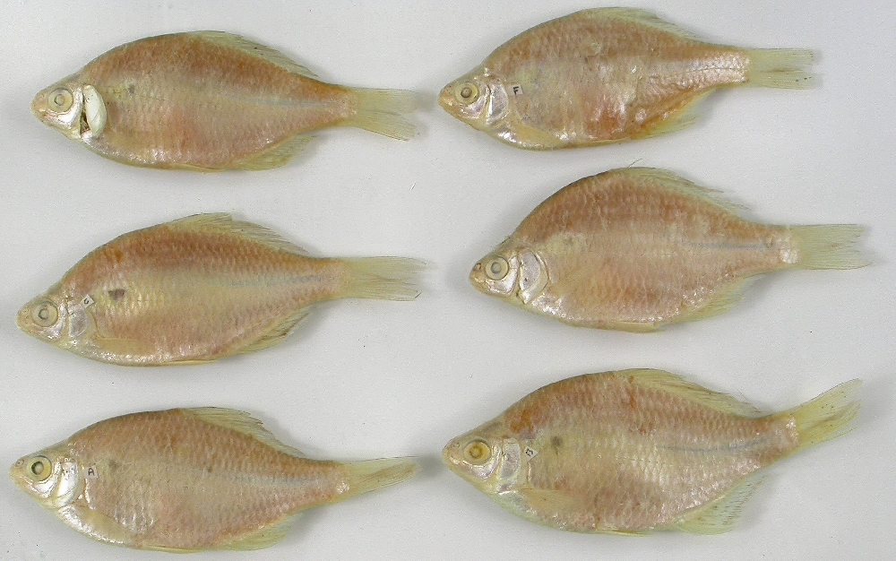
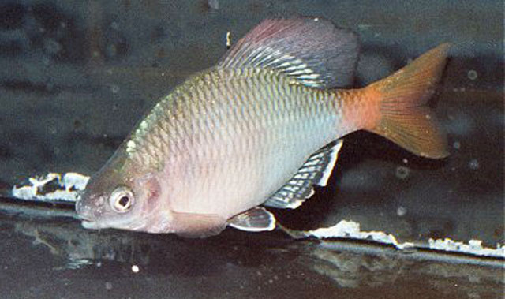

## 大鳍鱊

Acheilognathus macropterus  (Bleeker, 1871)

CAFS:

<http://www.fishbase.org/summary/54380>

### 简介

又名大鳍刺鰟鲏，体扁薄，卵圆形。具短须一对。齿面具锯纹。侧线完全，背、臀鳍均具硬刺。体背部暗绿色，体侧银白色，第四个侧线鳞上有一个大黑点，尾柄中线有一黑色纵纹。背鳍具三列小黑点组成的纵纹。鳍的外缘色浓。臀鳍有三条不等宽的黑色纵纹，其外缘纵纹最宽，其它各鳍灰色。是鰟鲏亚科中个体较大的一种。喜栖息于氧气条件良好、水草丛生的地方。生活习性和其它鰟鲏亚科类似。北自黑龙江，南至广东、广西均有分布。

### 形态特征

体侧扁，背缘较腹缘隆起。头短小，其长不及体高。口亚下位，口的顶点水平线远在眼下缘之下，口裂浅，两口角间距和两口角间距中点至下领顶端距离几等长。口角须1对，突起状，或缺失。鼻孔位近眼前缘较之吻端。眼侧上位。鳃孔上角稍低于眼上缘水平线。鳃盖膜至鳃盖骨前缘下方连于峡部。侧线完全，或尾部倒数1—4鳞片无孔，平直，后人尾柄中央。
背鳍位居体中央，或略近吻端较之尾鳍基。臀鳍起点与背鳍基中点相对。背、臀鳍末根不分枝鳍条粗壮，末端分节。背鳍基底长于臀鳍基底，后者长于尾柄长。腹鳍位在背鳍之前，腹鳍基部和背鳍起点往往在同一垂直线上，或略重叠。肛门位于腹鳍基和臀鳍起点之间。尾鳍叉形，末端尖。
下咽骨近弧形，齿侧扁，大多数齿侧有深凹纹，亦有光滑，咀嚼面狭，末端钩状。鳃耙较短，最长的鳃耙约有最长鳃丝的1/4。鳔2室，前短后长。消化管约为体长的3—4倍。腹膜黑褐色。
繁殖期雄鱼婚姻色明显，沿尾柄有蓝宝色纵条。鳃盖后缘蓝绿色的斑块，外围浅红色。各鳍呈浅柠檬色并夹带浅红色。虹膜、尾基部均为红色。雄鱼吻端和泪骨上追星为乳白色。液浸标本尾部有明显的黑纵条；鳃盖后缘黑斑及背、臀鳍的黑纵条亦为明显。雌体产卵管为无色。

### 地理分布

分布于朝鲜以及自广东、安徽直至东北黑龙江流域等，多见于水草丛生处。

### 生活习性

生活于缓流或静水水草丛生的水体中。多在江河流水，底质多砾石的环境中生活，也出现于沟渠、溪流上游。杂食性，以高等水生植物的叶片和藻类为主食。主要以底栖无脊椎动物如水生昆虫成虫及其幼虫、螺、蚌、虾、蟹为食，也食小鱼。多在夜间觅食，无明显季节变化。

### 资源状况

### 参考资料

- 北京鱼类志 P66

### 线描图片

### 标准图片

### 实物图片

