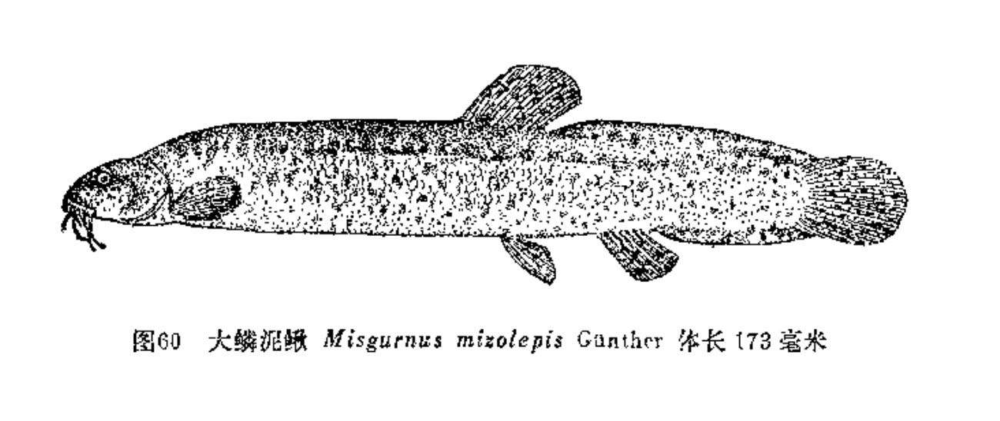
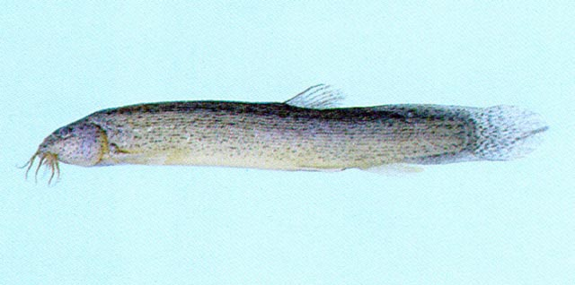
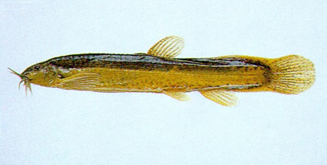

## 大鳞泥鳅

Misgurnus mizolepis  Günther, 1888

CAFS:

<http://www.fishbase.org/summary/14483>

### 简介

体近长筒形，稍侧扁，尾部遍薄。尾柄上脊较高而长。须5对。鼻孔靠近眼。眼被皮膜覆盖。眼下无刺。头部无鳞，体鳞较泥鳅为大。侧线完全。胸鳍距腹鳍很远。尾鳍圆形。体背部及体侧上半部灰黑色，体侧下半部及腹面灰白色。体侧具有许多不规则的褐色斑点。背鳍、尾鳍具黑色小店，其它各鳍灰白色。生活习性与泥鳅类似。分布于长江中下游。

### 形态特征

背鳍条Ⅱ，6；臀鳍条Ⅱ，5；侧线鳞102～107。体长为体高的5.0～6.2倍，为头长的4.7～6.2倍，为尼柄长的5.9～6.3倍，为尾柄高的5.4～6.9倍。头长为吻长的2.1～2.8倍，为眼径的4.1～8.1倍，为眼间距的3.2一4.2倍。体长而侧扁。口亚下位。须5对，最长1对口须末端远超过前鳃盖骨后缘。鳞埋于皮下。背鳍不具硬刺，其起点约在前鳃盖骨至尾鳍基部距离之中点。尾柄较高，具有明显的皮褶棱。胸鳍距腹鳍很远。尾鳍圆形。肛门较近臀鳍起点。约在腹鳍基部至臀鳍起点距离的3/4处。身体背部及体侧上半部灰黑色，体侧下半部及腹面灰白色。背鳍及尾鳍具黑色小点，其他各鳍灰白色。

### 地理分布

长江中下游，北京等地。

### 生活习性

与泥鳅类似。

### 资源状况

### 参考资料

- 北京鱼类志 P79

### 线描图片

### 标准图片

### 实物图片

