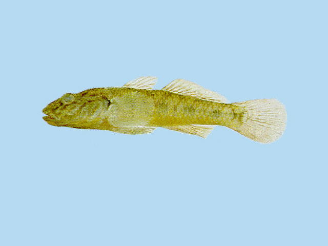
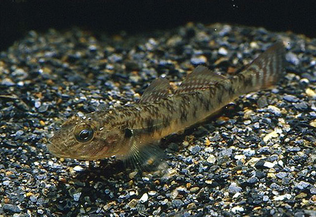

## 子陵吻虾虎鱼

Rhinogobius giurinus  (Rutter, 1897)

CAFS:750200540010250A20

<http://www.fishbase.org/summary/15825>

### 简介

又名小爬虎鱼、庐山石鱼、春鱼、麥鱼、琴鱼、沙鳁。体延长，前部近圆筒形，后部稍侧扁；背缘浅弧形隆起，腹缘稍平直；尾柄颇长，其长大于体高。头中大，圆钝，前部宽而平扁，背部稍隆起，头宽大于头高。眼较大，侧上位。体被中大栉鳞，头的吻部、颊部、鳃盖部无鳞。项部在背鳍中央前方具11～13枚背鳍前鳞。背鳍2个，分离。胸部、腹部及胸鳍基部均无鳞，腹部具小圆鳞。无侧线。胸鳍宽大，圆形。腹鳍胸位，左右愈合呈吸盘状，椭圆形。体呈灰褐色，腹部黄白色。体侧有一纵行暗色斑点。颊部有3-4条较长的褐色斜斑纹，还有一些短的斑纹。背鳍与尾鳍上均有暗色小点组成的线纹。臀鳍暗色。胸鳍基底上方有一个黑色小斑。喜生活于浅水区水底具有卵石、岩缝、沙滩的环境中，喜底栖生活。以小虾和水蚤等为食。数量多，分布广泛。

### 形态特征

体延长，前部近圆筒形，后部稍侧扁；背缘浅弧形隆起，腹缘稍平直；尾柄颇长，其长大于体高。头中大，圆钝，前部宽而平扁，背部稍隆起，头宽大于头高。颊部肌肉凸出，具2纵行感觉乳突线。吻圆钝，颇长，吻长大于眼径。眼中大，背侧位，位于头的前半部，眼上缘突出于头部背缘。眼下缘具5～6条放射状感觉乳突线，向下延伸。眼间隔狭窄，稍小于眼径，内凹。鼻孔每侧2个，分离，相互接近。口中大，前位，斜裂。两颌约等长。上颌骨后端伸达眼前缘下方。上、下颌齿细小，尖锐。唇略厚，发达。舌游离，前端圆形。体被中大栉鳞，头的吻部、颊部、鳃盖部无鳞。项部在背鳍中央前方具11～13枚背鳍前鳞，向前伸达眼间隔的后方，胸部、腹部及胸鳍基部均无鳞，腹部具小圆鳞。无侧线。胸鳍宽大，圆形，下侧位，鳍长约等于吻后头长，后缘不伸达肛门上方。腹鳍略短于胸鳍，长圆形，膜盖发达，边缘深凹，左、右腹鳍愈合成一吸盘。成鱼体色暗灰，有4条黑色分叉的宽斑带横跨背部，在侧面扩散成不规则的黑色小点。

### 地理分布

长江至珠江的各水系中。

### 生活习性

喜生活在底质为沙土、砾石、水质清亮而含氧丰富的池塘、湖泊、小河流的浅水区及山涧小溪中。平时分散居住在石隙里，用强有力的吸盘状腹鳍攀附于石壁，觅食时才从石隙中外出。个体虽小，但性极贪婪凶残，经常采用袭击的方式吞食底栖性的更小的鱼，或用胸鳍挖掘与翻搅水底泥沙，寻找底栖无脊椎动物，以便吞食。成鱼喜吹跳跃，有时跳出水面，有时从一块石上跳往另一块石头。鰕虎鱼一冬龄达性成熟，每年4-5月，亲鱼开始集群，雌雄鱼互相嬉戏追逐，进行生殖活动，雌鱼用鳍翻动沙粒，将卵产于沙穴中。1-2厘米的幼鱼喜欢逆水群游。

### 资源状况

### 参考资料

- 北京鱼类志 P93

### 线描图片

### 标准图片

### 实物图片

