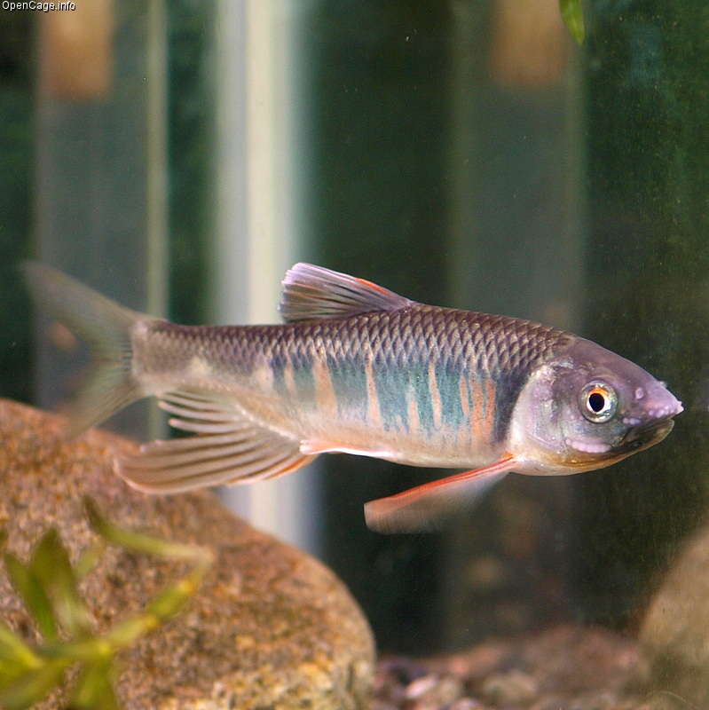

## 宽鳍鱲

Zacco platypus  (Temminck & Schlegel, 1846)

CAFS:750200040A70050004

<http://fishbase.org/summary/7762>

### 简介

又名双尾鱼，红车公，红翅子，白糯鱼，快鱼。体长而侧扁，体高略大于头长，腹部圆。生活时体色鲜艳，背部灰黑，腹部银白，体侧有多条蓝色的垂直条纹，在条纹之间杂有粉红色斑点。腹鳍淡红色，各鳍鳍膜微黑，无明显斑纹。小型鱼类，喜栖息于山涧底质为砾石的小溪急流中。通常集群活动，性情活波，喜跃水。摄食小型鱼类和水生昆虫。常与马口鱼在同一水域中共存。广泛分布于各大水系。

### 形态特征

体长而侧扁，体高略大于头长，腹部圆。吻钝。口端位，口裂向下倾斜；上颌骨向后延伸仅达眼前缘垂直下方；下颌前端有1不明显的突起与上颌凹陷相吻合。无口须。眼较小，侧上位。眼后头长大于吻长。眼间距等于或稍大于吻长。体被圆鳞，较大。侧线完全，在胸鳍上方显著下弯，沿体侧下部向后延伸，入尾柄后回升到体侧中部。
背鳍起点约与腹鳍起点相对，距吻端和距尾鳍基部的距离约相等，个别标本稍有前后。胸鳍末端尖，部分个体（特别是雄性）向后延伸可超越腹鳍起点。腹鳍稍钝，末端可达肛门。肛门紧挨于臀鳍之前。臀鳍条长，向后伸展末端超过尾鳍基部，性成熟的雄性个体尤为发达。尾鳍叉形，下叶稍长。
下咽骨弧形，较窄。咽齿锥形，末端略带钩状。鳃耙稀疏。肠管长度约等于体长。鳔2室，后室长约等于前室长的2倍。腹膜黑色。
生活时体色鲜艳，背部灰黑，腹部银白，体侧有10-13条蓝色的垂直条纹，在条纹之间杂有粉红色斑点。腹鳍为淡红色，胸鳍上有许多黑色斑点。背鳍和尾鳍灰色，尾鳍的后缘呈黑色。

### 地理分布

分布于黑龙江、黄河、长江、珠江、澜沧江及东部沿海各溪流。尤以山区溪流中为常见。

### 生活习性

此类鱼与马口鱼生活习性相似，两种鱼经常群集在一起，喜欢嬉游于水流较急、底质为砂石的浅滩。江河的支流中较多，而深水湖泊中则少见。以浮游甲壳类为食，兼食一些藻类、小鱼及水底的腐植物质。

### 资源状况

### 参考资料

- 北京鱼类志 P44

### 线描图片

### 标准图片

### 实物图片

