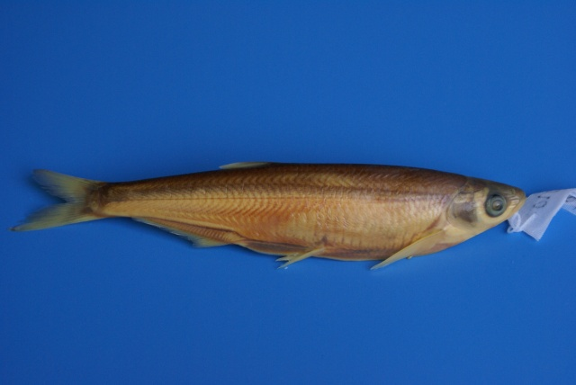
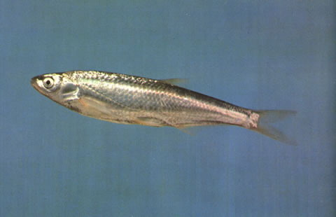

## 寡鳞飘鱼

Pseudolaubuca engraulis  (Nichols, 1925)

CAFS:

<http://www.fishbase.org/summary/54782>

### 简介

体甚侧扁，腹部外廓圆凸，背部接近一直线。腹棱完全。无须。侧线在胸鳍上方突然向下弯折。体呈银色，背部略带黄色。个体小，产量少，小型鱼类，杂食，在长江流域、黄河流域均有分布。

### 形态特征

体长形，侧扁，背部较厚，腹部呈弧形，自峡部至肛门具腹棱。头长，侧扁，头长大于体高（150mm以上个体头长小于体高），头背较平直。吻稍尖，吻长大于眼径。口端位，口裂斜，口裂末端约伸达眼前缘的下方；上下颌约等长，上颌中央具1缺刻，边缘稍波曲，下颌中央具1突起，与上领缺刻相吻合。眼中大，位于头侧，眼后缘至吻端的距离大于眼后头长。眼间宽，隆起，眼间距大于眼径，为眼径的1. 1—1. 4倍。鳃孔宽；鳃盖膜在前鳃盖骨后缘的下方与峡部相连；峡部窄。鳞中大，薄而易脱落。侧线在头后成广弧形向下弯曲与腹部平行，行于体之下半部，至尾柄处又折而向上，伸入尾柄正中。
背鳍位于腹鳍的后上方，无硬刺，外缘平直，起点在前鳃盖骨后缘或眼后缘与尾鳍基之间。臀鳍位于背鳍的后下方，外缘微凹，起点至腹鳍基的距离较至尾鳍基为近。胸鳍长，尖形，末端不达腹鳍起点；胸鳍腋部具1肉瓣，其长大于或等于眼径。腹鳍短于胸鳍，起点距臀鳍起点较至胸鳍起点为近，末端不伸达肛门。尾鳍深分叉，末端尖形，下叶长于上叶。
鳃耙短小，排列稀。下咽骨狭长，略呈钩状。咽齿稍侧扁，末端钩状。鳔小，2室，后室长于前室，鳔管甚细长，先在左侧盘曲2次，伸至右侧盘曲，其长为鳔全长的4倍余。肠短，呈前后弯曲，肠长短于体长。腹膜银白色。
体呈银色，鳍浅色。

### 地理分布

分布于珠江、九龙江、长江、黄河等水系。

### 生活习性

小型鱼类。杂食。5～6月在江河中产漂流性卵。在江河较湖泊为多。

### 资源状况

### 参考资料

- 北京鱼类志 P52

### 线描图片

### 标准图片

### 实物图片

