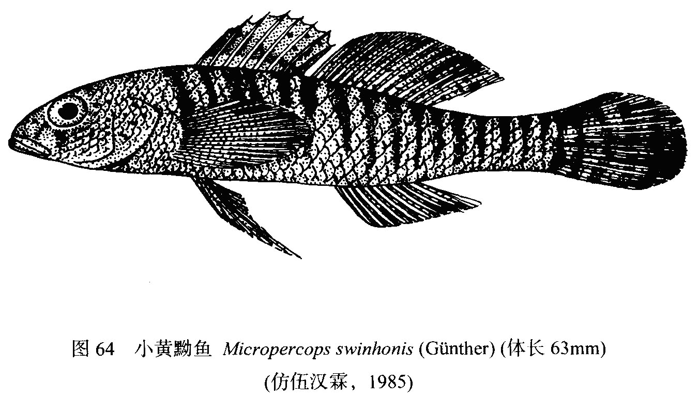
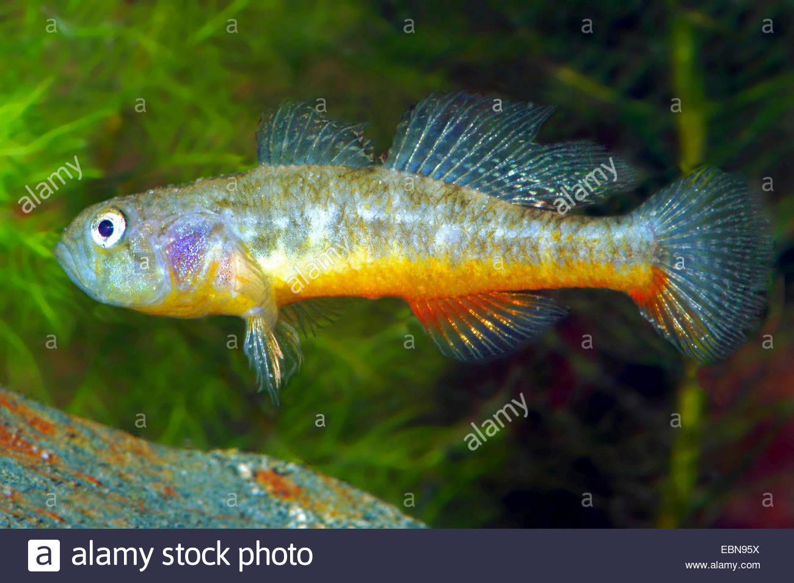

## 小黄黝鱼

Micropercops swinhonis  (Günther, 1873)

CAFS:

<http://www.fishbase.se/summary/68232>

### 简介

体延长，颇侧扁；背缘浅弧形，腹缘稍平直；尾柄颇长，小于体高。头中大，较尖，颇侧扁，背部稍隆起。头部具感觉管及5个感觉管孔。吻尖突，颇长，吻长小于或大于眼径。眼大，背侧位，眼上缘突出于头部背缘。体被中大栉鳞，头部、前鳃盖骨前部被圆鳞，鳃盖骨被小栉鳞，吻部和眼间隔处无鳞。胸部和胸鳍基部被小圆鳞。无侧线。体淡褐色，背部色较深，体侧有十多条灰褐色横纹。眼下缘至口角有一条棕色条纹。背鳍、尾鳍棕色，并具有多列黑色小点。个体很小，数量较多，常成小群生活在浅水水域的水草丛中，喜伏水底。以浮游动物、水生昆虫及其幼虫、小虾等为食。分布广泛。

### 形态特征

体延长，颇侧扁；背缘浅弧形，腹缘稍平直；尾柄颇长，小于体高。头中大，较尖，颇侧扁，背部稍隆起。头部具感觉管及5个感觉管孔。颊部不突出，具4条感觉乳突线。吻尖突，颇长，吻长小于或大于眼径。眼大，背侧位，眼上缘突出于头部背缘。眼间隔狭窄，稍内凹，稍小于眼径。鼻孔每侧2个，分离，相互接近：前鼻孔近吻端，具1短管；后鼻孔小，圆形，边缘隆起，紧位于眼前缘。口中大，前位，斜裂，下颌长于上颌，稍突出。上颌骨后端不伸达眼前缘下方。上、下颌齿细小，尖锐，绒毛状，无犬齿，多行排列，呈带状；犁骨、腭骨及舌上均无齿。唇略厚，发达。舌游离，前端浅弧形。鳃孔大，侧位，向头部腹面延伸，伸达眼中部下方。前鳃盖骨边缘光滑，无棘，后缘具4个感觉管孔,鳃盖骨上方无感觉管孔。峡部狭窄，左、右鳃盖膜在峡部的中部相遇，并在稍前方相互愈合，其同时与峡部亦有小部分相连。鳃盖条6根。具假鳃。鳃耙短小，柔软。体被中大栉鳞，头部、前鳃盖骨前部被圆鳞，鳃盖骨被小栉鳞，吻部和眼间隔处无鳞。胸部和胸鳍基部被小圆鳞。无侧线。

### 地理分布

广泛分布于东北、华北、华东、华南、华中、西南部各地淡水河川及溪流中。

### 生活习性

为淡水小型底栖鱼类，常成群生活于河溪、池塘、湖沼的浅水水域的中、下层及入湖溪流的水草丛中，喜潜伏于水底，以浮游动物、水生昆虫、摇蚊幼虫、小虾、硅藻、绿藻、丝状藻类等为食。1龄性成熟，怀卵量864～1037粒。5～6月为繁殖期，少数地区可延长至8月，产沉性卵。

### 资源状况

### 参考资料

- 北京鱼类志 P92

### 线描图片

### 线描图片

### 标准图片

### 实物图片

