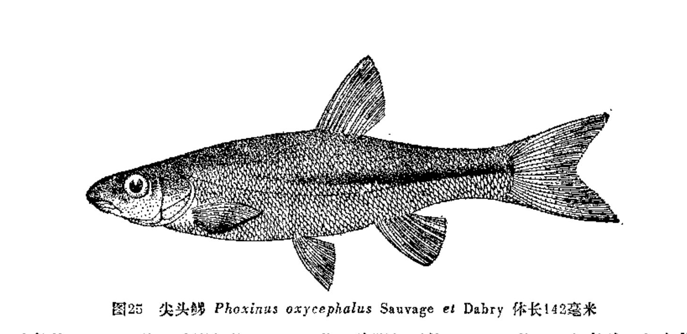
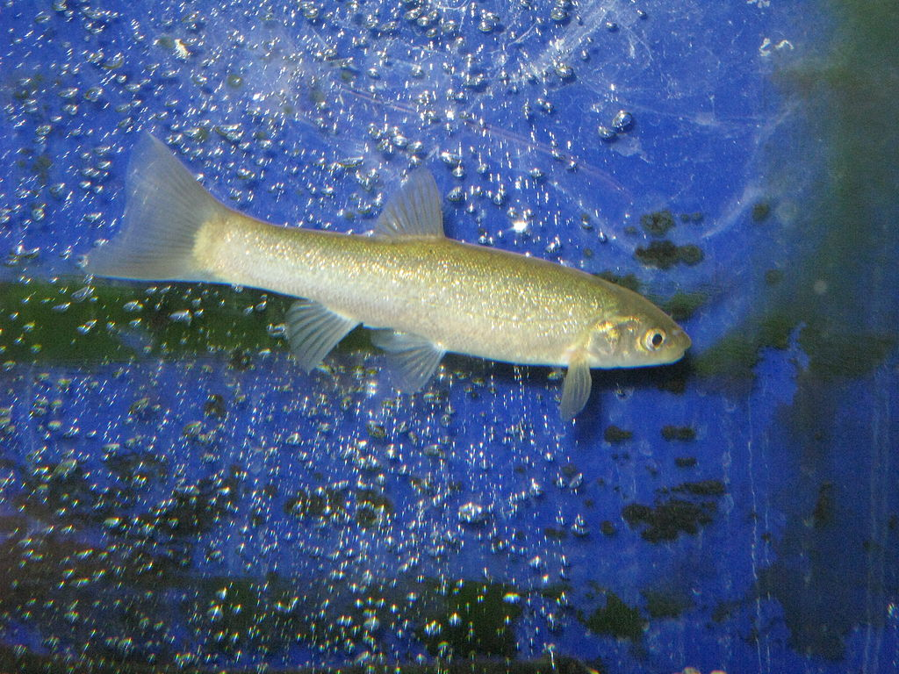
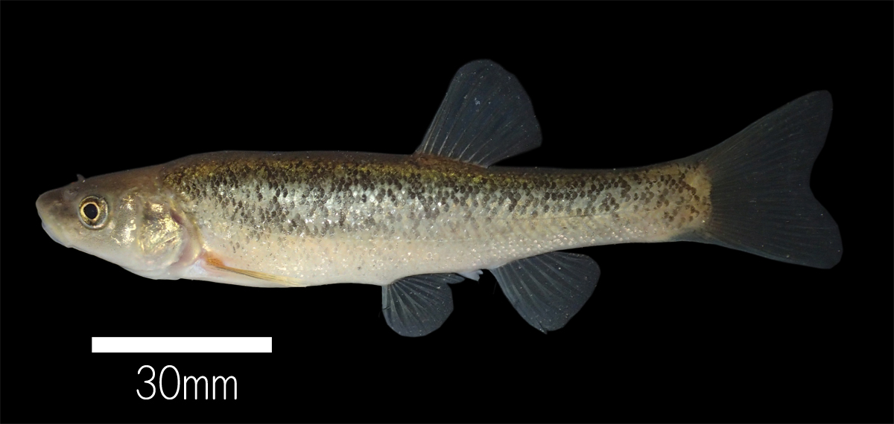

## 尖头鱥

Phoxinus jouyi  (Jordan & Snyder, 1901)

CAFS:

<http://www.fishbase.org/summary/22927>

### 简介

体长，稍侧扁，腹部圆，尾柄稍高。口裂宽浅，呈弧形。鳞细小，排列不规则。侧线完全。尾鳍浅灰色，其余鳍呈浅色。体呈黑褐色，至腹侧渐浅而呈白色。体有许多不规则的黑色小斑点，体两侧中轴有一显著的黑色纵带纹。小型鱼类，生活在水流缓慢清澈的冷水溪流中。通常成群，游动迅速。以食硅藻、植物碎片等植物为主，也食一些水生昆虫等。分布在黑龙江和山西等地。

### 形态特征

体长形，稍侧扁，腹部圆，尾柄较高。头近锥形，头长大于体高。吻尖突或钝；吻皮覆盖上颌，或止于上颌。口亚下位，口裂稍斜，下颌前端宽圆，上颌骨末端不伸达眼前缘的下方；下唇褶较发达。眼中大，位于头侧，眼后缘至吻端的距离一般大于眼后头长。眼问宽平，眼间距大于眼径。鳃孔向前伸至前鳃盖骨后缘稍前的下方；鳃盖膜联于峡部；峡部较窄。鳞小，胸、腹部具鳞。侧线完全，约位于体侧中央，在腹鳍前的侧线较为显著。背鳍位于腹鳍的上方，外缘平直，起点至吻端的距离大于至尾鳍基的距离。臀鳍位于背鳍的后下方，外缘平直，起点约与背鳍基末端相对。胸鳍短，末端钝，末端至腹鳍起点的距离为胸鳍长的2/3左右。腹鳍起点前于背鳍，末端伸达或伸越肛门。尾鳍分叉浅，上下叶约等长，末端钝。鳃耙短而散步，排列稀。下咽骨中长，前臂长于后臂。咽齿稍侧扁，末端尖而弯。鳔2室，后室长于前室，其长为前室长的2倍左右，末端圆钝。肠短，呈前后弯曲，其长短于体长。腹膜灰黑或黑色。体具多数不规则的黑色小点，背部正中自头后至尾鳍基有1狭的黑带，体侧一般无黑色纵带，或仅在尾部具l暗色纵带。尾鳍浅灰色，其余鳍呈浅色。尾鳍基或具1浅黑色小点。

### 地理分布

图们江及其支流尔哈通河、嘎呀河、珲春河及黄河和长江水系。

### 生活习性

常见于水草较多的江河静水区。一般喜栖居江河岸边水草或柳树根下，杂食性，主要食物有昆虫、藻类、植物根、芽、果实等。

### 资源状况

### 参考资料

- 北京鱼类志 P38

### 线描图片

### 标准图片

### 实物图片

