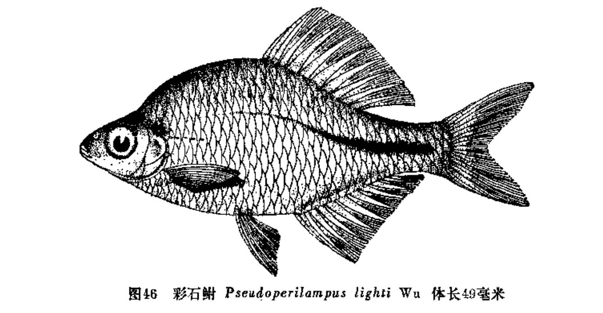
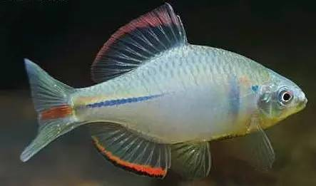
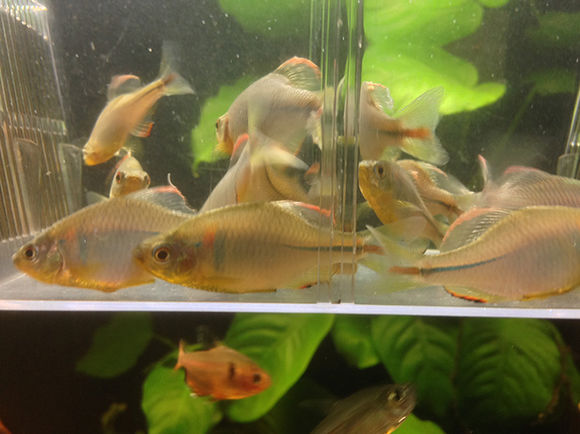

## 彩石鳑鲏

Rhodeus lighti  (Wu, 1931)

CAFS:

<http://www.fishbase.org/summary/47833>

### 简介

体高，扁薄，卵圆形。口角无须。背鳍无硬刺。侧线不完全，仅在前面3—6枚鳞片上具侧线孔。生殖期雄鱼的吻部具珠星，色泽鲜艳。背侧蓝绿色，腹部银白色，体上部鳞片后缘都具一小黑斑。鳃孔后方的第一个侧线鳞上有一绿色大斑点。尾柄中部有一条蓝绿色纵纹。多生活在小溪、水沟、稻田等处。主食藻类、水生植物碎片和水蚤等。繁殖季节雄鱼体色鲜艳。北起黑龙江，南至广东、福建等均有分布。

### 形态特征

体似卵圆形，侧扁而高，尾柄高度随体长增加而增高，体长达40—50mm时尾柄高和长相当。头短，头长往往大于头高。吻短而钝，其长不及眼径。眼侧上位，眼间呈弧形。鼻孔位近眼前缘较之吻端。口端位，口顶的水平线可穿过瞳孔，口裂较深，口角水 平线在眼下缘水平线之下。口角无须。鳃孔上角低于眼上缘水平线。鳃盖膜与峡部相连。
背、臀鳍不分枝鳍条细如首根分枝鳍条，不分枝鳍条第二根约有末根的2/3—1/2长。背鳍起点距尾鳍基较距吻端为近，偶有介于二者之间。背鳍基底长短于背鳍基底末至尾鳍基距离，偶有等长。臀鳍位于背鳍之下方，其基底长相当于或大于尾柄长。腹鳍位于背鳍之前下方，介于胸鳍基部和臀鳍起点之间或稍近前者。肛门位于腹鳍基部和臀鳍起点之间。尾鳍叉形，较浅，中间最短鳍条长约为最长鳍条长的1/2。
侧线不完全。背鳍前鳞多数呈棱状；腹鳍腋鳞较明显，约有腹鳍最长鳍条的1/4-1/3。下咽齿齿侧常有凹纹，咀嚼面狭而略凹，齿端呈钩状。鳃耙短，似三角形，排列稀疏。鳔2室，前室短，近椭圆形，后室长，为前室的2倍。消化管较短，约为体长的1.2—1.6倍。
固定标本尾柄黑纵条向前不超过背鳍起点，雄鱼较雌鱼粗，其宽度约有半个鳞片。雄鱼鳃盖上角有1小黑圆点，约隔2—3鳞片有形如长棒垂直而列的黑斑。雄鱼臀鳍外镶黑宽边，其宽度约有首根分枝鳍条长的1/6—1/5。雌鱼产卵管呈灰黑色，从基部至末端由深而浅。雌鱼体长约40mm，其背鳍（限于末根不分枝鳍条和3-4分枝鳍条及间膜）近基部仍有黑斑。

### 地理分布

主要分布于珠江、闽江、长江、黄河等水系。

### 生活习性

小型鱼类，经济价值低。生长缓慢，第一年稍快。常栖息于水流较缓的溪河、水沟、池塘或稻田等水体中，喜集群。其食物主要是水生植物碎屑、藻类、周丛生物和水蚤等。第一次性成熟为1龄，生殖季节在4-6月，怀卵量小，一般为300--500粒。产卵于瓣鳃类的鳃水管中。

### 资源状况

### 参考资料

- 北京鱼类志 P64

### 线描图片

### 标准图片

### 实物图片

