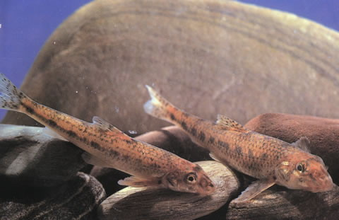
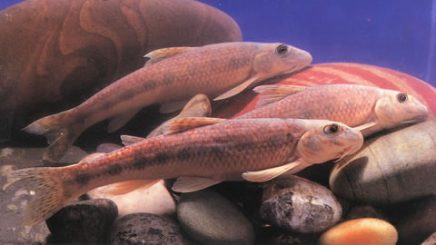

## 棒花鮈

Gobio rivuloides  Nichols, 1925

CAFS:

<http://www.fishbase.org/summary/60100>

### 简介

体长，略呈圆筒形，背部不甚隆起，腹部平坦，尾柄侧扁，较短且高。头近锥形。背鳍较短，无硬刺，外缘微凹。体背深灰色，腹面白色。体侧具不明显的纵纹，沿体中轴自头后至尾基。其上有9一11个黑斑点，背中线上也有8-11个黑斑点。背、尾鳍有多数小黑点组成的条纹，其他各鳍灰白。底层小型鱼类，栖息于泥沙底质的缓流浅水处，以摇蚊幼虫和藻类为食，6月繁殖。分布于海河、黄河、滦河、大凌河等水系。

### 形态特征

体长，略呈圆筒形，背部不甚隆起，腹部平坦，尾柄侧扁，较短且高。头近锥形。吻稍短，吻前部略平扁，其长稍小于眼后头长。口下位，弧形。唇稍薄，结构简单，无乳突，上下唇在口角处相连。唇后沟中断。须1对，位口角，较长，末端达到或稍过眼后缘的下方。眼较小，侧上位。眼间宽，平坦或微外凸。体被圆鳞，中等大，胸部自胸鳍基部之前裸露无鳞，且裸露区可自腹中线向后延伸到胸、腹鳍间的中央或至后1/3处。侧线完全，几平直。
背鳍较短，无硬刺，外缘微凹，其起点距吻端与自背鳍基部后端至尾鳍基部相等。胸鳍末端圆钝，其长超过胸、腹鳍间距离的2/3。腹鳍较短，末端刚盖过肛门。肛门位置在腹鳍基部和臀鳍起点间的中点。臀鳍短小，其起点距腹鳍基部较至尾鳍基部为近。尾鳍分叉，上下叶末端尖，上叶较下叶略长。
下咽齿主行齿略侧扁，末端钩曲。鳃耙稀少，细长，顶端尖。肠管粗短，约为体长的0.8—1.0倍。鳔较大，2室，前后室均呈长圆形，后室长为前室的1.8—1.9倍。腹膜白色。
体背深灰色，腹面白色。体侧具不明显的纵纹，沿体中轴自头后至尾基，其上有9-11个黑斑点，背中线上也有8—11个黑斑点。吻部两侧自吻端至眼下缘和鼻孔前缘各有1斜行黑条纹。背、尾鳍有多数小黑点组成的条纹，其他各鳍灰白。

### 地理分布

分布于海河、黄河、滦河、大凌河等水系。

### 生活习性

底层小型鱼类，栖息于泥沙底质的缓流浅水处，以摇蚊幼虫和藻类为食，6月繁殖。

### 资源状况

### 参考资料

- 北京鱼类志 P27

### 线描图片

### 标准图片

### 实物图片

