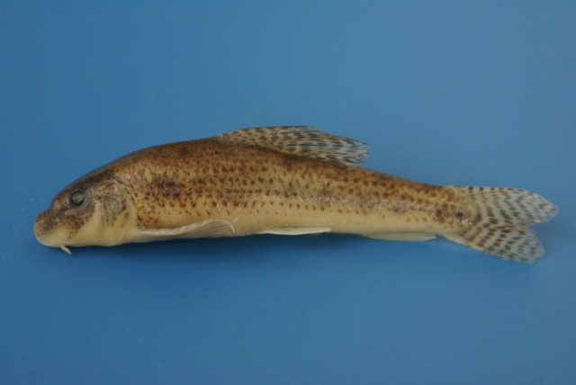
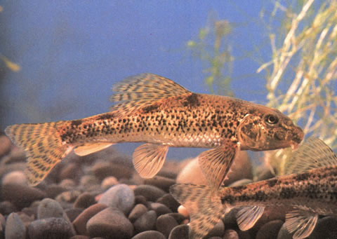

## 棒花鱼

Abbottina rivularis  (Basilewsky, 1855)

CAFS:750200040B10060001

<http://www.fishbase.org/summary/22903>

### 简介

体长，稍侧扁。头较短，吻短，前端圆钝。眼小，侧上位，眼间宽平。背鳍无硬刺，胸鳍圆钝，均较短。尾鳍叉型。头背部稍黑，体侧具一不明显的纵纹，其上有9-11个黑点斑块，背部也具8-11个黑色斑块。背鳍和尾鳍具有由黑色小点组成的斑纹。小型鱼类，生活在静水或流水的底层，主食无脊椎动物。分布于全国各主要水系及湖泊、沟塘中。

### 形态特征

体长，稍侧扁。头较短，吻短，前端圆钝。眼小，侧上位，眼间宽平。背鳍无硬刺，胸鳍圆钝，均较短。尾鳍叉型。头背部稍黑，体侧具一不明显的纵纹，其上有9-11个黑点斑块，背部也具8-11个黑色斑块。背鳍和尾鳍具有由黑色小点组成的斑纹。背部深黄褐色，至体侧逐渐转淡，腹部为淡黄色或乳白色，背部自背鳍起点至尾基有5个黑色大斑。在体侧有7—8个黑色大斑，此外在整个背部自头至尾不规则的散布有许多大小黑点，在背鳍、胸鳍及尾鳍上由小黑色斑点组成比较整齐的横纹数行，在生殖期体色转深，雄鱼更为明显。

### 地理分布

分布于黑龙江、图们江、辽河、黄河、长江、钱塘江、闽江、漓江等水系。

### 生活习性

底层鱼类，生殖时期为4～5月份，食物以枝角类，桡足类和端足类为主，其次为水生昆虫、水蚯蚓及植物碎片。

### 资源状况

### 参考资料

北京鱼类志 P29

### 线描图片

### 标准图片

### 实物图片

