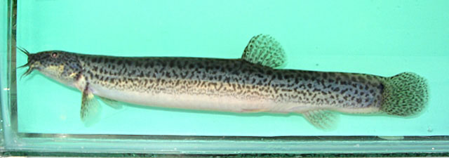
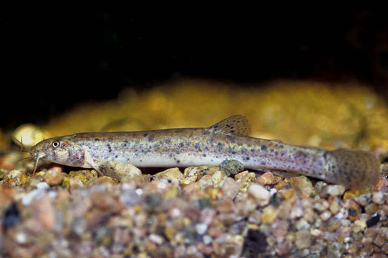

## 泥鳅

Misgurnus anguillicaudatus  (Cantor, 1842)

CAFS:750200040A51050005

<http://www.fishbase.org/summary/3016>

### 简介

体长形，呈圆柱状，尾柄侧扁而薄。头小。吻尖。须5对。眼小。鳞片甚细小。背鳍短小。胸鳍距腹鳍很远。胸鳍不达臀鳍。尾鳍圆形。体上部黑色，下部白色，体侧有不规则的黑色斑点。背鳍及尾鳍上有更小的斑点。尾鳍基部上方有一显著的黑色大斑。其它各鳍灰白色。适应性极强。多栖息于泥底较深的静水或水流缓慢的池塘、沟渠、稻田等水域，适于中性和弱酸性土壤。多活动于水的底层，有时潜入泥中。除用鳃呼吸外，肠管和皮肤均有呼吸作用，如果氧气不足，可跃出水面吞吸空气。杂食性，幼鱼主要吃浮游动物、摇蚊幼虫等，成鱼以植物性食物为主。主要在夜间摄食。在国内各水域广泛分布。

### 形态特征

背鳍条Ⅱ，7；臀鳍条Ⅱ，5～6；侧线鳞150左右。体长为体高的6.1～8.1倍，为头长的5.1～6.5倍，为尾柄长的5.5～6.3倍，为尾柄高的7.2～10.0倍。头长为吻长的2.2～2.8倍，为眼径的5.7～8.6倍，为眼间距的3.9～5.8倍。身体长圆筒状，尾部侧扁。口亚下位，马蹄形。须5对，最长口须向后伸达或稍超过眼后缘。鼻孔距吻端距眼前缘为远。眼间隔狭窄，无眼下刺。背鳍无硬刺，位置与腹鳍相对，起点约在前鳃盖骨后缘和尾鳍基部之中点。胸鳍距腹鳍很远。腹鳍不达臀鳍。尾鳍圆形。鳞片细小，埋于皮下，肛门近臀鳍起点，约在腹鳍基部和臀鳍起点之间距离的3/4处，体背及体侧灰黑色，并有黑色斑点。体侧下半部白色或浅黄色。尾鳍基部上方有一黑色大斑，背鳍及尾鳍具黑色小斑，其他各鳍灰白色。

### 地理分布

全国各地河川、沟渠、水田、池塘、湖泊及水库等天然淡水水域中均有分布。

### 生活习性

多栖息于静水水体的底层，常常钻入泥中，成鱼除能用鳃呼吸外，也能用肠呼吸，因此能在缺氧的环境中生活。以昆虫幼虫、小型甲壳类动物、扁螺、高等植物和藻类为食。不仅能用鳃和皮肤呼吸，还具有特殊的肠呼吸功能；当天气闷热或池底淤泥、腐植质等物质腐烂，引起严重缺氧时，泥鳅也能跃出水面，或垂直上升到水面，用口直接吞入空气，而由肠壁辅助呼吸，当它转头缓缓下潜时，废气则由肛门排出。离水后存活时间较长。

### 资源状况

### 参考资料

- 北京鱼类志 P80

### 线描图片

### 标准图片

### 实物图片

