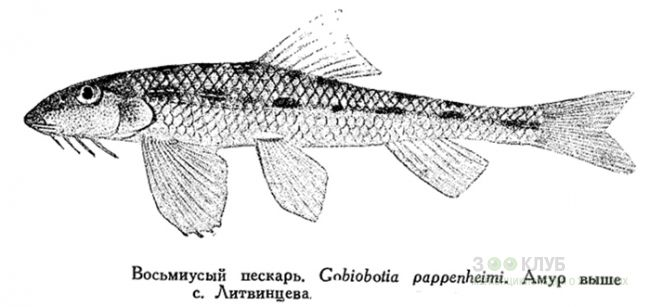

## 潘氏鳅鮀

Gobiobotia pappenheimi  Kreyenberg, 1911

CAFS:

<http://www.fishbase.org/summary/47278>

### 简介

体长形，前部圆形，后部侧扁，腹部平坦。头平宽，宽大于高。吻圆钝。鳞圆形，侧线平直，胸鳍较宽大，尾鳍深叉形，末端稍尖。体背部棕灰色，下部色淡，体侧正中线上有9个黑色斑点。背鳍河尾鳍上有不明显斑点组成的条纹，其它各鳍灰白色。小型鱼类，喜生活在急流中，贴近水底。胸部和胸鳍有吸盘的作用。以底栖无脊椎动物、昆虫幼鱼为食。分布于海河和黄河水系。

### 形态特征

体长圆筒形，后部略侧扁。头低，头宽显著大于头高，头背及两颊满布细小的皮质颗粒和条纹。吻部在鼻孔之前稍下陷，吻部渐趋平扁，吻长稍大于眼后头长。口下位，横宽，呈弧形。唇薄，具细小乳突和皱褶。眼中等大小、侧上位，眼间稍下陷，眼径略小于眼间距。须4对，1对口角须，3对颏须，稍长。口角须末端可达眼后缘垂直下方；第一对颏须起点与口角须起点相平或稍前，末端稍过第二对颏须起点；第二对颏须末端可延伸至前鳃盖骨后下方；第三对颏须最长，末端接近胸鳍起点。颏部各须基部之间具发达的小乳突。鳞圆形，侧线完全，平直延伸到尾鳍基部。背鳍前方的侧线以上鳞片具有发达的皮质棱脊。胸腹裸露无鳞，裸露区延伸到肛门。
背鳍起点稍后于腹鳍起点或与之相对，离吻端较距尾鳍基部为近。胸鳍发达，第二 根分枝鳍条最长，末端突出鳍膜，后延可超过腹鳍起点。腹鳍起点约在胸鳍起点至臀鳍起点的中点，或稍近胸鳍。肛门约位于腹鳍起点至臀鳍起点的前1/3处。臀鳍短，起点在腹鳍起点至尾鳍基部的中点。尾鳍叉形，下叶长于上叶。
下咽齿细长，上部膨大呈匙状，末端钩曲。鳃耙细小，呈乳突状。鳔小，2室，前室横宽，中部狭窄，分为左右侧泡，包在由第四脊椎腹肋形成的骨囊中，骨囊薄而脆；后室极小，连于前室中部。肠长小于体长。腹膜灰白。
固定标本，体背棕色，腹部灰黄。头背后部有一明显黑色斑点，横跨体背中线有8—11个黑斑，体侧具黑色斑块7—9个，在尾柄处相连成斑条状。背鳍及尾鳍上下缘的鳍膜微黑，其他各鳍灰白。

### 地理分布

分布于海河和黄河水系。

### 生活习性

常栖息于平原河流的缓流沙底处。

### 资源状况

### 参考资料

- 北京鱼类志 P32

### 线描图片

### 标准图片

### 实物图片

