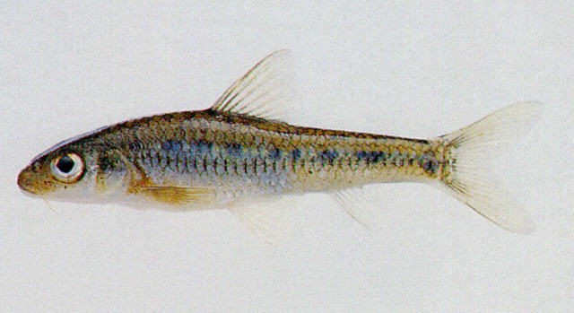
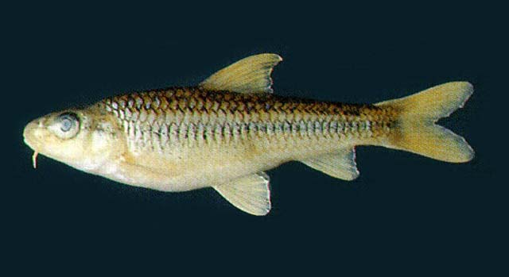

## 点纹银鮈

Squalidus wolterstorffi  (Regan, 1908)

CAFS:

<http://www.fishbase.org/summary/54972>

### 简介

体长不到10厘米，稍侧扁，腹部圆。头中等大。吻前端钝圆。胸腹部披鳞。背鳍较短，无硬刺。体呈淡棕色，腹部白色。体侧中轴稍上方有一黑条纹，体侧上半部有不规则黑色斑点。侧线鳞片各具一黑斑。背鳍、尾鳍深棕色，其它各鳍灰白色。栖息于浅水水域，以矽藻、绿藻及枝角类为食。小型鱼类，数量稀少。分布于滦河、海河、长江、闽江、漓江等水系。

### 形态特征

体长，略侧扁，头后背部斜向隆起，胸腹部圆。头中等大，其长等于或略大于体高。吻短，稍尖，近锥形，长度常小于眼后头长。口亚下位，上颌略长于下颌，上下颌无角质缘。唇薄，简单，上下唇均较狭窄。唇后沟中断。须1对，位口角，较长，其长与眼径相等或稍长，末端超过眼中央的垂直下方。眼较大，眼间平坦。体鳞较大，胸、腹部具鳞。侧线完全，较平直。
背鳍短，其起点至吻端约等于至臀鳍末端的垂直距离。胸鳍末端尖，后伸不达腹鳍起点。腹鳍较短，末端几及肛门。肛门靠近臀鳍，约位于腹鳍基与臀鳍起点间的后1/3处。臀鳍亦短。尾鳍分叉较深，上下叶等长，末端尖。
主行下咽齿稍侧扁，末端尖，略钩曲；外行齿细小。鳃耙短小，排列稀疏。肠短，长度不及体长，约为其0.8-0.9倍。鳔2室，较大，前室略圆，后室长圆，为前室长的1.3-1.8倍。腹膜灰白色。
体银灰色，背部和体侧上半部多数鳞片边缘色深，组成暗褐色的网纹，腹部灰白色。体侧中轴之上方有1黑条纹，其上具有1列暗斑，侧线每个鳞片均具1黑点，一般比较明显，黑点中间被侧线管分割为横“八”字形，上下各半。背、尾鳍色较深，臀鳍和偶鳍均为灰白色。

### 地理分布

分布甚广，珠江、闽江、富春江、长江、黄河等水系均有。

### 生活习性

中下层小型鱼类，体长一般不超过100mm，较银来说眼更小纹更密。分布于滦河以南的东部各水系。

### 资源状况

### 参考资料

- 北京鱼类志 P26

### 线描图片

### 标准图片

### 实物图片

