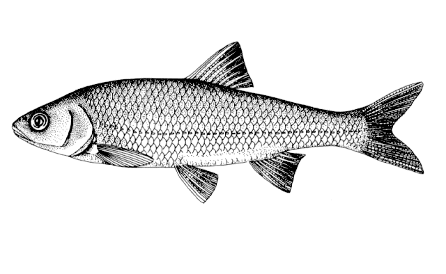
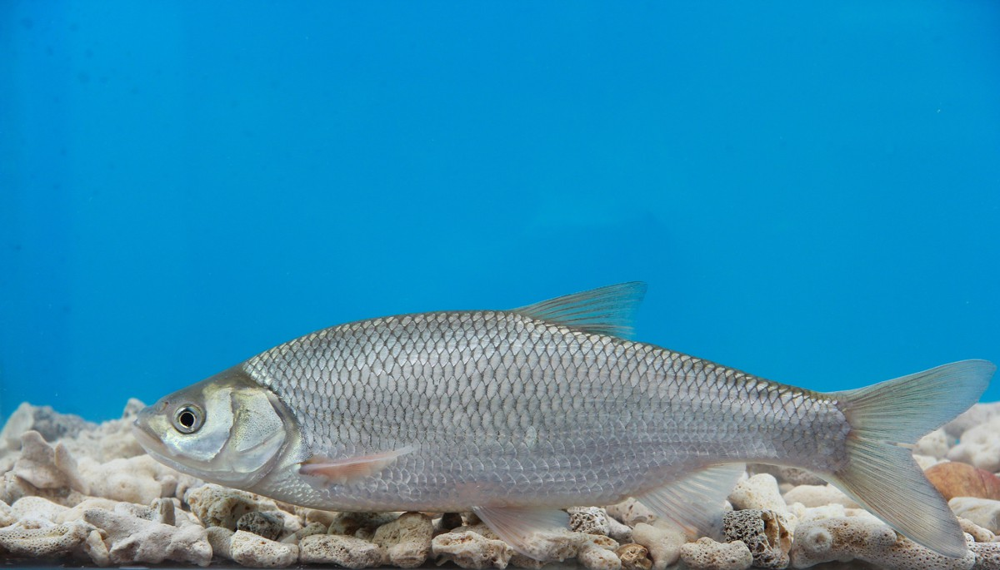
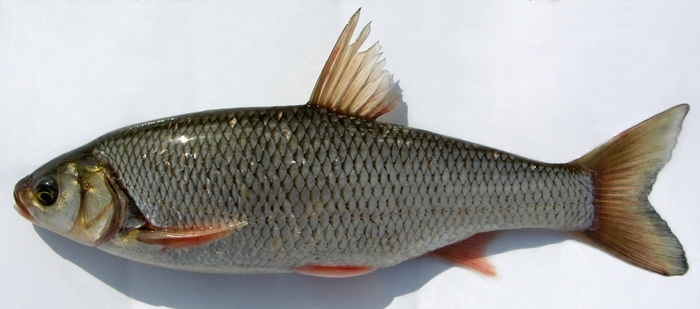

## 瓦氏雅罗鱼

Leuciscus waleckii  (Dybowski, 1869)

CAFS:750200040B70130002

<http://www.fishbase.org/summary/46549>

### 简介

又名东北雅罗鱼。俗称滑子鱼，达里湖滑子鱼，滑鱼，白鱼。体长形，侧扁，背缘略呈弧形，腹部圆。头短，侧扁，头长小于体高。腹鳍起点在背鳍之前，末端钝，不伸达肛门。尾鳍叉形，上下叶等长，末端尖形。体背侧青灰色，腹侧浅色，体侧鳞片后缘灰黑色；背鳍、尾鳍浅灰色，尾鳍边缘灰黑色，胸鳍、腹鳍、臀鳍浅色。中上层鱼类，喜栖居在河口及水流较缓、水质清澈处，冬季在江河的深水处越冬。杂食性，以底栖动物、水生昆虫为食，也食藻类和小鱼等。是脂肪不多的瘦鱼，被捕后极易死亡。分布于黑龙江流域和黄河中游地区。

### 形态特征

体长形，侧扁，背缘略呈弧形，腹部圆。头短，侧扁，头长小于体高。吻钝，吻长大于眼径。口端位，口裂稍斜，上下颌约等长，上颌骨末端约达鼻孔后缘的下方。眼中大，位于头侧前上方，眼后缘至吻端的距离小于眼后头长，眼间宽，稍突，眼间距为眼径2倍左右。鳃孔中大；鳃盖膜在前鳃盖骨后缘稍前的下方与峡部相连；峡部窄，鳞中大，胸腹部鳞片较体侧为小。侧线前部呈弧形，后部平直，伸至尾柄中轴偏下。
背鳍位于腹鳍的上方，外缘微凹，起点至尾鳍基的距离较至吻端为近。臀鳍位于背鳍的后下方，外缘凹入，起点距腹鳍基较距尾鳍基为近。胸鳍短，尖形，末端至腹鳍起点的距离约为胸鳍长的1/20。腹鳍起点在背鳍之前，末端钝，不伸达肛门。尾鳍叉形，上下叶等长，末端尖形。
鳃耙短，排列稀。下咽骨中长，中间稍宽。咽齿侧扁，末端钩状。鳔2室，后室大于前室，末端圆钝；后室长为前室长的1.4—1.6倍。腹膜灰黑色。
体背侧青灰色，腹侧浅色，体侧鳞片后缘灰黑色；背鳍、尾鳍浅灰色，尾鳍边缘灰黑色，胸鳍、腹鳍、臀鳍浅色。

### 地理分布

分布广泛，黑龙江、乌苏里江、松花江、嫩江、牡丹江及其支流，镜泊湖、大小兴凯湖、连环湖及五大连池等均有分布。达里湖数量最多。

### 生活习性

雅罗鱼为杂食性鱼类，以高等植物的茎叶和碎屑为主，以底栖动物、水生昆虫为食，亦吃维管束植物、藻类、鱼类。其次是昆虫，偶尔也食小型鱼类。为上中层鱼类，喜栖息于河江、支流、湖沼水体的低温、砂砾、水质澄清处。适应性较强，能在PH9以上的碱性水中生活。冬季在水深处越冬，活动降低。

### 资源状况

### 参考资料

- 北京鱼类志 P40

### 线描图片

### 标准图片

### 实物图片

