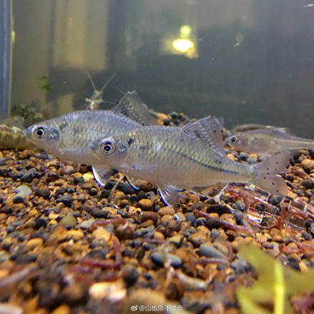

## 白河鱊

Acheilognathus peihoensis  (Fowler, 1910)

CAFS:

<http://www.fishbase.org/summary/61918>

### 简介

又名白河刺鰟鲏。体侧扁而高，呈椭圆形。口角无须。眼较大，侧位。侧线完全，较平直。背鳍和臀鳍均具硬刺。体背部灰褐色，腹侧银白色。鳃孔后方第一个侧线鳞上有一个大黑点，沿尾柄中线有一条黑色纵纹。背鳍有两列小黑点组成的纵纹，边缘黑色。尾鳍淡棕色，其边缘色浓。其它各鳍灰白色。主要分布于河北、湖北、江苏等地。

### 形态特征

体扁薄，外形近卵圆形。吻短而圆钝。口小，亚下位。口角无须。背鳍和臀鳍硬刺强壮，背鳍具11—13根分枝鳍条；臀鳍起点约与背鳍第5分枝鳍条之基部相对，具9—10根分枝鳍条。侧线完全，中段稍下弯。侧线鳞33—35枚。体长为体高的2.7—3.1倍。鳃耙短而稀少，第1鳃弓鳃耙6—8枚。体长60毫米。

### 地理分布

分布于我国天津和江苏。

### 生活习性

生活于河流缓流或湖泊静水的浅水区域。以植物碎屑和藻类为食。在产卵期间，雄鱼吻端具白色珠星，雌鱼具灰黑色产卵管。

### 资源状况

### 参考资料

- 北京鱼类志 P71

### 线描图片

### 标准图片

### 实物图片

