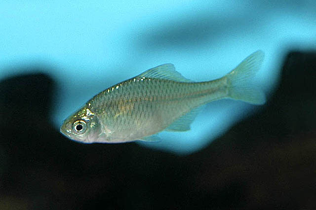
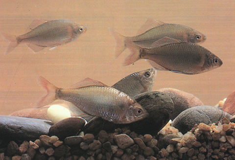

## 短须鱊

Acheilognathus barbatulus  Günther, 1873

CAFS:

<http://www.fishbase.org/summary/54928>

### 简介

体侧扁，轮廓呈长卵形。口亚下位，呈马蹄形。侧线完全。背鳍及臀鳍均具硬刺，背鳍起点距吻端距离比距尾鳍基距离大。肛门接近腹鳍，胸鳍末端不达腹鳍，尾鳍深分叉。体上部各鳞片边缘黑色，鳃孔后方第一个侧线鳞上有一大黑斑。尾柄中线有一条明显的黑色纵纹。背鳍具三列小黑点。臀鳍及其它各鳍灰白色。小型鱼类，生活习性和其它鰟鲏亚科类似。在长江中下游及附近均有分布。

### 形态特征

体侧扁，略延长，背缘薄而稍突起，腹缘圆而平直，体厚（近鳃盖上角躯部左右侧距离）不及体高的3倍。口狭小，亚下位，口裂如半月形，两口角间距大于或相当于两口角间距中点至上颌顶端的距离。上颌末端在鼻孔前缘的下方。上下唇联于口角，口角有对短须或缺。眼侧上位。鼻孔位近眼前上缘较之吻端。鳃孔上角处在眼上缘水平线之 下。鳃盖膜至鳃盖骨前缘和峡部相连。侧线完全，走向较为平直。
背、臀鳍末根不分枝鳍条粗于各自首根分枝鳍条。背鳍位于吻端和尾柄基之间或略近后者。背鳍基底长于背鳍基末至尾柄基距离。臀鳍起点与背鳍第五一六分枝鳍条相对，臀鳍基底略长于尾柄长。腹鳍位于背鳍之前下方，腹鳍基部和背鳍起点往往在同一垂直线上，亦处于胸鳍基部和臀鳍起点之间，或稍近后者。肛门位于腹鳍基部和臀鳍起点之间或近前者。尾鳍叉形。
下咽齿侧缘或光滑或具凹纹，凹纹有深有浅。背鳍前鳞呈棱状约占半数或不及。鳔分2室，后室长约有前室2倍。消化管约有体长的2.1—4.3倍，消化管随体长增加而增长。腹膜黑褐色。
固定标本近鳃盖上角有一小黑斑，跨越2—3个鳞片。沿尾柄的黑纵条较细，向头方延伸不超过背鳍之起点。背鳍外缘有狭黑边；臀鳍外缘无色，但雄鱼臀鳍近外缘有1纵黑条，其粗细约占最长鳍条1/3。

### 地理分布

分布于澜沧江、珠江、长江、黄河等水系。

### 生活习性

小型鱼类，喜生活于水草较多的静水或缓流水域。产卵于河蚌的鳃瓣中，以水生高等植物和藻类为食。

### 资源状况

### 参考资料

- 北京鱼类志 P65

### 线描图片

### 标准图片

### 实物图片

