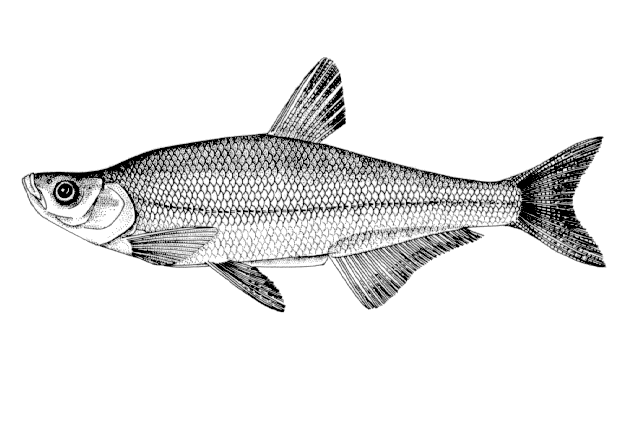
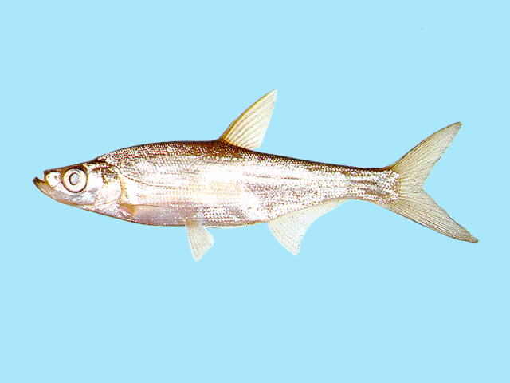
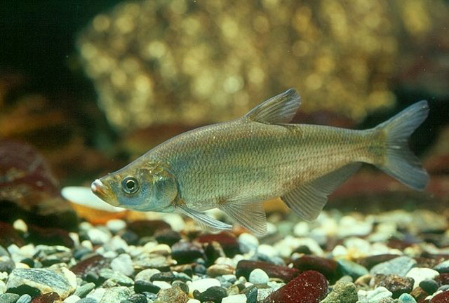

## 红鳍鲌

Chanodichthys erythropterus  (Basilewsky, 1855)

CAFS:750200040A90070002

<http://www.fishbase.org/summary/4635>

### 简介

又名短尾鲌、连子、白鱼、曲腰鱼、翘嘴巴、总统鱼。体长形，侧扁，头后背部隆起。下颌往上翘。下咽齿尖端呈钩状。胸鳍长，其末端接近腹鳍。尾鳍深叉形。体背部灰色，侧面及腹面银白色。体侧鳞片后缘具黑色斑点。背鳍灰白色，腹鳍、臀鳍和尾鳍下叶均呈桔黄色。喜栖息在水草繁茂的湖泊中，在河流中通常在缓流鳢。主要捕食小型鱼类，也是少量水生昆虫、虾和枝角类。从黑龙江至海南岛都有分布。

### 形态特征

体长，较厚而稍低;头后背部隆起，腹鳍基部的腹部常凹入;腹棱完全，存在于自胸鳍基部下方至肛门之间，腹鳍基部之后的腹棱低，呈脊状突起。吻长小于或等于眼径。口上位，口裂近垂直。下颌厚，突出于上颌之前。眼中等大;眼间隔宽而稍圆凸。鼻孔位于眼的前上方，其下缘与眼上缘约位于同一水平线上或稍低。鳃孔前伸达眼后缘的下方。鳞中等大，侧线鳞63—69，围尾柄鳞18—20。侧线在前部略呈弧形下折。背鳍末根不分枝鳍条为硬刺。第1鳃弓鳃耙数24—29。鳔3室，中室最长，后室甚小。肠短，其长度约等于体长。腹膜银灰色或灰黑色。背部青绿，微带黄色，体侧及腹部银白色，体例上半部鳞片后缘有小黑斑。尾鳍、胸鳍呈浅黄红色，臀鳍橘红色。

### 地理分布

分布极广，全国各主要水系均产。

### 生活习性

栖息于湖泊水草茂盛处或江河缓流区，幼鱼喜集群在浅水区觅食。肉食性，主要捕食小鱼，亦食无脊椎动物。5—7月在静水湖泊中产卵繁殖，卵粘附于水草上。

### 资源状况

### 参考资料

- 北京鱼类志 P54

### 线描图片

### 标准图片

### 实物图片

