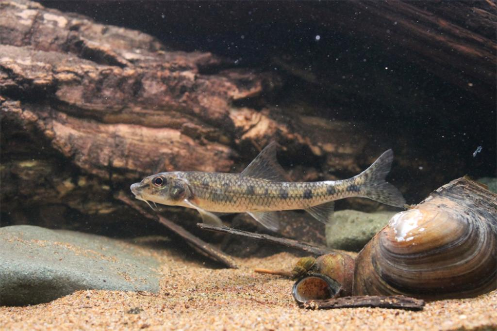

## 细体鮈

Romanogobio tenuicorpus  (Mori, 1934)

CAFS:

<http://www.fishbase.org/summary/47347>

### 简介

吻稍尖，口下位，呈弧形。唇厚，口角具粗长的须1对。背鳍无硬刺，胸鳍较大，腹鳍较长，尾鳍叉型，末端尖。体背部及体侧上部灰黑色，背上有许多小黑点，沿体侧中轴有8—11个黑色长形斑块，背部正中有6—7上黑斑块。喜激流，生活于江河中不进入湖泊。个体小，数量少，无经济价值。分布于黑龙江、滦河水系。

### 形态特征

体细长，前段稍呈圆筒形，背部稍隆起，腹部略圆或平坦，尾柄细长，侧扁。头较大，背面呈弧形隆起，腹面平，头长远大于体高。吻长，稍尖，其长约与眼后头长相等，鼻孔前方明显下陷。口下位，弧形。唇稍厚，无乳突，上下唇在口角处相连，下唇侧叶较狭窄。唇后沟中断。须1对，位于口角，须较长，末端几达前鳃盖骨的后缘。眼稍大，侧上位。眼间平坦或稍下凹。体被圆鳞，中等大，胸、腹部裸露区较大，除胸鳍基部之前无鳞外，向后尚可扩展至胸鳍基部与腹鳍起点中点的腹中央部分。侧线完全，几平直。
背鳍较短，起点至吻端的距离等于或略小于至臀鳍末端，约与背鳍基后端至尾鳍基部的距离相等。胸鳍较长，其末端达到或超过胸鳍基部与腹鳍起点间的后1/3处。腹鳍稍短，起点位于背鳍起点的后下方，末端远超过肛门，至臀鳍起点的距离甚远。肛门位置在腹鳍基部和臀鳍起点间的前1/3处，或更近腹鳍基。臀鳍短小，起点至腹鳍基部与尾鳍基部的距离几相等。尾鳍分叉，上下叶末端尖，等长。
下咽齿主行齿稍侧扁，末端微钩曲。鳃耙稀少，纤细，呈长锥形。肠管稍粗短，约为体长的0. 9—1.0倍。鳔大，2室，前室卵圆形，后室长圆形，后室长约为前室的1.7—2.0倍。腹膜灰白色。
体背灰黑色，背部具若干小黑点，正中自头后至尾鳍基有6—8个细长形黑斑，体侧中轴具8—11个长方形黑斑块，腹部灰白色。背、尾鳍有多数黑色小点，其他各鳍灰白色。

### 地理分布

分布于黑龙江、滦河水系。

### 生活习性

喜激流，生活于江河中不进入湖泊。个体小，数量少，无经济价值。

### 资源状况

### 参考资料

- 北京鱼类志 P28

### 线描图片

### 标准图片

### 实物图片

