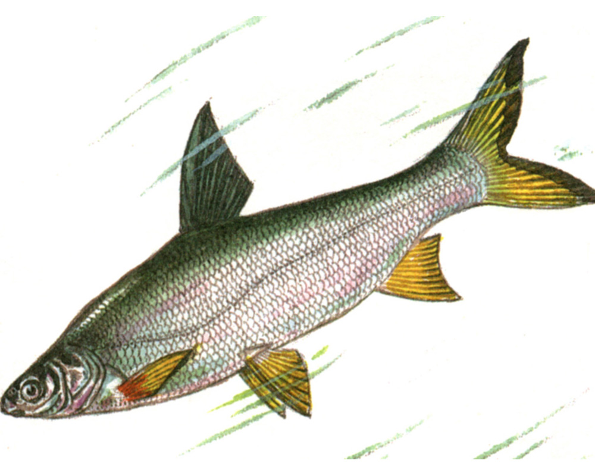
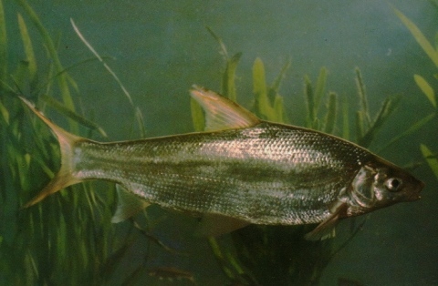

## 细鳞斜颌鲴

Plagiognathops microlepis  (Bleeker, 1871)

CAFS:750200040B10010003

<http://www.fishbase.org/summary/46742>

### 简介

又名沙姑子、黄片、黄片、黄皮、黄尾刁子、黄板鱼、细鳞鲴。体长而侧扁。头小。吻钝短；吻皮紧贴于上领。口下位，略呈弧形；下颌前缘有薄的角质缘。无须。体背灰黑色，体侧和腹部银白色。胸、腹、臀鳍浅黄色或灰白色，背鳍灰黑色、尾鳍桔黄色，后缘灰黑色。中下层鱼类，栖息于较急的流水中，行动缓慢，易于捕捞。主要以高等植物的枝叶颌丝状藻类为食，也食水生昆虫、枝角类和其他腐殖物质。在黑龙江、长江、珠江都有分布。

### 形态特征

体长而侧扁。头小。吻钝短；吻皮紧贴于上颌。口下位，略呈弧形；下颌前缘有薄的角质缘。无须。眼侧上位，眼径和吻长约相等。眼后头长大于吻长，略大于眼间距。鼻孔位于眼的前上方，至吻端与至眼前缘的距离约相等。鳞小；侧线完全，在胸鳍上方略下弯，向后伸人尾柄中央。
背鳍起点约与腹鳍起点相对，或稍有前后。至吻端的距离和至尾鳍基的距离相近。胸鳍末端尖，后伸不达腹鳍起点。腹鳍末端不达肛门，其基部有1—2片长形腋鳞。肛门紧靠臀鳍起点。肛门前有腹棱，腹棱长度为肛门至腹鳍基距离的3/4以上。臀鳍短，向后伸不达尾鳍基部。尾鳍叉形。
鳃耙为扁平的三角形，排列紧密。下咽骨近弧形，主行齿侧扁，顶端稍尖，外侧两行咽齿纤细。鳔2室，后室长为前室长的3倍或略多于3倍。腹膜黑色。
体背灰黑色，体侧和腹部银白色。胸、腹、臀鳍浅黄色或灰白色，背鳍灰黑色、尾鳍桔黄色，后缘灰黑色。固定后黄色消失。

鲴亚科几种主要种类形态特征较为相似，但都有各自明显的区别。黄尾鲴的腹棱不发达，长度为肛门到腹鳍的1/4，鳃盖后缘有一条桔黄色斑纹；鳍条呈显著黄色。园吻鲴无腹棱；在鳃盖后缘也无色斑；各鳍条均呈灰黑色。银鲴也无腹棱，或只有不发达的腹棱，长度为肛门到腹鳍的1/5；鳃盖后缘有较深桔黄色斑一条；鳍条颜色不同，腹鳍、臀鳍呈杏黄色，其他各鳍呈灰黑色。

### 地理分布

长江、珠江、黑龙江、黄河及东南沿海水系。

### 生活习性

喜生活在江河、湖泊、水库等较开阔的水体里，栖息于水体的中下层。适应流水生活，性较活跃。有集群摄食、活动的习性，一般冬季群栖于开阔水面的深水处，春暖后分散活动、觅食。属于杂食性鱼类，主要以水底腐殖质、硅藻、丝状藻等藻类及高等植物碎屑为食物，通过发达的下颌角质边缘在水底刮取而获得。

### 资源状况

### 参考资料

- 北京鱼类志 P57

### 线描图片

### 标准图片

### 实物图片

