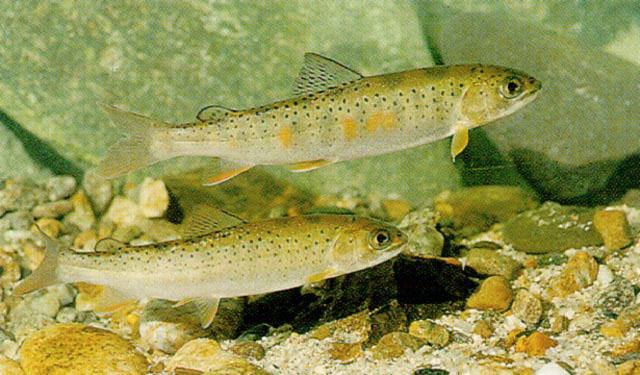
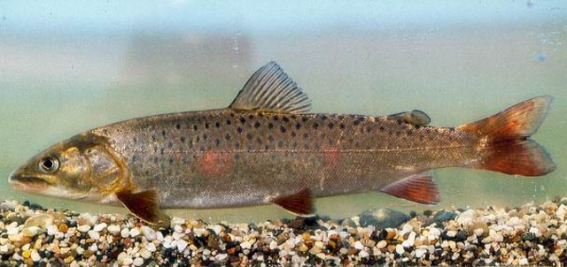

## 细鳞鲑（细鳞鱼）

Brachymystax lenok (Pallas,1773)

CAFS: 750180040010A50001

<http://www.fishbase.org/summary/2079>

### 简介

又名细鳞鱼。俗称桦鱼，花鱼。体长10到26厘米，体背部深紫褐色，体侧略淡，腹部橘黄色。体侧有许多分散的圆形或椭圆形小黑斑。为冷水性鱼类，多栖息于水温较低的山麓附近的水域，幼鱼喜钻入石缝或乱石堆中，入冬后进入深水区。是肉食性鱼类，较贪食，通常以小鱼、鱼卵、水生昆虫等为食，有时也能食小型哺乳动物及植物的枝叶等。每天食欲最旺的时间是早晨颌傍晚，其它时间多潜伏在溪流沿岸的水底。多分布于黑龙江、图们江水系，在秦岭有零星分布。鱼肉肥，含脂量大，个体大，是一种珍贵的经济鱼类。

### 形态特征

因鳞细小而得名。体长，侧扁，头稍尖，吻钝。口小，横裂，亚下位；上颌骨明显、游离，向后伸达眼中央下方。上下颌、犁骨、腭骨、舌上均有向内倾斜的齿。眼大，鳞细小，脂鳍小。幽门盲囊63-91个，背部黑褐色，体侧红褐色，分布着不规则的黑色斑点。幼鱼有数条垂直暗纹。腹部银白色。体色因栖息水域不同而异。终年栖息于山涧溪流里的群体，体背部呈绿褐色，体侧较黑，腹部白，背鳍、臀鳍、脂鳍有黑点，外缘黑色；胸鳍、腹鳍桔红色有黑斑。个体较小，体长在350毫米以下，渔民称其为“山细鳞”。冬季洄游到大江越冬的细鳞鱼，个体大，背部黑绿，体侧黄褐，有黑斑点，腹部黑；背鳍前角黑；胸鳍、腹鳍绿褐；尾鳍有细长黑点，边色黑；较前者鲜艳，俗称“江细鳞”。生殖季节成鱼色暗，背鳍前部鳍条变黑，体侧出现隐约红色斑。在不同年龄大小和不同栖息环境中，其体色变化较大，一般老龄鱼较幼龄鱼体色深。
　
　   　   　
### 地理分布

地理分布北纬40°以北的寒冷地区水域，国外分布于俄罗斯等水域；国内布于黑龙江、嫩江、乌苏里江、牡丹江、绥芬河、图们江、鸭绿江、辽宁浑河、太子河、潮河、河北滦河、陕西石头河、太白河、胥水河、新疆额尔齐斯河等水系，其中以黑龙江上游数量为最多。 　

### 生活习性

它属于陆封型冷水性鱼类，栖息于不高于20℃的水质清澈的江河溪流，但产卵繁殖需要在16℃以下，河床为砂砾或砾石的江河内的狭温性鱼类，大多分布在河川的上游。

### 资源状况

在我国分布于黑龙江至辽河的支流浑河上游，河北及内蒙古潮白河与滦河上游，黄河的渭河上游及其支流和长江的汉水北侧支流湑子河、子午河的上游。国外见于俄罗斯东部、朝鲜、蒙古部分地区的河流中。

### 参考资料

- 北京鱼类志 P8

### 线描图片

### 标准图片

### 实物图片

