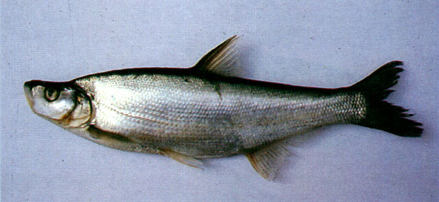
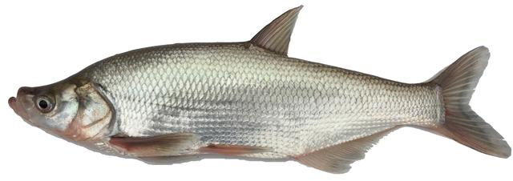

## 翘嘴鲌

Culter alburnus  Basilewsky, 1855

CAFS:750200040A90110005

<http://www.fishbase.org/summary/46708>

### 简介

又名翘嘴红鲌、翘嘴巴、翘壳、大鲌鱼、总统鱼、兴凯大白鱼。体长，侧扁，头背面平直。口上位，下颌坚厚，上翘，竖于口前。眼大。鳞小，侧线鳞80—93。背鳍具强大而光滑的硬刺。体背及体侧上部浅棕色，下部银灰色，腹部银白色，背鳍和尾鳍灰黑色，胸鳍、腹鳍及臀鳍灰白色。大型鱼类，生活在流水及大型水体中，中上层鱼，游动迅速，善于跳跃。主要以小鱼为食，也食昆虫、枝角类等。各地江河湖泊均有分布。

### 形态特征

体长形，侧扁，背缘较平直，腹部在腹鳍基至肛门具腹棱，尾柄较长。头侧扁，头背平直，头长一般小于体高。吻钝，吻长大于眼径。口上位，口裂几与体轴垂直，下颌厚而上翘，突出于上颌之前，为头的最前端。眼中大，位于头侧，眼后缘至吻端的距离稍小于眼后头长。眼间较窄，微凸，眼间距大于眼径，约与吻长等长。鼻孔位近眼的前缘，其下缘在眼的上缘水平线之上。鳃孔宽大，向前伸至眼后缘的下方；鳃盖膜连于峡部；峡部窄。鳞较小，背部鳞较体侧为小。侧线前部浅弧形，后部平直，伸达尾鳍基。
背鳍位于腹鳍基部的后上方，外缘斜直，末根不分枝鳍条为光滑的硬刺，刺强大；背鳍起点距吻端较距尾鳍基为近或相等。臀鳍位于背鳍的后下方，外缘凹入．起点至腹鳍基较至尾鳍基为近。胸鳍较短，尖形，末端不达腹鳍起点。腹鳍位于背鳍的前下方，其长短于胸鳍，末端距臀鳍起点颇远。尾鳍深叉，下叶长于上叶，末端尖形。
鳃耙长，排列密。下咽骨狭长，呈钩状，前臂较长，无明显的角突。咽齿近锥形，末端尖而钩状。鳔3室，中室最大，后室细尖而长，伸入体腔之后延部分。肠短，呈前后弯曲，其长约与体长相等。腹膜银白色。
体背侧灰黑色，腹侧银色，鳍呈深灰色。

### 地理分布

翘嘴鲌分布甚广，产于黑龙江、辽河、黄河、长江、钱塘江、闽江、台湾、珠江等水系的干、支流及其附属湖泊中。广泛分布于长江流域各水系及附属湖泊。

### 生活习性

翘嘴鲌平时多生活在流水及大水体的中上层，游泳迅速，善跳跃。以小鱼为食，是一种凶猛性鱼类。雌鱼3龄达性成熟，雄鱼2龄即达成熟，亲鱼于6-8月在水流缓慢的河湾或湖泊浅水区集群进行繁殖活动。产卵后大多进入湖泊摄食或在江湾缓流区肥育。幼鱼喜栖息于湖泊近岸水域和江河水流较缓的沿岸，以及支流、河道与港湾里。冬季，大小鱼群皆在河床或湖槽中越冬。

### 资源状况

由于捕捞强度过大，天然资源日益减少，且呈现低龄化、小型化现象。

### 参考资料

- 北京鱼类志 P56

### 线描图片

### 标准图片

### 实物图片

