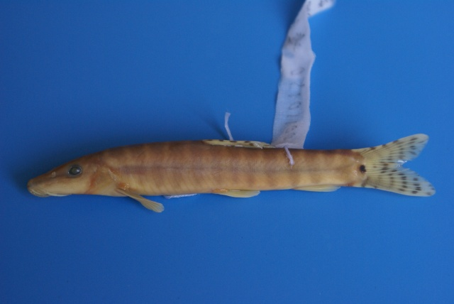
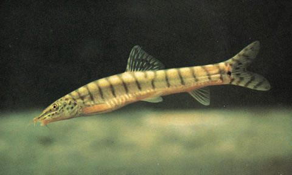

## 花斑副沙鳅

Parabotia fasciata  Dabry de Thiersant, 1872

CAFS:

<http://www.fishbase.org/summary/54998>

### 简介

又名宜昌沙鳅，黄沙鳅。体长形，略圆，尾部侧扁，头长而尖。前后鼻孔靠近，中间有一分离的皮褶。眼的下缘有一分叉的硬刺。鳃孔很小，鳞片很微小。侧线完全。背鳍无硬刺。胸鳍圆扇形。臀鳍短小、无硬刺。尾鳍分叉深。体呈黄褐色，腹部灰白色，鳃盖后缘有多条深褐色的横斑纹。尾鳍基部有一深褐色斑点。背鳍、尾鳍有多行褐色斑点组成的纵纹。小型底层鱼类，主要以水生昆虫为食。黄河流域、长江流域、河北均有分布。

### 形态特征

眼小，侧上位.眼在吻端与鳃盖后缘的正中。眼的前下缘有分叉的硬刺。鳃孔很小，鳃膜在胸鳍基部前方处与峡部侧面相连。鳃把外侧无，内侧为12—15o鳞片甚微小。侧线完全。背鳍无硬刺，起点位于腹鳍之前。见不分枝鳍条3、分枝鳍条9。胸鳍圆扇形。具不分枝鳍条1，分枝鳍条12，基部有一长形的皮褶。腹鳍具不分枝鳍条1，分枝鳍条7，起点约亦背鳍第2—3根鳍条的下方，基部也具一皮裕 臀绍短小。具不分枝鳍条3，分枝鳍条7，无硬刺。尾鳍分又。体呈黄褐色，腹部灰白色，由鳃盖后缘至尾鳍基部南13一15条深褐包背腹向的横斑纹，尾鳍基部有一深褐色斑点。背鳍、尾鳍只有多行褐色斑点组成的纵纹。胸鳍、腹鳍、臀鳍与腹部色泽相同。

### 地理分布

分布于北起黑龙江南至珠江的各江河。

### 生活习性

栖息于砂石底质的江河底层。食水生昆虫和藻类。个体小。

### 资源状况

### 参考资料

- 北京鱼类志 P76

### 线描图片

### 标准图片

### 实物图片

