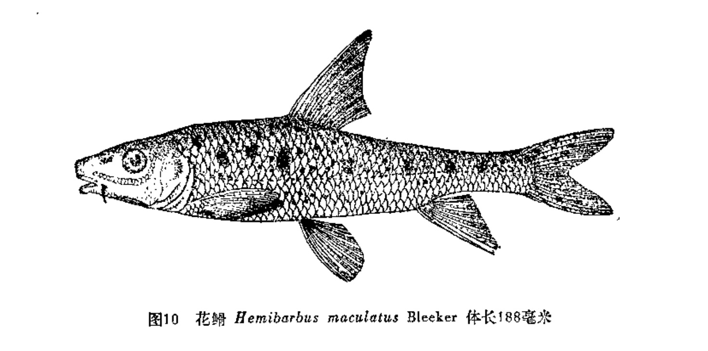
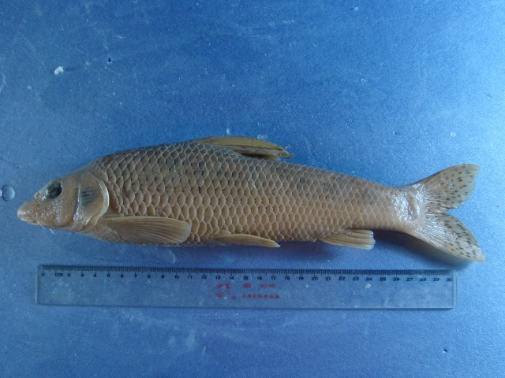
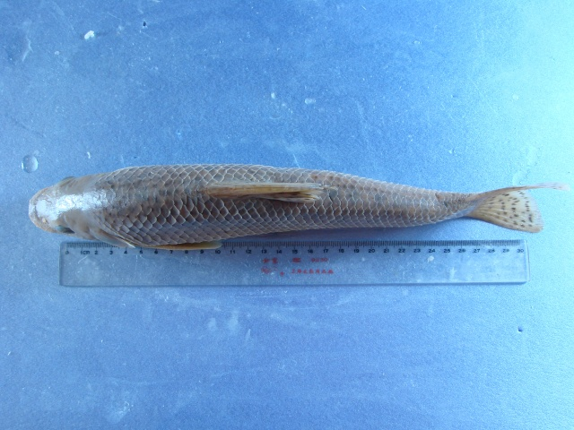

## 花䱻

Hemibarbus maculatus  Bleeker, 1871

CAFS:750200040B10050004

<http://www.fishbase.org/summary/4752>

### 简介

又名麻花鱼骨、鸡虾。俗称麻鲤，体长5到18厘米，较高，腹部圆。头中等大。背鳍长，末根不分枝鳍条为光滑的硬刺，长且粗壮。体背及体侧上部青灰色，腹部白色。体侧具多数大小不等的黑褐色斑点。背鳍和尾鳍具多数小黑点，其他各鳍灰白。为江湖中常见的中、下层鱼类。以水生昆虫的幼虫为主要食物，也食软体动物和小鱼。生殖季节在4—5月，分批产卵。卵粘性，附着于水草上发育。广泛分布于全国各大水系。

### 形态特征

背鳍条III―7；臀鳍条III-6；胸鳍条I―16~18，腹鳍条I―7~8。鳃耙6~11。下咽齿3行，1.3.5―5.3.1（1.3.4-4.3.1），侧线鳞 。 体长为体高的3.3~5.0（4.1）倍，为头长的3.3~3.9（3.6）倍，为尾柄长的5.3~7.7（6.4）倍。为尾柄高的7.6~10.4（9.3）倍。头长为吻长的2.4~2.6（2.5）倍，为眼径的4.3~5.5（4.7）倍，为眼间距的3.4~4.4（3.8）倍。尾柄长为尾柄高的1.4~1.7（1.5）倍。 体长，背部较高，腹部圆。头略长，吻钝圆，前端略平扁。口下位，呈马蹄形。唇稍薄，下唇两侧叶较为狭窄，颐部中央有一小三角形的突起，唇后沟中断，间距较宽。颌须1对，只达眼前缘的下方。眼较大，眼间宽。前眶骨、下眶骨及前鳃盖骨边缘具1排粘液腔。鳃耙呈锥状，粗长。下咽骨粗壮，主行末端呈钩状，外侧纤细。鳞小，侧线平直，完全。背鳍具1根光滑粗壮的硬刺，其起点稍后于背鳍起点，臀鳍起点距尾鳍基部较距腹鳍起点为近。肛门紧靠臀鳍起点。 鳔大，二室，前室长圆，后室长锥形，末端尖细，后室为前室的2倍左右，腹腔膜银灰色。 体色青褐色，腹部白色。体侧具有许多大小不等的黑褐色斑点，侧线上方有7~9个大黑斑，背鳍、尾鳍上具有多数小黑点，鳍为灰白色。

### 地理分布

黑龙江及支流、兴凯湖、镜泊湖。

### 生活习性

栖息于江河，生活在水底层。在湖沼区育肥，在江河深处越冬。

### 资源状况

### 参考资料

- 北京鱼类志 P20

### 线描图片

### 标准图片

### 实物图片

