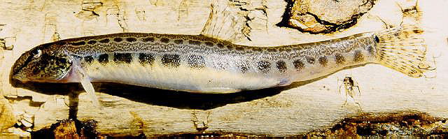
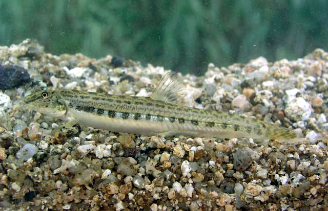

## 花鳅

Cobitis taenia  Linnaeus, 1758

CAFS:

<http://www.fishbase.org/summary/6378>

### 简介

又名豆角。体细长，侧扁。头部小，侧扁。口小，唇厚。须四对。前后鼻孔靠近。眼的下缘有一枚硬刺。眼间距狭小。鳃孔仅开口于胸鳍基部区域。胸鳍短小，呈圆扇形。尾鳍近圆形。鳞片甚细小。侧线不完全。腹膜灰色，鳔很小。体褐色，头部密布不规则黑色斑纹，背部有10多个黑色斑块。体侧中线上方至北部之间散有不规则的黑色花纹。腹部白色。胸鳍、腹鳍、臀鳍均为白色。背鳍和尾鳍有几条黑纹。小型底层鱼类，喜栖息于水质较肥的河岸或湖边的浅水处。以藻类和底栖无脊椎动物为食。分布广泛。

### 形态特征

背鳍Ⅱ—Ⅲ-6—7；臀鳍Ⅱ-5；胸鳍Ⅰ-8；腹鳍Ⅰ-5—6。鳃耙2+10—13。体长38—87．4毫米。体长为体高6．9—8．6倍，为头长4．6—5．9倍。体长形，侧扁，体高为体宽1．3—2．2倍。头侧扁。头长为吻长2．5—2．8倍，为眼径5．2—8．6倍。吻略突出。前鼻孔位吻侧正中，有一短管状皮突。眼小，侧上位。眼间隔窄于眼径。眶前骨在眼前缘下方向后有一叉状骨刺。口小，下位，不伸过后鼻孔。吻须2对；上颌须1对，较长，约达眼前缘下方。鳃孔侧位，下端略低于胸鳍基上缘。鳃耙钝短。肛门邻臀鳍始点。鳞微小，头无鳞。侧线侧中位。背鳍始于体正中央或略后，第一分枝鳍条最长。臀鳍似背鳍而窄小，距尾鳍基较距腹鳍基近。胸鳍侧下位。腹鳍始于背鳍第二至三分枝鳍条基下方，伸不到肛门。尾鳍圆形或截形。头体背侧灰褐色，沿背中线有一行黑褐色大斑；两侧较淡，有一纵行约16—21黑斑；腹侧白色。鳍淡黄色；背鳍、尾鳍有小黑点，尾鳍基上侧有一亮黑斑。成年雄鱼第二胸鳍条很粗长，不短于头长；雌鱼胸鳍圆形，短于头长。

### 地理分布

分布广泛。

### 生活习性

花鳅是一种小型的底层鱼类，一般生活在水质较肥的江边或湖岸的浅水处。以藻类和高等植物的碎屑为食。杂食性，以水生昆虫、有机物碎屑为食。繁殖期为3至9月，群体交配，产无粘性的沉性卵于河川底层，受精卵鱼24小时后孵化。

### 资源状况

### 参考资料

- 北京鱼类志 P75

### 线描图片

### 标准图片

### 实物图片

