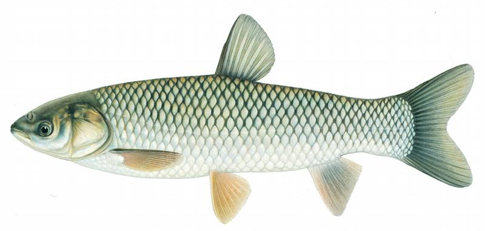
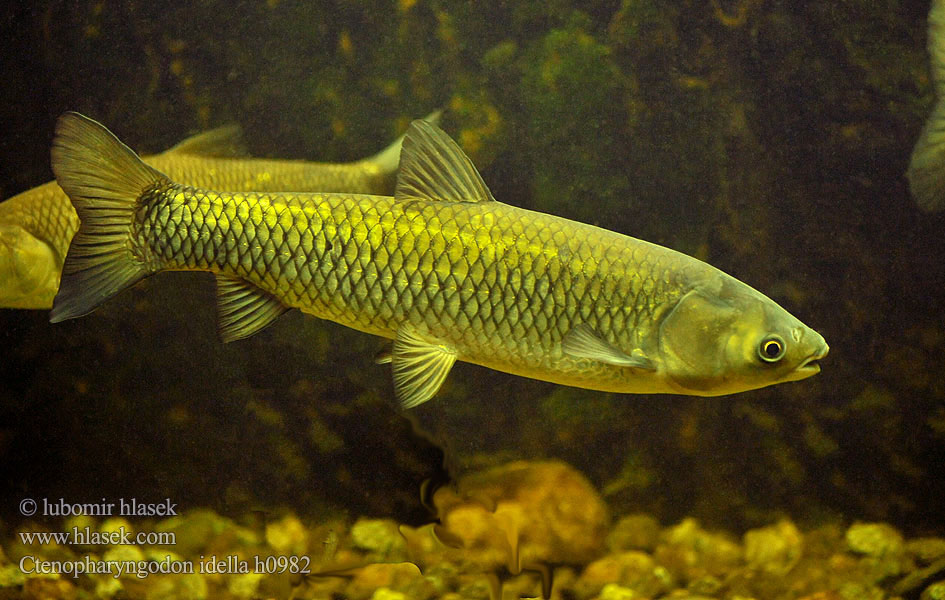

## 草鱼

Ctenopharyngodon idella  (Valenciennes, 1844)

CAFS:750200040B70020001

<http://www.fishbase.org/summary/79>

### 简介

体长形，前部近圆筒形，尾部侧扁，腹部圆，无腹棱。头宽，中等大，前部略平扁。吻短钝，吻长稍大于眼径。体呈荼黄色，腹部灰白色，体侧鳞片边缘灰黑色，胸鳍、腹鳍灰黄色，其它鳍浅色。生活于水的中下层和近岸多水草区域。性情活波，典型的草食性鱼类，以水草、萍类及高等植物为食，幼鱼期兼食昆虫、蚯蚓及藻类。个体大，生长快。在各地广泛分布。

### 形态特征

背鳍条3，7；臀鳍条3，8；侧线鳞35～42；下咽齿2行，一般为2.5一4.2；鳃耙外侧15～24，内侧21～25；脊椎骨39～42。体长为体高的3.5～4.8倍，为头长的4.3～5.0倍，为尾柄长的4.7～6.3倍，为尾柄高的7.3～9.4倍。头长为吻长的2.1～3.8倍，为眼径的6.0～8.9倍，为眼间距的1.7一1.9倍。身体各部分比例随个体大小不同有些差异。幼鱼的头长和眼径相对的较成鱼为大，尾柄长和眼间距相对的较成鱼为小。体长，略呈圆筒状，腹圆无棱。尾部侧扁，尾柄长大于足柄高。口端位，上颌稍突出于下颌。鳃把短小呈棒形，排列稀疏。下咽齿为流状栉齿。鳞片颇大。体呈茶黄色，背部青灰，腹部银白色。各鳍浅灰色。

### 地理分布

广泛分布于我国除新疆和青藏高原以外的广东至东北的平原地区。

### 生活习性

草鱼一般喜栖居于江河、湖泊等水域的中、下层和近岸多水草区域。具河湖洄游习性，性成熟个体在江河流水中产卵，产卵后的亲鱼和幼鱼进入支流及通江湖泊中，通常在被水淹没的浅滩草地和泛水区域以及干支流附属水体（湖泊、小河、港道等水草丛生地带）摄食育肥。冬季则在干流或湖泊的深水处越冬。草鱼性情活泼，游泳迅速，常成群觅食，性贪食，为典型的草食性鱼类。其鱼苗阶段摄食浮游动物，幼鱼期兼食昆虫、蚯蚓、藻类和浮萍等，体长约达10厘米以上时，完全摄食水生高等植物，其中尤以禾本科植物为多。

### 资源状况

草鱼广泛分布于我国除新疆和青藏高原以外的广东至东北的平原地区。自1958年人工催产授精孵化成功后，已移植至亚、欧、美、非各洲的许多国家。

### 参考资料

- 北京鱼类志 P36

### 线描图片

### 标准图片

### 实物图片

