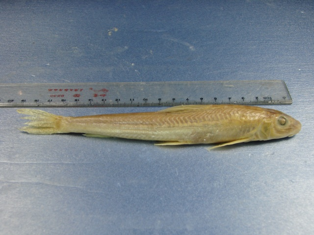
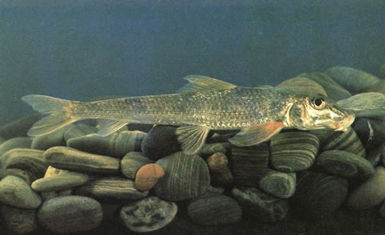

## 蛇鮈

Saurogobio dabryi  Bleeker, 1871

CAFS:750200040B10160003

<http://www.fishbase.org/summary/47352>

### 简介

体长形，前部圆筒形，候补稍侧扁，腹部略平坦。头较长，吻部在鼻孔前下凹。吻长大于眼后头长。唇发达，具显著小乳突，下唇后缘游离。须1对。侧线鳞47—49。胸部裸露。体上灰下白，沿侧线有一条宽的黑色纵带。小型鱼类，生活于江河、湖泊的底层。主食底栖无脊椎动物。繁殖期4—6月，漂流性卵。体较肥壮，数量较多。在各大水系广泛分布。

### 形态特征

体长，圆筒形，背部稍隆起，腹部较平坦，尾柄细长，略侧扁。头较长，锥形。吻长，其长大于眼后头长，前端稍尖，鼻孔前方下陷，吻部显著突出。口下位，马蹄形。唇厚，具细密的小乳突，下唇发达，中央有马威 长圆形肉垫，其上具有显著的细小乳突，后缘部分游离。上下唇在口角处相连。唇后沟中断，间距较宽。须1对，位口角，须长小于眼径。眼大，略呈纵向椭圆形。位于头侧上方，近头部上轮廓线。眼间较窄，下凹，间距小于眼径。泪骨发达，向前伸达吻前端，由吻侧沟将其与吻皮分开。体被圆鳞，鳞小，胸鳍基部之前裸露无鳞，在胸部中央处的裸露区部位间或向后延伸。侧线完全，平直。
背鳍无硬刺，位于体的前半部，起点距吻端的距离较其基部后端至尾鳍基为小，约与至臀鳍起点的垂直距相等。偶鳍平展，胸鳍稍宽长，等于或小于头长，后伸不达腹鳍起点。腹鳍位近腹面，起点位背鳍基部中央偏后，与背鳍第五、六根分枝鳍条相对，距胸鳍基较至臀鳍起点为近。肛门位置靠近腹鳍基，约位于腹鳍基与臀鳍起点间的前1/5处。臀鳍短，后位，起点距尾鳍基小于至腹鳍基部。尾鳍分叉，上下叶等长，末端尖。
下咽齿稍侧扁，末端钩曲。鳃耙不发达。肠管短，其长不及体长。鳔小，2室，前室包被于圆形骨囊内；后室细小，长圆形，露于囊外。腹膜浅灰色。
体背及体侧上半部黄绿色，腹部银白。吻背部两侧各有1黑色条纹。体上半部各鳞片边缘黑色，体侧中轴自鳃孔上方至尾鳍基具1浅黑色条纹，其上布有10—12个深黑色长方形斑块，鳃盖后部和偶鳍为黄色，其他各鳍灰白。

### 地理分布

遍布全国各主要水系。

### 生活习性

主要生活在江河中，喜低温流水。出生第二年，体长约115~125毫米时性成熟，产卵期在5月末至7月份（水温12~20℃）。怀卵量1.5~3.0万粒，分批产卵，产漂浮性卵，卵径2.3~3.0毫米，受精卵约3昼夜孵出。食性以底栖无脊椎动物为主，主要为摇蚊幼虫。

### 资源状况

### 参考资料

- 北京鱼类志 P30

### 线描图片

### 标准图片

### 实物图片

