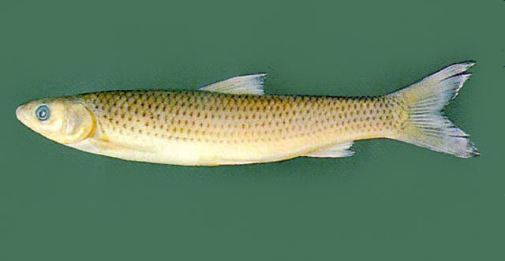
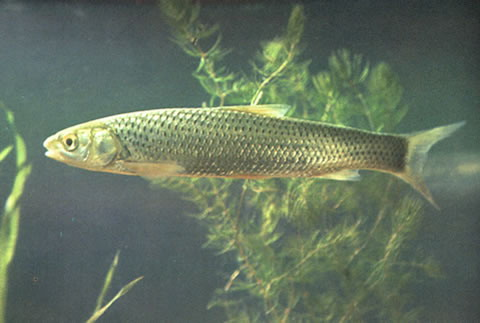

## 赤眼鳟

Squaliobarbus curriculus  (Richardson, 1846)

CAFS:750200040B70040001

<http://www.fishbase.org/summary/10387>

### 简介

又名野草鱼、红眼棒、红眼鲮、红眼鱼、红眼鳟子。体前部近圆筒形，尾部侧扁，背缘平直，腹部无腹棱。头近圆锥形，背面较宽。侧线以上每一鳞片基部有黑点，列成纵行。背鳍、尾鳍深灰色，其他鳍浅灰色。体色与草鱼蕾丝，灰黄中带青绿色，背部深灰色，腹部银白色。眼的上缘有一块红斑。生活在江河流速较缓的水域或湖泊的中下层。不喜集群。杂食性鱼类，主食水草，也食小鱼、软体动物等。广泛分布于各大水系。

### 形态特征

背鳍条Ⅲ-7，臀鳍条Ⅲ-7～8，胸鳍条I-14，腹鳍条I-8。鳃耙12～14。下咽齿3行，2.4.5-5.4.2。侧线鳞45（7）/（3-Ⅴ）50。 体长为体高的4.1～4.4(4.2)倍，为头长的4.3～4.7(4.5)倍，为尾柄长的7.0～7.4(7.2)，为尾柄高的8.5～8.7(8.6)倍。头长为吻长的3．2～3．3(3．2)倍，为眼径的5．2～5.7(5.5)倍，为眼间距的2.2～2.7(2.2)倍。尾柄长为尾柄高的1.1～1.2(1.1)倍。 体长，略成圆筒形。头呈圆锥形，吻钝，口端位，口裂宽，呈弧形，上下唇较厚，上颌有2对细小的须。眼近吻端。鳞大，圆形，侧线完全、平直。鳃耙短，排列稀疏。下咽齿内侧粗长，顶端呈钩状。肛门紧靠臀鳍起点。背鳍无硬刺，起点与腹鳍相对或略前。臀鳍起点至腹鳍基的距离较至尾鳍基部的距离为大。尾鳍深叉状。 鳔二室，后室长而尖。腹膜黑色。 背部和体侧呈灰黑色，侧线鳞上方每片鳞片的基部有黑色斑纹，形成体侧的纵列条纹。眼的上缘有一块红斑，体侧银白，背、尾鳍呈深灰色，其它鳍灰白色。

### 地理分布

我围除西北、西南外，南北各江河湖泊中均有分布。

### 生活习性

生活于江河湖泊中，一般栖息于流速较慢的水中。

### 资源状况

### 参考资料

- 北京鱼类志 P45

### 线描图片

### 标准图片

### 实物图片

